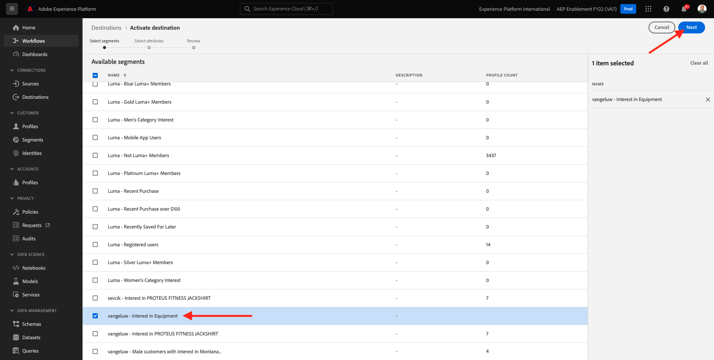

# 13.4 Activation du segment

## 13.4.1 Ajout d’un segment à la destination Azure Event Hub

Dans cet exercice, vous allez ajouter votre segment. `--demoProfileLdap-- - Interest in Equipment` à `--demoProfileLdap---aep-enablement` Destination Azure Event Hub.

Connectez-vous à Adobe Experience Platform en accédant à cette URL : [https://experience.adobe.com/platform](https://experience.adobe.com/platform).

Une fois connecté, vous accédez à la page d’accueil de Adobe Experience Platform.

Avant de continuer, vous devez sélectionner une **sandbox**. L’environnement de test à sélectionner est nommé ``--aepSandboxId--``. Pour ce faire, cliquez sur le texte **[!UICONTROL Production Prod]** dans la ligne bleue en haut de votre écran. Après avoir sélectionné l’environnement de test approprié, l’écran change et vous êtes désormais dans votre environnement de test dédié.

Accédez à **Destinations**, puis cliquez sur **Parcourir**. Vous verrez alors toutes les destinations disponibles. Recherchez votre destination et cliquez sur le bouton **+** comme indiqué ci-dessous.

Vous verrez alors ceci. Recherchez votre segment à l’aide de votre LDAP et sélectionnez `--demoProfileLdap-- - Interest in Equipment` dans la liste des segments.

Cliquez sur **Suivant**.

La plateforme de données clients en temps réel de Adobe Experience Platform peut fournir une charge utile à deux types de destinations, des destinations de segment et des destinations de profil.

Les destinations de segment recevront une charge utile de qualification de segment prédéfinie qui sera discutée ultérieurement. Ce payload contient **all** les qualifications de segment pour un profil spécifique. Même pour les segments qui ne figurent pas dans la liste d’activation de la destination. Voici un exemple de destination de segment : **Centre d’événements Azure** et **AWS Kinesis**.

Les destinations basées sur un profil vous permettent de sélectionner n’importe quel attribut (firstName, lastName, etc.) du schéma d’union XDM Profile et de l’inclure dans la payload d’activation. Voici un exemple de destination : **Marketing par e-mail**.

Parce que votre destination Azure Event Hub est une **segment** destination, sélectionnez par exemple le champ `--aepTenantId--.identification.core.ecid`.

Cliquez sur **Ajouter un nouveau champ**, cliquez sur parcourir le schéma et sélectionnez le champ `--aepTenantId--identification.core.ecid` (supprimez tout autre champ qui s’afficherait automatiquement).

Cliquez sur **Suivant**.

Cliquez sur **Terminer**.

Votre segment est maintenant activé vers votre destination de centre d’événements Microsoft.

Étape suivante : [13.5 Création de votre projet Microsoft Azure](./ex5.md)

[Revenir au module 13](./segment-activation-microsoft-azure-eventhub.md)

[Revenir à tous les modules](./../../overview.md)
