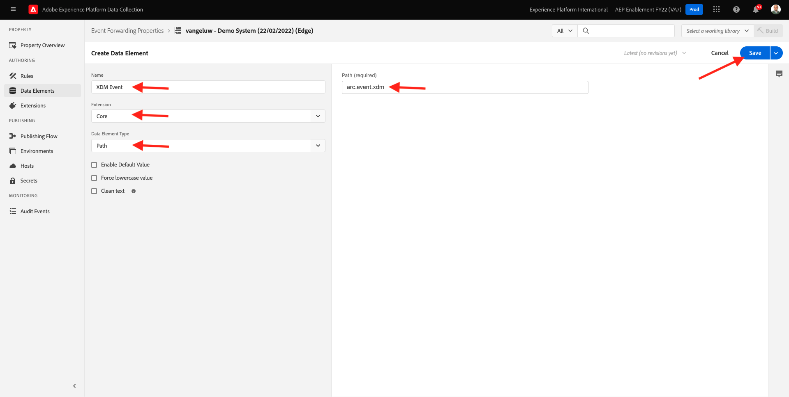
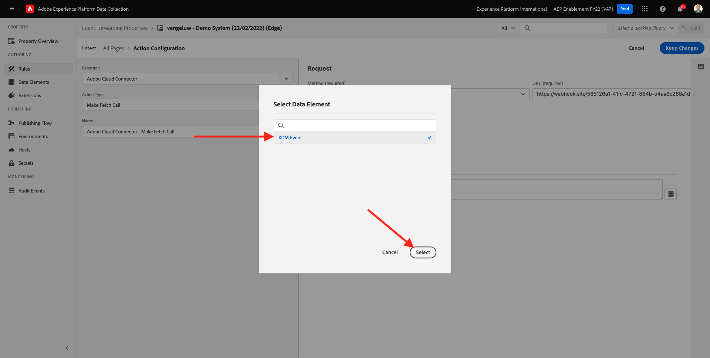

# 14.3 Création et configuration d’un webhook personnalisé

## 14.3.1 Création de votre webhook personnalisé

Accédez à [https://webhook.site/](https://webhook.site/). Vous verrez quelque chose comme ceci :

Votre URL unique se présente comme suit : `https://webhook.site/585126a1-41fc-4721-864b-d4aa8c268a1d`.

Ce site web a maintenant créé ce webhook pour vous, et vous pourrez configurer ce webhook dans votre **[!DNL Event Forwarding property]** pour commencer à tester le transfert des événements.

## 14.3.2 Mettez à jour la propriété Event Forwarding : Création d’un élément de données

Accédez à [https://experience.adobe.com/#/data-collection/](https://experience.adobe.com/#/data-collection/) et accédez à **Transfert d’événement**. Recherchez la propriété Event Forwarding et cliquez dessus pour l’ouvrir.

Dans le menu de gauche, accédez à **Éléments de données**. Cliquez sur **Créer un élément de données**.

Un nouvel élément de données à configurer s’affiche.

Effectuez la sélection suivante :

- Comme la variable **Nom**, saisissez **Événement XDM**.
- Comme la variable **Extension**, sélectionnez **Core**.
- Comme la variable **Type d’élément de données**, sélectionnez **Chemin**.
- Comme la variable **Chemin**, saisissez **arc.event.xdm**. En entrant ce chemin, vous allez filtrer la variable **XDM** à partir de la payload de l’événement envoyée par le site web ou l’application mobile dans Adobe Edge.

Vous allez maintenant avoir ceci. Cliquez sur **Enregistrer**.

>[!NOTE]
>
>Dans le chemin ci-dessus, une référence est effectuée à **arc**. **arc** signifie Adobe Resource Context et **arc** désigne toujours l’objet disponible le plus élevé disponible dans le contexte côté serveur. Des enrichissements et des transformations peuvent y être ajoutés. **arc** à l’aide des fonctions du serveur de collecte de données Adobe Experience Platform.
>
>Dans le chemin ci-dessus, une référence est effectuée à **event**. **event** représente un événement unique et le serveur de collecte de données Adobe Experience Platform évalue toujours chaque événement individuellement. Parfois, une référence à **events** dans la charge utile envoyée par le SDK Web côté client, mais dans le serveur de collecte de données Adobe Experience Platform, chaque événement est évalué individuellement.

## 14.3.3 Mise à jour de la propriété du serveur de collecte de données Adobe Experience Platform : Création d’une règle

Dans le menu de gauche, accédez à **Règles**. Cliquez sur **Créer une règle**.

Vous verrez alors une nouvelle règle à configurer. Saisissez le **Nom**: **Toutes les pages**. Pour cet exercice, il n’est pas nécessaire de configurer une condition. Vous allez plutôt configurer une action. Cliquez sur le bouton **+ Ajouter** sous **Actions**.

Vous verrez alors ceci. Effectuez la sélection suivante :

- Sélectionnez la **Extension**: **Connecteur Adobe Cloud**.
- Sélectionnez la **Type d’action**: **Rendre l’appel de récupération**.

Cela devrait vous donner ceci : **Nom**: **Connecteur Adobe Cloud - Lancer un appel de récupération**. Vous devriez maintenant voir ceci :

Configurez ensuite les éléments suivants :

- Modification de la méthode de requête de GET à **POST**
- Saisissez l’URL du webhook personnalisé que vous avez créé au cours de l’une des étapes précédentes du [https://webhook.site/](https://webhook.site/) qui ressemble à ceci : `https://webhook.site/585126a1-41fc-4721-864b-d4aa8c268a1d`

Vous devriez maintenant avoir ceci. Ensuite, accédez à **Corps**.

Vous verrez alors ceci. Cliquez sur l’icône d’élément de données comme indiqué ci-dessous.

Dans la fenêtre contextuelle, sélectionnez l’élément de données **Événement XDM** que vous avez créé à l’étape précédente. Cliquez sur **Sélectionner**.

Vous verrez alors ceci. Cliquez sur **Conserver les modifications**.

Vous verrez alors ceci. Cliquez sur **Enregistrer**.

Vous avez maintenant configuré votre première règle dans une propriété Event Forwarding. Accédez à **Flux de publication** pour publier vos modifications.
Ouvrir votre bibliothèque de développement **Principal** en cliquant **Modifier** comme indiqué.

Cliquez sur le bouton **Ajouter toutes les ressources modifiées** , après quoi votre règle et votre élément de données apparaîtront dans cette bibliothèque. Cliquez ensuite sur **Enregistrement et création pour le développement**. Vos modifications sont en cours de déploiement.

Au bout de quelques minutes, vous verrez que le déploiement est terminé et prêt à être testé.

## 14.3.4 Test de votre configuration

Accédez à [https://builder.adobedemo.com/projects](https://builder.adobedemo.com/projects). Une fois connecté avec votre Adobe ID, vous verrez ceci. Cliquez sur le projet de votre site web pour l’ouvrir.

Vous pouvez maintenant suivre le flux ci-dessous pour accéder au site web. Cliquez sur **Intégrations**.

Sur le **Intégrations** , vous devez sélectionner la propriété de collecte de données qui a été créée dans l’exercice 0.1.

Vous verrez alors votre site web de démonstration ouvert. Sélectionnez l’URL et copiez-la dans le presse-papiers.

Ouvrez une nouvelle fenêtre de navigateur incognito.

Collez l’URL de votre site web de démonstration, que vous avez copiée à l’étape précédente. Vous serez alors invité à vous connecter à l’aide de votre Adobe ID.

Sélectionnez le type de compte et procédez à la connexion.

Votre site web est alors chargé dans une fenêtre de navigateur incognito. Pour chaque démonstration, vous devez utiliser une fenêtre de navigateur incognito actualisée pour charger l’URL de votre site web de démonstration.

Lorsque vous ouvrez la vue Développeur de votre navigateur, vous pouvez examiner les demandes réseau comme indiqué ci-dessous. Lorsque vous utilisez le filtre **interagir**, vous verrez les requêtes réseau envoyées par le client de collecte de données Adobe Experience Platform à Adobe Edge.

Si vous sélectionnez la charge utile brute, accédez à [https://jsonformatter.org/json-pretty-print](https://jsonformatter.org/json-pretty-print) et collez la payload. Cliquez sur **Rendre joli**. Vous verrez ensuite la charge utile JSON, la variable **events** et le **xdm** . Lors de l’une des étapes précédentes, lorsque vous avez défini l’élément de données, vous avez utilisé la référence **arc.event.xdm**, ce qui entraîne l’analyse de la variable **xdm** de cette payload.

Rediriger votre affichage vers le site web [https://webhook.site/](https://webhook.site/) que vous avez utilisé dans l’une des étapes précédentes. Vous devriez maintenant avoir une vue similaire à celle-ci, avec les requêtes réseau affichées dans le menu de gauche. Vous voyez le **xdm** payload qui a été filtré hors de la requête réseau affichée ci-dessus.

Faites défiler la page vers le bas pour trouver le nom de la page, qui dans ce cas est **vangeluw-OCUC** (qui est le nom du projet de votre site web de démonstration).

Si vous parcourez désormais le site web, d’autres requêtes réseau seront disponibles en temps réel sur ce webhook personnalisé.

Vous avez maintenant configuré le transfert côté serveur des payloads Web SDK/XDM vers un webhook personnalisé externe. Dans les exercices suivants, vous allez configurer une approche similaire, et vous enverrez ces mêmes données vers les environnements Google et AWS.

Étape suivante : [14.4 Création et configuration d’une fonction cloud Google](./ex4.md)

[Revenir au module 14](./aep-data-collection-ssf.md)

[Revenir à tous les modules](./../../overview.md)
