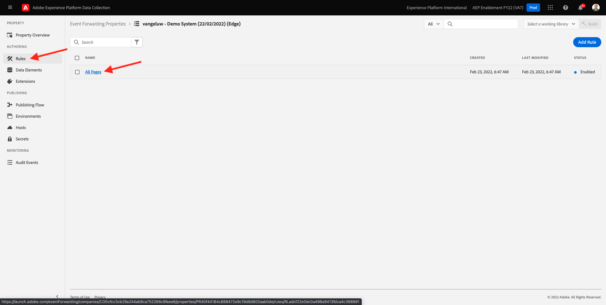
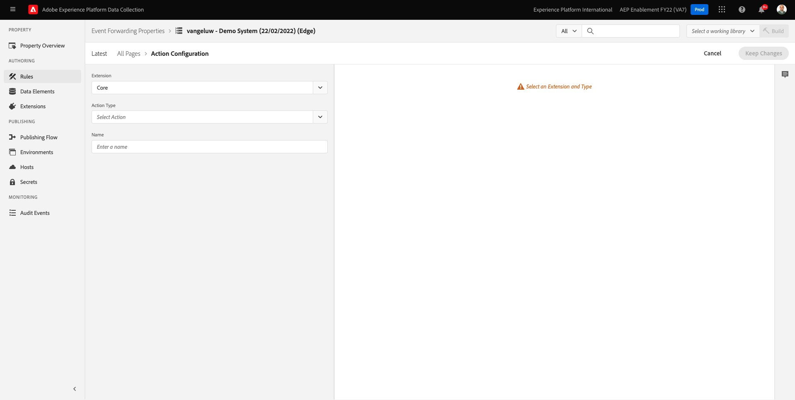
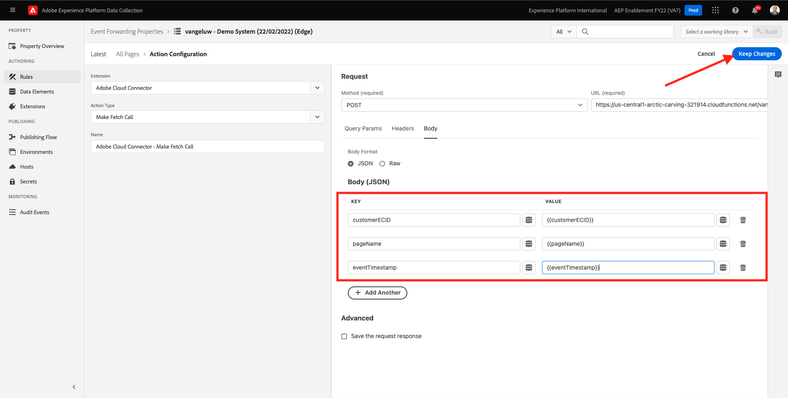

# 14.4 Création et configuration d’une fonction cloud Google

## 14.4.1 Création de la fonction cloud Google

Accédez à [https://console.cloud.google.com/](https://console.cloud.google.com/). Accédez à **Fonctions cloud**.


Vous verrez alors ceci. Cliquez sur **FONCTION CREATE**.


Vous verrez alors ceci.


Effectuez les choix suivants :

- **Nom de la fonction**: `--demoProfileLdap---event-forwarding`
- **Région**: sélectionner une région
- **Type de déclencheur**: select **HTTP**
- **Authentification**: select **Autoriser les appels non authentifiés**

Vous devriez maintenant avoir ceci. Cliquez sur **ENREGISTRER**.


Cliquez sur **SUIVANT**.


Vous verrez alors :


Effectuez les choix suivants :

- **Exécution**: select **Node.js 16** (ou plus récent)
- **Point d’entrée**: enter **helloAEP**

Cliquez sur **ACTIVER L’API** pour activer **API Cloud Build**. Vous verrez alors une nouvelle fenêtre. Dans cette nouvelle fenêtre, cliquez sur **ACTIVER** encore une fois.


Vous verrez alors ceci. Cliquez sur **Activer**.


Une fois **API Cloud Build** a été activé, vous verrez ceci.


Revenez à la **Fonction cloud**.
Dans votre éditeur en ligne de fonction Cloud, assurez-vous que vous y avez le code suivant :

```javascript
/**
 * Responds to any HTTP request.
 *
 * @param {!express:Request} req HTTP request context.
 * @param {!express:Response} res HTTP response context.
 */
exports.helloAEP = (req, res) => {
  let message = req.query.message || req.body.message || 'Hello World!';
  res.status(200).send(message);
};
```

Cliquez ensuite sur **DEPLOY**.


Vous verrez alors ceci. Votre fonction cloud est en cours de création. Cela peut prendre quelques minutes.


Une fois votre fonction créée et en cours d’exécution, vous verrez ceci. Cliquez sur le nom de la fonction pour l’ouvrir.


Vous verrez alors ceci. Accédez à **TRIGGER**. Vous verrez alors le **URL de déclenchement** qui est ce que vous utiliserez pour définir le point de terminaison dans Launch côté serveur.


Copiez l&#39;URL du déclencheur, qui se présente comme suit : **https://europe-west1-dazzling-pillar-273812.cloudfunctions.net/vangeluw-event-forwarding**.

Dans les étapes suivantes, vous allez configurer le serveur de collecte de données Adobe Experience Platform pour diffuser des informations spécifiques sur **Pages vues** à votre fonction cloud Google. Au lieu de simplement transférer la charge utile complète en l’état, vous enverrez uniquement des éléments tels que **ECID**, **timestamp** et **Nom de la page** à votre fonction cloud Google.

Voici un exemple de payload que vous devez analyser pour filtrer les variables mentionnées ci-dessus :

```json
{
  "events": [
    {
      "xdm": {
        "eventType": "web.webpagedetails.pageViews",
        "web": {
          "webPageDetails": {
            "URL": "https://builder.adobedemo.com/run/vangeluw-OCUC",
            "name": "vangeluw-OCUC",
            "viewName": "vangeluw-OCUC",
            "pageViews": {
              "value": 1
            }
          },
          "webReferrer": {
            "URL": "https://builder.adobedemo.com/run/vangeluw-OCUC/equipment"
          }
        },
        "device": {
          "screenHeight": 1080,
          "screenWidth": 1920,
          "screenOrientation": "landscape"
        },
        "environment": {
          "type": "browser",
          "browserDetails": {
            "viewportWidth": 1920,
            "viewportHeight": 451
          }
        },
        "placeContext": {
          "localTime": "2022-02-23T06:51:07.140+01:00",
          "localTimezoneOffset": -60
        },
        "timestamp": "2022-02-23T05:51:07.140Z",
        "implementationDetails": {
          "name": "https://ns.adobe.com/experience/alloy/reactor",
          "version": "2.8.0+2.9.0",
          "environment": "browser"
        },
        "_experienceplatform": {
          "identification": {
            "core": {
              "ecid": "08346969856929444850590365495949561249"
            }
          },
          "demoEnvironment": {
            "brandName": "vangeluw-OCUC"
          },
          "interactionDetails": {
            "core": {
              "channel": "web"
            }
          }
        }
      },
      "query": {
        "personalization": {
          "schemas": [
            "https://ns.adobe.com/personalization/html-content-item",
            "https://ns.adobe.com/personalization/json-content-item",
            "https://ns.adobe.com/personalization/redirect-item",
            "https://ns.adobe.com/personalization/dom-action"
          ],
          "decisionScopes": [
            "eyJ4ZG06YWN0aXZpdHlJZCI6Inhjb3JlOm9mZmVyLWFjdGl2aXR5OjE0YzA1MjM4MmUxYjY1MDUiLCJ4ZG06cGxhY2VtZW50SWQiOiJ4Y29yZTpvZmZlci1wbGFjZW1lbnQ6MTRiZjA5ZGM0MTkwZWJiYSJ9",
            "__view__"
          ]
        }
      }
    }
  ],
  "query": {
    "identity": {
      "fetch": [
        "ECID"
      ]
    }
  },
  "meta": {
    "state": {
      "domain": "adobedemo.com",
      "cookiesEnabled": true,
      "entries": [
        {
          "key": "kndctr_907075E95BF479EC0A495C73_AdobeOrg_identity",
          "value": "CiYwODM0Njk2OTg1NjkyOTQ0NDg1MDU5MDM2NTQ5NTk0OTU2MTI0OVIPCPn66KfyLxgBKgRJUkwx8AH5-uin8i8="
        },
        {
          "key": "kndctr_907075E95BF479EC0A495C73_AdobeOrg_consent_check",
          "value": "1"
        },
        {
          "key": "kndctr_907075E95BF479EC0A495C73_AdobeOrg_consent",
          "value": "general=in"
        }
      ]
    }
  }
}
```

Il s’agit des champs qui contiennent les informations qui doivent être analysées :

- ECID : **events.xdm._experienceplatform.identification.core.ecid**
- timestamp : **timestamp**
- Nom de la page : **events.xdm.web.webPageDetails.name**

Allons maintenant sur le serveur de collecte de données Adobe Experience Platform pour configurer les éléments de données afin de rendre cela possible.

## 14.4.2 Mettez à jour la propriété Event Forwarding : Éléments de données

Accédez à [https://experience.adobe.com/#/data-collection/](https://experience.adobe.com/#/data-collection/) et accédez à **Transfert d’événement**. Recherchez la propriété Event Forwarding et cliquez dessus pour l’ouvrir.


Dans le menu de gauche, accédez à **Éléments de données**. Cliquez sur **Ajouter un élément de données**.


Un nouvel élément de données à configurer s’affiche.


Effectuez la sélection suivante :

- Comme la variable **Nom**, saisissez **customerECID**.
- Comme la variable **Extension**, sélectionnez **Core**.
- Comme la variable **Type d’élément de données**, sélectionnez **Chemin**.
- Comme la variable **Chemin**, saisissez `arc.event.xdm.--aepTenantId--.identification.core.ecid`. En entrant ce chemin, vous allez filtrer le champ. **ecid** à partir de la payload d’événement envoyée par le site web ou l’application mobile dans Adobe Edge.

>[!NOTE]
>
>Dans les chemins ci-dessus et ci-dessous, une référence est faite à **arc**. **arc** signifie Adobe Resource Context et **arc** désigne toujours l’objet disponible le plus élevé disponible dans le contexte côté serveur. Des enrichissements et des transformations peuvent y être ajoutés. **arc** à l’aide des fonctions du serveur de collecte de données Adobe Experience Platform.
>
>Dans les chemins ci-dessus et ci-dessous, une référence est faite à **event**. **event** représente un événement unique et le serveur de collecte de données Adobe Experience Platform évalue toujours chaque événement individuellement. Parfois, une référence à **events** dans la charge utile envoyée par le SDK Web côté client, mais dans le serveur de collecte de données Adobe Experience Platform, chaque événement est évalué individuellement.

Vous allez maintenant avoir ceci. Cliquez sur **Enregistrer**.


Cliquez sur **Ajouter un élément de données**.


Un nouvel élément de données à configurer s’affiche.


Effectuez la sélection suivante :

- Comme la variable **Nom**, saisissez **eventTimestamp**.
- Comme la variable **Extension**, sélectionnez **Core**.
- Comme la variable **Type d’élément de données**, sélectionnez **Chemin**.
- Comme la variable **Chemin**, saisissez **arc.event.xdm.timestamp**. En entrant ce chemin, vous allez filtrer le champ. **timestamp** à partir de la payload d’événement envoyée par le site web ou l’application mobile dans Adobe Edge.

Vous allez maintenant avoir ceci. Cliquez sur **Enregistrer**.


Cliquez sur **Ajouter un élément de données**.


Un nouvel élément de données à configurer s’affiche.


Effectuez la sélection suivante :

- Comme la variable **Nom**, saisissez **pageName**.
- Comme la variable **Extension**, sélectionnez **Core**.
- Comme la variable **Type d’élément de données**, sélectionnez **Chemin**.
- Comme la variable **Chemin**, saisissez **arc.event.xdm.web.webPageDetails.name**. En entrant ce chemin, vous allez filtrer le champ. **name** à partir de la payload d’événement envoyée par le site web ou l’application mobile dans Adobe Edge.

Vous allez maintenant avoir ceci. Cliquez sur **Enregistrer**.


Ces éléments de données sont maintenant créés :


## 14.4.3 Mettez à jour la propriété Event Forwarding : Mettre à jour une règle

Dans le menu de gauche, accédez à **Règles**. Dans l’exercice précédent, vous avez créé la règle **Toutes les pages**. Cliquez sur cette règle pour l’ouvrir.



Vous ferez alors ceci. Cliquez sur le bouton **+** icône sous **Actions** pour ajouter une nouvelle action.


Vous verrez alors ceci.



Effectuez la sélection suivante :

- Sélectionnez la **Extension**: **Connecteur Adobe Cloud**.
- Sélectionnez la **Type d’action**: **Rendre l’appel de récupération**.

Cela devrait vous donner ceci : **Nom**: **Connecteur Adobe Cloud - Lancer un appel de récupération**. Vous devriez maintenant voir ceci :


Configurez ensuite les éléments suivants :

- Modifiez le protocole de requête de GET à **POST**
- Saisissez l’URL de la fonction Cloud Google que vous avez créée lors de l’une des étapes précédentes qui ressemble à ceci : **https://europe-west1-dazzling-pillar-273812.cloudfunctions.net/vangeluw-event-forwarding**

Vous devriez maintenant avoir ceci. Ensuite, accédez à **Corps**.


Vous verrez alors ceci. Cliquez sur le bouton radio pour **JSON**.


Configurez la variable **Corps** comme suit :

| CLÉ | VALEUR |
|--- |--- |
| customerECID | {{customerECID}} |
| pageName | {{pageName}} |
| eventTimestamp | {{eventTimestamp}} |

Vous verrez alors ceci. Cliquez sur **Conserver les modifications**.



Vous verrez alors ceci. Cliquez sur **Enregistrer**.


Vous avez maintenant mis à jour votre règle existante dans une propriété de serveur de collecte de données Adobe Experience Platform. Accédez à **Flux de publication** pour publier vos modifications. Ouvrir votre bibliothèque de développement **Principal** en cliquant **Modifier** comme indiqué.


Cliquez sur le bouton **Ajouter toutes les ressources modifiées** , après quoi votre règle et votre élément de données apparaîtront dans cette bibliothèque. Cliquez ensuite sur **Enregistrement et création pour le développement**. Vos modifications sont en cours de déploiement.


Au bout de quelques minutes, vous verrez que le déploiement est terminé et prêt à être testé.


## 14.3.4 Test de votre configuration

Accédez à [https://builder.adobedemo.com/projects](https://builder.adobedemo.com/projects). Une fois connecté avec votre Adobe ID, vous verrez ceci. Cliquez sur le projet de votre site web pour l’ouvrir.


Vous pouvez maintenant suivre le flux ci-dessous pour accéder au site web. Cliquez sur **Intégrations**.


Sur le **Intégrations** , vous devez sélectionner la propriété de collecte de données qui a été créée dans l’exercice 0.1.


Vous verrez alors votre site web de démonstration ouvert. Sélectionnez l’URL et copiez-la dans le presse-papiers.


Ouvrez une nouvelle fenêtre de navigateur incognito.


Collez l’URL de votre site web de démonstration, que vous avez copiée à l’étape précédente. Vous serez alors invité à vous connecter à l’aide de votre Adobe ID.


Sélectionnez le type de compte et procédez à la connexion.


Votre site web est alors chargé dans une fenêtre de navigateur incognito. Pour chaque démonstration, vous devez utiliser une fenêtre de navigateur incognito actualisée pour charger l’URL de votre site web de démonstration.


Lorsque vous ouvrez la vue Développeur de votre navigateur, vous pouvez examiner les demandes réseau comme indiqué ci-dessous. Lorsque vous utilisez le filtre **interagir**, vous verrez les requêtes réseau envoyées par le client de collecte de données Adobe Experience Platform à Adobe Edge.


Basculez votre vue vers votre fonction de cloud Google et accédez à **LOGS**. Vous devriez maintenant avoir une vue similaire à celle-ci, avec plusieurs entrées de journal affichées. Chaque fois que vous voyez **Exécution de la fonction démarrée**, cela signifie que le trafic entrant a été reçu dans votre fonction cloud Google.


Mettons un peu à jour votre fonction pour qu’elle fonctionne avec les données entrantes et affiche les informations reçues du serveur de collecte de données Adobe Experience Platform. Accédez à **SOURCE** et cliquez sur **MODIFIER**.


Dans l’écran suivant, cliquez sur **SUIVANT**.


Mettez à jour votre code comme suit :

```javascript
/**
 * Responds to any HTTP request.
 *
 * @param {!express:Request} req HTTP request context.
 * @param {!express:Response} res HTTP response context.
 */
exports.helloAEP = (req, res) => {
  console.log('>>>>> Function has started. The following information was received from Event Forwarding:');
  console.log(req.body);

  let message = req.query.message || req.body.message || 'Hello World!';
  res.status(200).send(message);
};
```

Vous aurez alors ceci. Cliquez sur **DEPLOY**.


Au bout de quelques minutes, votre fonction sera de nouveau déployée. Cliquez sur le nom de votre fonction pour l’ouvrir.


Sur votre site web de démonstration, accédez à un produit, par exemple **CAPRI DÉIRDRE RELAXED-FIT**.


Basculez votre vue vers votre fonction de cloud Google et accédez à **LOGS**. Vous devriez maintenant avoir une vue similaire à celle-ci, avec plusieurs entrées de journal affichées.

Pour chaque page vue de votre site web de démonstration, une nouvelle entrée de journal s’affiche dans les journaux de votre fonction Cloud Google, qui affiche les informations reçues.


Vous avez maintenant envoyé avec succès des données collectées par la collecte de données Adobe Experience Platform, en temps réel, à un point de terminaison de fonction Google Cloud. À partir de là, ces données peuvent être utilisées par n’importe quelle application Google Cloud Platform, comme BigQuery pour le stockage et la création de rapports, ou pour des cas pratiques d’apprentissage automatique.

Étape suivante : [14.5 Événements de transfert vers l’écosystème AWS](./ex5.md)

[Revenir au module 14](./aep-data-collection-ssf.md)

[Revenir à tous les modules](./../../overview.md)
