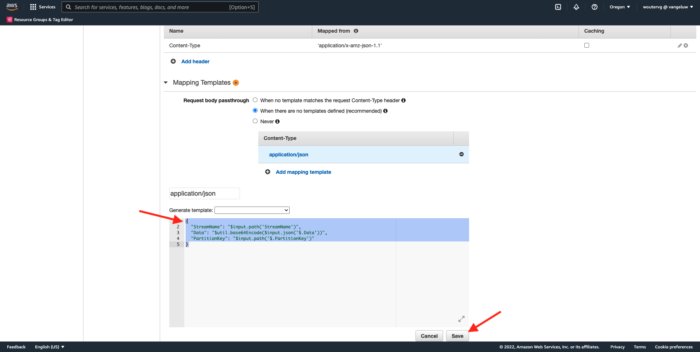
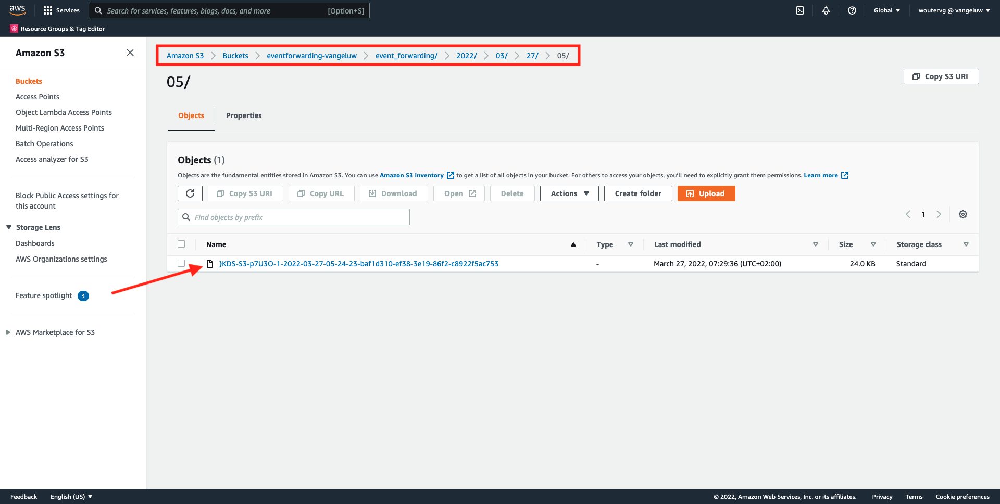

# 14.5 Événements de transfert vers l’écosystème AWS

>[!IMPORTANT]
>
>L’exécution de cet exercice est facultative et l’utilisation d’AWS Kinesis engendre des frais. Bien qu’AWS fournisse un compte de niveau gratuit qui vous permet de tester et de configurer de nombreux services sans frais, AWS Kinesis ne fait pas partie de ce compte de niveau libre. Ainsi, pour mettre en oeuvre et tester cet exercice, l’utilisation d’AWS Kinesis implique un coût.

## Bon à savoir

Adobe Experience Platform prend en charge divers services Amazon en tant que destination.
Kinesis et S3 sont tous deux [destinations d’exportation de profils](https://experienceleague.adobe.com/docs/experience-platform/destinations/destination-types.html?lang=en) et peut être utilisé dans le cadre de Adobe Experience Platform Real-Time CDP.
Vous pouvez facilement alimenter vos systèmes de choix en événements de segment à valeur élevée et en attributs de profil associés.

Dans cette note, vous allez apprendre à configurer votre propre flux Amazon Kinesis pour diffuser en continu des données d’événement provenant de l’écosystème Adobe Experience Platform Edge vers une destination de stockage dans le cloud, telle qu’Amazon S3. Cela s’avère utile si vous souhaitez collecter des événements d’expérience à partir de propriétés web et mobiles et les envoyer dans votre lac de données pour analyse et création de rapports opérationnels. En règle générale, les jeux de données ingèrent les données par lots avec de grands imports de fichiers quotidiens. Ils n’exposent pas le point de terminaison http public qui peut être utilisé avec le transfert d’événement.

La prise en charge des cas d’utilisation ci-dessus implique que les données en flux continu doivent être mises en mémoire tampon ou placées dans une file d’attente avant d’être écrites dans un fichier. Il faut prendre soin de ne pas ouvrir le fichier pour l’accès en écriture sur plusieurs processus. Déléguer cette tâche à un système dédié est idéal pour une bonne mise à l’échelle tout en assurant un niveau de service optimal, c’est là que Kinesis vient à la rescousse.

Les flux de données Kinesis d’Amazon se concentrent sur l’ingestion et le stockage des flux de données. Kinesis Data Firehose se concentre sur la diffusion de flux de données vers des destinations sélectionnées, telles que des compartiments S3.

Dans le cadre de cet exercice, vous allez...

- Exécution d’une configuration de base d’un flux de données Kinesis
- Créer un flux de diffusion Firehose et utiliser le compartiment S3 comme destination
- Configurer la passerelle API Amazon comme point d’entrée de l’API REST pour recevoir vos données d’événement
- Transfert des données d’événement brutes d’Adobe Edge vers votre flux Kinesis

## 14.5.1 Configuration du compartiment AWS S3

Accédez à [https://console.aws.amazon.com](https://console.aws.amazon.com) et connectez-vous avec le compte Amazon que vous avez créé précédemment.


Une fois connecté, vous serez redirigé vers le **Console de gestion AWS**.


Dans le **Recherche de services** menu, rechercher **s3**. Cliquez sur le premier résultat de la recherche : **S3 - Stockage évolutif dans le cloud**.


Vous verrez alors le **Amazon S3** page d’accueil. Cliquez sur **Créer un compartiment**.


Dans le **Créer un compartiment** vous devez configurer deux éléments :

- Nom : utiliser le nom `eventforwarding---demoProfileLdap--`. Par exemple, dans cet exercice, le nom du compartiment est **aepmoduertcdpvangeluw**
- Région : utiliser la région ; **UE (Francfort) eu-central-1**


Conservez tous les autres paramètres par défaut tels quels. Faites défiler la page vers le bas et cliquez sur **Créer un compartiment**.


Vous verrez alors votre compartiment en cours de création et vous serez redirigé vers la page d’accueil d’Amazon S3.


## 14.5.2 Configuration du flux de données Kinesis AWS

Dans le **Recherche de services** menu, rechercher **kinesis**. Cliquez sur le premier résultat de la recherche : **Kinesis - Utilisation des données de diffusion en temps réel**.


Sélectionner **Flux de données Kinesis**. Cliquez sur **Création d’un flux de données**.


Pour le **Nom du flux de données**, utilisez `--demoProfileLdap---datastream`.


Il n’est pas nécessaire de modifier les autres paramètres. Faites défiler la page vers le bas et cliquez sur **Création d’un flux de données**.


Vous verrez alors ceci. Une fois votre flux de données créé, vous pouvez passer à l’exercice suivant.


## 14.5.3 Configuration du flux de diffusion AWS Firehose

Dans le **Recherche de services** menu, rechercher **kinesis**. Cliquez sur **Kinesis Data Firehose**.


Cliquez sur **Créer un flux de diffusion**.


Pour **Source**, sélectionnez **Flux de données Kinesis Amazon**. Pour **Destination**, sélectionnez **Amazon S3**. Cliquez sur **Parcourir** pour sélectionner votre flux de données.


Sélectionnez votre flux de données. Cliquez sur **Choisir**.


Vous verrez alors ceci. Mémoriser **Nom du flux de diffusion** comme vous en aurez besoin plus tard.


Faites défiler l’écran vers le bas jusqu’à ce que vous voyiez **Paramètres de destination**. Cliquez sur **Parcourir** pour sélectionner votre compartiment S3.


Sélectionnez votre compartiment S3 et cliquez sur **Choisir**.


Vous verrez alors quelque chose comme ça. Mettez à jour les paramètres suivants :

- Partitionnement dynamique : défini sur **Activé**
- Déagrégation multi-enregistrements : défini sur **Désactivé**
- Nouveau délimiteur de ligne : défini sur **Activé**
- Analyse en ligne pour JSON : défini sur **Activé**


Faites défiler la page vers le bas, vous verrez ceci. Mettez à jour les paramètres suivants :

- Clés de découpe dynamiques
   - Nom de la clé : **dynamicPartitioningKey**
   - Expression JQ : **.dynamicPartitioningKey**
- Préfixe du compartiment S3 : ajoutez le code suivant :

```bash
!{partitionKeyFromQuery:dynamicPartitioningKey}/!{timestamp:yyyy}/!{timestamp:MM}/!{timestamp:dd}/!{timestamp:HH}/}
```

- Préfixe de sortie du compartiment S3 : défini sur **error**


Enfin, faites défiler l’écran vers le bas et cliquez sur **Créer un flux de diffusion**


Au bout de quelques minutes, votre diffusion ne sera pas créée et **Principal**.


## 14.5.4 Configuration de votre rôle AWS IAM

Dans le **Recherche de services** menu, rechercher **iam**. Cliquez sur **Passerelle API**.


Cliquez sur **Rôles**.


Recherchez votre **KinesisFirehose** rôle. Cliquez dessus pour l’ouvrir.


Cliquez sur le nom de votre stratégie d’autorisations pour l’ouvrir.


Dans le nouvel écran qui s’ouvre, cliquez sur **Modifier la stratégie**.


Sous **Kinesis** - **Actions**, assurez-vous que la variable **Write** autorisations pour **PutRecord** est activée. Cliquez sur **Stratégie de révision**.


Cliquez sur **Enregistrer les modifications**.


Vous serez alors de retour ici. Cliquez sur **Rôles**.


Recherchez votre **KinesisFirehose** rôle. Cliquez dessus pour l’ouvrir.


Accédez à **Relations de confiance** et cliquez sur **Modifier la stratégie de confiance**.


Remplacez la stratégie de confiance actuelle en collant ce code pour remplacer le code existant :

```json
{
	"Version": "2012-10-17",
	"Statement": [
		{
			"Effect": "Allow",
			"Principal": {
				"Service": [
                    "firehose.amazonaws.com",
                    "kinesis.amazonaws.com",
                    "apigateway.amazonaws.com"
                ]
			},
			"Action": "sts:AssumeRole"
		}
	]
}
```

Cliquez sur **Mettre à jour la stratégie**


Vous verrez alors ceci. Vous devez spécifier la variable **ARN** pour ce rôle à l’étape suivante.


## 14.5.5 Configuration de la passerelle API AWS

La passerelle API d’Amazon est un service AWS permettant de créer, publier, gérer, surveiller et sécuriser des API REST, HTTP et WebSocket à n’importe quelle échelle. Les développeurs d’API peuvent créer des API qui accèdent à AWS ou à d’autres services web, ainsi que des données stockées dans AWS Cloud.

Vous allez maintenant exposer le flux de données Kinesis à Internet par le biais d’un point de terminaison HTTPS qui peut ensuite être directement utilisé par les services Adobe, comme le transfert d’événements.

Dans le **Recherche de services** menu, rechercher **passerelle api**. Cliquez sur **Passerelle API**.


Vous verrez alors quelque chose comme ça. Cliquez sur **Créer une API**.


Cliquez sur **Build** sur le **API REST** carte.


Vous verrez alors ceci. Renseignez les paramètres suivants :

- Choisissez le protocole : select **REST**
- Créer une API : select **Nouvelle API**
- Paramètres:
   - Nom de l’API : use `--demoProfileLdap---eventforwarding`
   - Type de point de fin : select **Régional**

Cliquez sur **Créer une API**.


Vous verrez alors ceci. Cliquez sur **Actions** puis cliquez sur **Créer une ressource**.


Vous verrez alors ceci. Définir **Resource Name** to **stream**. Cliquez sur **Créer une ressource**.


Vous verrez alors ceci. Cliquez sur **Actions** puis cliquez sur **Méthode de création**.


Dans la liste déroulante, sélectionnez **POST** et cliquez sur le bouton **v** bouton .


Vous verrez alors ceci. Renseignez les paramètres suivants :

- Type d’intégration : **Service AWS**
- Région AWS : sélectionnez la région utilisée par votre flux de données Kinesis, dans ce cas : **us-west-2**
- Service AWS : select **Kinesis**
- Sous-domaine AWS : laisser vide
- Méthode HTTP : select **POST**
- Type d’action : select **Utiliser le nom de l’action**
- Action : enter **PutRecord**
- Rôle d’exécution : collez le **ARN** du rôle d’exécution utilisé par votre Kinesis Data Firehose, comme indiqué dans l’exercice précédent
- Gestion de contenu : select **Passage**
- Use Default Timeout : activer la case à cocher ;

Cliquez sur **Enregistrer**.


Vous verrez alors ceci. Cliquez sur **Demande d’intégration**.


Cliquez sur **En-têtes HTTP**.


Faites défiler l’écran vers le bas un peu et cliquez sur **Ajouter un en-tête**.


Définir **Nom** to **Content-Type**, définit **Mappé à partir de** to `'application/x-amz-json-1.1'`. Cliquez sur le bouton **v** pour enregistrer vos modifications.


Vous verrez alors ceci. Pour **Transmission du corps de la requête**, sélectionnez **Lorsqu’aucun modèle n’est défini (recommandé)**. Cliquez ensuite sur **Ajouter un modèle de mappage**.


Sous **Content-Type**, saisissez **application/json**. Cliquez sur le bouton **v** pour enregistrer vos modifications.


Faites défiler l’écran vers le bas pour trouver une fenêtre d’éditeur de code. Collez le code ci-dessous à cet emplacement :

```json
{
  "StreamName": "$input.path('StreamName')",
  "Data": "$util.base64Encode($input.json('$.Data'))",
  "PartitionKey": "$input.path('$.PartitionKey')"
}
```

Cliquez sur **Enregistrer**.



Faites ensuite défiler la page vers le haut et cliquez sur **&lt;- Exécution de la méthode** pour revenir en arrière.


Cliquez sur **TEST**.


Faites défiler l’écran vers le bas et collez ce code sous **Corps de requête**. Cliquez sur **Tester**.

```json
{
  "Data": {
    "message": "Hello World",
    "dynamicPartitioningKey": "v2"
  },
  "PartitionKey": "1",
  "StreamName": "--demoProfileLdap---datastream"
}
```


Vous verrez alors un résultat similaire :


Vous verrez alors ceci. Cliquez sur **Actions** puis cliquez sur **Déploiement de l’API**.


Pour **Etape de déploiement**, sélectionnez **Nouvelle étape**. As **Nom de l’étape**, saisissez **prod**. Cliquez sur **Déployer**.


Vous verrez alors ceci. Cliquez sur **Enregistrer les modifications**. FYI : l’URL de l’image est l’URL vers laquelle envoyer les données (dans cet exemple : https://vv1i5vwg2k.execute-api.us-west-2.amazonaws.com/prod).


Vous pouvez tester votre configuration à l’aide de la requête cURL ci-dessous. Il vous suffit de remplacer l’URL ci-dessous par la vôtre. `https://vv1i5vwg2k.execute-api.us-west-2.amazonaws.com/prod` dans cet exemple, et ajoutez `/stream` à la fin de l’URL.

```json
curl --location --request POST 'https://vv1i5vwg2k.execute-api.us-west-2.amazonaws.com/prod/stream' \
--header 'Content-Type: application/json' \
--data-raw '{
    "Data": {
        "userid": "--demoProfileLdap--@adobe.com",
        "firstName":"--demoProfileLdap--",
        "offerName":"10% off on outdoor gears",
        "offerCode": "10OFF-SPRING",
        "dynamicPartitioningKey": "campaign"
    },
    "PartitionKey": "1",
    "StreamName": "--demoProfileLdap---datastream"
}'
```

Collez le code mis à jour ci-dessus dans une fenêtre de terminal, puis appuyez sur Entrée. Vous verrez ensuite cette réponse, similaire à la réponse que vous pouvez voir lors du test ci-dessus.


## 14.5.6 Mise à jour de la propriété Event Forwarding

Vous pouvez désormais activer votre flux de données Kinesis AWS par le biais de la passerelle API AWS, afin d’envoyer vos événements d’expérience brute dans l’écosystème AWS. Grâce aux connexions Real-Time CDP et au transfert d’événements, vous pouvez désormais facilement activer le transfert d’événement vers votre nouveau point de terminaison de passerelle API AWS.

### 14.5.6.1 Mettre à jour la propriété Event Forwarding : Création d’un élément de données

Accédez à [https://experience.adobe.com/#/data-collection/](https://experience.adobe.com/#/data-collection/) et accédez à **Transfert d’événement**. Recherchez la propriété Event Forwarding et cliquez dessus pour l’ouvrir.


Dans le menu de gauche, accédez à **Éléments de données**. Cliquez sur **Ajouter un élément de données**.


Un nouvel élément de données à configurer s’affiche.


Effectuez la sélection suivante :

- Comme la variable **Nom**, saisissez **awsDataObject**.
- Comme la variable **Extension**, sélectionnez **Core**.
- Comme la variable **Type d’élément de données**, sélectionnez **Code personnalisé**.

Vous allez maintenant avoir ceci. Cliquez sur **&lt;/> Ouvrir l’éditeur**.


Dans l’éditeur, collez le code suivant à la ligne 3. Cliquez sur **Enregistrer**.

```javascript
const newObj = {...arc.event.xdm, dynamicPartitioningKey: "event_forwarding"}
return JSON.stringify(newObj);
```


>[!NOTE]
>
>Dans le chemin ci-dessus, une référence est effectuée à **arc**. **arc** signifie Adobe Resource Context et **arc** désigne toujours l’objet disponible le plus élevé disponible dans le contexte côté serveur. Des enrichissements et des transformations peuvent y être ajoutés. **arc** à l’aide des fonctions du serveur de collecte de données Adobe Experience Platform.
>
>Dans le chemin ci-dessus, une référence est effectuée à **event**. **event** représente un événement unique et le serveur de collecte de données Adobe Experience Platform évalue toujours chaque événement individuellement. Parfois, une référence à **events** dans la payload envoyée par le SDK Web côté client, mais dans le transfert d’événement de collecte de données Adobe Experience Platform, chaque événement est évalué individuellement.

Vous serez alors de retour ici. Cliquez sur **Enregistrer** ou **Enregistrer dans la bibliothèque**.


### 14.5.6.2 Mise à jour de la propriété du serveur de collecte de données Adobe Experience Platform : Mettre à jour votre règle

Dans le menu de gauche, accédez à **Règles**. Cliquez pour ouvrir la règle. **Toutes les pages** que vous avez créé dans l’un des exercices précédents.


Vous verrez alors ceci. Cliquez sur le bouton **+** pour ajouter une nouvelle action.


Vous verrez alors ceci. Effectuez la sélection suivante :

- Sélectionnez la **Extension**: **Connecteur Adobe Cloud**.
- Sélectionnez la **Type d’action**: **Rendre l’appel de récupération**.

Cela devrait vous donner ceci : **Nom**: **Connecteur Adobe Cloud - Lancer un appel de récupération**. Vous devriez maintenant voir ceci :


Configurez ensuite les éléments suivants :

- Modification de la méthode de requête de GET à **POST**
- Saisissez l’URL du point de terminaison de la passerelle API AWS que vous avez créé lors de l’une des étapes précédentes, qui ressemble à ceci : `https://vv1i5vwg2k.execute-api.us-west-2.amazonaws.com/prod/stream`

Vous devriez maintenant avoir ceci. Ensuite, accédez à **En-têtes**.


Sous En-têtes, ajoutez un nouvel en-tête avec la touche **Content-Type** et valeur **application/json**. Ensuite, accédez à **Corps**.


Vous verrez alors ceci. Collez le code suivant dans le champ . **Corps (brut)**. Cliquez sur **Conserver les modifications**.

```json
{
    "Data":{{awsDataObject}},
    "PartitionKey": "1",
    "StreamName": "--demoProfileLdap---datastream"
}
```


Vous verrez alors être de retour ici. Cliquez sur **Enregistrer** ou **Enregistrer dans la bibliothèque**.


Vous avez maintenant configuré votre première règle dans une propriété Event Forwarding. Accédez à **Flux de publication** pour publier vos modifications.
Ouvrez votre bibliothèque de développement en cliquant sur **Principal**.


Cliquez sur le bouton **Ajouter toutes les ressources modifiées** puis vos modifications de règle et d’élément de données s’affichent dans cette bibliothèque. Cliquez ensuite sur **Enregistrement et création pour le développement**. Vos modifications sont en cours de déploiement.


Au bout de quelques minutes, vous verrez que le déploiement est terminé et prêt à être testé.


## 14.5.7 Test de votre configuration

Accédez à [https://builder.adobedemo.com/projects](https://builder.adobedemo.com/projects). Une fois connecté avec votre Adobe ID, vous verrez ceci. Cliquez sur le projet de votre site web pour l’ouvrir.


Vous pouvez maintenant suivre le flux ci-dessous pour accéder au site web. Cliquez sur **Intégrations**.


Sur le **Intégrations** , vous devez sélectionner la propriété de collecte de données qui a été créée dans l’exercice 0.1.


Vous verrez alors votre site web de démonstration ouvert. Sélectionnez l’URL et copiez-la dans le presse-papiers.


Ouvrez une nouvelle fenêtre de navigateur incognito.


Collez l’URL de votre site web de démonstration, que vous avez copiée à l’étape précédente. Vous serez alors invité à vous connecter à l’aide de votre Adobe ID.


Sélectionnez le type de compte et procédez à la connexion.


Votre site web est alors chargé dans une fenêtre de navigateur incognito. Pour chaque démonstration, vous devez utiliser une fenêtre de navigateur incognito actualisée pour charger l’URL de votre site web de démonstration.


Lorsque vous ouvrez la vue Développeur de votre navigateur, vous pouvez examiner les demandes réseau comme indiqué ci-dessous. Lorsque vous utilisez le filtre **interagir**, vous verrez les requêtes réseau envoyées par le client de collecte de données Adobe Experience Platform à Adobe Edge.


Si vous sélectionnez la charge utile brute, accédez à [https://jsonformatter.org/json-pretty-print](https://jsonformatter.org/json-pretty-print) et collez la payload. Cliquez sur **Rendre joli**. Vous verrez ensuite la charge utile JSON, la variable **events** et le **xdm** . Lors de l’une des étapes précédentes, lorsque vous avez défini l’élément de données, vous avez utilisé la référence **arc.event.xdm**, ce qui entraîne l’analyse de la variable **xdm** de cette payload.


Basculez votre vue vers **AWS**. En ouvrant votre flux de données et en accédant à la variable **Surveillance** vous verrez désormais le trafic entrant.


Lorsque vous ouvrez votre flux de diffusion et accédez au **Surveillance** , vous verrez également le trafic entrant.


Enfin, lorsque vous examinez votre compartiment S3, vous remarquerez désormais que des fichiers y sont créés en raison de votre ingestion de données.



Lorsque vous téléchargez un tel fichier et l’ouvrez à l’aide d’un éditeur de texte, vous verrez qu’il contient la charge utile XDM des événements qui ont été transférés.


Étape suivante : [Résumé et avantages](./summary.md)

[Revenir au module 14](./aep-data-collection-ssf.md)

[Revenir à tous les modules](./../../overview.md)
