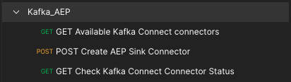

# 15.4 Installation et configuration de Kafka Connect et du connecteur Adobe Experience Platform Sink

## 15.4.1 Téléchargement du connecteur Adobe Experience Platform Sink

Accédez à [https://github.com/adobe/experience-platform-streaming-connect/releases](https://github.com/adobe/experience-platform-streaming-connect/releases) et téléchargez la dernière version officielle de Adobe Experience Platform Sink Connector.


Placez le fichier de téléchargement, **streaming-connect-sink-0.0.14-java-11.jar**, sur votre bureau.


## 15.4.2 Configuration de Kafka Connect

Accédez au dossier nommé sur votre bureau **Kafka_AEP** et accédez au dossier `kafka_2.13-3.1.0/config`.
Dans ce dossier, ouvrez le fichier **connect-distribute.properties** à l’aide de n’importe quel éditeur de texte.


Dans votre éditeur de texte, accédez aux lignes 34 et 35 et assurez-vous de définir les champs. `key.converter.schemas.enable` et `value.converter.schemas.enable` to `false`

```json
key.converter.schemas.enable=false
value.converter.schemas.enable=false
```

Enregistrez vos modifications dans ce fichier.


Ensuite, revenez au dossier `kafka_2.13-3.1.0` et créez manuellement un dossier, puis nommez-le. `connectors`.


Cliquez avec le bouton droit sur le dossier, puis cliquez sur **Nouveau terminal dans le dossier**.


Vous verrez alors ceci. Saisissez la commande `pwd` pour récupérer le chemin d’accès complet de ce dossier. Sélectionnez le chemin complet et copiez-le dans le presse-papiers.


Revenez au fichier de l’éditeur de texte. **connect-distribute.properties** et faites défiler jusqu’à la dernière ligne (ligne 86 dans la capture d’écran). Vous devez annuler la mise en commentaire de la ligne commençant par `# plugin.path=` et vous devez coller le chemin d’accès complet au dossier nommé `connectors`. Le résultat doit ressembler à ceci :

`plugin.path=/Users/woutervangeluwe/Desktop/Kafka_AEP/kafka_2.13-3.1.0/connectors`

Enregistrez vos modifications dans le fichier . **connect-distribute.properties** et fermez l’éditeur de texte.


Copiez ensuite la dernière version officielle du connecteur Adobe Experience Platform Sink que vous avez téléchargé dans le dossier nommé `connectors`. Le fichier que vous avez téléchargé précédemment est nommé **streaming-connect-sink-0.0.14-java-11.jar**, vous pouvez simplement le déplacer dans le `connectors` dossier.


Ouvrez ensuite une nouvelle fenêtre de terminal au niveau de la fonction **kafka_2.13-3.1.0** dossier. Cliquez avec le bouton droit de la souris sur ce dossier, puis cliquez sur **Nouveau terminal dans le dossier**.

Dans la fenêtre Terminal, collez la commande suivante : `bin/connect-distributed.sh config/connect-distributed.properties` et cliquez sur **Entrée**. Cette commande démarre Kafka Connect et charge la bibliothèque de Adobe Experience Platform Sink Connector.


Au bout de quelques secondes, vous verrez quelque chose comme ceci :


## 15.4.3 Création de votre connecteur Adobe Experience Platform Sink à l’aide de Postman

Vous pouvez désormais interagir avec Kafka Connect à l’aide de Postman. Pour ce faire, téléchargez [cette collection Postman](../../assets/postman/postman_kafka.zip) et décompressez-la sur votre ordinateur local sur le bureau. Vous aurez alors un fichier appelé `Kafka_AEP.postman_collection.json`.


Vous devez importer ce fichier dans Postman. Pour ce faire, ouvrez Postman, cliquez sur **Importer**, effectuez un glisser-déposer du fichier `Kafka_AEP.postman_collection.json` dans la fenêtre contextuelle, puis cliquez sur **Importer**.


Vous trouverez ensuite cette collection dans le menu de gauche de Postman. Cliquez sur la première requête, **Connecteurs Kafka Connect disponibles pour GET** pour l’ouvrir.



Vous verrez alors ceci. Cliquez sur le bouton bleu **Envoyer** à l’issue de laquelle une réponse vide s’affiche. `[]`. La réponse vide est due au fait qu’aucun connecteur Kafka Connect n’est actuellement défini.


Pour créer un connecteur, cliquez pour ouvrir la seconde requête dans la collection Kafka, **POST Créer un connecteur AEP Sink**. Vous verrez alors ceci. Sur la ligne 11, où il dit : **&quot;aep.endpoint&quot;: &quot;&quot;**, vous devez coller dans l’URL du point de terminaison de flux de l’API HTTP que vous avez reçue à la fin de l’exercice. [15.3](./ex3.md). L’URL du point de terminaison de diffusion en continu de l’API HTTP ressemble à ceci : `https://dcs.adobedc.net/collection/d282bbfc8a540321341576275a8d052e9dc4ea80625dd9a5fe5b02397cfd80dc`.


Après l’avoir collé, le corps de votre requête doit ressembler à ceci. Cliquez sur le bouton bleu **Envoyer** pour créer votre connecteur. Vous obtiendrez une réponse immédiate à la création de votre connecteur.


Cliquez sur la première requête, **Connecteurs Kafka Connect disponibles pour GET** pour l’ouvrir à nouveau, puis cliquez sur le bouton bleu **Envoyer** à nouveau. vous verrez maintenant qu&#39;un connecteur Kafka Connect est créé.


Ouvrez ensuite la troisième requête de la collection Kafka, **Vérification de l’état du connecteur Kafka Connect**. Cliquez sur le bouton bleu **Envoyer** vous obtiendrez alors une réponse similaire à celle ci-dessous, indiquant que le connecteur est en cours d’exécution.


## 15.4.4 Génération d’un événement d’expérience

Ouvrez une nouvelle **Terminal** en cliquant avec le bouton droit sur votre dossier **kafka_2.13-3.1.0** et clic **Nouveau terminal dans le dossier**.


Saisissez la commande suivante :

`bin/kafka-console-producer.sh --broker-list 127.0.0.1:9092 --topic aep`


Vous verrez alors ceci. Chaque nouvelle ligne suivie d’un bouton Entrée entraîne l’envoi d’un nouveau message dans la rubrique. **aep**.


Vous pouvez maintenant envoyer un message qui sera consommé par Adobe Experience Platform Sink Connector et ingéré dans Adobe Experience Platform en temps réel.

Faisons une petite démonstration pour le tester.

Accédez à [https://builder.adobedemo.com/projects](https://builder.adobedemo.com/projects). Une fois connecté avec votre Adobe ID, vous verrez ceci. Cliquez sur le projet de votre site web pour l’ouvrir.


Sur le **Screens** page, cliquez sur **Exécuter**.


Vous verrez alors votre site web de démonstration ouvert. Sélectionnez l’URL et copiez-la dans le presse-papiers.


Ouvrez une nouvelle fenêtre de navigateur incognito.


Collez l’URL de votre site web de démonstration, que vous avez copiée à l’étape précédente. Vous serez alors invité à vous connecter à l’aide de votre Adobe ID.


Sélectionnez le type de compte et procédez à la connexion.


Votre site web est alors chargé dans une fenêtre de navigateur incognito. Pour chaque démonstration, vous devez utiliser une fenêtre de navigateur incognito actualisée pour charger l’URL de votre site web de démonstration.


Cliquez sur l’icône représentant un logo d’Adobe dans le coin supérieur gauche de votre écran pour ouvrir la visionneuse de profils.


Consultez le panneau Visionneuse de profils et le profil client en temps réel avec le **ID Experience Cloud** comme identifiant Principal de ce client actuellement inconnu.


Accédez à la page Enregistrer/Connexion . Cliquez sur **CRÉATION D’UN COMPTE**.


Renseignez vos détails et cliquez sur **Enregistrer** après quoi vous serez redirigé vers la page précédente.


Ouvrez le panneau Visionneuse de profils et accédez à Real-time Customer Profile. Dans le panneau Visionneuse de profils, toutes vos données personnelles doivent s’afficher, comme les identifiants de téléphone et d’adresse électronique que vous venez d’ajouter.


Vous pouvez voir certains événements d’expérience en fonction d’activités antérieures.


Changeons cela et envoyons un événement d’expérience Callcenter de Kafka à Adobe Experience Platform.

Prenez l’exemple de payload d’événement d’expérience ci-dessous et copiez-le dans un éditeur de texte.

```json
{
  "header": {
    "datasetId": "61fe23fd242870194a6d779c",
    "imsOrgId": "--aepImsOrgID--",
    "source": {
      "name": "Launch"
    },
    "schemaRef": {
      "id": "https://ns.adobe.com/experienceplatform/schemas/b0190276c6e1e1e99cf56c99f4c07a6e517bf02091dcec90",
      "contentType": "application/vnd.adobe.xed-full+json;version=1"
    }
  },
  "body": {
    "xdmMeta": {
      "schemaRef": {
        "id": "https://ns.adobe.com/experienceplatform/schemas/b0190276c6e1e1e99cf56c99f4c07a6e517bf02091dcec90",
        "contentType": "application/vnd.adobe.xed-full+json;version=1"
      }
    },
    "xdmEntity": {
      "eventType": "callCenterInteractionKafka",
      "_id": "",
      "timestamp": "2022-02-23T09:54:12.232Z",
      "_experienceplatform": {
        "identification": {
          "core": {
            "phoneNumber": ""
          }
        },
        "interactionDetails": {
          "core": {
            "callCenterAgent": {
              "callID": "Support Contact - 3767767",
              "callTopic": "contract",
              "callFeeling": "negative"
            }
          }
        }
      }
    }
  }
}
```

Vous verrez alors ceci. Vous devez mettre à jour manuellement 2 champs :

- **_id**: définissez-le sur un identifiant aléatoire, par exemple `--demoProfileLdap--1234`
- **timestamp**: mettre à jour l’horodatage à la date et à l’heure actuelles ;
- **phoneNumber**: saisissez le numéro de téléphone du compte qui vient d’être créé sur le site web de démonstration. Vous pouvez le trouver dans le panneau Visionneuse de profil sous **Identités**.

Vous devez également vérifier et peut-être mettre à jour ces champs :
- **datasetId**: vous devez copier l’identifiant du jeu de données pour le système de démonstration du jeu de données - jeu de données d’événement pour le centre d’appels (Global v1.1).
- **imsOrgID**: votre identifiant de l’organisation IMS est `--aepImsOrgId--`

>[!NOTE]
>
>Le champ **_id** doit être unique pour chaque ingestion de données. Si vous générez plusieurs événements, veillez à mettre à jour le champ . **_id** à chaque fois qu’une nouvelle valeur est définie.


Vous devriez alors avoir quelque chose comme ceci :


Copiez ensuite l’événement d’expérience complet dans le presse-papiers. L’espace blanc de votre charge utile JSON doit être supprimé. Pour ce faire, nous utiliserons un outil en ligne. Accédez à [http://jsonviewer.stack.hu/](http://jsonviewer.stack.hu/) pour le faire.


Collez l’événement d’expérience dans l’éditeur, puis cliquez sur **Supprimer l’espace blanc**.


Ensuite, sélectionnez tout le texte de sortie et copiez-le dans le presse-papiers.


Revenez à la fenêtre de votre terminal.


Collez la nouvelle payload sans espaces dans la fenêtre Terminal, puis cliquez sur **Entrée**.


Revenez ensuite à votre site web de démonstration et actualisez la page. Vous devriez maintenant voir un événement d’expérience sur votre profil, sous **Autres événements**, comme celui-ci :


>[!NOTE]
>
>Si vous souhaitez que les interactions de votre centre d’appels apparaissent dans le panneau Visionneuse de profils, vous devez ajouter le libellé ci-dessous et filtrer dans votre projet sur [https://builder.adobedemo.com/projects](https://builder.adobedemo.com/projects)en accédant à l’onglet **Visionneuse de profils**.


Vous avez terminé cet exercice.

Étape suivante : [Résumé et avantages](./summary.md)

[Revenir au module 15](./aep-apache-kafka.md)

[Revenir à tous les modules](../../overview.md)
