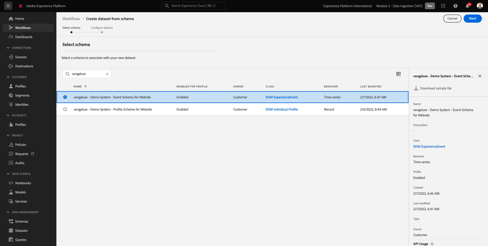

# 2.3 Configuration de jeux de données

Au cours de cet exercice, vous allez configurer les jeux de données requis pour capturer et stocker les informations de profil et le comportement des clients. Chaque jeu de données que vous créez dans utilise l’un des schémas que vous avez créés à l’étape précédente.

## Histoire

Après avoir défini la réponse aux questions **Qui est ce client ?** et **Que fait ce client ?** vous devez maintenant créer un compartiment qui utilise ces informations pour recevoir et valider les données envoyées à Adobe Experience Platform.

## 2.3.1 - Création de jeux de données

Vous devez maintenant créer 2 jeux de données :

- 1 jeu de données pour capturer les informations qui répondent à la variable **Qui est ce client ?** - question.
- 1 jeu de données pour capturer les informations qui répondent à la variable **Que fait ce client ?** - question.

Connectez-vous à Adobe Experience Platform en accédant à cette URL : [https://experience.adobe.com/platform](https://experience.adobe.com/platform).

Une fois connecté, vous accédez à la page d’accueil de Adobe Experience Platform.

Avant de continuer, vous devez sélectionner une **[!UICONTROL sandbox]**. L’environnement de test à sélectionner est nommé ``--module2sandbox--``. Pour ce faire, cliquez sur le texte **[!UICONTROL Production Prod]** dans la ligne bleue en haut de votre écran. Après avoir sélectionné le [!UICONTROL sandbox], vous verrez le changement d’écran et vous êtes maintenant dans votre [!UICONTROL sandbox].

Dans Adobe Experience Platform, cliquez sur **[!UICONTROL Jeux de données]** dans le menu du côté gauche de l’écran.  Vous verrez alors :

Commençons par créer le jeu de données pour capturer les informations d’enregistrement du site web.

Vous devez créer un nouveau jeu de données. Pour créer un nouveau jeu de données, cliquez sur le bouton **[!UICONTROL + Créer un jeu de données]**.

Après avoir cliqué sur le bouton **[!UICONTROL + Créer un jeu de données]** , l’écran suivant s’affiche.

Vous devez définir un jeu de données à partir du schéma que vous avez défini à l’étape précédente. Cliquez sur le bouton **[!UICONTROL Création d’un jeu de données à partir d’un schéma]** - .

Dans l&#39;écran suivant, vous devez sélectionner le schéma que vous avez créé en 1, `--demoProfileLdap-- - Demo System - Profile Schema for Website`.

Après avoir sélectionné le schéma, cliquez sur **[!UICONTROL Suivant]** pour continuer.

Attribuons un nom à votre jeu de données.

Pour nommer notre jeu de données, utilisez ceci :

`--demoProfileLdap-- - Demo System - Profile Dataset for Website`

Par exemple, pour ldap **[!UICONTROL vangeluw]**, il doit s’agir du nom du schéma :

**[!UICONTROL vangeluw - Système de démonstration - Jeu de données de profil pour le site web]**

Cela devrait vous donner quelque chose comme ceci :

Cliquez sur **[!UICONTROL Terminer]** pour terminer la configuration de votre jeu de données.

Vous verrez maintenant ceci :

Revenez au [!UICONTROL Jeux de données] aperçu. Le jeu de données que vous avez créé s’affiche désormais dans l’aperçu.

Vous allez ensuite configurer un deuxième jeu de données pour capturer les interactions avec le site web.

Vous devez créer un nouveau jeu de données. Pour créer un nouveau jeu de données, cliquez sur le bouton **[!UICONTROL + Créer un jeu de données]**.

Après avoir cliqué sur le bouton **[!UICONTROL + Créer un jeu de données]** , l’écran suivant s’affiche.

Vous devez définir un jeu de données à partir du schéma que vous avez défini à l’étape précédente. Cliquez sur le bouton **[!UICONTROL Création d’un jeu de données à partir d’un schéma]** - .

Dans l&#39;écran suivant, vous devez sélectionner le schéma que vous avez créé dans la version 2.2, `--demoProfileLdap-- - Demo System - Event Schema for Website`.

Après avoir sélectionné le schéma, cliquez sur **[!UICONTROL Suivant]** pour continuer.

Attribuons un nom à votre jeu de données.

Comme nom de notre jeu de données, nous utiliserons ceci :

`--demoProfileLdap-- - Demo System - Event Dataset for Website`

Par exemple, pour ldap **[!UICONTROL vangeluw]**, il doit s’agir du nom du schéma :

**[!UICONTROL vangeluw - Système de démonstration - Jeu de données d’événement pour le site web]**

Cela devrait vous donner quelque chose comme ceci :

Cliquez sur **[!UICONTROL Terminer]** pour terminer la configuration de votre jeu de données.

Vous verrez alors :

Revenez au [!UICONTROL Jeux de données] écran d’aperçu.

Vous devez maintenant activer vos jeux de données pour faire partie de Adobe Experience Platform Real-time Customer Profile.

Ouvrir votre jeu de données `--demoProfileLdap--` - Système de démonstration - Jeu de données de profil pour le site web en cliquant dessus.

Recherchez la variable [!UICONTROL Profil] icône d’activation/désactivation sur le côté droit de l’écran.

Cliquez sur le bouton [!UICONTROL Profil] activer/désactiver ce jeu de données pour [!UICONTROL Profil].

Cliquez sur le bouton **[!UICONTROL Activer]**.

Votre jeu de données est maintenant activé pour [!UICONTROL Profil].

Revenez à la présentation des jeux de données et ouvrez votre jeu de données. `--demoProfileLdap-- - Demo System - Event Dataset` pour le site Web en cliquant dessus.

Recherchez la variable [!UICONTROL Profil] icône d’activation/désactivation sur le côté droit de l’écran.

Cliquez sur le bouton [!UICONTROL Profil] bascule pour activer [!UICONTROL Profil].

Cliquez sur **[!UICONTROL Activer]**.

Votre jeu de données est maintenant activé pour [!UICONTROL Profil].

Étape suivante : [2.4 Ingestion de données à partir de sources hors ligne](./ex4.md)

[Revenir au module 2](./data-ingestion.md)

[Revenir à tous les modules](../../overview.md)
