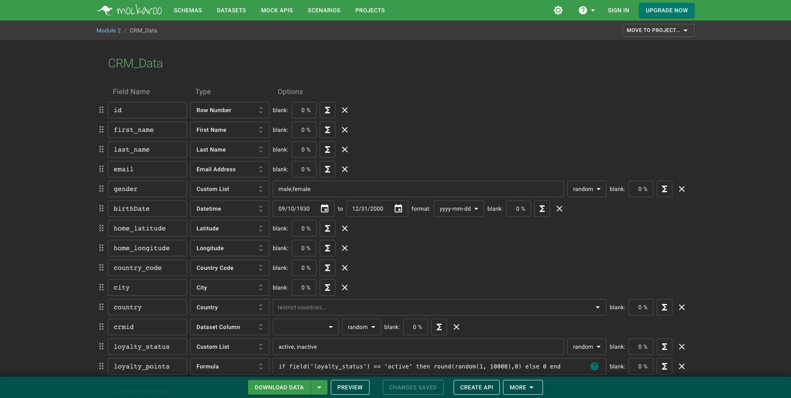
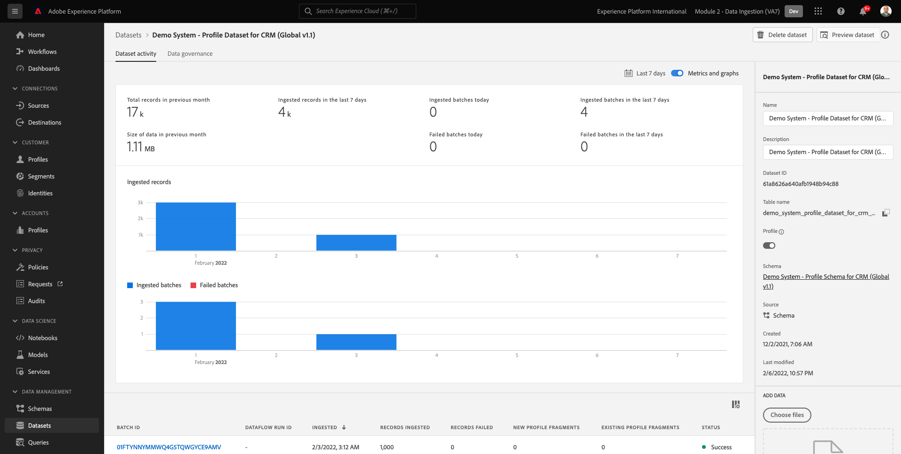

# 2.4 Ingestion de données à partir de sources hors ligne

Dans cet exercice, l’objectif est d’intégrer des données externes telles que les données CRM dans Platform.

## Objectifs d’apprentissage

- Découvrez comment générer des données de test
- Découvrez comment ingérer un fichier CSV
- Découvrez comment utiliser l’interface utilisateur web pour l’ingestion de données par le biais de workflows
- Présentation des fonctionnalités de gouvernance des données d’Experience Platform

## Ressources

- Interface utilisateur de Mockaroo : [https://www.mockaroo.com/](https://www.mockaroo.com/)
- Interface utilisateur de l’Experience Platform : [https://experience.adobe.com/platform/](https://experience.adobe.com/platform/)

## Tâches

- Créez un fichier CSV avec la date de démonstration. Ingérez le fichier CSV dans Adobe Experience Platform en utilisant les workflows disponibles.
- Présentation des options de gouvernance des données dans Adobe Experience Platform

## 2.4.1 Création de votre jeu de données CRM via un outil de générateur de données

Pour cela, vous avez besoin de 1000 échantillons de données CRM.

Ouvrez le modèle Mockaroo en accédant à [https://www.mockaroo.com/12674210](https://www.mockaroo.com/12674210).

Sur le modèle, vous remarquerez les champs suivants :

- identifiant
- first_name
- last_name
- adresse e-mail
- gender
- birthDate
- home_latitude
- home_longitude
- country_code
- ville
- pays

Tous ces champs ont été définis pour produire des données compatibles avec Platform.

Pour générer votre fichier CSV, cliquez sur le bouton **[!UICONTROL Télécharger les données]** qui vous donnera un fichier CSV contenant 1 000 lignes de données de démonstration.

Ouvrez votre fichier CSV dans Microsoft Excel pour en visualiser le contenu.

Une fois votre fichier CSV prêt, vous pouvez procéder au mappage par rapport à XDM.

### 2.4.2 Vérification du jeu de données d’intégration CRM dans Adobe Experience Platform

Ouvrir [Adobe Experience Platform](https://experience.adobe.com/platform) et accédez à **[!UICONTROL Jeux de données]**.

Avant de continuer, vous devez sélectionner une **[!UICONTROL sandbox]**. L’environnement de test à sélectionner est nommé ``--module2sandbox--``. Pour ce faire, cliquez sur le texte **[!UICONTROL Production Prod]** dans la ligne bleue en haut de votre écran. Après avoir sélectionné le [!UICONTROL sandbox], vous verrez le changement d’écran et vous êtes maintenant dans votre [!UICONTROL sandbox].

Dans Adobe Experience Platform, cliquez sur **[!UICONTROL Jeux de données]** dans le menu du côté gauche de l’écran.

Vous allez utiliser un jeu de données partagé basé sur cette activation. Le jeu de données partagé a déjà été créé et est appelé **[!UICONTROL Système de démonstration - Jeu de données de profil pour le CRM (Global v1.1)]**.

Ouvrir le jeu de données **[!UICONTROL Système de démonstration - Jeu de données de profil pour le CRM (Global v1.1)]**.

Dans l’écran de présentation, vous pouvez voir trois informations principales.

Tout d’abord, la [!UICONTROL Activité du jeu de données] Le tableau de bord affiche le nombre total d’enregistrements CRM dans le jeu de données et les lots ingérés, ainsi que leur état

Ensuite, en faisant défiler la page vers le bas, vous pouvez vérifier quand des lots de données ont été ingérés, combien d’enregistrements ont été intégrés et également, si le lot a été intégré avec succès ou non. Le **[!UICONTROL Identifiant de lot]** est l’identifiant d’une tâche par lots spécifique, et la variable **[!UICONTROL Identifiant de lot]** est important, car il peut être utilisé pour résoudre les problèmes liés à l’intégration d’un lot spécifique.

Enfin, la variable [!UICONTROL Informations sur le jeu de données] affiche des informations importantes, telles que [!UICONTROL Identifiant du jeu de données] (à nouveau, important du point de vue de la résolution des problèmes), le nom du jeu de données et si le jeu de données a été activé pour Profile.

Le paramètre le plus important ici est le lien entre le jeu de données et le schéma. Le schéma définit les données qui peuvent être ingérées et leur aspect.

Dans ce cas, nous utilisons le **[!UICONTROL Système de démonstration - Schéma de profil pour le CRM (Global v1.1)]**, qui est mappé sur la classe de **[!UICONTROL Profil]** et a mis en oeuvre des extensions, également appelées groupes de champs.

En cliquant sur le nom du schéma, vous accédez à la variable [!UICONTROL Schéma] dans la vue d’ensemble où vous pouvez voir tous les champs qui ont été activés pour ce schéma.

Un descripteur Principal personnalisé doit être défini pour chaque schéma. Dans le cas de notre jeu de données CRM, le schéma a défini que le champ **[!UICONTROL crmId]** doit être l’identifiant Principal. Si vous souhaitez créer un schéma et le lier au [!UICONTROL Real-time Customer Profile], vous devez définir une [!UICONTROL Groupe de champs] qui fait référence à votre Principal descripteur.

Dans la capture d’écran ci-dessus, vous pouvez voir que notre descripteur se trouve dans `--aepTenantId--.identification.core.crmId`, qui est défini comme [!UICONTROL Identifiant Principal], lié au [!UICONTROL namespace] de **[!UICONTROL Système de démonstration - CRMID]**.

Chaque schéma et, en tant que tel, chaque jeu de données qui doit être utilisé dans la variable [!UICONTROL Real-time Customer Profile] devrait en avoir une [!UICONTROL Identifiant Principal]. Ceci [!UICONTROL Identifiant Principal] est l’utilisateur d’identifiant par la marque d’un client dans ce jeu de données. Dans le cas d’un jeu de données CRM, il peut s’agir de l’adresse électronique ou de l’identifiant CRM. Dans le cas d’un jeu de données du centre d’appels, il peut s’agir du numéro de mobile d’un client.

Il est recommandé de créer un schéma distinct et spécifique pour chaque jeu de données et de définir le descripteur pour chaque jeu de données spécifiquement pour correspondre au fonctionnement des solutions actuelles utilisées par la marque.

### 2.4.3 Utilisation d’un workflow pour mapper un fichier CSV à un schéma XDM

L’objectif est d’intégrer des données CRM dans Platform. Toutes les données ingérées dans Platform doivent être mappées sur le schéma XDM spécifique. Vous disposez actuellement d’un jeu de données CSV avec 1 000 lignes d’un côté et d’un jeu de données lié à un schéma de l’autre côté. Pour charger ce fichier CSV dans ce jeu de données, un mappage doit avoir lieu. Pour faciliter cet exercice de mappage, nous avons **[!UICONTROL Workflows]** disponible dans Adobe Experience Platform.

Le [!UICONTROL workflow] que nous utiliserons ici, est le [!UICONTROL workflow] named **[!UICONTROL Mappage d’un fichier CSV au schéma XDM]** dans le [!UICONTROL Ingestion des données] .

Cliquez sur le bouton **[!UICONTROL Mappage d’un fichier CSV au schéma XDM]** bouton . Cliquez sur **[!UICONTROL Launch]** pour démarrer le processus.

Sur l’écran suivant, vous devez sélectionner un jeu de données dans lequel ingérer votre fichier. Vous avez le choix entre sélectionner un jeu de données existant ou en créer un nouveau. Pour cet exercice, nous allons réutiliser un existant : s’il vous plaît **[!UICONTROL Système de démonstration - Jeu de données de profil pour le CRM (Global v1.1)]** comme indiqué ci-dessous et conservez les autres paramètres définis par défaut.

Cliquez sur **[!UICONTROL Suivant]** pour passer à l’étape suivante.

Faites glisser et déposez votre fichier CSV ou cliquez sur **[!UICONTROL Parcourir]** et accédez à votre ordinateur de bureau sur votre ordinateur et sélectionnez votre fichier CSV.

Après avoir sélectionné votre fichier CSV, il est téléchargé immédiatement. Un aperçu de votre fichier s’affiche en quelques secondes.

Cliquez sur **[!UICONTROL Suivant]** pour passer à l’étape suivante. Cela peut prendre quelques secondes pendant le traitement complet du fichier.

Vous devez maintenant mapper vos en-têtes de colonne CSV avec une propriété XDM dans votre **[!UICONTROL Système de démonstration - Jeu de données de profil pour la gestion de la relation client]**.

Adobe Experience Platform a déjà fait quelques propositions pour vous, en essayant de lier le [!UICONTROL Attributs source] avec le [!UICONTROL Champs de schéma cible].

Pour le [!UICONTROL Mappages de schémas], Adobe Experience Platform a déjà essayé de lier des champs. Cependant, toutes les propositions de mappage ne sont pas correctes. Vous devez maintenant **Accepter les champs cibles** un par un.

#### birthDate

Le champ Schéma source **birthDate** doit être lié au champ cible **person.birthDate**.

#### ville

Le champ Schéma source **city** doit être lié au champ cible **homeAddress.city**.

#### pays

Le champ Schéma source **country** doit être lié au champ cible **homeAddress.country**.

#### country_code

Le champ Schéma source **country_code** doit être lié au champ cible **homeAddress.countryCode**.

#### adresse e-mail

Le champ Schéma source **email** doit être lié au champ cible **personalEmail.address**.

#### crmid

Le champ Schéma source ** crmid** doit être lié au champ cible. **`--aepTenantId--`.identification.core.crmId**.

#### first_name

Le champ Schéma source **first_name** doit être lié au champ cible **person.name.firstName**.

#### gender

Le champ Schéma source **gender** doit être lié au champ cible **person.gender**.

#### home_latitude

Le champ Schéma source **home_latitude** doit être lié au champ cible **homeAddress._schema.latitude**.

#### home_longitude

Le champ Schéma source **home_longitude** doit être lié au champ cible **homeAddress._schema.longitude**.

#### identifiant

Le champ Schéma source **id** doit être lié au champ cible **_id**.

#### last_name

Le champ Schéma source **last_name** doit être lié au champ cible **person.name.lastName**.

Vous devez maintenant disposer des éléments suivants :

Cliquez sur le bouton **[!UICONTROL Terminer]** pour terminer le workflow.

Après avoir cliqué sur **[!UICONTROL Terminer]**, vous verrez alors le **Flux de données** et après quelques minutes, vous pouvez actualiser votre écran pour voir si votre workflow s’est terminé avec succès. Cliquez sur **Nom du jeu de données cible**.

Vous verrez ensuite le jeu de données dans lequel votre ingestion a été traitée.

Sur le jeu de données, un [!UICONTROL Identifiant de lot] qui vient d’être ingéré, avec 1 000 enregistrements ingérés et un état de **[!UICONTROL Succès]**.

Cliquez sur le bouton **[!UICONTROL Aperçu du jeu de données]**- pour obtenir un aperçu rapide d’un petit échantillon du jeu de données afin de vous assurer que les données chargées sont correctes.

Une fois les données chargées, vous pouvez définir l’approche de gouvernance des données correcte pour notre jeu de données.

### 2.5.4 Ajout de la gouvernance des données à votre jeu de données

Maintenant que vos données client sont ingérées, vous devez vous assurer que ce jeu de données est correctement géré pour l’utilisation et le contrôle des exportations. Cliquez sur le bouton **[!UICONTROL Gouvernance des données]** et notez que vous pouvez définir trois types de restrictions : Données contractuelles, d’identité et sensibles.

Vous trouverez plus d’informations sur les différentes étiquettes et sur la manière dont elles seront appliquées à l’avenir par le biais du cadre de la politique sur ce lien : [https://www.adobe.io/apis/experienceplatform/home/dule/duleservices.html](https://www.adobe.io/apis/experienceplatform/home/dule/duleservices.html)

Limitons les données d’identité pour l’ensemble du jeu de données. Pointez sur le nom de votre jeu de données, puis cliquez sur l’icône représentant un crayon pour modifier les paramètres.

Accédez à **[!UICONTROL Données d’identité]** et vous verrez que le **[!UICONTROL I2]** est cochée. Cela suppose que toutes les informations contenues dans ce jeu de données sont au moins indirectement identifiables à la personne.

Cliquez sur **[!UICONTROL Enregistrer les modifications]** et observez les **[!UICONTROL I2]** est maintenant défini pour tous les champs de données du jeu de données.

Vous pouvez également définir ces indicateurs pour des champs de données individuels, par exemple : **[!UICONTROL firstName]** est susceptible d’être classé comme **[!UICONTROL I1]** pour les informations directement identifiables.

Sélectionner le champ **[!UICONTROL firstName]** en cochant la case et en cliquant sur **[!UICONTROL Modifier les libellés de gouvernance]** dans le coin supérieur droit de l’écran.

Accédez à **[!UICONTROL Données d’identité]** et vous verrez que le **[!UICONTROL I2]** est déjà cochée (héritée du jeu de données). Le champ firstName a également une configuration spécifique au champ et est défini comme **[!UICONTROL I1 - Données directement identifiables]**.

Grâce à cela, vous avez correctement ingéré et classé les données CRM dans Adobe Experience Platform.

Étape suivante : [2.5 Zone d’entrée des données](./ex5.md)

[Revenir au module 2](./data-ingestion.md)

[Revenir à tous les modules](../../overview.md)
