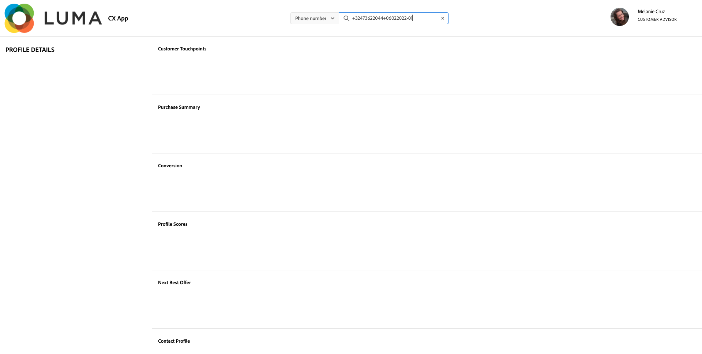

# 3.6 Voir votre profil client en temps réel en action dans le centre d’appels

Dans cet exercice, l’objectif est de vous faire parcourir le parcours client et agir comme un vrai client.

Sur ce site web, nous avons implémenté Adobe Experience Platform. Chaque action est considérée comme un événement d’expérience et est envoyée à Adobe Experience Platform en temps réel, hydratant le profil client en temps réel.

Au cours d’un exercice précédent, vous avez commencé comme un client anonyme qui naviguait sur le site, et après quelques étapes, vous êtes devenu un client connu.

Lorsque ce même client récupère finalement son téléphone et appelle votre centre d’appels, il est essentiel que les informations d’autres canaux soient disponibles immédiatement, de sorte que l’expérience du centre d’appels puisse être pertinente et personnalisée.

## 3.6.1 Utilisation de votre application CX

Dans le cadre de notre système de démonstration, nous avons créé un modèle d’application CX qui peut être utilisé pour simuler un environnement de centre d’appels. Pour créer un projet d’application CX, procédez comme suit.

Accédez à [https://builder.adobedemo.com/projects](https://builder.adobedemo.com/projects). Cliquez sur **Nouveau projet**.

Vous verrez ensuite votre projet d’application CX. Cliquez sur le projet pour l’ouvrir.

Dans votre projet d’application CX, accédez à **Intégrations**. Sélectionnez la propriété de collecte de données Adobe Experience Platform qui a été créée dans le module 0. Vous devez sélectionner la propriété qui possède **(activation)** dans son nom. Cliquez ensuite sur **Exécuter**.

Vous verrez alors ceci.

Dans le panneau Visionneuse de profils, vous pouvez voir ces combinaisons d’identifiants et d’espaces de noms :

| Identité | Espace de noms |
|:-------------:| :---------------:|
| Experience Cloud ID (ECID) | 12507560687324495704459439363261812234 |
| Email ID | woutervangeluwe+06022022-01@gmail.com |
| Identifiant du numéro de mobile | +32473622044+06022022-01 |

Lorsque le client appelle votre centre d’appel, le numéro de téléphone peut être utilisé pour identifier le client. Ainsi, dans cet exercice, vous utiliserez le numéro de téléphone pour récupérer le profil du client dans l’application CX.

Sélectionner **Numéro de téléphone** dans la liste déroulante et saisissez le numéro de téléphone que vous avez utilisé sur le site web. Accès **Entrée**.

Vous verrez désormais les informations qui seraient idéalement affichées dans le centre d’appels, de sorte que les employés du centre d’appels disposent immédiatement de toutes les informations pertinentes lorsqu’ils parlent à un client.

Étape suivante : [Résumé et avantages](./summary.md)

[Revenir au module 3](./real-time-customer-profile.md)

[Revenir à tous les modules](../../overview.md)
