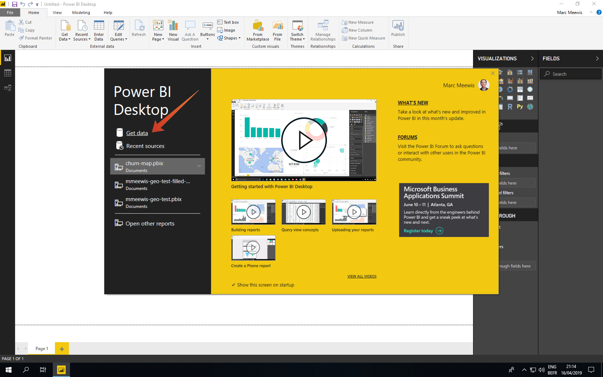

# 4.5 Query Service et Power BI

Ouvrez Microsoft Power BI Desktop.

Cliquez sur **Obtenir des données**.

Rechercher **postgres** (1), sélectionnez **Postgres** (2) de la liste et **Connexion** (3).

Accédez à Adobe Experience Platform, puis à **Requêtes** et à **Informations d’identification**.

Dans la **Informations d’identification** dans Adobe Experience Platform, copiez la variable **Hôte** et collez-le dans le **Serveur** et copiez la variable **Base** et collez-le dans le **Base** dans PowerBI, puis cliquez sur OK (2).

>[!IMPORTANT]
>
>Veillez à inclure le port **:80** à la fin de la valeur Server, car Query Service n’utilise actuellement pas le port PostgreSQL par défaut 5432.

Dans la boîte de dialogue suivante, indiquez le nom d’utilisateur et le mot de passe avec le nom d’utilisateur et le mot de passe figurant dans le champ **Informations d’identification** de requêtes dans Adobe Experience Platform.

Dans la boîte de dialogue Navigator, placez votre **LDAP** dans le champ de recherche (1) pour localiser vos jeux de données CTAS et cochez la case en regard de chaque (2). Cliquez ensuite sur Charger (3).

Assurez-vous que la variable **Rapport** (1) est sélectionné.

Sélectionnez la carte (1) et une fois qu’elle a été ajoutée à la zone de travail de création de rapports, agrandissez la carte (2).

Ensuite, nous devons définir les mesures et les dimensions. Pour ce faire, faites glisser les champs de la variable **fields** sur les espaces réservés correspondants (situés sous **visualisations**), comme indiqué ci-dessous :

Comme mesure, nous utiliserons un comptage de **customerId**. Faites glisser le **crmid** du champ **fields** dans la section **Taille** espace réservé :

Pour finir, **callTopic** analysez, faisons glisser la balise **callTopic** sur le champ **Filtres au niveau de la page** espace réservé (vous devrez peut-être faire défiler l’écran **visualisations** );

Sélectionner/désélectionner **calltopics** pour enquêter :

Vous avez maintenant terminé cet exercice.

Étape suivante : [4.7 API Query Service](./ex7.md)

[Revenir au module 4](./query-service.md)

[Revenir à tous les modules](../../overview.md)
