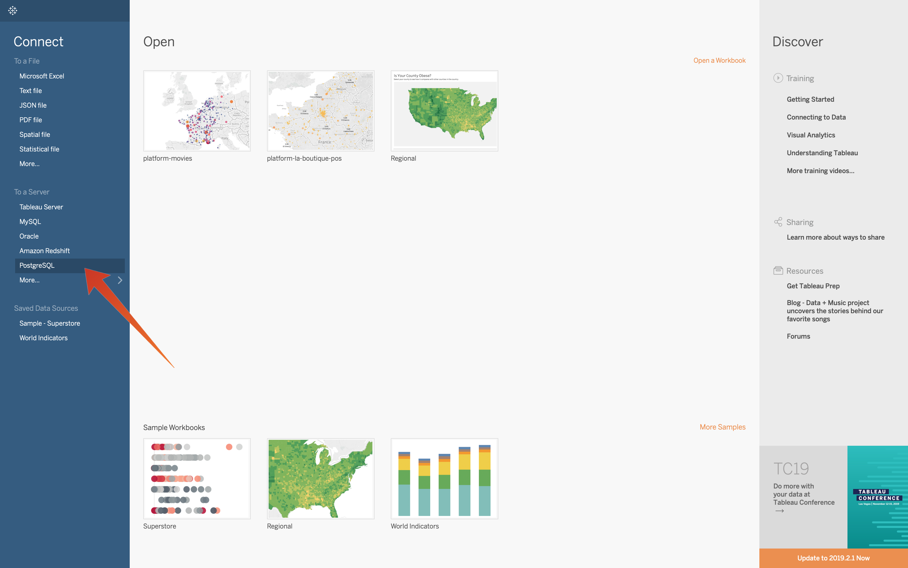

# 4.6 Query Service et Tableau

Ouvrez Tableau.

Dans **Connexion à un serveur** select **PostgreSQL**:

Accédez à Adobe Experience Platform, puis à **Requêtes** et à **Informations d’identification**.

Dans la **Informations d’identification** dans Adobe Experience Platform, copiez la variable **Hôte** et collez-le dans le **Serveur** , copiez le champ **Base** et collez-le dans le **Base** dans Tableau, copiez la variable **Port** et collez-le dans le champ **Port** dans Tableau, procédez de la même manière pour **Nom d’utilisateur** et **Mot de passe**. Cliquez ensuite sur **Se connecter**.

Connexion :

Cliquez sur Rechercher (1) et entrez votre **ldap** dans le champ de recherche, identifiez votre tableau à partir de l’ensemble de résultats et faites-le glisser (3) sur l’emplacement nommé **Faire glisser des tableaux ici**. Lorsque vous avez terminé, cliquez sur **Feuille 1** (3).

Pour visualiser nos données sur la carte, nous devons convertir la longitude et la latitude en dimensions. Dans **Mesures** select **Latitude** (1) puis ouvrez la liste déroulante du champ et sélectionnez **Convertir en Dimension** (2). Faites de même pour le **Longitude** mesure.

Faites glisser le **Longitude** à la mesure **Colonnes** et le **Latitude** mesurer **Lignes**. Mappage automatique de **Belgique** apparaîtra avec des petits points représentant les villes dans l’ensemble de données.

Sélectionner **Mesure des noms** (1), ouvrez la liste déroulante et sélectionnez **Ajouter à la feuille** (2) :

Vous disposez désormais d’une carte, avec des points de différentes tailles. La taille indique le nombre d’interactions du centre d’appels pour cette ville spécifique. Pour modifier la taille des points, accédez au panneau de droite et ouvrez **Mesure des valeurs** (à l’aide de l’icône déroulante). Dans la liste déroulante, sélectionnez **Modifier les tailles**. Jouez avec différentes tailles.

Pour afficher davantage les données par **Rubrique d’appel**, faites glisser (1) le **Rubrique d’appel** dimension sur **Pages**. Parcourez les différentes **Rubriques d’appel** en utilisant la variable **Rubrique d’appel** (2) sur le côté droit de l’écran :

Vous avez maintenant terminé cet exercice.

Étape suivante : [4.7 API Query Service](./ex7.md)

[Revenir au module 4](./query-service.md)

[Revenir à tous les modules](../../overview.md)
