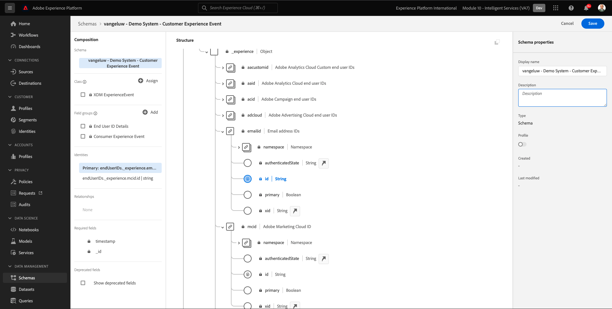
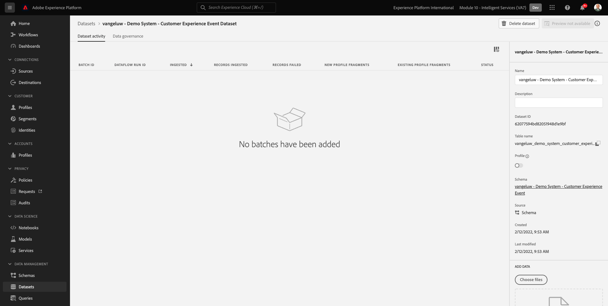

# 5.1 Customer AI - Préparation des données (ingestion)

Pour que les services intelligents découvrent des informations à partir de vos données d’événements marketing, les données doivent être enrichies sémantiquement et conservées dans une structure standard. Pour ce faire, les services intelligents utilisent les schémas XDM (Experience Data Model) d’Adobe.
En particulier, tous les jeux de données utilisés dans les services intelligents doivent se conformer à la variable **Événement d’expérience client** Schéma XDM.

## 5.1.1 Création d’un schéma

Dans cet exercice, vous allez créer un schéma qui contient le **Mixin Événement d’expérience client**, qui est requis par la variable **Customer AI** Intelligent Service.

Connectez-vous à Adobe Experience Platform en accédant à cette URL : [https://experience.adobe.com/platform](https://experience.adobe.com/platform).

Une fois connecté, vous accédez à la page d’accueil de Adobe Experience Platform.

Avant de continuer, vous devez sélectionner une **sandbox**. L’environnement de test à sélectionner est nommé ``--module10sandbox--``. Pour ce faire, cliquez sur le texte **[!UICONTROL Production Prod]** dans la ligne bleue en haut de votre écran. Après avoir sélectionné l’environnement de test approprié, l’écran change et vous êtes désormais dans votre environnement de test dédié.

Dans le menu de gauche, cliquez sur **Schémas** et accédez à **Parcourir**. Cliquez sur **Création d’un schéma**.

Dans la fenêtre contextuelle, sélectionnez **XDM ExperienceEvent**.

Vous verrez alors ceci.

Recherchez et sélectionnez les éléments suivants : **Mixins** à ajouter à ce schéma :

- Événement d’expérience client

   

- Informations sur l’identifiant de l’utilisateur final

   

Cliquez sur **Ajout de groupes de champs**.

Vous verrez alors ceci. Sélectionnez le mixin. **Détails de l’ID d’utilisateur final**.

Accédez au champ **endUserIDs._experience.emailid.id**.

Dans le menu de droite du champ **endUserIDs._experience.emailid.id**, faites défiler la page vers le bas et cochez la case pour **Identité**, cochez la case correspondant à **Identité Principal** et sélectionnez la variable **Espace de noms d’identité** de **Email**.

Accédez au champ **endUserIDs._experience.mcid.id**. Cochez la case correspondant à **Identité** et sélectionnez la variable **Espace de noms d’identité** de **ECID**. Cliquez sur **Appliquer**.

Donnez un nom à votre schéma maintenant.

Pour le nom de notre schéma, vous utiliserez ceci :

- `--demoProfileLdap-- - Demo System - Customer Experience Event`

Par exemple, pour ldap **vangeluw**, il doit s’agir du nom du schéma :

- **vangeluw - Système de démonstration - Événement d’expérience client**

Ça devrait vous donner quelque chose comme ça. Cliquez sur le bouton **+ Ajouter** pour ajouter un nouveau bouton **Mixins**.

Sélectionnez le nom de votre schéma. Vous devez maintenant activer votre schéma pour **Profil**, en cliquant sur le bouton **Profil** bascule.

Vous verrez alors ceci. Cliquez sur **Activer**.

Vous devriez maintenant avoir ceci. Cliquez sur **Enregistrer** pour enregistrer votre schéma.

## 5.1.2 Création d’un jeu de données

Dans le menu de gauche, cliquez sur **Jeux de données** et accédez à **Parcourir**. Cliquez sur **Création d’un jeu de données**.

Cliquez sur **Créer un jeu de données à partir d’un schéma**.

Dans l’écran suivant, sélectionnez le jeu de données que vous avez créé lors de l’exercice précédent, qui est nommé **[!UICONTROL ldap - Système de démonstration - Événement d’expérience client]**. Cliquez sur **Suivant**.

Pour nommer votre jeu de données, utilisez `--demoProfileLdap-- - Demo System - Customer Experience Event Dataset`. Cliquez sur **Terminer**.

Votre jeu de données est maintenant créé. Activez la variable **Profil** bascule.

Cliquez sur **Activer**.

Vous devez maintenant disposer des éléments suivants :

Vous êtes maintenant prêt à commencer à ingérer des données d’événement d’expérience client et à utiliser le service Customer AI.

## 5.1.3 Téléchargement des données de test d’événement d’expérience

Une fois que la variable **Schéma** et **Jeu de données** sont configurés. Vous êtes maintenant prêt à ingérer les données d’événement d’expérience. Puisque Customer AI requiert des données à l’échelle de la société **2 trimestres au moins**, vous devrez ingérer des données préparées en externe.

Les données préparées pour les événements d’expérience doivent être conformes aux exigences et au schéma de la variable [Mixin XDM des événements d’expérience client](https://github.com/adobe/xdm/blob/797cf4930d5a80799a095256302675b1362c9a15/docs/reference/context/experienceevent-consumer.schema.md).

Téléchargez le fichier contenant des exemples de données à partir de cet emplacement : [https://dashboard.adobedemo.com/data](https://dashboard.adobedemo.com/data). Cliquez sur le bouton **Télécharger** bouton .

Vous avez maintenant téléchargé un fichier nommé **retail-v1-dec2020-xl.json.zip**. Placez le fichier sur le bureau de votre ordinateur et décompressez-le, après quoi vous verrez un fichier nommé **retail-v1.json**. Vous aurez besoin de ce fichier lors de l’exercice suivant.

## 5.1.4 Ingestion des données de test d’événement d’expérience

Dans Adobe Experience Platform, accédez à **Jeux de données** et ouvrez votre jeu de données, nommé **[!UICONTROL ldap - Système de démonstration - Jeu de données d’événement d’expérience client]**.

Dans votre jeu de données, cliquez sur **Sélection de fichiers** pour ajouter des données.

Dans la fenêtre contextuelle, sélectionnez le fichier **retail-v1.json** et cliquez sur **Ouvrir**.

Vous verrez alors les données importées et un nouveau lot est créé dans la variable **Chargement** état. Ne quittez pas cette page tant que le fichier n’a pas été chargé.

Une fois le fichier chargé, vous verrez le changement d’état du lot de **Chargement** to **Traitement**.

L’ingestion et le traitement des données peuvent prendre entre 10 et 20 minutes.

Une fois l’ingestion des données réussie, l’état du lot passe à **Succès**.

Étape suivante : [5.2 Customer AI - Création d’une instance (configuration)](./ex2.md)

[Revenir au module 5](./intelligent-services.md)

[Revenir à tous les modules](./../../overview.md)
