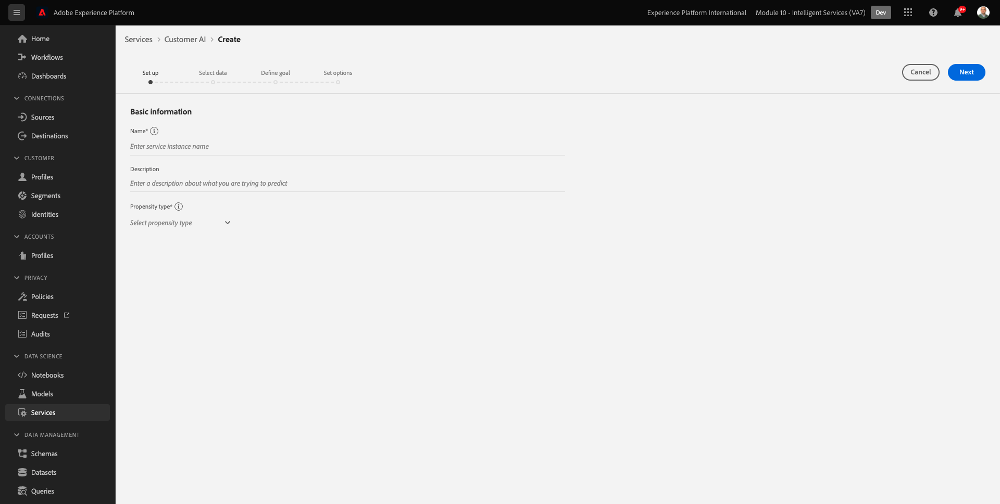

# 5.2 Customer AI - Création d’une instance (configuration)

Customer AI analyse les données d’événement d’expérience existantes pour le client afin de prévoir les taux d’attrition ou de conversion. La création d’une instance Customer AI permet aux marketeurs de définir des objectifs et des mesures.

## 5.2.1 Configuration d’une nouvelle instance de Customer AI

Dans Adobe Experience Platform, cliquez sur **Services** dans le menu de gauche. Le navigateur **Services** apparaît et affiche tous les services disponibles. Dans la carte de Customer AI, cliquez sur **Ouvrir**.

Cliquez sur **Créer une instance**.

Vous verrez alors ceci.

Saisissez les détails requis pour l’instance Customer AI :

- Nom : use `--demoProfileLdap-- Product Purchase Propensity`
- Description : use: **Prédire la probabilité pour les clients d’acheter un produit**
- Type de propension : select **Conversion**

Cliquez sur **Suivant**.

Vous verrez alors ceci. Sélectionnez le jeu de données que vous avez créé lors de l’exercice précédent qui est nommé `--demoProfileLdap - Demo System - Customer Experience Event Dataset`. Cliquez sur **Suivant**.

Sélectionner **Se produit** et définir le champ **commerce.purchase.value** comme variable cible.

Cliquez sur **Suivant**.

Définissez ensuite votre planning pour qu’il s’exécute. **Hebdomadaire** et définissez l’heure aussi près que possible de l’heure actuelle. Assurez-vous que la bascule **Activation des scores pour Profile** est activée.

Cliquez sur **Terminer**.

Vous verrez alors cette fenêtre contextuelle. Cliquez sur **OK**.

Une fois l’instance configurée, vous pouvez l’afficher dans la liste des instances Customer AI et prévisualiser le résumé de la configuration et des détails d’exécution en cliquant sur la ligne de l’instance Customer AI. Le panneau de résumé affiche également les détails des erreurs en cas d’erreur.

>[!NOTE]
>
>Vous pouvez modifier n’importe quelle définition ou attribut tant que l’état de votre instance Customer AI est : **En attente de formation** ou **Erreur**

Étape suivante : [5.3 Customer AI - Tableau de bord de notation et segmentation (prévoir et prendre des mesures)](./ex3.md)

[Revenir au module 5](./intelligent-services.md)

[Revenir à tous les modules](./../../overview.md)
