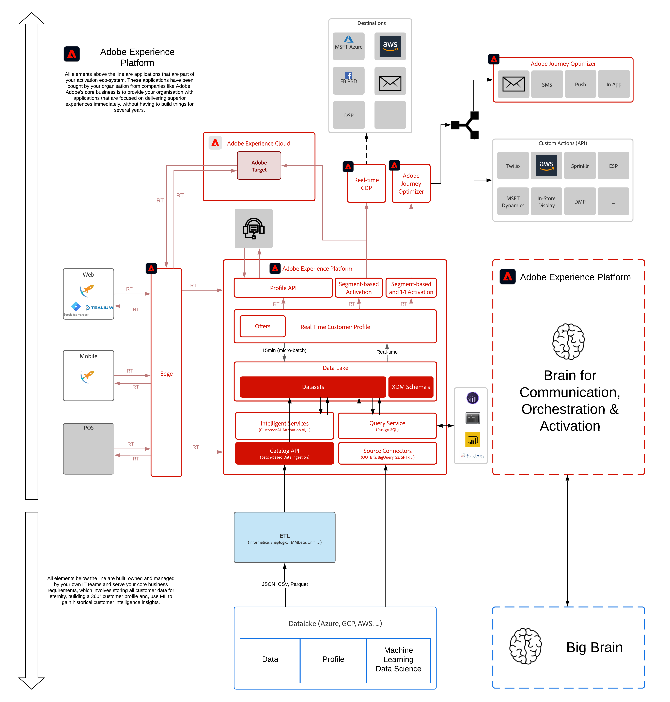

# 5. Intelligent Services

**Auteurs : [Diptiman Badajena](https://www.linkedin.com/in/diptiman-badajena-1b178019/), [Wouter Van Geluwe](https://www.linkedin.com/in/woutervangeluwe/)**

Dans ce module, vous apprendrez à configurer et à utiliser les services intelligents Adobe Experience Platform.

## Objectifs d’apprentissage

- Familiarisez-vous avec Adobe Experience Platform
- Configuration d’un schéma/d’un jeu de données à utiliser avec Intelligent Services
- Création d’une instance Customer AI
- Tableau de bord de notation et segmentation

## Conditions préalables

- Accès à Adobe Experience Platform : [https://experience.adobe.com/platform](https://experience.adobe.com/platform)

>[!IMPORTANT]
>
>Ce tutoriel a été créé pour faciliter un format d’atelier particulier. Il utilise des systèmes et des comptes spécifiques auxquels vous n’avez peut-être pas accès. Même sans accès, nous pensons que vous pouvez encore apprendre beaucoup en lisant à travers ce contenu très détaillé. Si vous participez à l’un des ateliers et que vous avez besoin de vos informations d’identification d’accès, veuillez contacter votre représentant d’Adobe qui vous fournira les informations requises.

## Aperçu de l’architecture

Regardez l’architecture ci-dessous, qui met en évidence les composants qui seront discutés et utilisés dans ce module.

## Environnement de test à utiliser

Pour ce module, utilisez cet environnement de test : `--module10sandbox--`.

>[!NOTE]
>
>N’oubliez pas d’installer, de configurer et d’utiliser l’extension Chrome comme référencé dans [0.1 - Installation de l’extension Chrome pour la documentation Experience League](../module0/ex1.md)

## Exercices

[5.1 Customer AI - Préparation des données (ingestion)](./ex1.md)

Les données clients sont assimilées et transformées avec le modèle de données d’expérience (XDM) sur Adobe Experience Platform. En particulier, tous les jeux de données utilisés dans Intelligent Services doivent être conformes au schéma XDM Consumer ExperienceEvent (CEE).

[5.2 Customer AI - Création d’une instance (configuration)](./ex2.md)

L’analyste marketing configure les prédictions souhaitées en spécifiant les règles commerciales et en identifiant les données pertinentes. Après avoir configuré le modèle, planifiez les exécutions et les scores de révision.

[5.3 Customer AI - Tableau de bord de notation et segmentation (prévoir et prendre des mesures)](./ex3.md)

Une fois que la formation et la notation avec les modèles sont terminées, les scores sont réinsérés dans Platform. Vous pouvez décider des actions à entreprendre avec les prédictions, telles que la définition de segments, la création de tableaux de bord personnalisés, etc.

>[!NOTE]
>
>Merci d&#39;investir votre temps dans l&#39;apprentissage de Adobe Experience Platform. Si vous avez des questions, souhaitez partager les commentaires généraux d&#39;avoir des suggestions sur le contenu futur, contactez directement Wouter Van Geluwe en envoyant un email à **vangeluw@adobe.com**.

[Revenir à tous les modules](../../overview.md)
