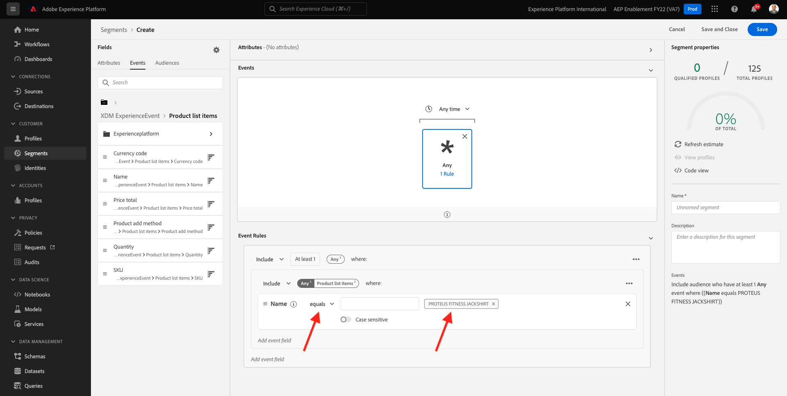

# 6.1 Création d’un segment

Dans cet exercice, vous allez créer un segment en utilisant le créateur de segments de Adobe Experience Platform.

## 6.1.1 Contexte

Dans le monde d&#39;aujourd&#39;hui, répondre au comportement d&#39;un client doit être en temps réel. L’utilisation d’un segment, à condition que le segment soit admissible en temps réel, constitue l’une des façons de répondre au comportement des clients en temps réel. Dans cet exercice, vous devez créer un segment, en tenant compte de l’activité réelle sur le site web que nous avons utilisé.

## 6.1.2 Identifier le comportement auquel vous souhaitez réagir

Accédez à [https://builder.adobedemo.com/projects](https://builder.adobedemo.com/projects). Une fois connecté avec votre Adobe ID, vous verrez ceci. Cliquez sur le projet de votre site web pour l’ouvrir.

Vous pouvez maintenant suivre le flux ci-dessous pour accéder au site web. Cliquez sur **Intégrations**.

Sur le **Intégrations** , vous devez sélectionner la propriété de collecte de données qui a été créée dans l’exercice 0.1.

Vous verrez alors votre site web de démonstration ouvert. Sélectionnez l’URL et copiez-la dans le presse-papiers.

Ouvrez une nouvelle fenêtre de navigateur incognito.

Collez l’URL de votre site web de démonstration, que vous avez copiée à l’étape précédente. Vous serez alors invité à vous connecter à l’aide de votre Adobe ID.

Sélectionnez le type de compte et procédez à la connexion.

Votre site web est alors chargé dans une fenêtre de navigateur incognito. Pour chaque démonstration, vous devez utiliser une fenêtre de navigateur incognito actualisée pour charger l’URL de votre site web de démonstration.

Dans cet exemple, vous souhaitez répondre à un client spécifique qui consulte un produit spécifique.
Dans la **Luma** homepage, accédez à **Hommes**, puis cliquez sur le produit **PROTÉGER UN JACKSHIRT D&#39;AFFICHAGE**.

Ainsi, lorsque quelqu’un visite la page de produit pour **PROTÉGER UN JACKSHIRT D&#39;AFFICHAGE**, vous voulez pouvoir agir. La première chose à faire est de définir un segment.

## 6.1.3 Création du segment

Accédez à [Adobe Experience Platform](https://experience.adobe.com/platform). Une fois connecté, vous accédez à la page d’accueil de Adobe Experience Platform.

Avant de continuer, vous devez sélectionner une **sandbox**. L’environnement de test à sélectionner est nommé ``--aepSandboxId--``. Pour ce faire, cliquez sur le texte **[!UICONTROL Production Prod]** dans la ligne bleue en haut de votre écran. Après avoir sélectionné le [!UICONTROL sandbox], vous verrez le changement d’écran et vous êtes maintenant dans votre [!UICONTROL sandbox].

Dans le menu de gauche, accédez à **Segments** puis accédez à **Parcourir** où vous pouvez voir un aperçu de tous les segments existants. Cliquez sur le bouton **Créer un segment** pour commencer à créer un segment.

Comme mentionné ci-dessus, vous devez créer un segment parmi tous les clients qui ont consulté le produit. **PROTÉGER UN JACKSHIRT D&#39;AFFICHAGE**.

Pour créer ce segment, vous devez ajouter un événement . Vous pouvez trouver tous les événements en cliquant sur la variable **Événements** dans le **Segments** de la barre de menus.

Ensuite, vous verrez le niveau supérieur **XDM ExperienceEvent** noeud .

Pour rechercher des clients qui ont consulté la variable **PROTÉGER UN JACKSHIRT D&#39;AFFICHAGE** produit, cliquez sur **XDM ExperienceEvent**.

Faites défiler jusqu’à **Éléments de liste de produits** et cliquez dessus.

Sélectionner **Nom** et faites glisser et déposez le **Nom** à partir de la gauche **Éléments de liste de produits** sur le canevas du créateur de segments dans la **Événements** .

Le paramètre de comparaison doit être **est égal à** et dans le champ de saisie, saisissez `PROTEUS FITNESS JACKSHIRT`.

Votre **Règles d’événement** devrait maintenant ressembler à ceci. Chaque fois que vous ajoutez un élément au créateur de segments, vous pouvez cliquer sur le **Actualiser l’estimation** pour obtenir une nouvelle estimation de la population de votre segment.

Enfin, attribuons un nom à votre segment et enregistrez-le.

Pour définir une convention d’affectation des noms, utilisez :

- `--demoProfileLdap-- - Interest in PROTEUS FITNESS JACKSHIRT`

Le nom de votre segment doit se présenter comme suit :
`vangeluw - Interest in PROTEUS FITNESS JACKSHIRT`

Cliquez ensuite sur le **Enregistrer et fermer** pour enregistrer votre segment.

Vous allez maintenant revenir à la page d’aperçu du segment.

Étape suivante : [6.2 Découvrez comment configurer une destination DV360 à l’aide de destinations](./ex2.md)

[Revenir au module 11](./real-time-cdp-build-a-segment-take-action.md)

[Revenir à tous les modules](../../overview.md)
