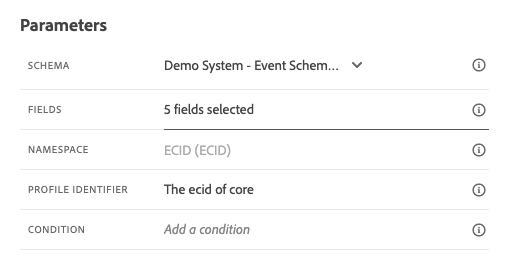

# 8.1 Définition d’un événement

Connectez-vous à Adobe Journey Optimizer en accédant à [Adobe Experience Cloud](https://experience.adobe.com). Cliquez sur **Journey Optimizer**.

Vous serez redirigé vers le **Accueil**  dans Journey Optimizer. Tout d’abord, assurez-vous d’utiliser l’environnement de test approprié. L’environnement de test à utiliser est appelé `--aepSandboxId--`. Pour passer d’un environnement de test à un autre, cliquez sur **Production (VA7)** et sélectionnez l’environnement de test dans la liste. Dans cet exemple, l’environnement de test est nommé **Activation AEP FY22**. Vous serez alors dans le **Accueil** affichage de votre environnement de test `--aepSandboxId--`.

Dans le menu de gauche, faites défiler l’écran vers le bas et cliquez sur **Configurations**. Cliquez ensuite sur le **Gérer** sous **Événements**.

Vous verrez ensuite un aperçu de tous les événements disponibles. Cliquez sur **Créer un événement** pour commencer à créer votre propre événement.

Une nouvelle fenêtre d’événement vide s’affiche alors.

Pour attribuer un nom à l’événement, utilisez `--demoProfileLdap--GeofenceEntry`. Dans cet exemple, le nom de l’événement est `vangeluwGeofenceEntry`.

Définissez la description sur : `Geofence Entry Event`.

Ensuite, assurez-vous que la variable **Type** est défini sur **Unitaire**, et pour le **Type d’identifiant d’événement** sélection, sélectionnez **Généré par le système**

Vous devez ensuite sélectionner un schéma. Tous les schémas présentés ici sont des schémas Adobe Experience Platform.

Vous remarquerez que tous les schémas ne sont pas affichés. Il existe de nombreux autres schémas disponibles dans Adobe Experience Platform.
Pour apparaître dans cette liste, un schéma doit être associé à un groupe de champs très spécifique. Le groupe de champs nécessaire pour s’afficher ici est appelé `Orchestration eventID`.

Découvrez comment ces schémas sont définis dans Adobe Experience Platform.

Dans le menu de gauche, accédez à **Schémas** et ouvrez-le dans un nouvel onglet du navigateur. Dans **Schémas**, accédez à **Parcourir** pour afficher la liste des schémas disponibles.
Ouverture du schéma `Demo System - Event Schema for Website (Global v1.1)`.

Après avoir ouvert le schéma, vous verrez que le groupe de champs `Orchestration eventID` fait partie du schéma.
Ce groupe de champs n&#39;a que deux champs, `_experience.campaign.orchestration.eventID` et `originJourneyID`.

Une fois que ce groupe de champs et ce champ eventID spécifique font partie d’un schéma, ce schéma peut être utilisé par Adobe Journey Optimizer.

Revenez à la configuration de votre événement dans Adobe Journey Optimizer.

Dans ce cas d’utilisation, vous souhaitez écouter un événement de géolocalisation pour savoir si un client se trouve à un emplacement spécifique. Sélectionnez donc maintenant le schéma. `Demo System - Event Schema for Website (Global v1.1)` comme schéma de votre événement.

Adobe Journey Optimizer sélectionne alors automatiquement certains champs requis, mais vous pouvez modifier les champs mis à disposition de Adobe Journey Optimizer.

Cliquez sur le bouton **crayon** pour modifier les champs.

Une fenêtre contextuelle s’affiche, avec une hiérarchie de schémas permettant de sélectionner des champs.

Les champs tels que l’ECID et l’identifiant d’événement Orchestration sont obligatoires et, en tant que tels, présélectionnés.

Cependant, un marketeur doit disposer d’un accès flexible à tous les points de données qui fournissent un contexte à un Parcours. Veillez donc à sélectionner également les champs suivants (situés dans le noeud Contexte de l’emplacement) :

- Ville

Une fois que vous avez terminé, cliquez sur **OK**.

Adobe Journey Optimizer a également besoin d’un identifiant pour identifier le client. Adobe Journey Optimizer étant lié à Adobe Experience Platform, l’identifiant Principal d’un schéma est automatiquement pris comme identifiant du Parcours.
L’identifiant Principal prend également automatiquement en compte le graphique d’identités complet de Adobe Experience Platform et associe tous les comportements sur toutes les identités, appareils et canaux disponibles au même profil, de sorte que Adobe Journey Optimizer soit contextuel, pertinent et cohérent.

Cliquez sur **Enregistrer** pour enregistrer votre événement personnalisé.

Votre événement fera alors partie de la liste des événements disponibles.

Enfin, vous devez récupérer la variable `Orchestration eventID` pour votre événement personnalisé.

Ouvrez à nouveau votre événement en cliquant dessus dans la liste des événements.
Sur votre événement, cliquez sur le bouton **Afficher la charge utile** en regard de **Champs**.

Cliquez sur le bouton **Afficher la charge utile** Cette icône ouvre un exemple de charge utile XDM pour cet événement.

Faites défiler l’écran vers le bas **Payload** jusqu’à ce que la ligne s’affiche `eventID`.

Notez les `eventID` comme vous en aurez besoin dans la dernière pour tester votre configuration.

Dans cet exemple, la variable `eventID` is `fa42ab7982ba55f039eacec24c1e32e5c51b310c67f0fa559ab49b89b63f4934`.

Vous avez maintenant défini l’événement qui déclenchera le parcours que nous sommes en train de créer. Une fois le parcours déclenché, les champs de géobarrière tels que Ville et tout autre champ que vous avez choisi (Pays, Latitude et Longitude, par exemple) seront mis à la disposition du parcours.

Comme indiqué dans la description du cas d’utilisation, nous devons ensuite fournir des promotions contextuelles qui dépendent du temps. Pour obtenir des informations météorologiques, nous allons devoir définir une source de données externe qui nous fournira les informations météorologiques pour cet emplacement. Vous utiliserez la variable **OpenWeather** pour nous fournir ces informations, dans le cadre de la section 2.

Étape suivante : [8.2 Définition d’une source de données externe](./ex2.md)

[Revenir au module 8](journey-orchestration-external-weather-api-sms.md)

[Revenir à tous les modules](../../overview.md)
