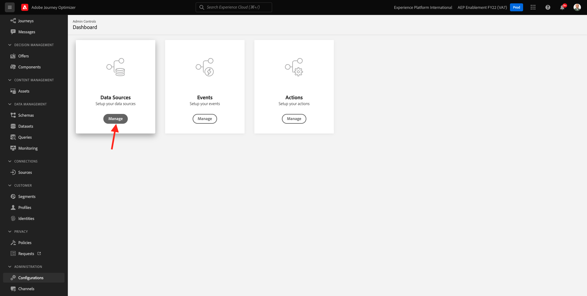
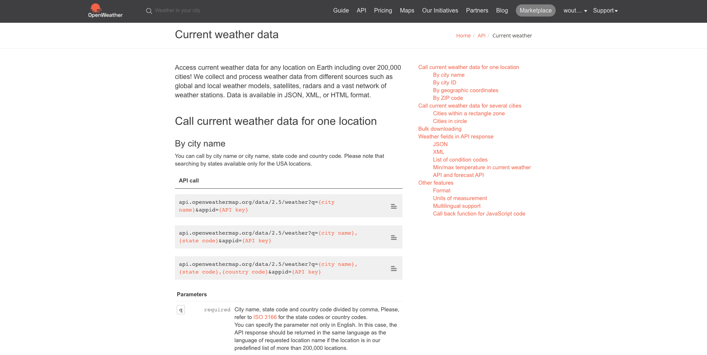

# 8.2 Définition d’une source de données externe

Dans cet exercice, vous allez créer une source de données externe personnalisée à l’aide de Adobe Journey Optimizer.

Connectez-vous à Adobe Journey Optimizer en accédant à [Adobe Experience Cloud](https://experience.adobe.com). Cliquez sur **Journey Optimizer**.


Vous serez redirigé vers le **Accueil**  dans Journey Optimizer. Tout d’abord, assurez-vous d’utiliser l’environnement de test approprié. L’environnement de test à utiliser est appelé `--aepSandboxId--`. Pour passer d’un environnement de test à un autre, cliquez sur **Production (VA7)** et sélectionnez l’environnement de test dans la liste. Dans cet exemple, l’environnement de test est nommé **Activation AEP FY22**. Vous serez alors dans le **Accueil** affichage de votre environnement de test `--aepSandboxId--`.


Dans le menu de gauche, faites défiler l’écran vers le bas et cliquez sur **Configurations**. Cliquez ensuite sur le **Gérer** sous **Sources de données**.



Vous verrez alors le **Sources de données** liste.
Cliquez sur **Création d’une source de données** pour commencer à ajouter votre source de données.


Une fenêtre contextuelle de source de données vide s’affiche.


Avant de pouvoir commencer à configurer ce paramètre, vous devez disposer d’un compte avec la variable **Ouvrir la carte météorologique** service. Pour créer votre compte et obtenir votre clé d’API, procédez comme suit.

Accédez à [https://openweathermap.org/](https://openweathermap.org/). Sur la page d’accueil, cliquez sur **Se connecter**.


Cliquez sur **Création d’un compte**.


Renseignez les détails.


Cliquez sur **Créer un compte**.


Vous serez ensuite redirigé vers la page de votre compte.


Dans le menu, cliquez sur **Clés API** pour récupérer votre clé API, que vous devrez configurer votre source de données externe personnalisée.


Un **Clé API** ressemble à ceci : `b2c4c36b6bb59c3458d6686b05311dc3`.

Vous trouverez la variable **Documentation API** pour le **Météo actuelle** [here](https://openweathermap.org/current).

Dans notre cas d’utilisation, nous mettrons en oeuvre la connexion avec la carte météorologique ouverte en fonction de la ville où se trouve le client.



Revenir à **Adobe Journey Optimizer**, à votre valeur vide **Source de données externe** s’affiche.


En tant que nom de la source de données, utilisez `--demoProfileLdap--WeatherApi`. Dans cet exemple, le nom de la source de données est `vangeluwWeatherApi `.

Définissez la description sur : `Access to the Open Weather Map`.

L’URL de l’API Open Weather Map est la suivante : **http://api.openweathermap.org/data/2.5/weather?units=metric**


Ensuite, vous devez sélectionner l’authentification à utiliser.

Utilisez les variables suivantes :

| Champ | Valeur |
|:-----------------------:| :-----------------------|
| Type | **Clé API** |
| Nom | **APPID** |
| Valeur | **votre clé API** |
| Emplacement | **Paramètre de requête** |


Enfin, vous devez définir une **FieldGroup**, qui est essentiellement la demande que vous enverrez à l’API météorologique. Dans notre cas, nous voulons utiliser le nom de la ville pour demander la météo actuelle pour cette ville.


Selon la documentation de l’API de météo, nous devons envoyer un paramètre . `q=City`.


Pour correspondre à la requête API attendue, configurez votre FieldGroup comme suit :

>[!IMPORTANT]
>
>Le nom du groupe de champs doit être unique. Utilisez cette convention d’affectation des noms : `--demoProfileLdap--WeatherByCity` Dans ce cas, le nom doit être `vangeluwWeatherByCity`


Pour la payload de réponse, vous devez coller un exemple de la réponse qui sera envoyée par l’API de météo.

Vous trouverez la réponse JSON de l’API attendue sur la page de documentation de l’API. [here](https://openweathermap.org/current).


Vous pouvez également copier la réponse JSON à partir de cet emplacement :

```json
{"coord": { "lon": 139,"lat": 35},
  "weather": [
    {
      "id": 800,
      "main": "Clear",
      "description": "clear sky",
      "icon": "01n"
    }
  ],
  "base": "stations",
  "main": {
    "temp": 281.52,
    "feels_like": 278.99,
    "temp_min": 280.15,
    "temp_max": 283.71,
    "pressure": 1016,
    "humidity": 93
  },
  "wind": {
    "speed": 0.47,
    "deg": 107.538
  },
  "clouds": {
    "all": 2
  },
  "dt": 1560350192,
  "sys": {
    "type": 3,
    "id": 2019346,
    "message": 0.0065,
    "country": "JP",
    "sunrise": 1560281377,
    "sunset": 1560333478
  },
  "timezone": 32400,
  "id": 1851632,
  "name": "Shuzenji",
  "cod": 200
}
```

Copiez la réponse JSON ci-dessus dans le presse-papiers, puis accédez à l’écran de configuration de la source de données personnalisée.

Cliquez sur le bouton **Modifier la charge utile** icône .


Une fenêtre contextuelle s’affiche, dans laquelle vous devez maintenant coller la réponse JSON ci-dessus.


Collez votre réponse JSON, puis vous verrez ceci. Cliquez sur **Enregistrer**.


La configuration de votre source de données personnalisée est maintenant terminée. Faites défiler la page vers le haut et cliquez sur **Enregistrer**.


Votre source de données a été créée avec succès et fait partie de la **Sources de données** liste.


Étape suivante : [8.3 Définition d’une action personnalisée](./ex3.md)

[Revenir au module 8](journey-orchestration-external-weather-api-sms.md)

[Revenir à tous les modules](../../overview.md)
