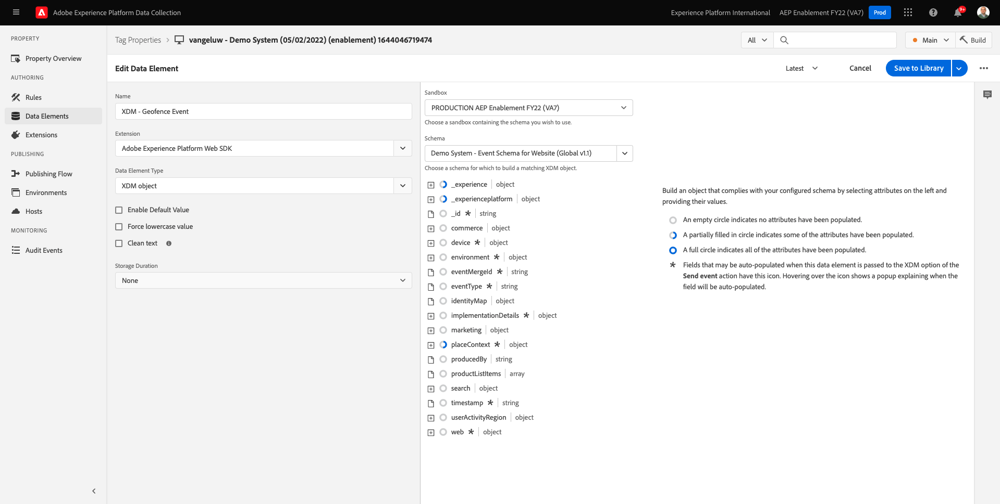
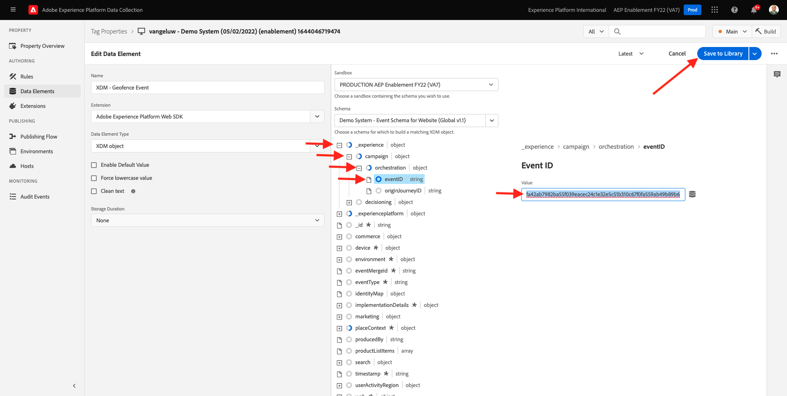
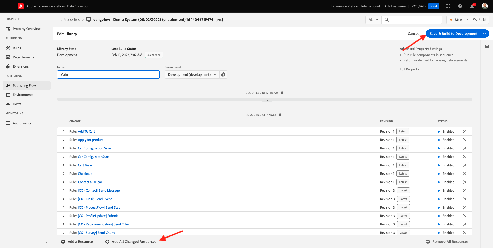

# 8.5 Déclenchement de votre parcours

Dans cet exercice, vous allez tester et déclencher le parcours que vous avez configuré dans ce module.

## 8.5.1 Mise à jour de la configuration des événements de géo-barrière

Accédez à [Collecte de données Adobe Experience Platform](https://experience.adobe.com/launch/) et sélectionnez **Balises**.

Il s’agit de la page Propriétés de la collecte de données Adobe Experience Platform que vous avez déjà vue.

Dans le module 0, Demo System a créé deux propriétés clientes pour vous : un pour le site web et un pour l’application mobile. Recherchez-les en recherchant `--demoProfileLdap--` dans le **[!UICONTROL Rechercher]** de la boîte. Cliquez pour ouvrir la **Web** .

Vous verrez alors ceci.

Dans le menu de gauche, accédez à **Règles** et recherchez la règle. **Événement de géo**. Clic sur la règle **Événement de géo** pour l’ouvrir.

Vous verrez alors les détails de cette règle. Cliquez pour ouvrir l’action. **Envoi de &quot;l’événement geofence&quot; à AEP - déclencheur JO**.

Vous verrez ensuite que lorsque cette action est déclenchée, un élément de données spécifique est utilisé pour définir la structure de données XDM. Vous devez mettre à jour cet élément de données et définir la variable **Identifiant d’événement** de l’événement que vous avez configuré dans [Exercice 8.1](./ex1.md).

Vous devez maintenant mettre à jour l’élément de données **XDM - Événement Geofence**. Pour ce faire, accédez à **Éléments de données**. Rechercher **XDM - Événement Geofence** et cliquez pour ouvrir cet élément de données.

Vous verrez alors :

Accédez au champ `_experience.campaign.orchestration.eventID`. Supprimez la valeur actuelle et collez-y votre eventID.

Pour rappel, l’ID d’événement se trouve dans Adobe Journey Optimizer sous **Configurations > Événements** et vous trouverez l’identifiant d’événement dans l’exemple de payload de votre événement, qui ressemble à ceci : `"eventID": "fa42ab7982ba55f039eacec24c1e32e5c51b310c67f0fa559ab49b89b63f4934"`.

Vous devez ensuite définir votre ville dans cet élément de données. Accédez à **placeContext > geo > city** et entrer dans une ville de choix. Cliquez ensuite sur **Enregistrer** ou **Enregistrer dans la bibliothèque**.

Enfin, vous devez publier vos modifications. Accédez à **Flux de publication** dans le menu de gauche.

Cliquez sur **Ajouter toutes les ressources modifiées** puis cliquez sur **Enregistrement et création pour le développement**.

## 8.5.2 Déclenchement de votre parcours

Accédez à [https://builder.adobedemo.com/projects](https://builder.adobedemo.com/projects). Une fois connecté avec votre Adobe ID, vous verrez ceci. Cliquez sur le projet de votre site web pour l’ouvrir.

Sur le **Screens** page, cliquez sur **Exécuter**.

Vous verrez alors votre site web de démonstration ouvert. Sélectionnez l’URL et copiez-la dans le presse-papiers.

Ouvrez une nouvelle fenêtre de navigateur incognito.

Collez l’URL de votre site web de démonstration, que vous avez copiée à l’étape précédente. Vous serez alors invité à vous connecter à l’aide de votre Adobe ID.

Sélectionnez le type de compte et procédez à la connexion.

Votre site web est alors chargé dans une fenêtre de navigateur incognito. Pour chaque démonstration, vous devez utiliser une fenêtre de navigateur incognito actualisée pour charger l’URL de votre site web de démonstration.

Cliquez sur l’icône représentant un logo d’Adobe dans le coin supérieur gauche de votre écran pour ouvrir la visionneuse de profils.

Consultez le panneau Visionneuse de profils et le profil client en temps réel avec le **ID Experience Cloud** comme identifiant Principal de ce client actuellement inconnu.

Accédez à la page Enregistrer/Connexion . Cliquez sur **CRÉATION D’UN COMPTE**.

Renseignez vos détails et cliquez sur **Enregistrer** après quoi vous serez redirigé vers la page précédente.

Ouvrez le panneau Visionneuse de profils et accédez à Real-time Customer Profile. Dans le panneau Visionneuse de profils, toutes vos données personnelles doivent s’afficher, comme les identifiants de téléphone et d’adresse électronique que vous venez d’ajouter.

Dans le panneau Visionneuse de profils, cliquez sur **UTILITAIRES**. Entrée `geofenceevent` et cliquez sur **Envoyer**.

Quelques secondes plus tard, vous recevrez un SMS de Adobe Journey Optimizer.

Étape suivante : [Résumé et avantages](./summary.md)

[Revenir au module 8](journey-orchestration-external-weather-api-sms.md)

[Revenir à tous les modules](../../overview.md)
