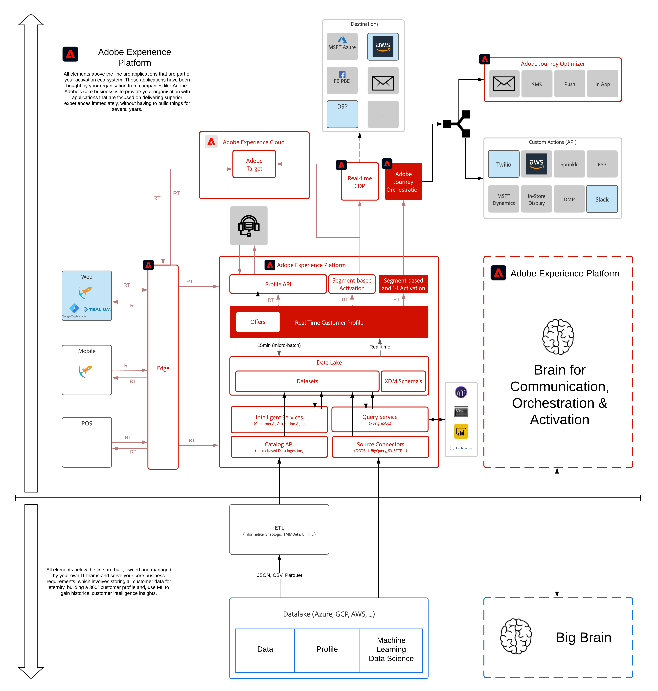

# 8. Adobe Journey Optimizer : Sources de données externes et actions personnalisées

**Auteur : [Wouter Van Geluwe](https://www.linkedin.com/in/woutervangeluwe/)**

Dans ce module, vous utiliserez Adobe Journey Optimizer pour écouter le comportement des clients, en ligne et hors ligne, et y répondre de manière intelligente, contextuelle et en temps réel. Vous avez déjà eu une expérience pratique initiale avec Adobe Journey Optimizer dans le module 6. Dans cet exercice, vous allez approfondir et explorer un cas d’utilisation plus avancé où des sources de données externes sont utilisées dans le cadre d’un parcours.

## Objectifs d’apprentissage

- Découvrez comment créer des événements, des sources de données externes et des parcours dans Adobe Journey Optimizer
- Découvrez comment utiliser les informations météorologiques de l’API Open Weather
- Découvrez comment utiliser des destinations d’action personnalisée telles que Twilio et Slack à partir de Adobe Journey Optimizer

## Conditions préalables

- Accès à Adobe Experience Platform : [https://experience.adobe.com/platform](https://experience.adobe.com/platform)
- Accès à Adobe Journey Optimizer
- Accès à l’API Open Weather

>[!IMPORTANT]
>
>Ce tutoriel a été créé pour faciliter un format d’atelier particulier. Il utilise des systèmes et des comptes spécifiques auxquels vous n’avez peut-être pas accès. Même sans accès, nous pensons que vous pouvez encore apprendre beaucoup en lisant à travers ce contenu très détaillé. Si vous participez à l’un des ateliers et que vous avez besoin de vos informations d’identification d’accès, veuillez contacter votre représentant d’Adobe qui vous fournira les informations requises.

## Aperçu de l’architecture

Regardez l’architecture ci-dessous, qui met en évidence les composants qui seront discutés et utilisés dans ce module.

## Contexte commercial

En tant que marque, vous avez beaucoup investi dans la personnalisation d’expériences en ligne. Maintenant, vous souhaitez être aussi contextuel et pertinent pour les expériences hors ligne.
Dans ce module, vous utiliserez la présence d’un client dans un magasin hors ligne pour diffuser ensuite une expérience personnalisée dans le magasin en présentant du contenu pertinent à ce client sur nos écrans en magasin. Dans le même temps, nous souhaitons diffuser un message push ou SMS personnalisé à ce même client, le tout en temps réel.
En tant que marque, vous comprenez également que le contexte a un impact important sur l’intérêt d’un client. Vous souhaitez donc importer les informations météorologiques actuelles sur l’emplacement de ce client, afin de décider quel contenu ou promotion afficher.

## Environnement de test à utiliser

Pour ce module, utilisez cet environnement de test : `--aepSandboxId--`.

>[!NOTE]
>
>N’oubliez pas d’installer, de configurer et d’utiliser l’extension Chrome comme référencé dans [0.1 - Installation de l’extension Chrome pour la documentation Experience League](../module0/ex1.md)

## Exercices

[8.1 Définition d’un événement](./ex1.md)

Découvrez comment définir un événement personnalisé à l’aide de Adobe Journey Optimizer.

[8.2 Définition d’une source de données externe](./ex2.md)

Découvrez comment configurer une source de données externe à l’aide de Adobe Journey Optimizer.

[8.3 Définition d’une action personnalisée](./ex3.md)

Découvrez comment définir une action externe à l’aide de Adobe Journey Optimizer.

[8.4 Création de votre parcours et de vos messages](./ex4.md)

Combinez des événements, des sources de données et des actions dans un parcours intelligent et contextuel.

[8.5 Déclenchement de votre parcours](./ex5.md)

Déclenchez votre parcours spécifique.

[Résumé et avantages](./summary.md)

Résumé de ce module et aperçu des avantages.

>[!NOTE]
>
>Merci d&#39;investir votre temps dans l&#39;apprentissage de Adobe Experience Platform. Si vous avez des questions, souhaitez partager les commentaires généraux d&#39;avoir des suggestions sur le contenu futur, contactez directement Wouter Van Geluwe en envoyant un email à **vangeluw@adobe.com**.

[Revenir à tous les modules](../../overview.md)
