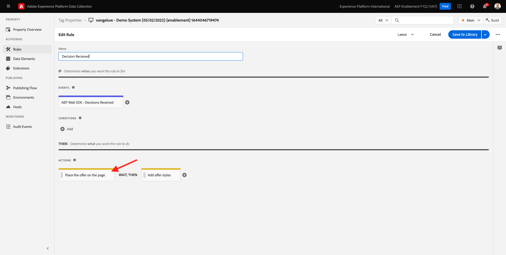
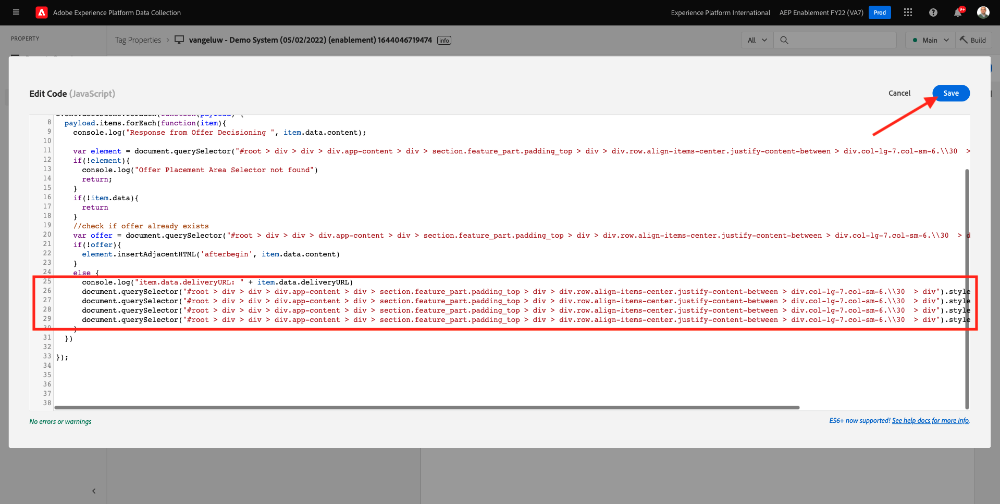

# 9.3 Préparation de la configuration de la propriété du client de collecte de données Adobe Experience Platform et du SDK Web pour Offer Decisioning

>[!NOTE]
>
>L’utilisation d’Offer Decisioning dans le SDK web d’Adobe Experience Platform est actuellement possible en accès anticipé pour certains utilisateurs. Cette fonctionnalité n’est pas disponible pour toutes les organisations IMS.

## 9.3.1 Mise à jour de la matrice de données

Dans [Exercice 0.2](./../../modules/module0/ex2.md), vous avez créé votre propre **[!UICONTROL Datastream]**. Vous avez ensuite utilisé le nom `--demoProfileLdap-- - Demo System Datastream`.

Dans cet exercice, vous devez configurer **[!UICONTROL Datastream]** pour utiliser **[!DNL Offer Decisioning]**.

Pour ce faire, accédez à [https://experience.adobe.com/#/data-collection/](https://experience.adobe.com/#/data-collection/). Vous verrez alors ceci. Cliquez sur **[!UICONTROL Datastreams]** ou **[!UICONTROL Flux de données (bêta)]**.

Dans le coin supérieur droit de votre écran, sélectionnez le nom de votre environnement de test, qui doit être `--aepSandboxId--`.


Recherchez votre **[!UICONTROL Datastream]**, qui est nommé `--demoProfileLdap-- - Demo System Datastream`. Cliquez sur **[!UICONTROL Datastream]** pour l’ouvrir.


Vous verrez alors ceci. Cliquez sur **...** en regard de **Adobe Experience Platform** puis cliquez sur **Modifier**.


Pour activer **[!DNL Offer Decisioning]**, cochez la case correspondant à **[!DNL Offer Decisioning]**. Cliquez sur **Enregistrer**.


Votre **[!UICONTROL Datastream]** est maintenant prêt à travailler avec **[!DNL Offer Decisioning]**.


## 9.3.2 Configuration de la propriété du client de collecte de données Adobe Experience Platform pour demander des offres personnalisées

Accédez à [https://experience.adobe.com/#/data-collection/](https://experience.adobe.com/#/data-collection/), à **[!UICONTROL Client]**. Recherchez vos propriétés de collecte de données, qui sont nommées `--demoProfileLdap-- - Demo System (DD/MM/YYYY)`. Ouvrez la propriété du client de collecte de données pour le Web.


Dans la propriété , accédez à **[!UICONTROL Règles]** et ouvrez la règle. **[!UICONTROL Page vue]**.


Cliquez pour ouvrir la [!UICONTROL Action] **[!UICONTROL SDK Web AEP - Envoyer l’événement]**.


Vous verrez alors ceci. L’option de menu pour **[!UICONTROL Portées de décision]**.


Pour chaque requête envoyée à la périphérie et à Adobe Experience Platform, il est possible de fournir une ou plusieurs **[!UICONTROL Portées de décision]**. A **[!UICONTROL Portée de décision]** est une combinaison de deux éléments :

- [!UICONTROL ID de décision]
- [!UICONTROL Identifiant d’emplacement]

Regardons d&#39;abord où vous pouvez trouver ces deux éléments.

### 9.3.2.1 Récupérez votre [!UICONTROL Identifiant de référencement]

Le [!UICONTROL Identifiant de référencement] identifie l’emplacement et le type de ressource requis. Par exemple, l’image principale de la page d’accueil du site web Luma correspond à la variable [!UICONTROL Identifiant de référencement] pour [!UICONTROL Web - Image].

>[!NOTE]
>
>Dans le cadre du module 6, vous avez déjà configuré une activité de ciblage d’expérience Adobe Target qui modifiera l’image de l’emplacement du héros sur la page d’accueil, comme vous pouvez le voir dans la capture d’écran. Pour le plaisir de l’exercice, vous allez maintenant faire apparaître vos offres sur l’image sous l’image principale, comme indiqué dans la capture d’écran.


Pour rechercher la variable [!UICONTROL Identifiant de référencement] pour [!UICONTROL Web - Image] Accédez à Adobe Journey Optimizer en accédant à [Adobe Experience Cloud](https://experience.adobe.com). Cliquez sur **Journey Optimizer**.


Vous serez redirigé vers le **Accueil**  dans Journey Optimizer. Tout d’abord, assurez-vous d’utiliser l’environnement de test approprié. L’environnement de test à utiliser est appelé `--aepSandboxId--`. Pour passer d’un environnement de test à un autre, cliquez sur **Production (VA7)** et sélectionnez l’environnement de test dans la liste. Dans cet exemple, l’environnement de test est nommé **Activation AEP FY22**. Vous serez alors dans le **Accueil** affichage de votre environnement de test `--aepSandboxId--`.


Ensuite, accédez à [!UICONTROL Composants] puis à [!UICONTROL Emplacements]. Cliquez sur le bouton [!UICONTROL Web - Image] placement pour afficher ses détails.


Comme vous pouvez le voir dans l’image ci-dessus, dans cet exemple, la variable [!UICONTROL Identifiant de référencement] is `xcore:offer-placement:14bf09dc4190ebba`. Notez les [!UICONTROL Identifiant de référencement] pour votre emplacement [!UICONTROL Web - Image] comme vous en aurez besoin lors du prochain exercice.

### 9.3.2.2 Récupérez votre [!UICONTROL ID de décision]

Le [!UICONTROL ID de décision] identifie la combinaison d’offres personnalisées et d’offres de secours que vous souhaitez utiliser. Dans l’exercice précédent, vous avez créé le vôtre. [!UICONTROL Décision] et son nom `--demoProfileLdap-- - Luma Decision`.

Pour rechercher la variable [!UICONTROL ID de décision] pour votre `--demoProfileLdap-- - Luma Decision`, accédez à [https://platform.adobe.com](https://platform.adobe.com).

Ensuite, accédez à [!UICONTROL Offres] puis accédez à [!UICONTROL Décisions]. Cliquez pour sélectionner votre [!UICONTROL Décision], qui est nommé `--demoProfileLdap-- - Luma Decision`.


Comme vous pouvez le voir dans l’image ci-dessus, dans cet exemple, la variable [!UICONTROL ID de décision] is `xcore:offer-activity:14c052382e1b6505`. Notez les [!UICONTROL ID de décision] pour votre décision `--demoProfileLdap-- - Luma Decision` comme vous en aurez besoin lors du prochain exercice.

Maintenant que vous avez récupéré les deux éléments dont vous avez besoin pour créer une **[!UICONTROL Portées de décision]**, vous pouvez passer à l’étape suivante, qui implique de coder la portée de la décision.

### 9.3.2.3 Codage BASE64

Le **[!UICONTROL Portée de décision]** vous devez entrer une chaîne codée en BASE64. Cette chaîne codée en BASE64 est une combinaison de la chaîne [!UICONTROL Identifiant de référencement] et le [!UICONTROL ID de décision], comme vous pouvez le voir ci-dessous.

```json
{
  "activityId":"xcore:offer-activity:14c052382e1b6505",
  "placementId":"xcore:offer-placement:14bf09dc4190ebba"
}
```

Le **[!UICONTROL Portée de décision]** peut être généré de deux façons :

- Utilisez un service public comme [https://www.base64encode.org/](https://www.base64encode.org/). Saisissez le code JSON comme mentionné ci-dessus, puis cliquez sur **[!UICONTROL Encode]** et vous obtiendrez la chaîne codée BASE64 ci-dessous.

   

- Récupérez la chaîne codée BASE64 à partir de Adobe Experience Platform. Accédez à [!UICONTROL Décisions] et cliquez sur pour ouvrir le [!UICONTROL Décision], qui est nommé `--demoProfileLdap-- - Luma Decision`.

   

   Après ouverture `--demoProfileLdap-- - Luma Decision`, vous verrez ceci. Localisation de l’emplacement [!UICONTROL Web - Image] et cliquez sur le bouton **[!UICONTROL Copier]** bouton . Cliquez ensuite sur **[!UICONTROL Étendue de décision codée]**. Le **[!UICONTROL Portée de décision]** est désormais copié dans le presse-papiers.

   

Ensuite, revenez à Launch, à votre action. **[!UICONTROL SDK Web AEP - Envoyer l’événement]**.


Collez la portée de décision codée dans le champ de saisie.


Enregistrer vos modifications dans l’action **[!UICONTROL SDK Web AEP - Envoyer l’événement]** en cliquant **[!UICONTROL Conserver les modifications]**.


Cliquez ensuite sur **[!UICONTROL Enregistrer]** ou **[!UICONTROL Enregistrer dans la bibliothèque]**


Dans la collecte de données Adobe Experience Platform, accédez à **[!UICONTROL Flux de publication]** et ouvrez votre **[!UICONTROL Bibliothèque de développement]** qui est nommé **[!UICONTROL Principal]**. Cliquez sur **[!UICONTROL + Ajouter toutes les ressources modifiées]** puis cliquez sur **[!UICONTROL Enregistrement et création pour le développement]**. Vos modifications seront désormais publiées sur votre site web de démonstration.


Chaque fois que vous chargez une **Page générale** maintenant, comme par exemple la page d’accueil du site web de démonstration, Offer Decisioning évalue l’offre applicable et renvoie une réponse au site web avec les détails de l’offre à afficher. L’affichage de l’offre sur le site web nécessite une configuration supplémentaire, ce que vous allez faire à l’étape suivante.

## 9.3.3 Configuration de la propriété cliente de collecte de données Adobe Experience Platform pour recevoir et appliquer des offres personnalisées

Accédez à [https://experience.adobe.com/#/data-collection/](https://experience.adobe.com/#/data-collection/), à **[!UICONTROL Propriétés]**. Recherchez vos propriétés de collecte de données, qui sont nommées `--demoProfileLdap-- - Demo System (DD/MM/YYYY)`. Ouvrez la propriété Collecte de données pour le Web.


Dans la propriété , accédez à **[!UICONTROL Règles]**.


Rechercher et ouvrir la règle **Décision reçue**.


Vous verrez alors ceci. Ouvrir l’action **Placez l’offre sur la page**.



Cliquez sur **[!UICONTROL Ouvrir l’éditeur]**.


Remplacez le code en collant le code ci-dessous dans l’éditeur.

```javascript
if(!Array.isArray(event.decisions)) {
  console.log('No decisions returned')
  return;
}
console.log("decision",event.decisions)

event.decisions.forEach(function(payload) {
  payload.items.forEach(function(item){
    console.log("Response from Offer Decisioning ", item.data.content);
   
    var element = document.querySelector("#root > div > div > div.app-content > div > section.feature_part.padding_top > div > div.row.align-items-center.justify-content-between > div.col-lg-7.col-sm-6.\\30  > div");
    if(!element){
      console.log("Offer Placement Area Selector not found")
      return;
    }
    if(!item.data){
      return
    }
    //check if offer already exists
    var offer = document.querySelector("#root > div > div > div.app-content > div > section.feature_part.padding_top > div > div.row.align-items-center.justify-content-between > div.col-lg-7.col-sm-6.\\30  > div");
    if(!offer){ 
      element.insertAdjacentHTML('afterbegin', item.data.content) 
    }
    else { 
      console.log("item.data.deliveryURL: " + item.data.deliveryURL)
      document.querySelector("#root > div > div > div.app-content > div > section.feature_part.padding_top > div > div.row.align-items-center.justify-content-between > div.col-lg-7.col-sm-6.\\30  > div").style.background="url('"+item.data.deliveryURL+"')";
      document.querySelector("#root > div > div > div.app-content > div > section.feature_part.padding_top > div > div.row.align-items-center.justify-content-between > div.col-lg-7.col-sm-6.\\30  > div").style.backgroundRepeat="no-repeat";
      document.querySelector("#root > div > div > div.app-content > div > section.feature_part.padding_top > div > div.row.align-items-center.justify-content-between > div.col-lg-7.col-sm-6.\\30  > div").style.backgroundPosition="center center";
      document.querySelector("#root > div > div > div.app-content > div > section.feature_part.padding_top > div > div.row.align-items-center.justify-content-between > div.col-lg-7.col-sm-6.\\30  > div").style.backgroundSize = "contain";
    }  
  })
});
```

Les lignes 26-27-28-29 appliqueront l&#39;image qui est renvoyée par Offer decisioning au site web. Cliquez sur **[!UICONTROL Enregistrer]**.



Cliquez sur **[!UICONTROL Conserver les modifications]**.


Cliquez ensuite sur **[!UICONTROL Enregistrer]** ou **[!UICONTROL Enregistrer dans la bibliothèque]**


Dans la collecte de données Adobe Experience Platform, accédez à **[!UICONTROL Flux de publication]** et ouvrez votre **[!UICONTROL Bibliothèque de développement]** qui est nommé **[!UICONTROL Principal]**. Cliquez sur **[!UICONTROL + Ajouter toutes les ressources modifiées]** puis cliquez sur **[!UICONTROL Enregistrement et création pour le développement]**. Vos modifications seront désormais publiées sur votre site web de démonstration.


Avec cette modification, cette règle dans la collecte de données Adobe Experience Platform écoute désormais la réponse de l’Offer decisioning qui fait partie de la réponse du SDK Web. Lorsque la réponse est reçue, l’image de l’offre s’affiche sur la page d’accueil.

En regardant le site web de démonstration, vous verrez que cette image sera remplacée maintenant :

>[!NOTE]
>
>Dans le cadre du module 6, vous avez déjà configuré une activité de ciblage d’expérience Adobe Target qui modifiera l’image de l’emplacement du héros sur la page d’accueil, comme vous pouvez le voir dans la capture d’écran. Pour le plaisir de l’exercice, vous allez maintenant faire apparaître vos offres sur l’image sous l’image principale, comme indiqué dans la capture d’écran.


Et au lieu des images par défaut du site web Luma, vous verrez désormais une offre comme celle-ci. Dans ce cas, l’offre de secours s’affiche.


Vous avez maintenant configuré 2 types de personnalisation :

- 1 activité de ciblage d’expérience à l’aide d’Adobe Target dans le module 6
- Mise en oeuvre d’un Offer decisioning à l’aide de votre propriété de collecte de données

Au cours de l’exercice suivant, vous verrez comment combiner vos offres et décisions créées dans Adobe Journey Optimizer avec une activité de ciblage d’expérience Adobe Target.

Étape suivante : [9.4 Combinaison d’Adobe Target et d’Offer Decisioning](./ex4.md)

[Revenir au module 9](./offer-decisioning.md)

[Revenir à tous les modules](./../../overview.md)
