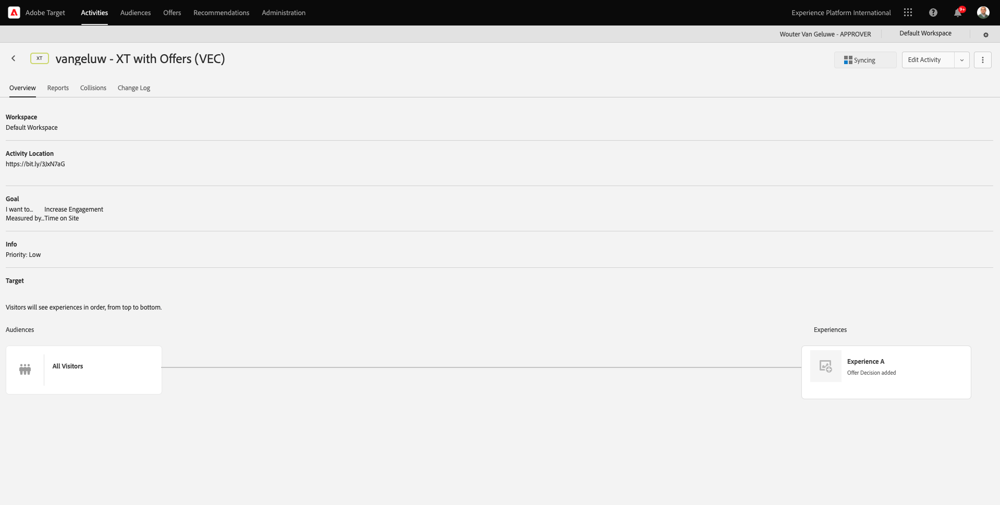

# 9.4 Combinaison d’Adobe Target et d’Offer Decisioning

## 9.4.1 Collecte du lien partageable de votre projet de démonstration

Pour charger le projet de site web de démonstration dans Adobe Target, vous devez d’abord collecter un lien spécial qui permettra à Adobe Target de charger votre projet de site web de démonstration.

Pour ce faire, accédez à [https://builder.adobedemo.com/projects](https://builder.adobedemo.com/projects). Une fois connecté avec votre Adobe ID, vous verrez ceci. Cliquez sur le projet de votre site web pour l’ouvrir.

Vous allez maintenant voir ceci. Cliquez sur **Partager**.

Cliquez sur **Générer un lien** puis copiez le lien dans le presse-papiers.

Accédez à [https://bitly.com](https://bitly.com), collez le lien que vous avez copié et cliquez sur **Raccourcir**. Vous obtenez maintenant un lien raccourci, qui ressemble à ceci : `https://bit.ly/3JxN7aG`. Vous aurez besoin de ce lien dans le prochain exercice.

## 9.4.2 Collecte

Accédez maintenant à la page d’accueil de Adobe Experience Cloud en accédant à [https://experiencecloud.adobe.com/](https://experiencecloud.adobe.com/). Cliquez sur **Cible**.

Sur le **Adobe Target** Page d’accueil, vous verrez toutes les activités existantes.

Cliquez sur **+ Créer une activité** pour créer une activité.

Sélectionner **Ciblage d’expérience**.

Maintenant, sélectionnez **Visuel** et collez le lien raccourci dans le champ **Entrée dans l’URL d’activité**. Cliquez sur **Suivant**.

Votre projet de site web de démonstration sera alors chargé dans le compositeur d’expérience visuelle.

Accédez à **Parcourir** mode pour cliquer **Autoriser tout** dans la fenêtre contextuelle de consentement du cookie.

Cliquez sur la zone contenant le texte. **Catégories proposées**. Cliquez sur **Insérer avant** puis sélectionnez **Offer Decision**.

Vous verrez alors cette fenêtre contextuelle. Sélectionner votre environnement de test `--aepSandboxId--` puis sélectionnez l’emplacement. **Web - Image**.

Ensuite, sélectionnez votre décision. `--demoProfileLdap-- - Luma Decision`. Cliquez sur **Enregistrer**.

Vous verrez alors ceci. Veillez à ajouter une règle de modèle supplémentaire. **URL** **contains** **your-project-name**. Clics **Enregistrer**.

Vous verrez alors ceci. Cliquez sur **Suivant**.

Saisissez le nom de votre offre. Utilisez ce nom : `--demoProfileLdap-- - XT with Offers (VEC)`. Cliquez sur **Suivant**.

Vous verrez alors ceci. Définissez vos **Mesure de l’objectif** comme indiqué. Cliquez sur **Enregistrer et fermer**.

Votre offre est maintenant créée et en cours de publication.

Une fois votre offre publiée, vous pouvez l’activer.

Étape suivante : [9.5 Utiliser votre décision dans un email et un SMS](./ex5.md)

[Revenir au module 9](./offer-decisioning.md)

[Revenir à tous les modules](./../../overview.md)
