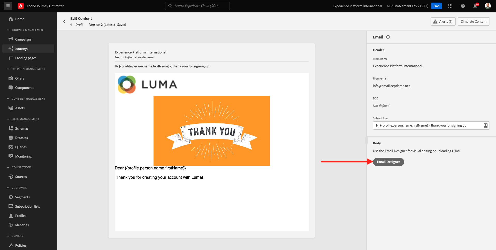

# 9.5 Utiliser votre décision dans un email

Dans cet exercice, vous utiliserez votre décision pour personnaliser la diffusion d’un email et d’un SMS.

Accédez à **Parcours**. Recherchez le parcours que vous avez créé dans l’exercice 7.2, qui est nommé `--demoProfileLdap-- - Account Creation Journey`. Cliquez sur votre parcours pour l’ouvrir.

Vous verrez alors ceci. Cliquez sur **Création d’une version**.

Cliquez sur **Création d’une version**.

Cliquez sur le bouton **Email** puis cliquez sur **Modifier le contenu**.

Le tableau de bord du message s’affiche alors. Cliquez sur **Concepteur d&#39;email**.

Vous verrez alors ceci.

Vous verrez alors ceci. Faites glisser un nouveau **Colonne 1:1** composant de structure sur la zone de travail.

Dans le menu, accédez à **Composants de contenu**. Sélectionnez la **Décision sur l’offre** et faites glisser et déposez ce composant dans l’espace réservé de l’offre de contenu de l’email comme indiqué. Cliquez ensuite sur **Ajouter**.

Sélectionnez le type d’emplacement que vous souhaitez inclure dans le courrier électronique. Dans le **Emplacements** menu déroulant, sélectionnez **Email - Image**, puis sélectionnez votre décision `--demoProfileLdap-- - Luma Decision`. Cliquez sur **Ajouter**.

Toutes les offres personnalisées et l’offre de secours sont désormais visibles dans le concepteur d’email. Cliquez sur  **Simulation du contenu** pour prévisualiser le message électronique avec un profil client réel.

Commencez par identifier le profil que vous souhaitez utiliser pour la prévisualisation. Sélectionnez la **email** et saisissez l’adresse électronique d’un profil client que vous avez créé sur le site web de démonstration. Cliquez ensuite sur **Aperçu**.

Une fois l&#39;email affiché et l&#39;offre correctement affichée, cliquez sur la **Fermer** bouton .

Enfin, cliquez sur **Enregistrer**.

Cliquez maintenant sur la flèche pour revenir à l’écran précédent.

Vous verrez alors ceci. Cliquez sur la flèche dans le coin supérieur gauche pour revenir à votre parcours.

Cliquez sur **Ok** pour fermer votre **Email** action.

Cliquez sur **Publier** pour publier votre parcours mis à jour.

Confirmer en cliquant sur **Publier** encore une fois.

Votre message est maintenant publié.

Lorsque vous créez un compte sur le site web de démonstration, vous obtenez maintenant cet e-mail :

Vous avez terminé cet exercice.

Étape suivante : [9.6 Test de votre décision à l’aide de l’API](./ex6.md)

[Revenir au module 9](./offer-decisioning.md)

[Revenir à tous les modules](./../../overview.md)
