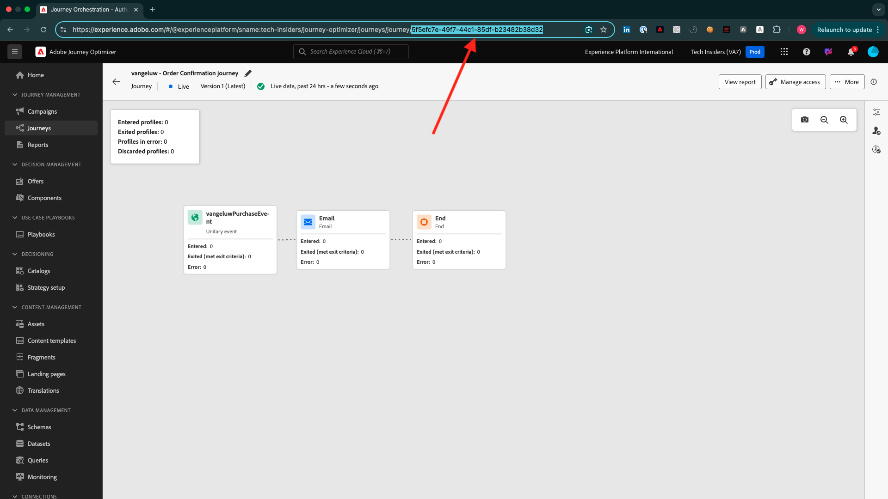

# Comment la fin est-elle mesurée ?

Accédez à [https://certification.adobe.com](https://certification.adobe.com) et accédez au cours **XXX**.

Pour terminer un module, vous devez fournir un bon à tirer.

Vous trouverez ci-dessous les bons à tirer de l’achèvement de chaque module.

## Prise en main

La preuve d’achèvement attendue pour le module **Prise en main** est l’identifiant du projet Demo System pour le web que vous avez créé.

L’identifiant du projet Demo System pour le format web ressemble à ceci : `--demoProfileLdap-- - OCUC`.

## 1.1 Collecte de données Adobe Experience Platform et extension du SDK Web

Le BAT attendu pour le module **Data Collection &amp; Web SDK** est le nom de la propriété Data Collection pour le web.

Le nom de la propriété Collecte de données pour le format web ressemble à ceci : `--demoProfileLdap-- - Demo System (05/02/2022) (enablement) 1644046719474`.

## 1.2 Ingestion des données

La preuve attendue de l’achèvement du module **Data Ingestion** est l’identifiant du jeu de données pour les 2 jeux de données que vous avez créés.

Le format de l’identifiant du jeu de données ressemble à ceci : **5f069724723ef41916a8b5d2**.

`--demoProfileLdap-- - Demo System - Event Dataset for Website`

`--demoProfileLdap-- - Demo System - Profile Dataset for Website`

## 1.3 Composition du public fédéré

La preuve d’achèvement attendue pour le module **Composition de l’audience fédérée** est...

## 2.1 Real-time Customer Profile

Le **identifiant de segment** du segment que vous avez créé via l’interface utilisateur `--demoProfileLdap-- - Male customers with interest in Montana Wind Jacket` constitue la preuve attendue de l’achèvement du module **Real-Time Customer Profile**.

Le format de l’identifiant de segment ressemble à ceci : **8cb7034d-d4ae-4d26-a61f-a76559c12457**.

## 2.2 Intelligent Services

La preuve d’achèvement attendue pour le module **Intelligent Services** est l’identifiant de votre **service Customer AI de propension aux achats de produits**.

Le format ressemble à ceci : **12729** et vous pouvez le récupérer à partir de l’URL lorsque vous avez ouvert votre service.

## 2.3 Real-Time CDP : créez une audience et prenez des mesures !

La preuve d’achèvement attendue pour le module **Real-Time CDP** est l’identifiant de votre **activité Adobe Target**.

Le format ressemble à ceci : **111804**.

## 2.4 Real-Time CDP : Audience Activation à Microsoft Azure Event Hub

Le BAT attendu pour le module **RTCDP : EventHub** est l’identifiant de votre destination **Microsoft Azure Event Hub** dans Adobe Experience Platform.

Vous pouvez trouver le **Microsoft Azure Event Hub Destination ID**, qui ressemble à ce **fa3f7ce5-86fd-4096-bf7c-e586fdc096ba**, ici :

## 2.5 Connexions Real-Time CDP : Transfert d’événement

La preuve attendue d’achèvement pour le module **Connexions RTCDP** est votre **ID de propriété de transfert d’événement**.

Vous pouvez trouver l’ **ID de propriété de transfert d’événement**, qui ressemble à ce **PR40f44184c888472e9c19d8d602aab0de**, ici :

## 2.6 Diffusion de données en continu d’Apache Kafka vers Real-Time CDP

La preuve d’achèvement attendue pour le module **Apache Kafka** est l’identifiant de votre connecteur source `--demoProfileLdap-- - Kafka`.

L’ID ressemble à ceci : **f843d50a-ee30-4ca8-a766-0e4f3d29a2f7**. Vous pouvez le trouver ici :

## Adobe Journey Optimizer 3.1 : Orchestration

Le preuve d’achèvement attendu pour le module **AJO: Orchestration** est l’eventID de votre `--demoProfileLdap--AccountCreationEvent`.

Le format ressemble à ceci : **227402c540eb8f8855c6b2333adf6d54d7153d9d7d56fa475a6866081c574736**.

## 3.2 Adobe Journey Optimizer : sources de données externes et actions personnalisées

Le preuve d’achèvement attendu pour le module **AJO : actions personnalisées** est l’eventID de votre événement `--demoProfileLdap--GeofenceEntry`.

Le format ressemble à ceci : **fa42ab7982ba55f039eacec24c1e32e5c51b310c67f0fa559ab49b89b63f493 4**.

## 3.3 Adobe Journey Optimizer : Offer decisioning

La preuve d’achèvement attendue pour le module **AJO : Offres** est l’identifiant de la **décision d’offre** que vous avez créée.

Vous pouvez trouver l’ **ID de décision de l’offre**, qui ressemble à ce **xcore:offer-activity:1122fcc4603ea499**, ici :

## 3.4 Adobe Journey Optimizer : Parcours basés sur un événement

Le preuve d’achèvement attendu pour le module **AJO: Events** est l’eventID de votre `--demoProfileLdap--StoreEntryEvent`.

Le format ressemble à ceci : **e3a8f0bdc0b609667cd96a72a6b1e5aafa0ddaf6ccf121c574e6a2030860a633**.

## 4.1 Customer Journey Analytics : création d’un tableau de bord à l’aide d’Analysis Workspace

La preuve d’achèvement attendue pour le module **CJA** est l’identifiant de votre projet `--demoProfileLdap-- - Omnichannel Analysis`.

Le format ressemble à ceci : **6217344f6249ac70c726db60**, vous pouvez le trouver dans l’URL lorsque vous avez ouvert votre projet.

## 4.2 Customer Journey Analytics : ingestion et analyse de données de Google Analytics dans Adobe Experience Platform avec le connecteur Source BigQuery

La preuve d’achèvement attendue pour le module **CJA : BigQuery** est l’identifiant de votre connexion **BigQuery**.

Vous pouvez trouver l’ **identifiant de connexion BigQuery**, qui ressemble à ce **85a2394d-8b94-410c-a239-4d8b94b10c38**, ici :

## 5.1 Query Service

La preuve attendue d’achèvement pour le module **Query Service** est l’identifiant du jeu de données pour votre `--demoProfileLdap--_callcenter_interaction_analysis` - jeu de données que vous obtenez après avoir terminé le module.

Le format ressemble à ceci : **62076f68f14a9d194995d4e2**.

[Revenir à tous les modules](./overview.md)
