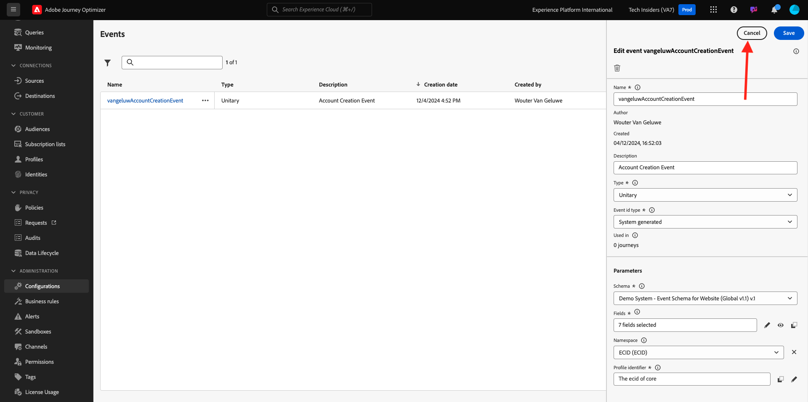

# 3.1.1 Créer votre événement

Connectez-vous à Adobe Journey Optimizer en allant sur [Adobe Experience Cloud](https://experience.adobe.com?lang=fr). Cliquez sur **Journey Optimizer**.

Vous serez redirigé vers la vue **Accueil** dans Journey Optimizer. Tout d’abord, assurez-vous d’utiliser le bon sandbox. Le sandbox à utiliser est appelé `--aepSandboxName--`.

Dans le menu de gauche, faites défiler l’écran vers le bas et cliquez sur **Configurations**. Cliquez ensuite sur le bouton **Gérer** sous **Événements**.

Vous verrez ensuite un aperçu de tous les événements disponibles. Cliquez sur **Créer un événement** pour commencer à créer votre propre événement.

Une nouvelle fenêtre d’événement vide s’affiche alors.

Tout d&#39;abord, donnez à votre événement un nom comme celui-ci : `--aepUserLdap--AccountCreationEvent`.
Définissez la description sur `Account Creation Event`, assurez-vous que le **Type** est défini sur **Unitaire** et, pour la sélection **Type d’identifiant d’événement**, sélectionnez **Généré par le système**.

Vient ensuite la sélection du schéma . Veuillez utiliser le `Demo System - Event Schema for Website (Global v1.1) v.1` de schéma.

Après avoir sélectionné le schéma, vous verrez un certain nombre de champs sélectionnés dans la section **Payload**. Vous devriez maintenant pointer sur la section **Payload** et vous verrez 3 icônes s’afficher dans la fenêtre contextuelle. Cliquez sur l’icône **Modifier**.

Une fenêtre contextuelle **Champs** s’affiche, dans laquelle vous devez sélectionner certains des champs dont nous avons besoin pour personnaliser l’e-mail.  Nous choisirons d’autres attributs de profil ultérieurement à l’aide des données déjà présentes dans Adobe Experience Platform.

Dans le `--aepTenantId--.demoEnvironment` d’objet, veillez à sélectionner les champs **brandLogo** et **brandName**.

Dans la `--aepTenantId--.identification.core` de l’objet, veillez à sélectionner le champ **e-mail**. Cliquez sur **Ok** pour enregistrer vos modifications.

Vous devriez alors voir ceci. Définissez **Espace de noms** sur **ECID (ECID)**. Cliquez sur **Enregistrer**.

Votre événement est maintenant configuré et enregistré.

Cliquez à nouveau sur votre événement pour ouvrir à nouveau l’écran **Modifier l’événement**. Pointez à nouveau sur le champ **Payload** pour afficher à nouveau les 3 icônes. Cliquez sur l’icône **Afficher la payload**.

Un exemple de la payload attendue s’affiche maintenant.

Votre événement possède un eventID d’orchestration unique, que vous pouvez trouver en faisant défiler cette payload jusqu’à ce que vous voyiez `_experience.campaign.orchestration.eventID`.

L’identifiant d’événement est ce qui doit être envoyé à Adobe Experience Platform afin de déclencher le parcours que vous allez créer ensuite. Mémorisez cet eventID, car vous en aurez besoin dans l’un des exercices suivants.
`"eventID": "5ae9b8d3f68eb555502b0c07d03ef71780600c4bd0373a4065c692ae0bfbd34d"`

Cliquez sur **OK**.

Cliquez sur **Annuler**.

Vous avez maintenant terminé cet exercice.

Étape suivante : [3.1.2 Créer des fragments à utiliser dans votre message](./ex2.md)

[Retour au module 3.1](./journey-orchestration-create-account.md)

[Revenir à tous les modules](../../../overview.md)
