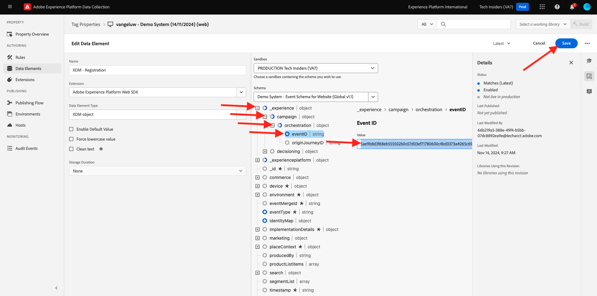

# 3.1.3 Mise à jour de la propriété Collecte de données et test de votre parcours

## 3.1.3.1 Mise à jour de la propriété Collecte de données

Accédez à [Adobe Experience Platform Data Collection](https://experience.adobe.com/launch/) et sélectionnez **Balises**.

Il s’agit de la page Propriétés de la collecte de données Adobe Experience Platform que vous avez déjà vue.

Dans le module 0, Demo System a créé deux propriétés Client pour vous : une pour le site web et une pour l’application mobile. Recherchez-les en recherchant `--demoProfileLdap--` dans la zone **[!UICONTROL Rechercher]**. Cliquez pour ouvrir la propriété **Web**.

Vous verrez alors ceci.

Dans le menu de gauche, accédez à **Règles** et recherchez la règle **Enregistrer le profil**. Cliquez sur la règle **Enregistrer le profil** pour l’ouvrir.

Vous verrez alors les détails de cette règle. Cliquez pour ouvrir l’action **Envoyer un événement d’enregistrement à AEP - déclencher JO**.

Vous verrez ensuite que lorsque cette action est déclenchée, un élément de données spécifique est utilisé pour définir la structure de données XDM. Vous devez mettre à jour cet élément de données et définir l’**ID d’événement** de l’événement que vous avez configuré dans l’ [exercice 7.1](./ex1.md).

Vous devez maintenant mettre à jour l’élément de données **XDM - Enregistrement de l’événement**. Pour ce faire, accédez à **Data Elements**. Recherchez **XDM - Registration Event** et cliquez pour ouvrir cet élément de données.

Vous verrez alors :

Accédez au champ `_experience.campaign.orchestration.eventID`. Supprimez la valeur actuelle et collez-y votre eventID.

Pour rappel, l’ID d’événement se trouve dans Adobe Journey Optimizer sous **Configurations > Événements** et vous trouverez l’ID d’événement dans l’exemple de charge utile de votre événement, qui ressemble à ceci : `"eventID": "227402c540eb8f8855c6b2333adf6d54d7153d9d7d56fa475a6866081c574736"`.

Après avoir collé votre eventID, votre écran doit ressembler à celui-ci. Cliquez ensuite sur **Enregistrer** ou **Enregistrer dans la bibliothèque**.

Enfin, vous devez publier vos modifications. Accédez à **Flux de publication** dans le menu de gauche.

Cliquez sur **Ajouter toutes les ressources modifiées**, puis sur **Enregistrer et créer dans le développement**.

Votre bibliothèque sera alors mise à jour. Au bout de 1 à 2 minutes, vous pourrez ensuite poursuivre et tester votre configuration.

## 3.1.3.2 Test de votre Parcours

Accédez à [https://builder.adobedemo.com/projects](https://builder.adobedemo.com/projects). Une fois connecté avec votre Adobe ID, vous verrez ceci. Cliquez sur le projet de votre site web pour l’ouvrir.

Sur la page **Screens**, cliquez sur **Exécuter**.

Vous verrez alors votre site web de démonstration ouvert. Sélectionnez l’URL et copiez-la dans le presse-papiers.

Ouvrez une nouvelle fenêtre de navigateur incognito.

Collez l’URL de votre site web de démonstration, que vous avez copiée à l’étape précédente. Vous serez alors invité à vous connecter à l’aide de votre Adobe ID.

Sélectionnez le type de compte et procédez à la connexion.

Votre site web est alors chargé dans une fenêtre de navigateur incognito. Pour chaque démonstration, vous devez utiliser une fenêtre de navigateur incognito actualisée pour charger l’URL de votre site web de démonstration.

Cliquez sur l’icône représentant un logo d’Adobe dans le coin supérieur gauche de votre écran pour ouvrir la visionneuse de profils.

Consultez le panneau Visionneuse de profils et Real-time Customer Profile avec l’**identifiant Experience Cloud** comme identifiant principal pour ce client actuellement inconnu.

Accédez à la page Enregistrer/Connexion . Cliquez sur **CRÉER UN COMPTE**.

Renseignez vos détails et cliquez sur **Enregistrer** après quoi vous serez redirigé vers la page précédente.

Ouvrez le panneau Visionneuse de profils et accédez à Real-time Customer Profile. Dans le panneau Visionneuse de profils, toutes vos données personnelles doivent s’afficher, comme les identifiants de téléphone et d’adresse électronique que vous venez d’ajouter.

1 minute après avoir créé votre compte, vous recevrez de Adobe Journey Optimizer l’e-mail de création de votre compte.

Étape suivante : [Résumé et avantages](./summary.md)

[Revenir au module 3.1](./journey-orchestration-create-account.md)

[Revenir à tous les modules](../../../overview.md)
