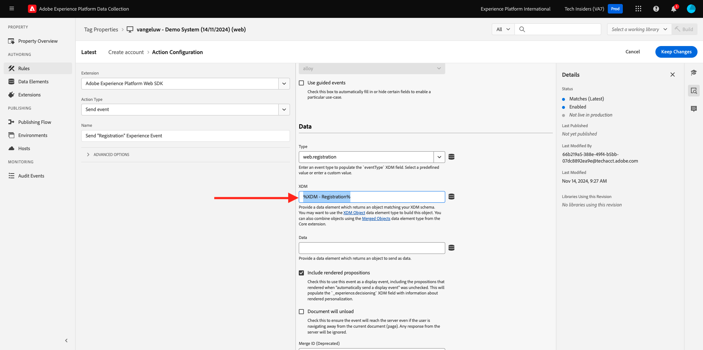

# 3.1.3 Mettre à jour la propriété de collecte de données et tester le parcours

## 3.1.3.1 Mettre à jour la propriété de la collecte de données

Accédez à [Collecte de données Adobe Experience Platform](https://experience.adobe.com/launch/) puis sélectionnez **Balises**.

Dans **Prise en main**, le système de démonstration a créé deux propriétés client pour vous : une pour le site web et une pour l’application mobile. Recherchez-les en `--aepUserLdap--` dans la zone **[!UICONTROL Rechercher]**. Cliquez pour ouvrir la propriété **Web**.

Tu verras ça.

Dans le menu de gauche, accédez à **Règles** et recherchez la règle **Créer un compte**. Cliquez sur la règle **Créer un compte** pour l’ouvrir.

Vous verrez alors les détails de cette règle. Cliquez pour ouvrir l’action **Envoyer l’événement d’expérience « Événement d’enregistrement »**.

Vous constaterez ensuite que lorsque cette action est déclenchée, un élément de données spécifique est utilisé pour définir la structure de données XDM. Vous devez mettre à jour cet élément de données et définir l’**identifiant d’événement** de l’événement que vous avez configuré dans [Exercice 3.1.1](./ex1.md).

Vous devez maintenant procéder à la mise à jour de l’élément de données **XDM - Événement d’enregistrement**. Pour ce faire, accédez à **Éléments de données**. Recherchez **XDM - Enregistrement** et cliquez pour ouvrir cet élément de données.

Vous verrez alors ceci :

Accédez au `_experience.campaign.orchestration.eventID` de champs . Supprimez la valeur actuelle et collez-y votre eventID.

Pour rappel, l’identifiant d’événement se trouve dans Adobe Journey Optimizer sous **Configurations > Événements** et vous trouverez l’identifiant d’événement dans l’exemple de payload de votre événement, qui se présente comme suit : `"eventID": "5ae9b8d3f68eb555502b0c07d03ef71780600c4bd0373a4065c692ae0bfbd34d"`.

Après avoir collé votre eventID, l’écran doit se présenter comme suit : Cliquez ensuite sur **Enregistrer** ou **Enregistrer dans la bibliothèque**.

Enfin, vous devez publier vos modifications. Accédez à **Flux de publication** dans le menu de gauche, puis cliquez pour ouvrir votre bibliothèque **principale**.

Cliquez sur **Ajouter toutes les ressources modifiées** puis sur **Enregistrer et créer dans le développement**.

Votre bibliothèque sera alors mise à jour et, au bout de 1 à 2 minutes, vous pourrez tester votre configuration.

## 3.1.3.2 Tester votre Parcours

Accédez à [https://dsn.adobe.com](https://dsn.adobe.com). Après vous être connecté avec votre Adobe ID, voici ce que vous verrez. Cliquez sur le **de 3 points...** sur le projet de votre site web, puis cliquez sur **Exécuter** pour l’ouvrir.

Vous verrez ensuite votre site web de démonstration s’ouvrir. Sélectionnez l’URL et copiez-la dans le presse-papiers.

Ouvrez une nouvelle fenêtre de navigateur en mode privé.

Collez l’URL de votre site web de démonstration, que vous avez copiée à l’étape précédente. Il vous sera ensuite demandé de vous connecter à l’aide de votre Adobe ID.

Sélectionnez votre type de compte et terminez le processus de connexion.

Votre site web est alors chargé dans une fenêtre de navigateur en mode privé. Pour chaque exercice, vous devrez utiliser une nouvelle fenêtre de navigateur en mode privé pour charger l’URL de votre site web de démonstration.

Cliquez sur l’icône du logo Adobe dans le coin supérieur gauche de l’écran pour ouvrir la visionneuse de profils.

Affichez le panneau Visionneuse de profils et le profil client en temps réel avec l’ID **Experience Cloud** comme identifiant principal pour ce client actuellement inconnu. Cliquez sur **Se connecter**.

Cliquez sur **CRÉER UN COMPTE**.

Renseignez vos informations et cliquez sur **S’inscrire** après quoi vous serez redirigé vers la page précédente.

Ouvrez le panneau Visionneuse de profils et accédez au profil client en temps réel. Dans le panneau Visionneuse de profil, toutes vos données personnelles doivent s’afficher, comme vos nouveaux identifiants d’e-mail et de téléphone ajoutés.

1 minute après la création de votre compte, vous recevrez un e-mail de création de compte de Adobe Journey Optimizer.

Vous verrez également l’entrée du parcours et la progression à travers le parcours sur le tableau de bord du parcours dans Journey Optimizer.

Étape suivante : [Résumé et avantages](./summary.md)

[Retour au module 3.1](./journey-orchestration-create-account.md)

[Revenir à tous les modules](../../../overview.md)
