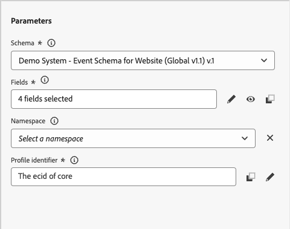
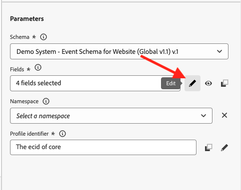
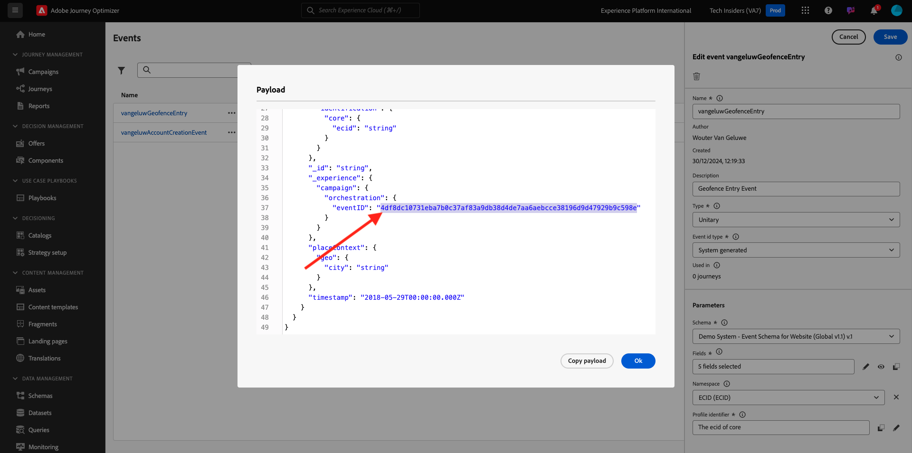

# 3.2.1 Définir un événement

Connectez-vous à Adobe Journey Optimizer en allant sur [Adobe Experience Cloud](https://experience.adobe.com?lang=fr). Cliquez sur **Journey Optimizer**.

Vous serez redirigé vers la vue **Accueil** dans Journey Optimizer. Tout d’abord, assurez-vous d’utiliser le bon sandbox. Le sandbox à utiliser est appelé `--aepSandboxName--`. Vous serez alors dans la vue **Accueil** de votre `--aepSandboxName--` sandbox.

Dans le menu de gauche, faites défiler l’écran vers le bas et cliquez sur **Configurations**. Cliquez ensuite sur le bouton **Gérer** sous **Événements**.

Vous verrez ensuite un aperçu de tous les événements disponibles. Cliquez sur **Créer un événement** pour commencer à créer votre propre événement.

Une nouvelle fenêtre d’événement vide s’affiche alors.
Utilisez `--aepUserLdap--GeofenceEntry` comme nom pour l’événement.

Définissez Description sur : `Geofence Entry Event`.

Assurez-vous que le **Type** est défini sur **Unitaire** et, pour la sélection **Type d’identifiant d’événement**, sélectionnez **Généré par le système**

Vous devez ensuite sélectionner un schéma. Tous les schémas affichés ici sont des schémas Adobe Experience Platform.

Vous remarquerez que tous les schémas ne s’affichent pas. Il existe de nombreux autres schémas disponibles dans Adobe Experience Platform.
Pour s’afficher dans cette liste, un schéma doit être lié à un groupe de champs très spécifique. Le groupe de champs nécessaire pour s’afficher ici est appelé `Orchestration eventID`.

Regardons rapidement comment ces schémas sont définis dans Adobe Experience Platform.

Dans le menu de gauche, accédez à **Schémas** et ouvrez-le dans un nouvel onglet du navigateur. Dans **Schémas**, accédez à **Parcourir** pour afficher la liste des schémas disponibles.
Ouvrez l’`Demo System - Event Schema for Website (Global v1.1)` Schéma .

Après avoir ouvert le schéma, vous verrez que le groupe de champs `Orchestration eventID` fait partie du schéma.
Ce groupe de champs ne comporte que deux champs, `_experience.campaign.orchestration.eventID` et `originJourneyID`.

Une fois que ce groupe de champs et ce champ eventID spécifique font partie d’un schéma, ce schéma est disponible pour être utilisé par Adobe Journey Optimizer.

Revenez à la configuration d’événement dans Adobe Journey Optimizer.

Dans ce cas d’utilisation, vous souhaitez écouter un événement de géorepérage pour comprendre si un client se trouve à un emplacement spécifique. Dès lors, sélectionnez l’`Demo System - Event Schema for Website (Global v1.1)` de schéma comme schéma de votre événement.

Adobe Journey Optimizer sélectionne alors automatiquement certains champs obligatoires, mais vous pouvez modifier les champs mis à la disposition de Adobe Journey Optimizer.

Cliquez sur l’icône **crayon** pour modifier les champs.

Une fenêtre contextuelle s’affiche alors avec une hiérarchie de schéma qui vous permet de sélectionner des champs.

Les champs tels que l’ECID et l’eventID d’orchestration sont obligatoires et donc présélectionnés.

Cependant, un professionnel du marketing doit disposer d’un accès flexible à tous les points de données qui fournissent un contexte à un parcours. Veillons donc à sélectionner également au minimum les champs suivants (qui se trouvent dans le nœud de contexte Placer ) :

- Ville

Une fois cette opération terminée, cliquez sur **OK**.

Adobe Journey Optimizer a également besoin d’un identifiant pour identifier le client. Adobe Journey Optimizer étant lié à Adobe Experience Platform, l’identifiant de Principal d’un schéma est automatiquement utilisé comme identifiant du Parcours.
L’identifiant de Principal prend également automatiquement en compte le graphique d’identités complet de Adobe Experience Platform et lie tous les comportements entre les identités, les appareils et les canaux disponibles au même profil, de sorte que Adobe Journey Optimizer soit contextuel, pertinent et cohérent. Cliquez sur **Enregistrer**.

Votre événement fera alors partie de la liste des événements disponibles.

Enfin, vous devez récupérer le `Orchestration eventID` de votre événement personnalisé.

Ouvrez à nouveau votre événement en cliquant dessus dans la liste des événements.
Lors de l’événement, cliquez sur l’icône **Afficher la payload** située en regard de **Champs**.

Cliquez sur l’icône **Afficher la payload** pour ouvrir un exemple de payload XDM pour cet événement. Faites défiler la page vers le bas dans **Payload** jusqu’à afficher la ligne `eventID`.

Notez le `eventID` comme vous en aurez besoin lors du dernier test de votre configuration.

Dans cet exemple, la `eventID` est `4df8dc10731eba7b0c37af83a9db38d4de7aa6aebcce38196d9d47929b9c598e`.

Vous avez maintenant défini l’événement qui déclenchera le parcours que nous sommes en train de créer. Une fois le parcours déclenché, les champs de limite géographique comme Ville, et tous les autres que vous avez pu choisir (comme Pays, Latitude et Longitude) seront mis à la disposition du parcours.

Comme indiqué dans la description du cas d’utilisation, nous devons ensuite fournir des promotions contextuelles qui dépendent de la météo. Pour obtenir des informations météorologiques, nous devrons définir une source de données externe qui nous fournira les informations météorologiques pour cet emplacement. Vous utiliserez le service **API OpenWeather** pour nous fournir ces informations.

Étape suivante : [3.2.2 Définir une source de données externe](./ex2.md)

[Retour au module 3.2](journey-orchestration-external-weather-api-sms.md)

[Revenir à tous les modules](../../../overview.md)
