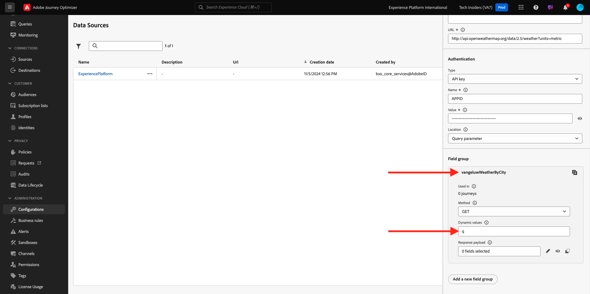

# 3.2.2 Définir une source de données externe

Dans cet exercice, vous allez créer une source de données externe personnalisée à l’aide de Adobe Journey Optimizer.

Connectez-vous à Adobe Journey Optimizer en allant sur [Adobe Experience Cloud](https://experience.adobe.com?lang=fr). Cliquez sur **Journey Optimizer**.


Vous serez redirigé vers la vue **Accueil** dans Journey Optimizer. Tout d’abord, assurez-vous d’utiliser le bon sandbox. Le sandbox à utiliser est appelé `--aepSandboxName--`. Vous serez alors dans la vue **Accueil** de votre `--aepSandboxName--` sandbox.


Dans le menu de gauche, faites défiler l’écran vers le bas et cliquez sur **Configurations**. Cliquez ensuite sur le bouton **Gérer** sous **Sources de données**.


La liste **Sources de données** s’affiche alors.
Cliquez sur **Créer une Source de données** pour commencer à ajouter votre source de données.


Une fenêtre contextuelle de source de données vide s’affiche.


Avant de commencer à configurer ce service, vous aurez besoin d&#39;un compte avec le service **Open Weather Map**. Pour créer votre compte et obtenir votre clé API, procédez comme suit.

Accédez à [https://openweathermap.org/](https://openweathermap.org/). Sur la page d’accueil, cliquez sur **Se connecter**.


Cliquez sur **Créer un compte**.


Renseignez les détails. Cliquez sur **Créer un compte**.


Vous serez alors redirigé vers la page de votre compte.


Dans le menu, cliquez sur **Clés API** pour récupérer votre clé API, dont vous aurez besoin pour configurer votre source de données externe personnalisée.


Une **clé API** ressemble à ceci : `b2c4c36b6bb59c3458d6686b05311dc3`.

Vous trouverez la **Documentation de l’API** pour la **Météo actuelle** [ici](https://openweathermap.org/current).

Pour ce cas d’utilisation, vous allez implémenter la connexion à Open Weather Map en fonction de la ville où se trouve le client, à l’aide de la **requête d’API intégrée par nom de ville**.


Revenez à **Adobe Journey Optimizer**, sur votre fenêtre contextuelle vide **External Data Source**.


Comme nom de source de données, utilisez `--aepUserLdap--WeatherApi`.

Définissez Description sur : `Access to the Open Weather Map`.

L’URL de l’API Open Weather Map est : **http://api.openweathermap.org/data/2.5/weather?units=metric**


Ensuite, vous devez sélectionner l’Authentification à utiliser.

Utilisez les variables suivantes :

| Champ | Valeur |
|:-----------------------:| :-----------------------|
| Type | **Clé API** |
| Nom | **APPID** |
| Valeur | **votre clé API** |
| Emplacement | **Paramètre de requête** |


Enfin, vous devez définir un **FieldGroup**, qui est en fait la requête que vous enverrez à l’API Weather. Dans notre cas, nous voulons utiliser le nom de la ville pour demander la météo actuelle pour cette ville.


Selon la documentation de l’API Météo , vous devez envoyer un `q=City` de paramètre.


Pour correspondre à la requête d’API attendue, configurez votre groupe de champs comme suit :

>[!IMPORTANT]
>
>Le nom du groupe de champs doit être unique. Utilisez la convention de nommage suivante : `--aepUserLdap--WeatherByCity`.



Pour la payload de réponse, vous devez coller un exemple de réponse qui sera envoyé par l’API de météo.

La réponse JSON de l’API attendue figure sur la page de documentation de l’API [ici](https://openweathermap.org/current), sous l’objet **JSON**.


Vous pouvez également copier la réponse JSON à partir d’ici :

```json
{
   "coord": {
      "lon": 7.367,
      "lat": 45.133
   },
   "weather": [
      {
         "id": 501,
         "main": "Rain",
         "description": "moderate rain",
         "icon": "10d"
      }
   ],
   "base": "stations",
   "main": {
      "temp": 284.2,
      "feels_like": 282.93,
      "temp_min": 283.06,
      "temp_max": 286.82,
      "pressure": 1021,
      "humidity": 60,
      "sea_level": 1021,
      "grnd_level": 910
   },
   "visibility": 10000,
   "wind": {
      "speed": 4.09,
      "deg": 121,
      "gust": 3.47
   },
   "rain": {
      "1h": 2.73
   },
   "clouds": {
      "all": 83
   },
   "dt": 1726660758,
   "sys": {
      "type": 1,
      "id": 6736,
      "country": "IT",
      "sunrise": 1726636384,
      "sunset": 1726680975
   },
   "timezone": 7200,
   "id": 3165523,
   "name": "Province of Turin",
   "cod": 200
}    
```

Copiez la réponse JSON ci-dessus dans le presse-papiers, puis accédez à l’écran de configuration de votre source de données personnalisée.

Cliquez sur l’icône **Modifier la payload**.


Une fenêtre contextuelle s’affiche, dans laquelle vous devez maintenant coller la réponse JSON ci-dessus.


Collez votre réponse JSON, après quoi vous verrez ceci. Cliquez sur **Enregistrer**.


Votre configuration de source de données personnalisée est maintenant terminée. Faites défiler vers le haut et cliquez sur **Enregistrer**.


Votre source de données a été créée avec succès et fait partie de la liste **Sources de données**.


Étape suivante : [3.2.3 Définir une action personnalisée](./ex3.md)

[Retour au module 3.2](journey-orchestration-external-weather-api-sms.md)

[Revenir à tous les modules](../../../overview.md)
