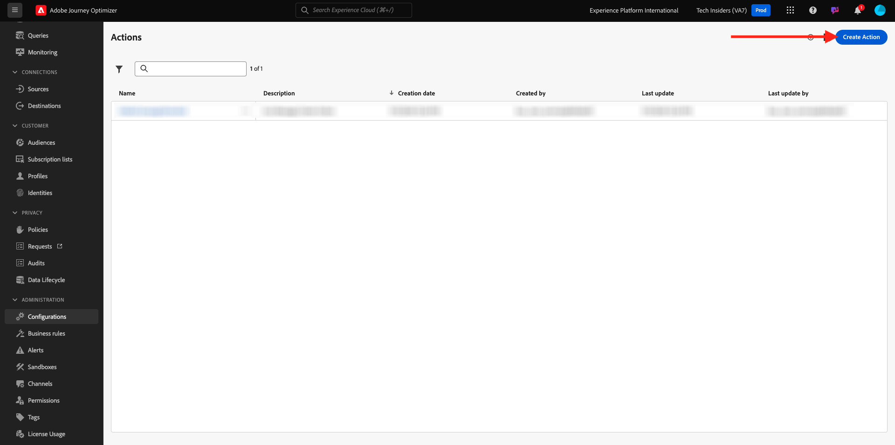
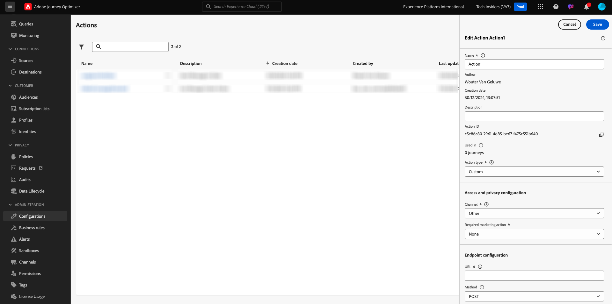

# 3.2.3 Définition d’une action personnalisée

Dans cet exercice, vous allez créer deux actions personnalisées en combinant l’utilisation de Adobe Journey Optimizer.

Connectez-vous à Adobe Journey Optimizer en vous rendant à [Adobe Experience Cloud](https://experience.adobe.com?lang=fr). Cliquez sur **Journey Optimizer**.


Vous serez redirigé vers la vue **Home** dans Journey Optimizer. Tout d’abord, assurez-vous d’utiliser l’environnement de test approprié. L’environnement de test à utiliser s’appelle `--aepSandboxId--`. Pour passer d’un environnement de test à un autre, cliquez sur **Production Prod (VA7)** et sélectionnez l’environnement de test dans la liste. Dans cet exemple, l’environnement de test est nommé **AEP Enablement FY22**. Vous serez alors dans la vue **Home** de votre environnement de test `--aepSandboxId--`.


Dans le menu de gauche, faites défiler l’écran vers le bas et cliquez sur **Configurations**. Cliquez ensuite sur le bouton **Gérer** sous **Actions**.


Vous verrez ensuite la liste **Actions**.



Vous définissez une action qui envoie du texte à un canal de Slack.

## 3.2.3.1 Action : envoyer du texte au canal Slack

Vous allez maintenant utiliser un canal de Slack existant et envoyer des messages à ce canal de Slack. Slack dispose d’une API conviviale et nous allons utiliser Adobe Journey Optimizer pour déclencher son API.


Cliquez sur **Créer une action** pour commencer à ajouter une nouvelle action.


Une fenêtre contextuelle Action vide s’affiche.



En tant que nom de l’action, utilisez `--demoProfileLdap--TextSlack`. Dans cet exemple, le nom de l’action est `vangeluwTextSlack`.

Définissez la description sur : `Send Text to Slack`.


Pour la **configuration d’URL**, utilisez ceci :

- URL : `https://2mnbfjyrre.execute-api.us-west-2.amazonaws.com/prod`
- Méthode : **POST**

>[!NOTE]
>
>L’URL ci-dessus fait référence à une fonction AWS Lambda qui transmettra ensuite votre requête au canal du Slack comme mentionné ci-dessus. Cela permet de protéger l’accès à un canal de Slack détenu par l’Adobe. Si vous disposez de votre propre canal de Slack, vous devez créer une application de Slack via [https://api.slack.com/](https://api.slack.com/), puis créer un webhook entrant dans cette application de Slack, puis remplacer l’URL ci-dessus par l’URL de webhook entrant.

Il n’est pas nécessaire de modifier les champs d’en-tête.


**L’authentification** doit être définie sur **Aucune authentification**.


Pour les **paramètres d’action**, vous devez définir les champs à envoyer au Slack. En toute logique, nous voulons que Adobe Journey Optimizer et Adobe Experience Platform soient le cerveau de la personnalisation, de sorte que le texte à envoyer au Slack doit être défini par Adobe Journey Optimizer, puis envoyé au Slack pour exécution.

Pour les **paramètres d’action**, cliquez sur l’icône **Modifier la charge utile** .


Vous verrez alors une fenêtre contextuelle vide.


Copiez le texte ci-dessous et collez-le dans la fenêtre contextuelle vide.

```json
{
 "text": {
  "toBeMapped": true,
  "dataType": "string",
  "label": "textToSlack"
 }
}
```

Pour votre information, en spécifiant les champs ci-dessous, ces champs deviennent accessibles à partir de votre Parcours client et vous pourrez les remplir dynamiquement à partir du Parcours :

**&quot;toBeMapped&quot;: true,**

**&quot;dataType&quot;: &quot;string&quot;,**

**&quot;label&quot;: &quot;textToSlack&quot;**

Vous verrez alors :


Cliquez sur **Enregistrer**.


Faites défiler l’écran vers le haut et cliquez une fois de plus sur **Enregistrer** pour enregistrer votre action personnalisée.


Votre action personnalisée fait désormais partie de la liste **Actions**.


Vous avez défini des événements, des sources de données externes et des actions. Maintenant, consolidons tout ça en un parcours.

Étape suivante : [3.2.4 Création de votre parcours et de vos messages](./ex4.md)

[Revenir au module 8](journey-orchestration-external-weather-api-sms.md)

[Revenir à tous les modules](../../../overview.md)
