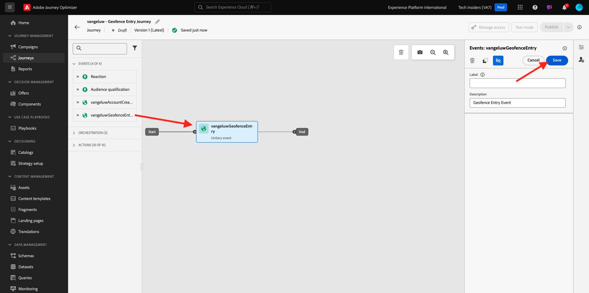
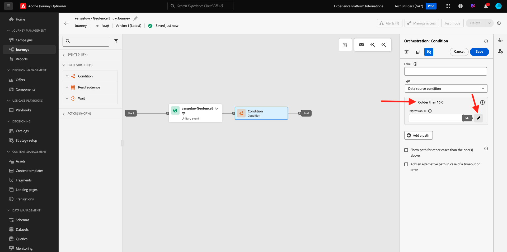
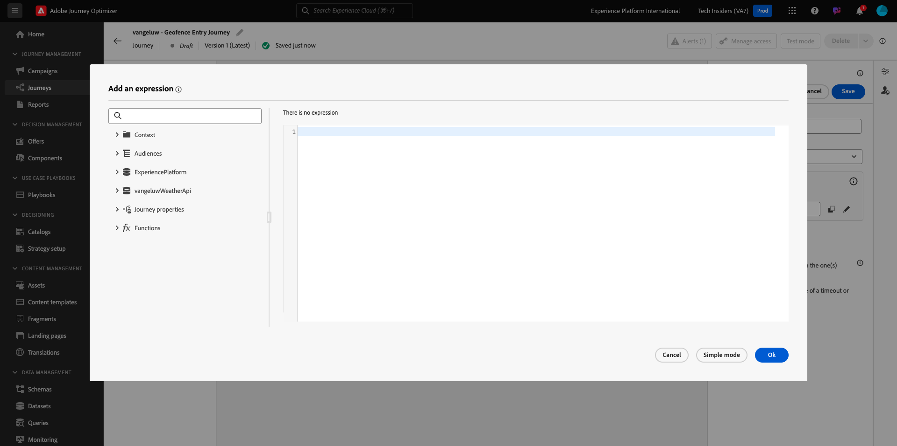

# 3.2.4 Création de votre parcours et de vos messages

Dans cet exercice, vous allez créer un parcours et plusieurs messages texte à l’aide de Adobe Journey Optimizer.

Dans ce cas pratique, l’objectif est d’envoyer différents SMS en fonction des conditions météorologiques de l’emplacement de votre client. 3 scénarios ont été définis :

- Plus de 10° Celsius
- Entre 10 ° et 25 ° Celsius
- Plus de 25° Celsius

Pour ces 3 conditions, vous devez définir 3 messages SMS dans Adobe Journey Optimizer.

## 3.2.4.1 Création de votre parcours

Connectez-vous à Adobe Journey Optimizer en vous rendant à [Adobe Experience Cloud](https://experience.adobe.com?lang=fr). Cliquez sur **Journey Optimizer**.


Vous serez redirigé vers la vue **Home** dans Journey Optimizer. Tout d’abord, assurez-vous d’utiliser l’environnement de test approprié. L’environnement de test à utiliser s’appelle `--aepSandboxName--`. Pour passer d’un environnement de test à un autre, cliquez sur **Production Prod (VA7)** et sélectionnez l’environnement de test dans la liste. Dans cet exemple, l’environnement de test est nommé **AEP Enablement FY22**. Vous serez alors dans la vue **Home** de votre environnement de test `--aepSandboxName--`.


Dans le menu de gauche, accédez à **Parcours** et cliquez sur **Créer un Parcours** pour commencer à créer votre Parcours.


Tu devrais prénommer ton parcours.

En tant que nom du parcours, utilisez `--aepUserLdap-- - Geofence Entry Journey`. Dans cet exemple, le nom du parcours est `vangeluw - Geofence Entry Journey`. Aucune autre valeur ne doit être définie pour le moment. Cliquez sur **OK**.


Sur le côté gauche de l’écran, regardez **Events**. L’événement précédemment créé doit s’afficher dans cette liste. Sélectionnez-la, puis faites-la glisser et déposez-la sur le canevas de parcours. Votre parcours ressemble alors à ceci. Cliquez sur **OK**.



Cliquez ensuite sur **Orchestration**. Les fonctionnalités **Orchestration** disponibles s’affichent désormais. Sélectionnez **Condition**, puis faites-le glisser et déposez-le sur le canevas de Parcours.


Vous devez maintenant définir trois conditions :

- Il fait plus de 10° Celsius.
- C&#39;est entre 10° et 25° Celsius
- Il fait plus de 25° Celsius.

Définissons la première condition.

### Condition 1 : plus de 10° Celsius

Cliquez sur la **condition**.  Cliquez sur **Path1** et modifiez le nom du chemin d’accès en **Colonnes supérieures à 10 C**. Cliquez sur l’icône **Edit** pour l’expression de Path1.



Vous verrez alors un écran **Simple Editor** vide. Votre requête sera un peu plus avancée, vous aurez donc besoin du **mode avancé**. Cliquez sur **Mode avancé**.


Vous verrez ensuite l’ **éditeur avancé** qui permet la saisie de code.



Sélectionnez le code ci-dessous et collez-le dans l’ **éditeur avancé**.

`#{--aepUserLdap--WeatherApi.--aepUserLdap--WeatherByCity.main.temp} <= 10`

Vous verrez alors ceci.


Pour récupérer la température dans le cadre de cette condition, vous devez indiquer la ville dans laquelle se trouve actuellement le client.
La **Ville** doit être liée au paramètre dynamique `q`, comme nous l’avons vu précédemment dans la documentation de l’API Open Weather.

Cliquez sur le champ **dynamic val: q** comme indiqué dans la capture d’écran.


Vous devez ensuite trouver le champ qui contient la ville actuelle du client dans l’une des sources de données disponibles.


Vous pouvez trouver le champ en accédant à `--aepUserLdap--GeofenceEntry.placeContext.geo.city`.

En cliquant sur ce champ, il sera ajouté comme valeur dynamique pour le paramètre `q`. Ce champ sera renseigné par exemple par le service de géolocalisation que vous avez mis en oeuvre dans votre application mobile. Dans notre cas, nous simulerons cela avec la console d’administration du site web de démonstration. Cliquez sur **OK**.


### Condition 2 : entre 10 ° et 25 ° Celsius

Après avoir ajouté la première condition, cet écran s’affiche. Cliquez sur **Ajouter chemin**.


Double-cliquez sur **Path1** et modifiez le nom du chemin d’accès en **Entre 10 et 25 C**. Cliquez sur l&#39;icône **Edit** pour l&#39;expression de ce chemin.


Vous verrez alors un écran **Simple Editor** vide. Votre requête sera un peu plus avancée, vous aurez donc besoin du **mode avancé**. Cliquez sur **Mode avancé**.


Vous verrez ensuite l’ **éditeur avancé** qui permet la saisie de code.


Sélectionnez le code ci-dessous et collez-le dans l’ **éditeur avancé**.

`#{--aepUserLdap--WeatherApi.--aepUserLdap--WeatherByCity.main.temp} > 10 and #{--aepUserLdap--WeatherApi.--aepUserLdap--WeatherByCity.main.temp} <= 25`

Vous verrez alors ceci.


Pour récupérer la température dans le cadre de cette condition, vous devez indiquer la ville dans laquelle se trouve actuellement le client.
La **Ville** doit être liée au paramètre dynamique **q**, comme nous l’avons vu précédemment dans la documentation de l’API Open Weather.

Cliquez sur le champ **dynamic val: q** comme indiqué dans la capture d’écran.


Vous devez ensuite trouver le champ qui contient la ville actuelle du client dans l’une des sources de données disponibles.


Vous pouvez trouver le champ en accédant à `--aepUserLdap--GeofenceEntry.placeContext.geo.city`. En cliquant sur ce champ, il sera ajouté comme valeur dynamique pour le paramètre **q**. Ce champ sera renseigné par exemple par le service de géolocalisation que vous avez mis en oeuvre dans votre application mobile. Dans notre cas, nous simulerons cela avec la console d’administration du site web de démonstration. Cliquez sur **OK**.


Vous allez ensuite ajouter la troisième condition.

### Condition 3 : plus chaud que 25° Celsius

Après avoir ajouté la deuxième condition, cet écran s’affiche. Cliquez sur **Ajouter chemin**.


Double-cliquez sur Path1 pour remplacer le nom par **Warmer than 25 C**.
Cliquez ensuite sur l&#39;icône **Modifier** pour l&#39;expression de ce chemin.


Vous verrez alors un écran **Simple Editor** vide. Votre requête sera un peu plus avancée, vous aurez donc besoin du **mode avancé**. Cliquez sur **Mode avancé**.


Vous verrez ensuite l’ **éditeur avancé** qui permet la saisie de code.


Sélectionnez le code ci-dessous et collez-le dans l’ **éditeur avancé**.

`#{--aepUserLdap--WeatherApi.--aepUserLdap--WeatherByCity.main.temp} > 25`

Vous verrez alors ceci.


Pour récupérer la température dans le cadre de cette condition, vous devez indiquer la ville dans laquelle se trouve actuellement le client.
La **Ville** doit être liée au paramètre dynamique **q**, comme nous l’avons vu précédemment dans la documentation de l’API Open Weather.

Cliquez sur le champ **dynamic val: q** comme indiqué dans la capture d’écran.


Vous devez ensuite trouver le champ qui contient la ville actuelle du client dans l’une des sources de données disponibles.


Vous pouvez trouver le champ en accédant à ```--aepUserLdap--GeofenceEntry.placeContext.geo.city```. En cliquant sur ce champ, il sera ajouté comme valeur dynamique pour le paramètre **q**. Ce champ sera renseigné par exemple par le service de géolocalisation que vous avez mis en oeuvre dans votre application mobile. Dans notre cas, nous simulerons cela avec la console d’administration du site web de démonstration. Cliquez sur **OK**.


Vous disposez désormais de trois chemins configurés. Cliquez sur **OK**.


Comme il s’agit d’un parcours à des fins d’apprentissage, nous allons maintenant configurer quelques actions afin de présenter la variété d’options que les marketeurs doivent désormais fournir aux messages.

## 3.2.4.2 Envoi des messages pour le chemin : plus de 10° Celsius

Pour chacun des contextes de température, nous tenterons d’envoyer un SMS à notre client. Nous ne pouvons envoyer un SMS que si un numéro de mobile est disponible pour un client. Nous allons donc d’abord devoir vérifier que nous le faisons.

Concentrons-nous sur **Plus de 10 C**.


Prenons un autre élément **Condition** et faisons-le glisser comme indiqué dans la capture d’écran ci-dessous. Nous vérifierons si, pour ce client, un numéro de mobile est disponible.


Comme il ne s’agit que d’un exemple, nous ne configurons que l’option pour laquelle le client dispose d’un numéro de mobile. Ajoutez un libellé **Comporte-t-il un mobile ?**.

Cliquez sur l&#39;icône **Modifier** pour l&#39;expression du chemin **Chemin1**.


Dans la partie Sources de données affichée à gauche, accédez à **ExperiencePlatform.ProfileFieldGroup.profile.mobilePhone.number**. Vous lisez maintenant le numéro de téléphone mobile directement à partir de Adobe Experience Platform et de Real-time Customer Profile.


Sélectionnez le champ **Nombre**, puis faites-le glisser vers le canevas de conditions.

Sélectionnez l’opérateur **n’est pas vide**. Cliquez sur **OK**.


Vous verrez alors ceci. Cliquez à nouveau sur **OK**.


Votre parcours ressemblera alors à ceci. Cliquez sur **Actions** comme indiqué dans la capture d’écran.


Sélectionnez l’action **SMS**, puis faites-la glisser après la condition que vous venez d’ajouter.


Définissez la **catégorie** sur **Marketing** et sélectionnez une surface SMS qui vous permet d&#39;envoyer des SMS. Dans ce cas, la surface d&#39;email à sélectionner est **SMS**.


L’étape suivante consiste à créer votre message. Pour ce faire, cliquez sur **Modifier le contenu**.


Le tableau de bord des messages s’affiche maintenant, dans lequel vous pouvez configurer le texte de votre SMS. Cliquez sur la zone **Composer le message** pour créer votre message.


Saisissez le texte suivant : `Brrrr... {{profile.person.name.firstName}}, it's freezing. 20% discount on jackets today!`. Cliquez sur **Enregistrer**.


Vous verrez alors ceci. Cliquez sur la flèche dans le coin supérieur gauche pour revenir à votre parcours.


Vous serez alors de retour ici. Cliquez sur **OK**.


Dans le menu de gauche, revenez à **Actions**, sélectionnez l’action `--aepUserLdap--TextSlack`, puis faites-la glisser après l’action **Message**.


Accédez à **Action Parameters** et cliquez sur l’icône **Edit** pour le paramètre `TEXTTOSLACK`.


Dans la fenêtre contextuelle, cliquez sur **Mode avancé**.


Sélectionnez le code ci-dessous, copiez-le et collez-le dans l’ **éditeur de mode avancé**. Cliquez sur **OK**.

`"Brrrr..." + #{ExperiencePlatform.ProfileFieldGroup.profile.person.name.firstName} + " It's freezing. 20% discount on Jackets today!"`


L’action terminée s’affiche. Cliquez sur **OK**.


Ce chemin du parcours est maintenant prêt.

## 3.2.4.3 Envoyer des messages pour le chemin : entre 10° et 25° Celsius

Pour chacun des contextes de température, nous tenterons d’envoyer un SMS à notre client. Nous ne pouvons envoyer un SMS que si un numéro de mobile est disponible pour un client. Nous allons donc d’abord devoir vérifier que nous le faisons.

Concentrons-nous sur le chemin **Entre 10 et 25 C**.


Prenons un autre élément **Condition** et faisons-le glisser comme indiqué dans la capture d’écran ci-dessous. Nous vérifierons si, pour ce client, un numéro de mobile est disponible.


Comme il ne s’agit que d’un exemple, nous ne configurons que l’option pour laquelle le client dispose d’un numéro de mobile. Ajoutez un libellé **Comporte-t-il un mobile ?**.

Cliquez sur l&#39;icône **Modifier** pour l&#39;expression du chemin **Chemin1**.


Dans la partie Sources de données affichée à gauche, accédez à **ExperiencePlatform.ProfileFieldGroup.profile.mobilePhone.number**. Vous lisez maintenant le numéro de téléphone mobile directement à partir de Adobe Experience Platform et de Real-time Customer Profile.


Sélectionnez le champ **Nombre**, puis faites-le glisser vers le canevas de conditions.

Sélectionnez l’opérateur **n’est pas vide**. Cliquez sur **OK**.


Vous verrez alors ceci. Cliquez sur **OK**.


Votre parcours ressemblera alors à ceci. Cliquez sur **Actions** comme indiqué dans la capture d’écran.


Sélectionnez l’action **SMS**, puis faites-la glisser après la condition que vous venez d’ajouter.


Définissez la **catégorie** sur **Marketing** et sélectionnez une surface SMS qui vous permet d&#39;envoyer des SMS. Dans ce cas, la surface d&#39;email à sélectionner est **SMS**.


L’étape suivante consiste à créer votre message. Pour ce faire, cliquez sur **Modifier le contenu**.


Le tableau de bord des messages s’affiche maintenant, dans lequel vous pouvez configurer le texte de votre SMS. Cliquez sur la zone **Composer le message** pour créer votre message.


Saisissez le texte suivant : `What a nice weather for the time of year, {{profile.person.name.firstName}} - 20% discount on Sweaters today!`. Cliquez sur **Enregistrer**.


Vous verrez alors ceci. Cliquez sur la flèche dans le coin supérieur gauche pour revenir à votre parcours.


L’action terminée s’affiche désormais. Cliquez sur **OK**.


Dans le menu de gauche, revenez à **Actions**, sélectionnez l’action `--aepUserLdap--TextSlack`, puis faites-la glisser après l’action **Message**.


Accédez à **Action Parameters** et cliquez sur l’icône **Edit** pour le paramètre `TEXTTOSLACK`.


Dans la fenêtre contextuelle, cliquez sur **Mode avancé**.


Sélectionnez le code ci-dessous, copiez-le et collez-le dans l’ **éditeur de mode avancé**. Cliquez sur **OK**.

`"What nice weather for the time of year, " + #{ExperiencePlatform.ProfileFieldGroup.profile.person.name.firstName} + " 20% discount on Sweaters today!"`


L’action terminée s’affiche. Cliquez sur **OK**.


Ce chemin du parcours est maintenant prêt.

## 3.2.4.4 Envoi des messages pour le chemin d’accès : plus chaud que 25° Celsius

Pour chacun des contextes de température, nous tenterons d’envoyer un SMS à notre client. Nous ne pouvons envoyer un SMS que si un numéro de mobile est disponible pour un client. Nous allons donc d’abord devoir vérifier que nous le faisons.

Concentrons-nous sur le chemin **Warmer than 25 C**.


Prenons un autre élément **Condition** et faisons-le glisser comme indiqué dans la capture d’écran ci-dessous. Vous allez vérifier si, pour ce client, un numéro de mobile est disponible.


Comme il ne s’agit que d’un exemple, nous ne configurons que l’option pour laquelle le client dispose d’un numéro de mobile. Ajoutez un libellé **Comporte-t-il un mobile ?**.

Cliquez sur l&#39;icône **Modifier** pour l&#39;expression du chemin **Chemin1**.


Dans la partie Sources de données affichée à gauche, accédez à **ExperiencePlatform.ProfileFieldGroup.profile.mobilePhone.number**. Vous lisez maintenant le numéro de téléphone mobile directement à partir de Adobe Experience Platform et de Real-time Customer Profile.


Sélectionnez le champ **Nombre**, puis faites-le glisser vers le canevas de conditions.

Sélectionnez l’opérateur **n’est pas vide**. Cliquez sur **OK**.


Vous verrez alors ceci. Cliquez sur **OK**.


Votre parcours ressemblera alors à ceci. Cliquez sur **Actions** comme indiqué dans la capture d’écran.


Sélectionnez l’action **SMS**, puis faites-la glisser après la condition que vous venez d’ajouter.


Définissez la **catégorie** sur **Marketing** et sélectionnez une surface SMS qui vous permet d&#39;envoyer des SMS. Dans ce cas, la surface d&#39;email à sélectionner est **SMS**.


L’étape suivante consiste à créer votre message. Pour ce faire, cliquez sur **Modifier le contenu**.


Le tableau de bord des messages s’affiche maintenant, dans lequel vous pouvez configurer le texte de votre SMS. Cliquez sur la zone **Composer le message** pour créer votre message.


Saisissez le texte suivant : `So warm, {{profile.person.name.firstName}}! 20% discount on swimwear today!`. Cliquez sur **Enregistrer**.


Vous verrez alors ceci. Cliquez sur la flèche dans le coin supérieur gauche pour revenir à votre parcours.


L’action terminée s’affiche désormais. Cliquez sur **OK**.


Dans le menu de gauche, revenez à **Actions**, sélectionnez l’action `--aepUserLdap--TextSlack`, puis faites-la glisser après l’action **Messages**.


Accédez à **Action Parameters** et cliquez sur l’icône **Edit** pour le paramètre `TEXTTOSLACK`.


Dans la fenêtre contextuelle, cliquez sur **Mode avancé**.


Sélectionnez le code ci-dessous, copiez-le et collez-le dans l’ **éditeur de mode avancé**. Cliquez sur **OK**.

`"So warm, " + #{ExperiencePlatform.ProfileFieldGroup.profile.person.name.firstName} + "! 20% discount on swimwear today!"`


L’action terminée s’affiche. Cliquez sur **OK**.


Ce chemin du parcours est maintenant prêt.

## 3.2.4.5 Publish votre parcours

Votre parcours est maintenant entièrement configuré. Cliquez sur **Publier**.


Cliquez de nouveau sur **Publish**.


Votre parcours est maintenant publié.


Étape suivante : [3.2.5 Déclencher votre parcours](./ex5.md)

[Revenir au module 3.2](journey-orchestration-external-weather-api-sms.md)

[Revenir à tous les modules](../../../overview.md)
