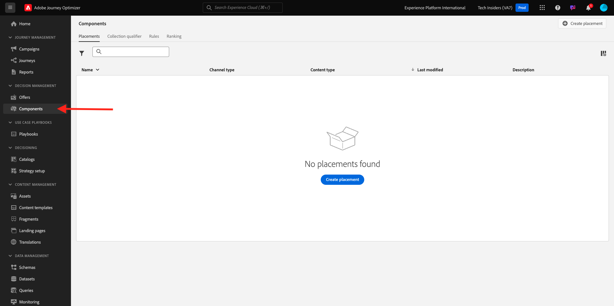
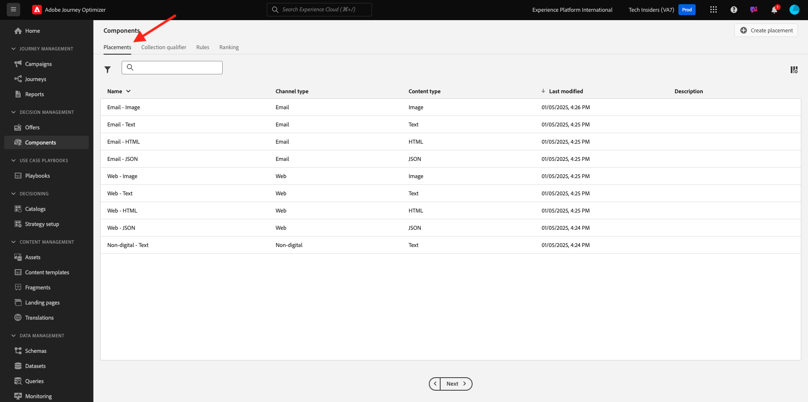

# 3.3.1 Offer decisioning 101

## Terminologie 3.3.1.1

Pour mieux comprendre le fonctionnement d’Offer decisioning, nous vous recommandons vivement de lire la [présentation](https://experienceleague.adobe.com/docs/journey-optimizer/using/offer-decisioniong/get-started-decision/starting-offer-decisioning.html?lang=fr) sur le fonctionnement d’Offer Decisioning Application Service avec Adobe Experience Platform.

L’utilisation de l’Offer decisioning nécessite la compréhension des concepts suivants :

| Terme | Explication |
| ------------------------- | -------------------------------------------------------------------------------------------------------------------------------------------------------------------------------------------------------------------------------------------------------- |
| **Offre** | Une offre est un message marketing auquel des règles peuvent être associées et qui spécifie qui est éligible pour voir l’offre. Une offre a un statut : brouillon, approuvée ou archivée. |
| **Placement** | Combinaison de l’emplacement (ou type de canal) et du contexte (ou type de contenu) dans lequel apparaît une offre pour un utilisateur final. En effet, il s’agit de la combinaison de textes, d’HTMLS, d’images, de fichiers JSON sur les canaux mobiles, web, sociaux, de messagerie instantanée et non numériques. |
| **Règle** | Logique qui définit et contrôle l’éligibilité des utilisateurs finaux pour une offre. |
| **Offre Personnalisée** | Message marketing personnalisable basé sur des règles et des contraintes d’éligibilité. |
| **Offre De Secours** | Offre par défaut affichée lorsqu&#39;un utilisateur final n&#39;est éligible à aucune des offres de la collection utilisée. |
| **Limitation** | Utilisé dans une définition d’offre pour définir le nombre total de fois où une offre peut être présentée au total et à un utilisateur spécifique. |
| **Priorité** | Niveau permettant de déterminer le rang de priorité à partir d’un jeu d’offres de résultats. |
| **Collection** | Utilisé pour filtrer un sous-ensemble d’offres de la liste d’offres personnalisées afin d’accélérer le processus d’offer decisioning. |
| **Décision** | Une combinaison d’un ensemble d’offres, d’emplacements et de profils pour laquelle le marketeur souhaite que le moteur de décision fournisse la meilleure offre. |
| **AEM Assets Essentials** | Une expérience universelle et centralisée pour le stockage, la recherche et la sélection de ressources dans les solutions Adobe Experience Cloud et Adobe Experience Platform. |

{style="table-layout:auto"}

## offer decisioning 3.3.1.2

Connectez-vous à Adobe Journey Optimizer en allant sur [Adobe Experience Cloud](https://experience.adobe.com?lang=fr). Cliquez sur **Journey Optimizer**.

Vous serez redirigé vers la vue **Accueil** dans Journey Optimizer. Tout d’abord, assurez-vous d’utiliser le bon sandbox. Le sandbox à utiliser est appelé `--aepSandboxName--`. Vous serez alors dans la vue **Accueil** de votre `--aepSandboxName--` sandbox.

Dans le menu de gauche, cliquez sur **Offres**. Vous verrez maintenant le menu Offres , qui contient des éléments tels que des offres, des collections et des décisions.

Cliquez sur **Composants**. Vous verrez désormais des éléments tels que les emplacements, le qualificateur de collection, les règles et les classements.

## Emplacements 3.3.1.3

Accédez à **Emplacements**.

Dans l’onglet **Emplacements** , vous pouvez définir les emplacements de vos offres. Lorsque vous définissez une décision, l&#39;emplacement définit l&#39;endroit où l&#39;offre résultante apparaîtra (Type de canal) et dans quelle forme (Type de contenu).

Si vous ne voyez aucun emplacement dans votre environnement, créez-le comme indiqué ci-dessous et dans la capture d’écran.

| Nom | Type de canal | Type de contenu |
| ---------------------- | ------------ | ------------ |
| **Non numérique - Texte** | Non numérique | Texte |
| **Web - JSON** | Web | JSON |
| **Web - HTML** | Web | HTML |
| **Web - Texte** | Web | Texte |
| **Web - Image** | Web | Image |
| **Email - JSON** | E-mail | JSON |
| **Email - HTML** | E-mail | HTML |
| **E-mail - Texte** | E-mail | Texte |
| **E-mail - Image** | E-mail | Image |

{style="table-layout:auto"}

**Remarque** : ne modifiez rien aux emplacements déjà disponibles.

Cliquez sur un emplacement pour en visualiser les paramètres.

Tous les champs de l&#39;Emplacement s&#39;affichent à présent :

- **Nom** de l’emplacement
- **ID d’emplacement**
- **Type de canal** pour l’emplacement
- **Type de contenu** de l&#39;emplacement, qui peut être **Texte**, **HTML**, **Image** ou **JSON**
- Champ **Description** permettant d’ajouter une description supplémentaire pour l’emplacement

## 3.3.1.4 des règles de décision

Une règle (également appelée règle d’éligibilité) est l’équivalent d’une **audience**. Une règle est en fait une audience elle-même, à la seule différence qu’une règle peut être utilisée avec une offre pour fournir la meilleure offre à un profil dans Adobe Experience Platform.

Comme vous savez déjà comment définir des audiences en fonction des modules d’activation précédents, nous allons rapidement revoir l’environnement de segmentation :

Accédez à **Règles**. Cliquez sur **+ Créer une règle**.

Vous verrez ensuite l’interface de création d’audiences de Adobe Experience Platform.

Vous pouvez désormais accéder à tous les champs qui font partie du schéma d’union pour le profil client en temps réel et créer n’importe quelle règle.

Il est également bon de savoir que vous pouvez simplement réutiliser des audiences déjà définies dans Adobe Experience Platform, en accédant à **Audiences** > ``--aepTenantId--``.

Vous verrez alors ceci :

Si vous le souhaitez, vous pouvez maintenant configurer vos propres règles. Pour cet exercice, vous aurez besoin de deux règles :

- all - Clients
- all - Clientes

Si ces règles n’existent pas encore, créez-les. S’ils existent déjà, utilisez ces règles et ne créez pas de nouvelles règles.

L’attribut à utiliser pour créer la règle est **Profil individuel XDM** > **Personne** > **Genre**.

À titre d’exemple, voici la définition de la règle **tous - Clients** :

À titre d’exemple, voici la définition de la règle **toutes - Clientes** :

## 3.3.1.5 Offres

Accédez à **Offres** et sélectionnez **Offres**. Cliquez sur **+ Créer une offre**.

Vous verrez alors cette fenêtre contextuelle.

Ne créez aucune offre pour l’instant. Vous le ferez dans l’exercice suivant.

Vous constatez maintenant qu’il existe deux types d’offres :

- Offres personnalisées
- Offres de secours

Une offre personnalisée est un contenu spécifique qui doit être affiché dans une situation spécifique. Une offre personnalisée est conçue spécifiquement pour fournir une expérience personnelle et contextuelle si des critères spécifiques sont remplis.

Une offre de secours est une offre qui s’affiche si les critères des offres personnalisées ne sont pas remplis.

## Décisions 3.3.1.6

Une décision associe des emplacements, une collection d&#39;offres personnalisées et une offre de secours à utiliser finalement par le moteur d&#39;Offer decisioning pour rechercher la meilleure offre pour un profil spécifique, en fonction de chacune des caractéristiques d&#39;offres personnalisées individuelles telles que la priorité, la contrainte d&#39;éligibilité et la limitation totale/utilisateur.

Pour configurer votre **Décision**, cliquez sur **Décisions**.

Dans l’exercice suivant, vous allez configurer vos propres offres et décisions.

Étape suivante : [3.3.2 Configurer vos offres et votre décision](./ex2.md)

[Retour au module 3.3](./offer-decisioning.md)

[Revenir à tous les modules](./../../../overview.md)
