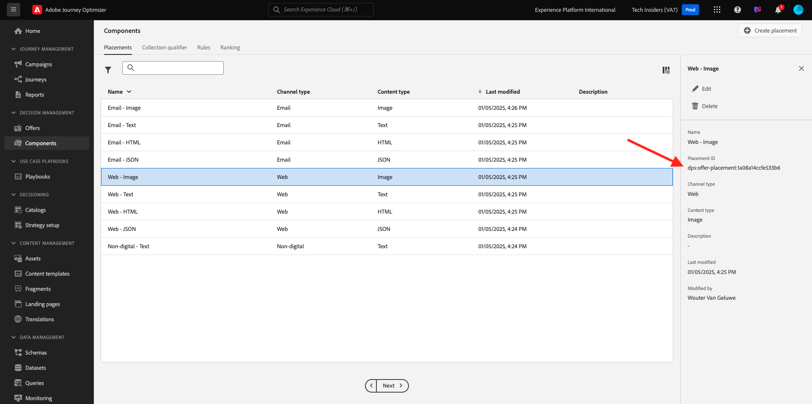
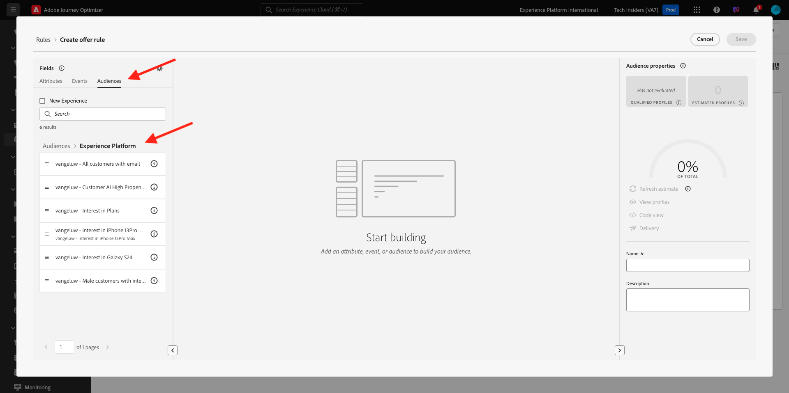

# 3.3.1 Offer decisioning 101

## 3.3.1.1 Terminologie

Pour une meilleure compréhension de l’Offer decisioning, nous vous recommandons vivement de lire la [présentation](https://experienceleague.adobe.com/docs/journey-optimizer/using/offer-decisioniong/get-started-decision/starting-offer-decisioning.html?lang=en) sur le fonctionnement d’Offer Decisioning Application Service avec Adobe Experience Platform.

Avec Offer Decisioning, vous devez comprendre les concepts suivants :

| Terme | Explication |
| ------------------------- | -------------------------------------------------------------------------------------------------------------------------------------------------------------------------------------------------------------------------------------------------------- |
| **Offre** | Une offre est un message marketing auquel des règles peuvent être associées et qui spécifie qui est éligible pour voir l’offre. Une offre a un statut : version préliminaire, approuvée ou archivée. |
| **Placement** | Combinaison de l’emplacement (ou du type de canal) et du contexte (ou type de contenu) dans lequel une offre apparaît pour un utilisateur final. Il s’agit en fait de la combinaison de canaux Texte, HTML, Image, JSON dans Mobile, Web, Social, Messagerie instantanée et non numériques. |
| **Règle** | Logique qui définit et contrôle l’éligibilité des utilisateurs finaux pour une offre. |
| **Offre personnalisée** | Message marketing personnalisable basé sur des règles d’éligibilité et des contraintes. |
| **Offre de secours** | L’offre par défaut s’affiche lorsqu’un utilisateur final n’est éligible à aucune des offres de la collection utilisée. |
| **limitation** | Utilisé dans une définition d’offre pour définir le nombre de fois où une offre peut être présentée au total et à un utilisateur spécifique. |
| **Priorité** | Niveau pour déterminer le rang de priorité à partir d’un ensemble de résultats d’offres. |
| **Collection** | Utilisé pour filtrer un sous-ensemble d’offres de la liste d’offres personnalisée afin d’accélérer le processus d’offer decisioning. |
| **Décision** | Combinaison d’un ensemble d’offres, d’emplacements et de profils pour lesquels le marketeur souhaite que le moteur de décision fournisse la meilleure offre. |
| **AEM Assets Essentials** | Expérience universelle et centralisée pour le stockage, la recherche et la sélection de ressources dans les solutions Adobe Experience Cloud et Adobe Experience Platform. |

{style="table-layout:auto"}

## 3.3.1.2 Offer decisioning

Connectez-vous à Adobe Journey Optimizer en vous rendant à [Adobe Experience Cloud](https://experience.adobe.com?lang=fr). Cliquez sur **Journey Optimizer**.

Vous serez redirigé vers la vue **Home** dans Journey Optimizer. Tout d’abord, assurez-vous d’utiliser l’environnement de test approprié. L’environnement de test à utiliser s’appelle `--aepSandboxName--`. Pour passer d’un environnement de test à un autre, cliquez sur **Production Prod (VA7)** et sélectionnez l’environnement de test dans la liste. Dans cet exemple, l’environnement de test est nommé **AEP Enablement FY22**. Vous serez alors dans la vue **Home** de votre environnement de test `--aepSandboxName--`.

Dans le menu de gauche, cliquez sur **Offres**. Le menu Offres s’affiche désormais, avec des éléments tels que Offres, Collections et Décisions.

Cliquez sur **Composants**. Le menu Offres s’affiche désormais, avec des éléments tels que Emplacements, Balises, Règles et Classements.

## 3.3.1.3 Emplacements

Accédez à **Emplacements**.

Dans l’onglet **Emplacements** , vous pouvez définir vos emplacements pour vos offres. Lorsque vous définissez une décision, l’emplacement définit l’emplacement où l’offre résultante apparaîtra (type de canal) et dans quelle forme ou forme (type de contenu).

Si aucun emplacement ne s’affiche dans votre instance Adobe Experience Platform, créez-le comme indiqué ci-dessous et dans la capture d’écran.

| Nom | Type de canal | Type de contenu |
| ---------------------- | ------------ | ------------ |
| **Non numérique - Texte** | Non numérique | Texte |
| **Web - JSON** | Web | JSON |
| **Web - HTML** | Web | HTML |
| **Web - Texte** | Web | Texte |
| **Web - Image** | Web | Image |
| **Email - JSON** | E-mail | JSON |
| **Email - HTML** | E-mail | HTML |
| **Email - Text** | E-mail | Texte |
| **E-mail - Image** | E-mail | Image |

{style="table-layout:auto"}

**Remarque** : Veuillez ne rien changer aux emplacements déjà disponibles.

Cliquez sur n’importe quel emplacement pour visualiser ses paramètres.

Vous verrez maintenant tous les champs de l’emplacement :

- **Nom** de l’emplacement
- **Identifiant de référencement**
- **Type de canal** pour l’emplacement
- **Type de contenu** de l’emplacement, qui peut être **Texte**, **HTML**, **Image** ou **JSON**
- Champ **Description** permettant d’ajouter une description supplémentaire pour l’emplacement

## 3.3.1.4 Règles de décision

Une règle (également appelée règle d’éligibilité) est l’équivalent d’une **audience**. Une règle est en fait une audience elle-même avec la seule différence qu’une règle peut être utilisée avec une offre pour fournir la meilleure offre à un profil dans Adobe Experience Platform.

Comme vous savez déjà comment définir des audiences en fonction des modules d’activation précédents, revenons rapidement à l’environnement de segmentation :

Accédez à **Rules**. Cliquez sur **+ Créer une règle**.

L’environnement Segmentation de Adobe Experience Platform s’affiche alors.

Vous pouvez désormais accéder à tous les champs qui font partie du schéma d’union pour Real-time Customer Profile et créer n’importe quelle règle.

Il est également intéressant de savoir que vous pouvez simplement réutiliser des audiences déjà définies dans Adobe Experience Platform, en accédant à **Audiences** > ``--aepTenantId--``.

Vous verrez alors :

Si vous le souhaitez, vous pouvez maintenant configurer vos propres règles. Pour cet exercice, vous aurez besoin de deux règles :

- all - Clients masculins
- all - Clients féminins

Si ces règles n&#39;existent pas encore, merci de les créer. S&#39;ils existent déjà, veuillez utiliser ces règles et ne pas en créer de nouvelles.

L’attribut à utiliser pour créer la règle est **XDM Individual Profile** > **Person** > **Gender**.

Par exemple, voici la définition de règle pour la règle **all - Masculin Customers** :

Par exemple, voici la définition de règle pour la règle **all - Female Customers** :

## 3.3.1.5 Offres

Accédez à **Offres** et sélectionnez **Offres**. Cliquez sur **+ Créer une offre**.

Vous verrez alors cette fenêtre contextuelle.

Ne créez aucune offre maintenant. Vous le ferez lors du prochain exercice.

Vous constatez maintenant qu’il existe deux types d’offres :

- Offres personnalisées
- Offres de secours

Une offre personnalisée est un contenu spécifique qui doit s’afficher dans une situation spécifique. Une offre personnalisée est spécialement conçue pour offrir une expérience personnelle et contextuelle si des critères spécifiques sont satisfaits.

Une offre de secours est une offre qui s’affiche si les critères des offres personnalisées ne sont pas remplis.

## 3.3.1.6 Décisions

Une décision combine des emplacements, un ensemble d’offres personnalisées et une offre de secours qui sera finalement utilisée par le moteur d’Offer decisioning pour trouver la meilleure offre pour un profil spécifique, en fonction de chacune des caractéristiques d’offre personnalisées individuelles telles que la priorité, la contrainte d’éligibilité et la limitation totale/utilisateur.

Pour configurer votre **décision**, cliquez sur **décisions**.

Au cours de l’exercice suivant, vous allez configurer vos propres offres et décisions.

Étape suivante : [3.3.2 Configuration de vos offres et de votre décision](./ex2.md)

[Revenir au module 3.3](./offer-decisioning.md)

[Revenir à tous les modules](./../../../overview.md)
