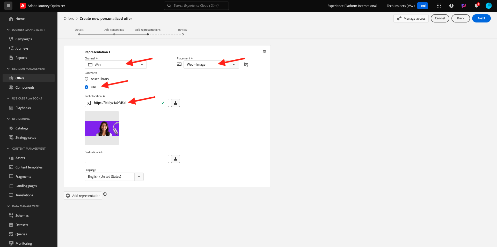
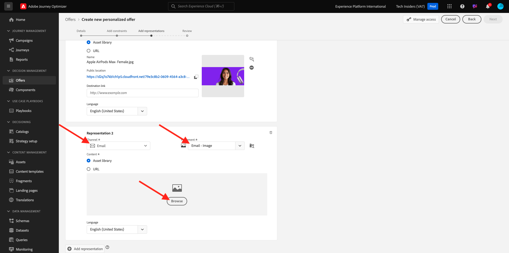
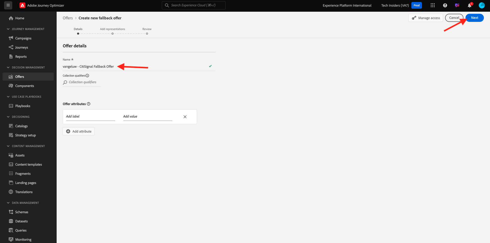
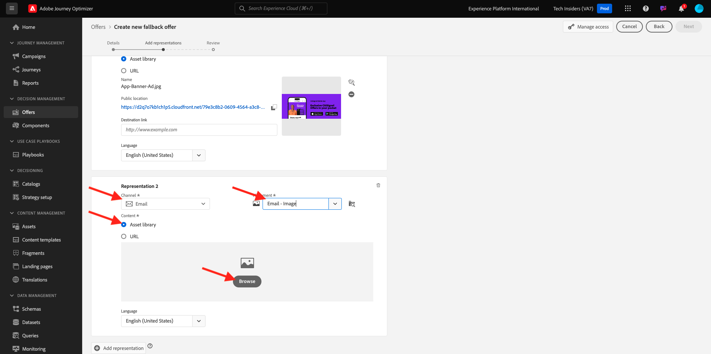
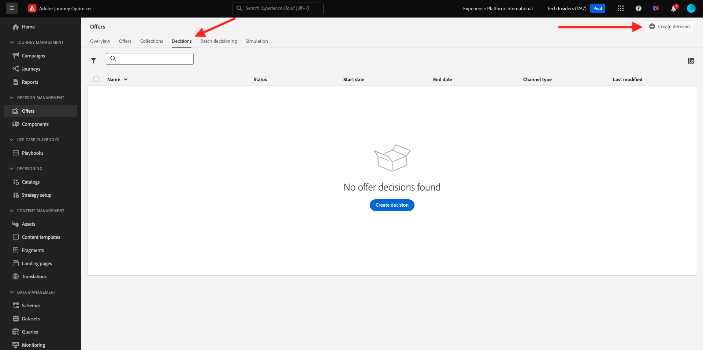

# 3.3.2 Configuration de vos offres et de votre décision

## 3.3.2.1 Création de vos offres personnalisées

Dans cet exercice, vous allez créer quatre **offres personnalisées**. Voici les détails à prendre en compte lors de la création de ces offres :

| Nom | Période | Lien d’image pour le courrier électronique | Lien d’image pour le web | Texte | Priorité | Admissibilité | Langue |
|-----|------------|----------------------|--------------------|------|:--------:|--------------|:-------:|
| `--aepUserLdap-- - Nadia Elements Shell` | aujourd’hui - 1 mois plus tard | https://bit.ly/3nPiwdZ | https://bit.ly/2INwXjt | `{{ profile.person.name.firstName }}, 10% discount on Nadia Elements Shell` | 25 | all - Clients féminins | Anglais (États-Unis) |
| `--aepUserLdap-- - Radiant Tee` | aujourd’hui - 1 mois plus tard | https://bit.ly/2HfA17v | https://bit.ly/3pEIdzn | `{{ profile.person.name.firstName }}, 5% discount on Radiant Tee` | 15 | all - Clients féminins | Anglais (États-Unis) |
| `--aepUserLdap-- - Zeppelin Yoga Pant` | aujourd’hui - 1 mois plus tard | https://bit.ly/2IOaItW | https://bit.ly/2INZHZd | `{{ profile.person.name.firstName }}, 10% discount on Zeppelin Yoga Pant` | 25 | all - Clients masculins | Anglais (États-Unis) |
| `--aepUserLdap-- - Proteus Fitness Jackshirt` | aujourd’hui - 1 mois plus tard | https://bit.ly/330a43n | https://bit.ly/36USaQW | `{{ profile.person.name.firstName }}, 5% discount on Proteus Fitness Jackshirt` | 15 | all - Clients masculins | Anglais (États-Unis) |

{style="table-layout:auto"}

Connectez-vous à Adobe Journey Optimizer en vous rendant à [Adobe Experience Cloud](https://experience.adobe.com?lang=fr). Cliquez sur **Journey Optimizer**.

Vous serez redirigé vers la vue **Home** dans Journey Optimizer. Tout d’abord, assurez-vous d’utiliser l’environnement de test approprié. L’environnement de test à utiliser s’appelle `--aepSandboxName--`. Pour passer d’un environnement de test à un autre, cliquez sur **Production Prod (VA7)** et sélectionnez l’environnement de test dans la liste. Dans cet exemple, l’environnement de test est nommé **AEP Enablement FY22**. Vous serez alors dans la vue **Home** de votre environnement de test `--aepSandboxName--`.

Dans le menu de gauche, cliquez sur **Offres** , puis accédez à **Offres**. Cliquez sur **+ Créer une offre**.

Vous verrez alors cette fenêtre contextuelle. Sélectionnez **Offre personnalisée** et cliquez sur **Suivant**.

Vous êtes maintenant sur la vue **Détails**.

Dans ce cas, vous devez configurer l’offre `--aepUserLdap-- - Nadia Elements Shell`. Renseignez les informations du tableau ci-dessus pour remplir les champs. Dans cet exemple, le nom de l’offre personnalisée est **vangeluw - Nadia Elements Shell**. En outre, définissez la **date et l’heure de début** sur hier, et définissez la **date et l’heure de fin** sur une date dans un mois à partir de maintenant.

Une fois terminé, vous devriez avoir ceci. Cliquez sur **Suivant**.

Vous devez maintenant créer des **représentations**. Les représentations sont une combinaison d’un **emplacement** et d’une ressource réelle.

Pour **Représentation 1**, sélectionnez :

- Canal : Web
- Placement : Web - Image
- Contenu : URL
- Emplacement public : copiez l’URL de la colonne **Lien d’image pour le Web** dans le tableau ci-dessus.

Vous pouvez également sélectionner la **bibliothèque de ressources** pour le contenu, puis cliquer sur **Parcourir**.

Vous verrez ensuite une fenêtre contextuelle de la bibliothèque Assets, accédez au dossier **enablement-assets** et sélectionnez le fichier image **nadia-web.png**. Cliquez ensuite sur **Sélectionner**.

Vous verrez alors :

Cliquez sur **+ Ajouter une représentation**.

Pour **Représentation 2**, sélectionnez :

- Canal : e-mail
- Placement : Email - Image
- Contenu : URL
- Emplacement public : copiez l’URL de la colonne **Lien d’image pour le courrier électronique** dans le tableau ci-dessus.

Vous pouvez également sélectionner la **bibliothèque de ressources** pour le contenu, puis cliquer sur **Parcourir**.

Vous verrez ensuite une fenêtre contextuelle de la bibliothèque Assets, accédez au dossier **enablement-assets** et sélectionnez le fichier image **nadia-email.png**. Cliquez ensuite sur **Sélectionner**.

Vous verrez alors :

Cliquez ensuite sur **+ Ajouter une représentation**.

Pour **Représentation 3**, sélectionnez :

- Canal : Non numérique
- Placement : non numérique - Texte

Vous devez ensuite ajouter du contenu. Dans ce cas, cela signifie ajouter le texte à utiliser comme appel à l’action.

Cliquez sur **Ajouter du contenu**.

Vous verrez alors cette fenêtre contextuelle.

Sélectionnez **Texte personnalisé** et remplissez les champs suivants :

Examinez le champ **Texte** du tableau ci-dessus et saisissez ce texte ici, dans ce cas : `{{ profile.person.name.firstName }}, 10% discount on Nadia Elements Shell`.

Vous remarquerez également que vous pouvez sélectionner n’importe quel attribut de profil et l’inclure comme champ dynamique dans le texte de l’offre. Dans cet exemple, le champ `{{ profile.person.name.firstName }}` s’assure que le prénom du client qui recevra cette offre sera inclus dans le texte de l’offre.

Vous verrez alors ceci. Cliquez sur **Enregistrer**.

Vous avez maintenant ceci. Cliquez sur **Suivant**.

Vous verrez alors :

Sélectionnez **Par règle de décision définie** et cliquez sur l’icône **+** pour ajouter la règle **all - Female Customers**.

Vous verrez alors ceci. Remplissez la **Priorité** comme indiqué dans le tableau ci-dessus. Cliquez sur **Suivant**.

Vous verrez ensuite un aperçu de votre nouvelle **offre personnalisée**.

Enfin, cliquez sur **Enregistrer et approuver**.

Vous verrez ensuite votre nouvelle offre personnalisée devenir disponible dans la Présentation des offres :

Vous devez maintenant répéter les étapes ci-dessus pour créer les trois autres offres personnalisées pour les produits Tee Radiant, Zeppelin Yoga Pant et Proteus Fitness Jackshirt.

Lorsque vous avez terminé, votre écran **Offer Overviews** pour **Offres personnalisées** devrait afficher toutes vos offres.

## 3.3.2.2 Création de votre offre de secours

Après avoir créé quatre offres personnalisées, vous devez maintenant configurer une **offre de secours**.

Vérifiez que vous vous trouvez dans la vue **Offres** :

Cliquez sur **+ Créer une offre**.

Vous verrez alors cette fenêtre contextuelle. Sélectionnez **Offre de secours** et cliquez sur **Suivant**.

Vous verrez alors :

Saisissez ce nom pour votre offre de secours : `--aepUserLdap-- - Luma Fallback Offer`. Cliquez sur **Suivant**.

Vous devez maintenant créer des **représentations**. Les représentations sont une combinaison d’un **emplacement** et d’une ressource réelle.

Pour **Représentation 1**, sélectionnez :

- Canal : Web
- Placement : Web - Image
- Contenu : URL
- Emplacement public : `https://bit.ly/3nBOt9h`

Vous pouvez également sélectionner la **bibliothèque de ressources** pour le contenu, puis cliquer sur **Parcourir**.

Vous verrez ensuite une fenêtre contextuelle de la bibliothèque Assets, accédez au dossier **enablement-assets** et sélectionnez le fichier image **spriteyogastraps-web.png**. Cliquez ensuite sur **Sélectionner**.

Vous verrez alors :

Pour **Représentation 2**, sélectionnez :

- Canal : e-mail
- Placement : Email - Image
- Contenu : URL
- Emplacement public : `https://bit.ly/3nF4qvE`

Vous pouvez également sélectionner la **bibliothèque de ressources** pour le contenu, puis cliquer sur **Parcourir**.

Vous verrez ensuite une fenêtre contextuelle de la bibliothèque Assets, accédez au dossier **enablement-assets** et sélectionnez le fichier image **spriteyogastraps-email.png**. Cliquez ensuite sur **Sélectionner**.

Vous verrez alors :

Cliquez ensuite sur **+ Ajouter une représentation**.

Pour **Représentation 3**, sélectionnez :

- Canal : Non numérique
- Placement : non numérique - Texte

Vous devez ensuite ajouter du contenu. Dans ce cas, cela signifie ajouter le lien de l’image.

Cliquez sur **Ajouter du contenu**.

Vous verrez alors cette fenêtre contextuelle.

Sélectionnez **Texte personnalisé** et remplissez les champs suivants :

Saisissez le texte `{{ profile.person.name.firstName }}, discover our Sprite Yoga Straps!` et cliquez sur **Enregistrer**.

Vous verrez alors ceci. Cliquez sur **Suivant**.

Vous verrez ensuite un aperçu de votre nouvelle **offre de secours**. Cliquez sur **Terminer**.

Enfin, cliquez sur **Enregistrer et approuver**.

Dans l’écran **Offer Overviews** , vous verrez maintenant ceci :

## 3.3.2.3 Création de votre collection

Une collection est utilisée pour **filtrer** un sous-ensemble d’offres de la liste d’offres personnalisée et les utiliser dans le cadre d’une décision afin d’accélérer le processus de décision.

Accédez à **Collections**. Cliquez sur **+ Créer une collection**.

Vous verrez alors cette fenêtre contextuelle. Configurez votre collection comme suit. Cliquez sur **Suivant**.

- Nom de la collection : utilisez `--aepUserLdap-- - Luma Collection`
- Sélectionnez **Créer une collection statique**.

Dans l’écran suivant, sélectionnez les quatre **Offres personnalisées** que vous avez créées dans l’exercice précédent. Cliquez sur **Enregistrer**.

Vous verrez maintenant ceci :

## 3.3.2.4 Créer votre décision

Une décision associe des emplacements, un ensemble d’offres personnalisées et une offre de secours qui, ultimement, seront utilisés par le moteur d’Offer decisioning pour trouver la meilleure offre pour un profil spécifique, en fonction de chacune des caractéristiques d’offre personnalisées individuelles telles que la priorité, la contrainte d’éligibilité et la limitation totale/utilisateur.

Pour configurer votre **décision**, accédez à **Décisions**. Cliquez sur **+ Créer l’activité**.

Vous verrez alors :

Renseignez les champs comme celui-ci. Cliquez sur **Suivant**.

- Nom : `--aepUserLdap-- - Luma Decision`
- Date et heure de début : hier
- Date et heure de fin : aujourd’hui + 1 mois

Dans l’écran suivant, vous devez ajouter des emplacements aux portées de décision. Vous devrez créer des portées de décision pour les emplacements **Web - Image**, **Email - Image** et **Non-digital - Text**.

Tout d’abord, créez la portée de décision pour **Non-digital - Text** en sélectionnant cet emplacement dans la liste déroulante. Cliquez ensuite sur le bouton **Ajouter** pour ajouter des critères d’évaluation.

Sélectionnez votre collection `--aepUserLdap-- - Luma Collection` et cliquez sur **Ajouter**.

Vous verrez alors ceci. Cliquez sur le bouton **-** pour ajouter une nouvelle portée de décision.

Sélectionnez l&#39;emplacement **Web - Image** et ajoutez votre collection `--aepUserLdap-- - Luma Collection` sous les critères d&#39;évaluation. Cliquez ensuite de nouveau sur le bouton **+** pour ajouter une nouvelle portée de décision.

Sélectionnez l’emplacement **Email - Image** et ajoutez votre collection `--aepUserLdap-- - Luma Collection` sous les critères d’évaluation. Cliquez ensuite sur **Suivant**.

Vous devez maintenant sélectionner votre **offre de secours**, qui s’appelle `--aepUserLdap-- - Luma Fallback Offer`. Cliquez sur **Suivant**.

Vérifiez votre décision. Cliquez sur **Terminer**.

Dans la fenêtre contextuelle, cliquez sur **Enregistrer et activer**.

Enfin, vous verrez votre décision dans la présentation :

Vous avez maintenant correctement configuré votre décision. Votre décision est maintenant en ligne et peut être utilisée pour offrir des offres optimisées et personnalisées à vos clients, en temps réel.

Étape suivante : [3.3.3 Préparation de la configuration de la propriété du client de collecte de données et du SDK web pour Offer Decisioning](./ex3.md)

[Revenir au module 3.3](./offer-decisioning.md)

[Revenir à tous les modules](./../../../overview.md)
