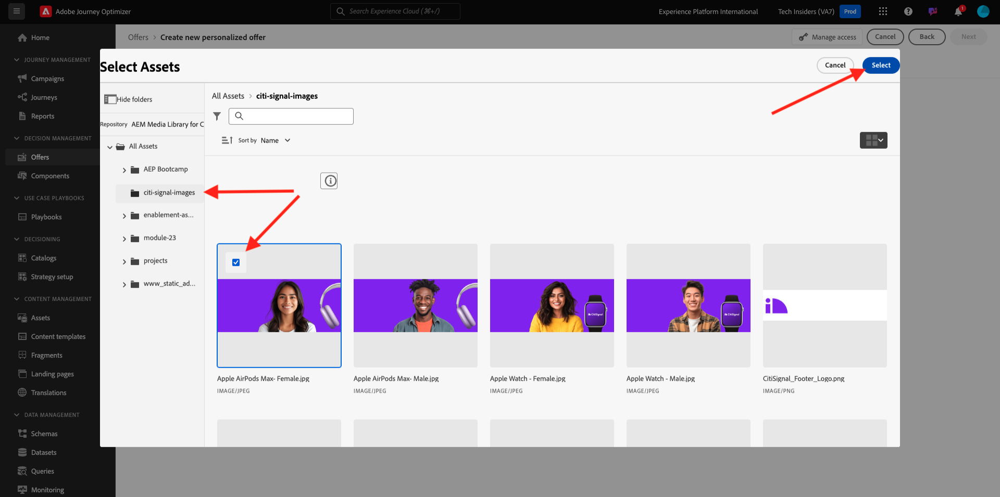
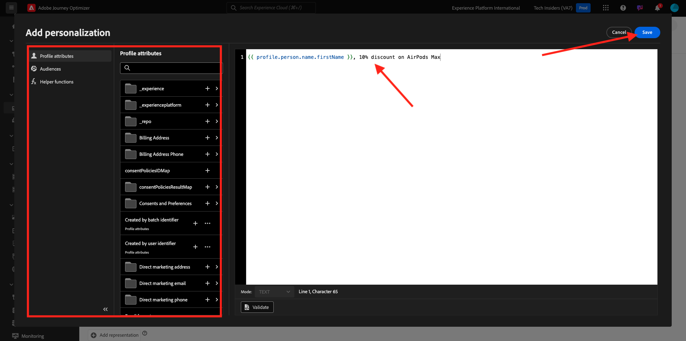
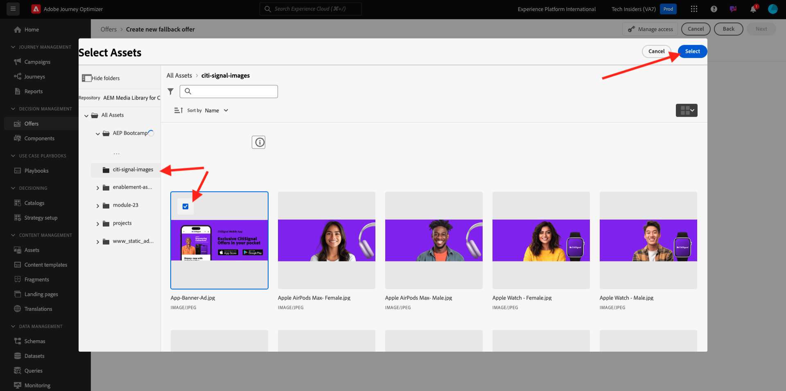
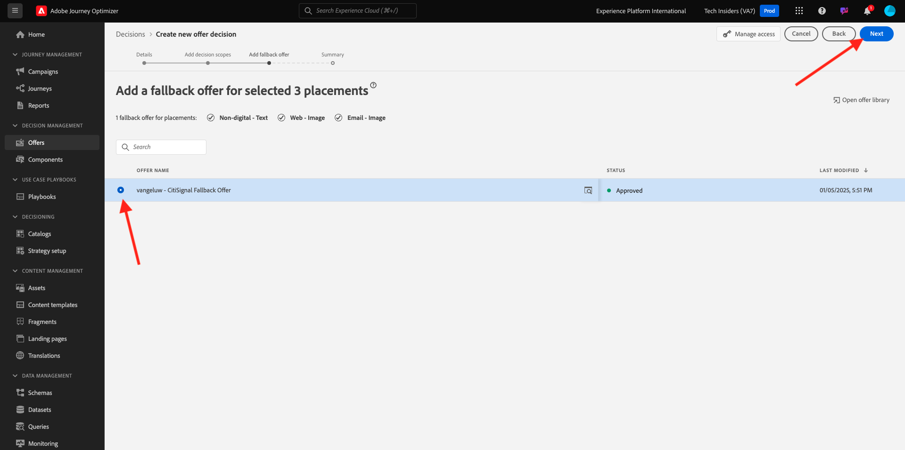

# 3.3.2 Configuration de vos offres et de votre décision

## 3.3.2.1 Créer vos offres personnalisées

Dans cet exercice, vous allez créer quatre **Offres personnalisées**. Voici les détails à prendre en compte lors de la création de ces offres :

| Nom | Période | Lien d’image pour l’e-mail | Lien de l’image pour le Web | Texte | Priorité | Admissibilité | Langue |
|-----|------------|----------------------|--------------------|------|:--------:|--------------|:-------:|
| `--aepUserLdap-- - Nadia Elements Shell` | aujourd’hui - 1 mois plus tard | https://bit.ly/3nPiwdZ | https://bit.ly/2INwXjt | `{{ profile.person.name.firstName }}, 10% discount on Nadia Elements Shell` | 25 | all - Clientes | Anglais (États-Unis) |
| `--aepUserLdap-- - Radiant Tee` | aujourd’hui - 1 mois plus tard | https://bit.ly/2HfA17v | https://bit.ly/3pEIdzn | `{{ profile.person.name.firstName }}, 5% discount on Radiant Tee` | 15 | all - Clientes | Anglais (États-Unis) |
| `--aepUserLdap-- - Zeppelin Yoga Pant` | aujourd’hui - 1 mois plus tard | https://bit.ly/2IOaItW | https://bit.ly/2INZHZd | `{{ profile.person.name.firstName }}, 10% discount on Zeppelin Yoga Pant` | 25 | all - Clients | Anglais (États-Unis) |
| `--aepUserLdap-- - Proteus Fitness Jackshirt` | aujourd’hui - 1 mois plus tard | https://bit.ly/330a43n | https://bit.ly/36USaQW | `{{ profile.person.name.firstName }}, 5% discount on Proteus Fitness Jackshirt` | 15 | all - Clients | Anglais (États-Unis) |

{style="table-layout:auto"}

Connectez-vous à Adobe Journey Optimizer en allant sur [Adobe Experience Cloud](https://experience.adobe.com?lang=fr). Cliquez sur **Journey Optimizer**.

Vous serez redirigé vers la vue **Accueil** dans Journey Optimizer. Tout d’abord, assurez-vous d’utiliser le bon sandbox. Le sandbox à utiliser est appelé `--aepSandboxName--`. Pour passer d’un sandbox à un autre, cliquez sur **PRODUCTION Prod (VA7)** et sélectionnez le sandbox dans la liste. Dans cet exemple, le sandbox est nommé **Activation AEP FY22**. Vous serez alors dans la vue **Accueil** de votre `--aepSandboxName--` sandbox.

Dans le menu de gauche, cliquez sur **Offres** puis accédez à **Offres**. Cliquez sur **+ Créer une offre**.

Vous verrez alors cette fenêtre contextuelle. Sélectionnez **Offre personnalisée** puis cliquez sur **Suivant**.

Vous êtes maintenant dans la vue **Détails**.

Dans ce cas, vous devez configurer le `--aepUserLdap-- - Nadia Elements Shell` de l&#39;offre. Utilisez les informations du tableau ci-dessus pour remplir les champs. Dans cet exemple, le nom de l’offre personnalisée est **vangeluw - Nadia Elements Shell**. En outre, définissez la **Date et heure de début** sur hier, et la **Date et heure de fin** sur une date dans un mois à partir de maintenant.

Une fois cette opération terminée, vous devriez disposer de ceci. Cliquez sur **Suivant**.

Vous devez maintenant créer des **Représentations**. Les représentations sont une combinaison d&#39;un **Emplacement** et d&#39;une ressource réelle.

Pour **Représentation 1**, sélectionnez :

- Canal : Web
- Emplacement : Web - Image
- Contenu : URL
- Emplacement public : copiez l’URL à partir de la colonne **Lien d’image pour le Web** dans le tableau ci-dessus.

Vous pouvez également sélectionner **Bibliothèque de ressources** pour le contenu, puis cliquer sur **Parcourir**.

Une fenêtre contextuelle de la bibliothèque Assets s’affiche alors, accédez au dossier **enablement-assets** et sélectionnez le fichier image **nadia-web.png**. Cliquez ensuite sur **Sélectionner**.

Vous verrez alors ceci :

Cliquez sur **+ Ajouter une représentation**.

Pour **Représentation 2**, sélectionnez :

- Canal : e-mail
- Emplacement : E-mail - Image
- Contenu : URL
- Emplacement public : copiez l’URL à partir de la colonne **Lien d’image pour l’e-mail** dans le tableau ci-dessus.

Vous pouvez également sélectionner **Bibliothèque de ressources** pour le contenu, puis cliquer sur **Parcourir**.

Une fenêtre contextuelle de la bibliothèque Assets s’affiche alors, accédez au dossier **enablement-assets** et sélectionnez le fichier image **nadia-email.png**. Cliquez ensuite sur **Sélectionner**.

Vous verrez alors ceci :

Cliquez ensuite sur **+ Ajouter une représentation**.

Pour **Représentation 3**, sélectionnez :

- Canal : non numérique
- Emplacement : Non numérique - Texte

Vous devez ensuite ajouter du contenu. Dans ce cas, il s’agit d’ajouter le texte à utiliser comme appel à l’action.

Cliquez sur **Ajouter du contenu**.

Vous verrez alors cette fenêtre contextuelle.

Sélectionnez **Texte personnalisé** et renseignez les champs suivants :

Examinez le champ **Texte** du tableau ci-dessus et saisissez ce texte ici, dans ce cas : `{{ profile.person.name.firstName }}, 10% discount on Nadia Elements Shell`.

Vous remarquerez également que vous pouvez sélectionner n’importe quel attribut de profil et l’inclure en tant que champ dynamique dans le texte de l’offre. Dans cet exemple, le champ `{{ profile.person.name.firstName }}` garantit que le prénom du client qui recevra cette offre sera inclus dans le texte de l&#39;offre.

Tu verras ça. Cliquez sur **Enregistrer**.

Vous l&#39;avez maintenant. Cliquez sur **Suivant**.

Vous verrez alors ceci :

Sélectionnez **Par règle de décision définie** et cliquez sur l’icône **+** pour ajouter la règle **Tous - Clientes**.

Tu verras ça. Remplissez le champ **Priorité** comme indiqué dans le tableau ci-dessus. Cliquez sur **Suivant**.

Vous verrez ensuite un aperçu de votre nouvelle **Offre personnalisée**.

Enfin, cliquez sur **Enregistrer et approuver**.

Votre offre personnalisée nouvellement créée est alors disponible dans la Présentation des offres :

Vous devez maintenant répéter les étapes ci-dessus pour créer les trois autres offres personnalisées pour les produits T-shirt Radiant, Pantalon de yoga Zeppelin et Veste de fitness Proteus.

Une fois cette opération terminée, votre écran **Vues d’ensemble des offres** pour **Offres personnalisées** doit afficher toutes vos offres.

## 3.3.2.2 Créer votre offre de secours

Après avoir créé quatre offres personnalisées, vous devez maintenant configurer une **offre de secours**.

Assurez-vous que vous êtes dans la vue **Offres** :

Cliquez sur **+ Créer une offre**.

Vous verrez alors cette fenêtre contextuelle. Sélectionnez **Offre de secours** puis cliquez sur **Suivant**.

Vous verrez alors ceci :

Saisissez le nom suivant pour votre offre de secours : `--aepUserLdap-- - Luma Fallback Offer`. Cliquez sur **Suivant**.

Vous devez maintenant créer des **Représentations**. Les représentations sont une combinaison d&#39;un **Emplacement** et d&#39;une ressource réelle.

Pour **Représentation 1**, sélectionnez :

- Canal : Web
- Emplacement : Web - Image
- Contenu : URL
- Emplacement public : `https://bit.ly/3nBOt9h`

Vous pouvez également sélectionner **Bibliothèque de ressources** pour le contenu, puis cliquer sur **Parcourir**.

Une fenêtre contextuelle de la bibliothèque Assets s’affiche alors, accédez au dossier **enablement-assets** et sélectionnez le fichier image **spriteyogastraps-web.png**. Cliquez ensuite sur **Sélectionner**.

Vous verrez alors ceci :

Pour **Représentation 2**, sélectionnez :

- Canal : e-mail
- Emplacement : E-mail - Image
- Contenu : URL
- Emplacement public : `https://bit.ly/3nF4qvE`

Vous pouvez également sélectionner **Bibliothèque de ressources** pour le contenu, puis cliquer sur **Parcourir**.

Une fenêtre contextuelle de la bibliothèque Assets s’affiche alors, accédez au dossier **enablement-assets** et sélectionnez le fichier image **spriteyogastraps-email.png**. Cliquez ensuite sur **Sélectionner**.

Vous verrez alors ceci :

Cliquez ensuite sur **+ Ajouter une représentation**.

Pour **Représentation 3**, sélectionnez :

- Canal : non numérique
- Emplacement : Non numérique - Texte

Vous devez ensuite ajouter du contenu. Dans ce cas, il s’agit d’ajouter le lien d’image.

Cliquez sur **Ajouter du contenu**.

Vous verrez alors cette fenêtre contextuelle.

Sélectionnez **Texte personnalisé** et renseignez les champs suivants :

Saisissez le `{{ profile.person.name.firstName }}, discover our Sprite Yoga Straps!` de texte et cliquez sur **Enregistrer**.

Tu verras ça. Cliquez sur **Suivant**.

Vous verrez ensuite un aperçu de votre nouvelle **offre de secours**. Cliquez sur **Terminer**.

Enfin, cliquez sur **Enregistrer et approuver**.

Dans l’écran **Présentation des offres**, vous verrez ceci :

## 3.3.2.3 Créer votre collection

Une collection est utilisée pour **filtrer** un sous-ensemble d’offres de la liste d’offres personnalisée et l’utiliser dans le cadre d’une décision afin d’accélérer le processus de décision.

Accédez à **Collections**. Cliquez sur **+ Créer une collection**.

Vous verrez alors cette fenêtre contextuelle. Configurez votre collection comme suit : Cliquez sur **Suivant**.

- Nom de la collection : utiliser `--aepUserLdap-- - Luma Collection`
- Sélectionnez **Créer une collection statique**.

Dans l’écran suivant, sélectionnez les quatre **Offres personnalisées** vous avez créées dans l’exercice précédent. Cliquez sur **Enregistrer**.

Vous verrez maintenant ceci :

## 3.3.2.4 Créer votre décision

Une décision associe des emplacements, une collection d’offres personnalisées et une offre de secours afin que le moteur d’Offer decisioning puisse finalement l’utiliser pour trouver la meilleure offre pour un profil spécifique, en fonction de chacune des caractéristiques d’offre personnalisées individuelles telles que la priorité, la contrainte d’éligibilité et la limitation totale/utilisateur.

Pour configurer votre **Décision**, accédez à **Décisions**. Cliquez sur **+ Créer une activité**.

Vous verrez alors ceci :

Remplissez les champs comme ceci. Cliquez sur **Suivant**.

- Nom : `--aepUserLdap-- - Luma Decision`
- Date et heure de début : hier
- Date et heure de fin : aujourd’hui + 1 mois

Dans l&#39;écran suivant, vous devez ajouter des emplacements dans les portées de décision. Vous devez créer des portées de décision pour les emplacements **Web - Image**, **E-mail - Image** et **Non numérique - Texte**.

Créez tout d’abord la portée de décision pour **Non numérique - Texte** en sélectionnant cet emplacement dans la liste déroulante. Cliquez ensuite sur le bouton **Ajouter** pour ajouter des critères d’évaluation.

Sélectionnez votre `--aepUserLdap-- - Luma Collection` de collection et cliquez sur **Ajouter**.

Tu verras ça. Cliquez sur le bouton **-** pour ajouter une nouvelle portée de décision.

Sélectionnez l’emplacement **Web - Image** et ajoutez votre `--aepUserLdap-- - Luma Collection` de collection sous critères d’évaluation. Cliquez ensuite à nouveau sur le bouton **+** pour ajouter une nouvelle portée de décision.

Sélectionnez l’emplacement **E-mail - Image** et ajoutez vos `--aepUserLdap-- - Luma Collection` de collection sous critères d’évaluation. Cliquez ensuite sur **Suivant**.

Vous devez maintenant sélectionner votre **Offre de secours**, qui porte le nom `--aepUserLdap-- - Luma Fallback Offer`. Cliquez sur **Suivant**.

Passez en revue votre décision. Cliquez sur **Terminer**.

Dans la fenêtre contextuelle, cliquez sur **Enregistrer et activer**.

Enfin, votre décision s’affiche désormais dans la vue d’ensemble :

Vous avez maintenant correctement configuré votre décision. Votre décision est maintenant en ligne et peut être utilisée pour diffuser des offres optimisées et personnalisées à vos clients et clientes, en temps réel.

Étape suivante : [3.3.3 Préparez la propriété du client de collecte de données et la configuration de Web SDK pour l’Offer decisioning ](./ex3.md)

[Retour au module 3.3](./offer-decisioning.md)

[Revenir à tous les modules](./../../../overview.md)
