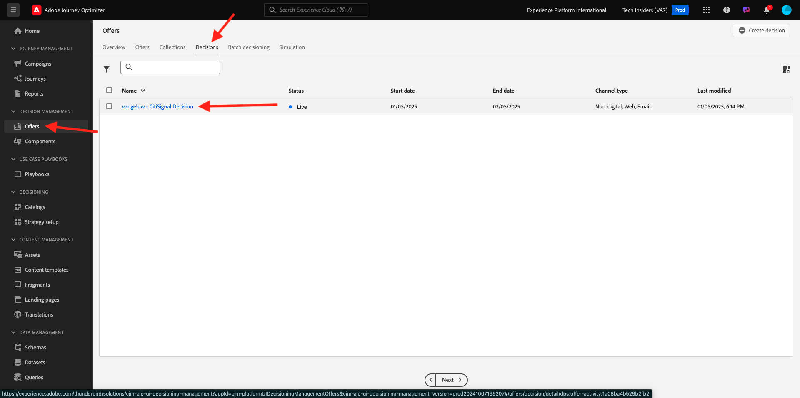
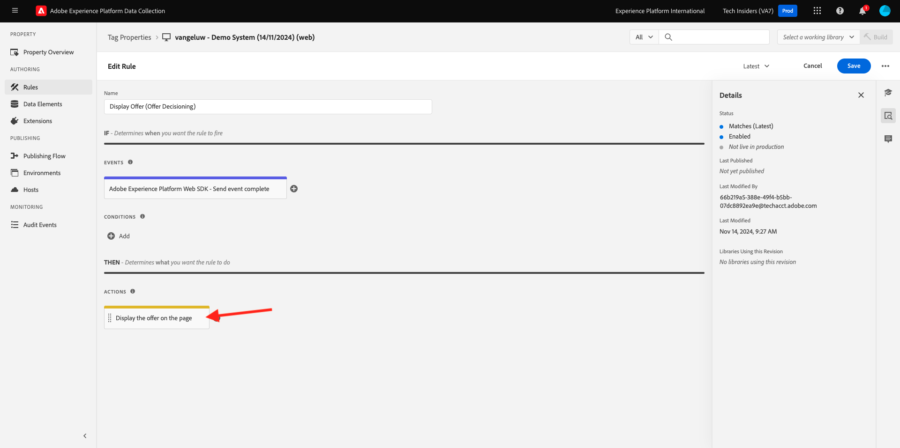

# 3.3.3 Préparez la propriété du client de collecte de données Adobe Experience Platform et la configuration de Web SDK pour l’Offer decisioning

## 3.3.3.1 Mettre à jour votre flux de données

Dans [Prise en main](./../../../modules/gettingstarted/gettingstarted/ex2.md), vous avez créé votre propre **flux de données**. Vous avez ensuite utilisé le nom `--aepUserLdap-- - Demo System Datastream`.

Dans cet exercice, vous devez configurer ce **flux de données** pour qu’il fonctionne avec l’Offer decisioning **&#x200B;**.

Pour ce faire, accédez à [https://experience.adobe.com/#/data-collection/](https://experience.adobe.com/#/data-collection/). Tu verras ça. Cliquez sur **Flux de données**.

Dans le coin supérieur droit de l’écran, sélectionnez le nom du sandbox, qui doit être `--aepSandboxName--`.


Recherchez votre **Flux de données**, qui est nommé `--aepUserLdap-- - Demo System Datastream`. Cliquez sur votre **flux de données** pour l’ouvrir.


Tu verras ça. Cliquez sur **...** en regard de **Adobe Experience Platform** puis sur **Modifier**.


Pour activer l&#39;Offer decisioning **&#x200B;**, cochez la case correspondant à l&#39;Offer decisioning **&#x200B;**. Cliquez sur **Enregistrer**.


Votre **flux de données** est maintenant prêt à fonctionner avec **Offer decisioning**.


## 3.3.3.2 Configurer la propriété Client de la collecte de données Adobe Experience Platform pour demander des offres personnalisées

Accédez à [https://experience.adobe.com/#/data-collection/](https://experience.adobe.com/#/data-collection/), à **Balises**. Recherchez vos propriétés de collecte de données, qui sont nommées `--aepUserLdap-- - Demo System (DD/MM/YYYY)`. Ouvrez la propriété cliente de collecte de données pour le Web.


Dans votre propriété, accédez à **Règles** et ouvrez la règle **Page vue**.


Cliquez pour ouvrir l’action **Envoyer un événement d’expérience « Page vue »**.


Tu verras ça. Sous **Personalization**, vous remarquerez l&#39;option pour **Portées**.


Pour chaque requête envoyée à Edge et à Adobe Experience Platform, il est possible de fournir une ou plusieurs **portées de décision**. Une **portée de décision** est une combinaison de deux éléments :

- ID de décision
- Identifiant d’emplacement

Voyons d&#39;abord où vous pouvez trouver ces deux éléments.

### 3.3.3.2.1 Récupération de l’identifiant d’emplacement

L’identifiant d’emplacement identifie l’emplacement et le type de ressource requis. Par exemple, l&#39;image principale sur la page d&#39;accueil du site CitiSignal correspond à l&#39;identifiant d&#39;emplacement Web - Image.

>[!NOTE]
>
>Dans le cadre de l’exercice 2.3.5, vous avez déjà configuré une activité de ciblage d’expérience Adobe Target qui modifiera l’image de l’emplacement principal sur la page d’accueil, comme vous pouvez le voir dans la capture d’écran. Pour cet exercice, vous allez maintenant faire apparaître vos offres sur l’image sous l’image principale, comme indiqué dans la capture d’écran.


Pour trouver l&#39;ID d&#39;emplacement pour Web - Image, accédez à Adobe Journey Optimizer en accédant à [Adobe Experience Cloud](https://experience.adobe.com?lang=fr). Cliquez sur **Journey Optimizer**.


Vous serez redirigé vers la vue **Accueil** dans Journey Optimizer. Tout d’abord, assurez-vous d’utiliser le bon sandbox. Le sandbox à utiliser est appelé `--aepSandboxName--`. Vous serez alors dans la vue **Accueil** de votre `--aepSandboxName--` sandbox.


Accédez ensuite à Composants , puis à Emplacements . Cliquez sur l&#39;emplacement **Web - Image** pour en afficher les détails.


Comme vous pouvez le voir dans l’image ci-dessus, dans cet exemple, l’identifiant d’emplacement est `dps:offer-placement:1a08a14ccfe533b6`. Notez l’ID d’emplacement de votre emplacement pour Web - Image, car vous en aurez besoin dans l’exercice suivant.

### 3.3.3.2.2 Récupérer l’identifiant de votre décision d’offre

L’**ID de décision d’offre** identifie la combinaison d’offres personnalisées et d’offres de secours que vous souhaitez utiliser. Dans l’exercice précédent, vous avez créé votre propre décision et l’avez nommée `--aepUserLdap-- - CitiSignal Decision`.

Pour trouver l’identifiant de décision d’offre pour votre `--aepUserLdap-- - CitiSignal Decision`, accédez à Offres , puis à Décisions . Cliquez pour sélectionner votre décision, qui est nommée `--aepUserLdap-- - CitiSignal Decision`.


Comme vous pouvez le voir dans l’image ci-dessus, dans cet exemple, l’ID de décision est `dps:offer-activity:1a08ba4b529b2fb2`. Notez l’identifiant de décision d’offre pour votre `--aepUserLdap-- - CitiSignal Decision` de décision, car vous en aurez besoin dans l’exercice suivant.

Maintenant que vous avez récupéré les deux éléments dont vous avez besoin pour créer une **Portées de décision**, vous pouvez passer à l’étape suivante, qui consiste à coder la portée de décision.

### Encodage BASE64 3.3.3.2.3

La **Portée de décision** que vous devez saisir est une chaîne codée en BASE64. Cette chaîne codée en BASE64 est une combinaison de l’identifiant d’emplacement et de l’identifiant de décision comme vous pouvez le voir ci-dessous :

```json
{
  "xdm:activityId": "dps:offer-activity:1a08ba4b529b2fb2",
  "xdm:placementId": "dps:offer-placement:1a08a14ccfe533b6"
}
```

Vous pouvez récupérer la chaîne codée en BASE64 à partir de Adobe Experience Platform. Accédez à Décisions et cliquez pour ouvrir votre décision, qui est nommée `--aepUserLdap-- - CitiSignal Decision`.



Après l&#39;ouverture de `--aepUserLdap-- - CitiSignal Decision`, vous verrez ceci. Recherchez l&#39;emplacement Web - Image et cliquez sur le bouton **Copier**. Cliquez ensuite sur **Portée de décision codée**. La **Portée de décision** est maintenant copiée dans votre presse-papiers.


Ensuite, revenez à Launch, à votre action **AEP Web SDK - Envoyer l’événement**.


Collez la portée de décision codée dans le champ de saisie. Enregistrez vos modifications dans l’action **AEP Web SDK - Envoyer l’événement** en cliquant sur **[!UICONTROL Conserver les modifications]**.


Cliquez ensuite sur **[!UICONTROL Enregistrer]**.


Dans la collecte de données Adobe Experience Platform, accédez à **[!UICONTROL Flux de publication]** et ouvrez votre **[!UICONTROL Bibliothèque de développement]** qui est nommée **[!UICONTROL Principal]**. Cliquez sur **[!UICONTROL + Ajouter toutes les ressources modifiées]** puis sur **[!UICONTROL Enregistrer et créer pour développement]**. Vos modifications seront désormais publiées sur votre site web de démonstration.


Désormais, chaque fois que vous chargez une **Page générale** comme par exemple la page d’accueil du site web de démonstration, Offer Decisioning évalue l’offre applicable et renvoie une réponse au site web avec les détails de l’offre à afficher. L&#39;affichage de l&#39;offre sur le site web nécessite une configuration supplémentaire, que vous effectuerez à l&#39;étape suivante.

## 3.3.3.3 Configurer la propriété du client de la collecte de données Adobe Experience Platform pour recevoir et appliquer des offres personnalisées

Accédez à [https://experience.adobe.com/#/data-collection/](https://experience.adobe.com/#/data-collection/), à **[!UICONTROL Propriétés]**. Recherchez vos propriétés de collecte de données, qui sont nommées `--aepUserLdap-- - Demo System (DD/MM/YYYY)`. Ouvrez la propriété Collecte de données pour le Web.


Dans votre propriété, accédez à **Règles**. Recherchez et ouvrez la règle **Afficher l’offre (Offer decisioning)**.


Tu verras ça. Ouvrez l&#39;action **Afficher l&#39;offre sur la page**.



Cliquez sur **[!UICONTROL Ouvrir l’éditeur]**


Remplacez le code en collant le code ci-dessous dans l’éditeur.

```javascript
if (!Array.isArray(event.decisions)) {
  console.log("No personalization decisions");
  return;
}

console.log("Received response from Offer Decisioning", event.decisions);

event.decisions.forEach(function (payload) {
  payload.items.forEach(function (item) {
    console.log("Offer", item.data.deliveryURL);

    if (!item.data || item.data?.deliveryURL==null) {
      return;
    }
    console.log("item.data.deliveryURL", item.data.deliveryURL)
    //document.querySelector(".TopRibbon").innerHTML = item.data.content;
    document.querySelector("#SpectrumProvider > div.App > div > div.Page.home > main > div:nth-child(2)").innerHTML = "";
    document.querySelector("#SpectrumProvider > div.App > div > div.Page.home > main > div:nth-child(2) > img").style.backgroundRepeat="no-repeat";
    document.querySelector("#SpectrumProvider > div.App > div > div.Page.home > main > div:nth-child(2) > img").style.backgroundPosition="center center";
    document.querySelector("#SpectrumProvider > div.App > div > div.Page.home > main > div:nth-child(2) > img").style.backgroundSize = "contain";
  });
});
```

La ligne 17 s’applique à l’image renvoyée par Offer decisioning au site web. Cliquez sur **[!UICONTROL Enregistrer]**.


Cliquez sur **[!UICONTROL Conserver les modifications]**.


Cliquez ensuite sur **[!UICONTROL Enregistrer]**.


Dans la collecte de données Adobe Experience Platform, accédez à **[!UICONTROL Flux de publication]** et ouvrez votre **[!UICONTROL Bibliothèque de développement]** qui est nommée **[!UICONTROL Principal]**. Cliquez sur **[!UICONTROL + Ajouter toutes les ressources modifiées]** puis sur **[!UICONTROL Enregistrer et créer pour développement]**. Vos modifications seront désormais publiées sur votre site web de démonstration.


Grâce à cette modification, cette règle de la collecte de données Adobe Experience Platform écoute désormais la réponse de l’Offer decisioning qui fait partie de la réponse de Web SDK. Lorsque la réponse est reçue, l’image de l’offre s’affiche sur la page d’accueil.

En regardant le site web de démonstration, vous verrez que cette image sera remplacée maintenant. Au lieu des images par défaut du site CitiSignal, vous verrez maintenant une offre comme celle-ci. Dans ce cas, l&#39;offre de secours s&#39;affiche.


Vous avez maintenant configuré 2 types de personnalisation :

- 1 activité Ciblage d’expérience à l’aide d’Adobe Target dans l’exercice 2.3.5
- 1 Offer decisioning d’implémentation à l’aide de votre propriété Data Collection

Dans l’exercice suivant, vous allez découvrir comment combiner vos offres et décisions créées dans Adobe Journey Optimizer avec une activité de ciblage d’expérience Adobe Target.

Étape suivante : [3.3.4 Combiner Adobe Target et Offer decisioning ](./ex4.md)

[Retour au module 3.3](./offer-decisioning.md)

[Revenir à tous les modules](./../../../overview.md)
