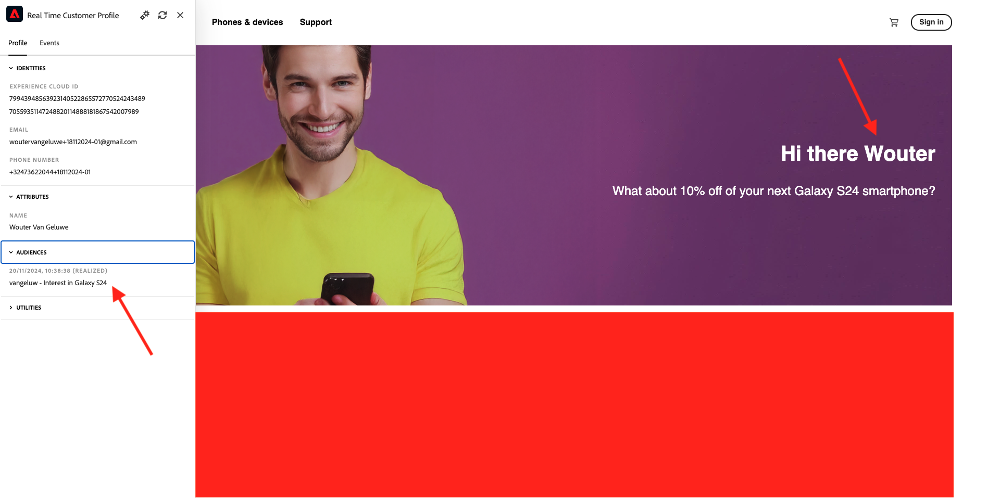

# 3.3.3 Préparez la propriété du client de collecte de données Adobe Experience Platform et la configuration de Web SDK pour l’Offer decisioning

## 3.3.3.1 Mettre à jour votre flux de données

Dans [Exercice 0.2](./../../../modules/gettingstarted/gettingstarted/ex2.md), vous avez créé votre propre **[!UICONTROL flux de données]**. Vous avez ensuite utilisé le nom `--aepUserLdap-- - Demo System Datastream`.

Dans cet exercice, vous devez configurer ce **[!UICONTROL flux de données]** pour l’utiliser avec **[!DNL Offer Decisioning]**.

Pour ce faire, accédez à [https://experience.adobe.com/#/data-collection/](https://experience.adobe.com/#/data-collection/). Tu verras ça. Cliquez sur **[!UICONTROL Flux de données]** ou **[!UICONTROL Flux de données (Beta)]**.

Dans le coin supérieur droit de l’écran, sélectionnez le nom du sandbox, qui doit être `--aepSandboxName--`.


Recherchez votre **[!UICONTROL Flux de données]**, qui est nommé `--aepUserLdap-- - Demo System Datastream`. Cliquez sur votre **[!UICONTROL flux de données]** pour l’ouvrir.


Tu verras ça. Cliquez sur **...** en regard de **Adobe Experience Platform** puis sur **Modifier**.


Pour **[!DNL Offer Decisioning]** activer, cochez la case correspondant à **[!DNL Offer Decisioning]**. Cliquez sur **Enregistrer**.


Votre **[!UICONTROL flux de données]** est maintenant prêt à fonctionner avec **[!DNL Offer Decisioning]**.


## 3.3.3.2 Configurer la propriété Client de la collecte de données Adobe Experience Platform pour demander des offres personnalisées

Accédez à [https://experience.adobe.com/#/data-collection/](https://experience.adobe.com/#/data-collection/), à **[!UICONTROL Client]**. Recherchez vos propriétés de collecte de données, qui sont nommées `--aepUserLdap-- - Demo System (DD/MM/YYYY)`. Ouvrez la propriété cliente de collecte de données pour le Web.


Dans votre propriété, accédez à **[!UICONTROL Règles]** et ouvrez la règle **[!UICONTROL Page vue]**.


Cliquez pour ouvrir le [!UICONTROL Action] **[!UICONTROL SDK Web AEP - Envoyer l’événement]**.


Tu verras ça. Vous remarquerez l’option de menu pour **[!UICONTROL Portées de décision]**.


Pour chaque requête envoyée à Edge et à Adobe Experience Platform, il est possible de fournir une ou plusieurs **[!UICONTROL portées de décision]**. Une **[!UICONTROL portée de décision]** est une combinaison de deux éléments :

- [!UICONTROL ID de décision]
- [!UICONTROL ID d’emplacement]

Voyons d&#39;abord où vous pouvez trouver ces deux éléments.

### 3.3.3.2.1 Récupérer votre [!UICONTROL identifiant d’emplacement]

L’[!UICONTROL ID d’emplacement] identifie l’emplacement et le type de ressource requis. Par exemple, l’image principale sur la page d’accueil du site web Luma correspond à l’[!UICONTROL ID d’emplacement] pour [!UICONTROL Web - Image].

>[!NOTE]
>
>Dans le cadre du module 6, vous avez déjà configuré une activité de ciblage d’expérience Adobe Target qui modifiera l’image de l’emplacement principal sur la page d’accueil, comme vous pouvez le voir dans la capture d’écran. Pour les besoins de l’exercice, vous allez maintenant faire apparaître vos offres sur l’image sous l’image principale, comme indiqué dans la capture d’écran.



Pour rechercher l’[!UICONTROL ID d’emplacement] pour [!UICONTROL Web - Image] accédez à Adobe Journey Optimizer en accédant à [Adobe Experience Cloud](https://experience.adobe.com?lang=fr). Cliquez sur **Journey Optimizer**.


Vous serez redirigé vers la vue **Accueil** dans Journey Optimizer. Tout d’abord, assurez-vous d’utiliser le bon sandbox. Le sandbox à utiliser est appelé `--aepSandboxName--`. Vous serez alors dans la vue **Accueil** de votre `--aepSandboxName--` sandbox.


Accédez ensuite à [!UICONTROL Composants] puis à [!UICONTROL Emplacements]. Cliquez sur l&#39;emplacement [!UICONTROL Web - Image] pour en afficher les détails.


Comme vous pouvez le voir dans l’image ci-dessus, dans cet exemple, l’[!UICONTROL identifiant d’emplacement] est `xcore:offer-placement:14bf09dc4190ebba`. Notez l’[!UICONTROL ID d’emplacement] de votre emplacement pour [!UICONTROL Web - Image], car vous en aurez besoin dans l’exercice suivant.

### 3.3.3.2.2 Récupérer votre [!UICONTROL ID de décision]

L’[!UICONTROL ID de décision] identifie la combinaison d’offres personnalisées et d’offres de secours que vous souhaitez utiliser. Dans l’exercice précédent, vous avez créé votre propre [!UICONTROL Décision] et l’avez nommée `--aepUserLdap-- - Luma Decision`.

Pour trouver l’[!UICONTROL ID de décision] pour votre `--aepUserLdap-- - Luma Decision`, accédez à [https://platform.adobe.com](https://platform.adobe.com).

Ensuite, accédez à [!UICONTROL Offres] puis à [!UICONTROL Décisions]. Cliquez pour sélectionner votre [!UICONTROL Décision], qui porte le nom `--aepUserLdap-- - Luma Decision`.


Comme vous pouvez le voir dans l’image ci-dessus, dans cet exemple, l’[!UICONTROL ID de décision] est `xcore:offer-activity:14c052382e1b6505`. Notez l’[!UICONTROL ID de décision] de votre `--aepUserLdap-- - Luma Decision` de décision, car vous en aurez besoin lors de l’exercice suivant.

Maintenant que vous avez récupéré les deux éléments dont vous avez besoin pour créer une **[!UICONTROL Portées de décision]**, vous pouvez passer à l’étape suivante, qui consiste à coder la portée de décision.

### Encodage BASE64 3.3.3.2.3

La **[!UICONTROL Portée de décision]** que vous devez saisir est une chaîne codée en BASE64. Cette chaîne codée en BASE64 est une combinaison de l’[!UICONTROL identifiant d’emplacement] et de l’[!UICONTROL identifiant de décision], comme vous pouvez le voir ci-dessous.

```json
{
  "activityId":"xcore:offer-activity:14c052382e1b6505",
  "placementId":"xcore:offer-placement:14bf09dc4190ebba"
}
```

La **[!UICONTROL portée de décision]** peut être générée de deux manières :

- Utilisez un service public tel que [https://www.base64encode.org/](https://www.base64encode.org/). Saisissez le code JSON comme mentionné ci-dessus, cliquez sur **[!UICONTROL Coder]** et vous obtiendrez votre chaîne codée en BASE64 ci-dessous.

  

- Récupérez la chaîne codée en BASE64 à partir de Adobe Experience Platform. Accédez à [!UICONTROL Décisions] et cliquez pour ouvrir votre [!UICONTROL Décision], qui est nommée `--aepUserLdap-- - Luma Decision`.

  

  Après l&#39;ouverture de `--aepUserLdap-- - Luma Decision`, vous verrez ceci. Localisez l&#39;emplacement [!UICONTROL Web - Image] et cliquez sur le bouton **[!UICONTROL Copier]**. Cliquez ensuite sur **[!UICONTROL Portée de décision codée]**. La **[!UICONTROL Portée de décision]** est maintenant copiée dans votre presse-papiers.

  

Ensuite, revenez à Launch, à votre action **[!UICONTROL AEP Web SDK - Envoyer l’événement]**.


Collez la portée de décision codée dans le champ de saisie.


Enregistrez vos modifications dans l’action **[!UICONTROL AEP Web SDK - Envoyer l’événement]** en cliquant sur **[!UICONTROL Conserver les modifications]**.


Cliquez ensuite sur **[!UICONTROL Enregistrer]** ou **[!UICONTROL Enregistrer dans la bibliothèque]**


Dans la collecte de données Adobe Experience Platform, accédez à **[!UICONTROL Flux de publication]** et ouvrez votre **[!UICONTROL Bibliothèque de développement]** qui est nommée **[!UICONTROL Principal]**. Cliquez sur **[!UICONTROL + Ajouter toutes les ressources modifiées]** puis sur **[!UICONTROL Enregistrer et créer pour développement]**. Vos modifications seront désormais publiées sur votre site web de démonstration.


Désormais, chaque fois que vous chargez une **Page générale** comme par exemple la page d’accueil du site web de démonstration, Offer Decisioning évalue l’offre applicable et renvoie une réponse au site web avec les détails de l’offre à afficher. L&#39;affichage de l&#39;offre sur le site web nécessite une configuration supplémentaire, que vous effectuerez à l&#39;étape suivante.

## 3.3.3.3 Configurer la propriété du client de la collecte de données Adobe Experience Platform pour recevoir et appliquer des offres personnalisées

Accédez à [https://experience.adobe.com/#/data-collection/](https://experience.adobe.com/#/data-collection/), à **[!UICONTROL Propriétés]**. Recherchez vos propriétés de collecte de données, qui sont nommées `--aepUserLdap-- - Demo System (DD/MM/YYYY)`. Ouvrez la propriété Collecte de données pour le Web.


Dans votre propriété, accédez à **[!UICONTROL Règles]**.


Recherchez et ouvrez la règle **Décision reçue**.


Tu verras ça. Ouvrez l’action **Placez l’offre sur la page**.


Cliquez sur **[!UICONTROL Ouvrir l’éditeur]**


Remplacez le code en collant le code ci-dessous dans l’éditeur.

```javascript
if(!Array.isArray(event.decisions)) {
  console.log('No decisions returned')
  return;
}
console.log("decision",event.decisions)

event.decisions.forEach(function(payload) {
  payload.items.forEach(function(item){
    console.log("Response from Offer Decisioning ", item.data.content);
   
    var element = document.querySelector("#root > div > div > div.app-content > div > section.feature_part.padding_top > div > div.row.align-items-center.justify-content-between > div.col-lg-7.col-sm-6.\\30  > div");
    if(!element){
      console.log("Offer Placement Area Selector not found")
      return;
    }
    if(!item.data){
      return
    }
    //check if offer already exists
    var offer = document.querySelector("#root > div > div > div.app-content > div > section.feature_part.padding_top > div > div.row.align-items-center.justify-content-between > div.col-lg-7.col-sm-6.\\30  > div");
    if(!offer){ 
      element.insertAdjacentHTML('afterbegin', item.data.content) 
    }
    else { 
      console.log("item.data.deliveryURL: " + item.data.deliveryURL)
      document.querySelector("#root > div > div > div.app-content > div > section.feature_part.padding_top > div > div.row.align-items-center.justify-content-between > div.col-lg-7.col-sm-6.\\30  > div").style.background="url('"+item.data.deliveryURL+"')";
      document.querySelector("#root > div > div > div.app-content > div > section.feature_part.padding_top > div > div.row.align-items-center.justify-content-between > div.col-lg-7.col-sm-6.\\30  > div").style.backgroundRepeat="no-repeat";
      document.querySelector("#root > div > div > div.app-content > div > section.feature_part.padding_top > div > div.row.align-items-center.justify-content-between > div.col-lg-7.col-sm-6.\\30  > div").style.backgroundPosition="center center";
      document.querySelector("#root > div > div > div.app-content > div > section.feature_part.padding_top > div > div.row.align-items-center.justify-content-between > div.col-lg-7.col-sm-6.\\30  > div").style.backgroundSize = "contain";
    }  
  })
});
```

Les lignes 26-27-28-29 s’appliquent à l’image renvoyée par Offer decisioning au site web. Cliquez sur **[!UICONTROL Enregistrer]**.


Cliquez sur **[!UICONTROL Conserver les modifications]**.


Cliquez ensuite sur **[!UICONTROL Enregistrer]** ou **[!UICONTROL Enregistrer dans la bibliothèque]**


Dans la collecte de données Adobe Experience Platform, accédez à **[!UICONTROL Flux de publication]** et ouvrez votre **[!UICONTROL Bibliothèque de développement]** qui est nommée **[!UICONTROL Principal]**. Cliquez sur **[!UICONTROL + Ajouter toutes les ressources modifiées]** puis sur **[!UICONTROL Enregistrer et créer pour développement]**. Vos modifications seront désormais publiées sur votre site web de démonstration.


Grâce à cette modification, cette règle de la collecte de données Adobe Experience Platform écoute désormais la réponse de l’Offer decisioning qui fait partie de la réponse de Web SDK. Lorsque la réponse est reçue, l’image de l’offre s’affiche sur la page d’accueil.

En consultant le site web de démonstration, vous verrez que cette image sera remplacée maintenant :

>[!NOTE]
>
>Dans le cadre du module 6, vous avez déjà configuré une activité de ciblage d’expérience Adobe Target qui modifiera l’image de l’emplacement principal sur la page d’accueil, comme vous pouvez le voir dans la capture d’écran. Pour les besoins de l’exercice, vous allez maintenant faire apparaître vos offres sur l’image sous l’image principale, comme indiqué dans la capture d’écran.


Et au lieu des images du site web Luma par défaut, vous verrez désormais une offre comme celle-ci. Dans ce cas, l&#39;offre de secours s&#39;affiche.


Vous avez maintenant configuré 2 types de personnalisation :

- 1 activité de ciblage d’expérience utilisant Adobe Target dans le module 6
- 1 Offer decisioning d’implémentation à l’aide de votre propriété Data Collection

Dans l’exercice suivant, vous allez découvrir comment combiner vos offres et décisions créées dans Adobe Journey Optimizer avec une activité de ciblage d’expérience Adobe Target.

Étape suivante : [3.3.4 Combiner Adobe Target et Offer decisioning ](./ex4.md)

[Retour au module 3.3](./offer-decisioning.md)

[Revenir à tous les modules](./../../../overview.md)
