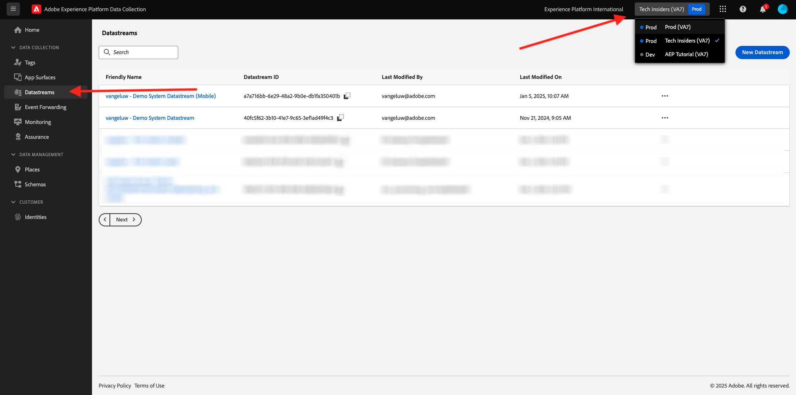
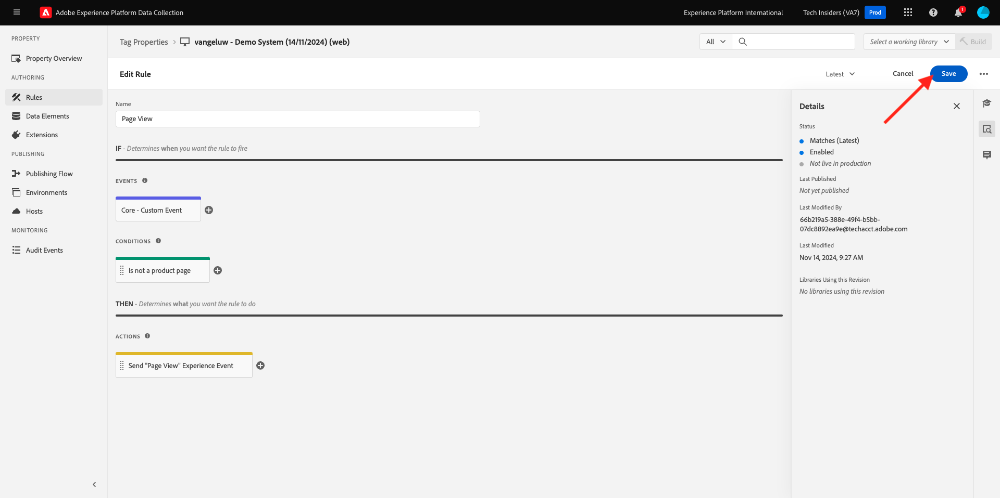
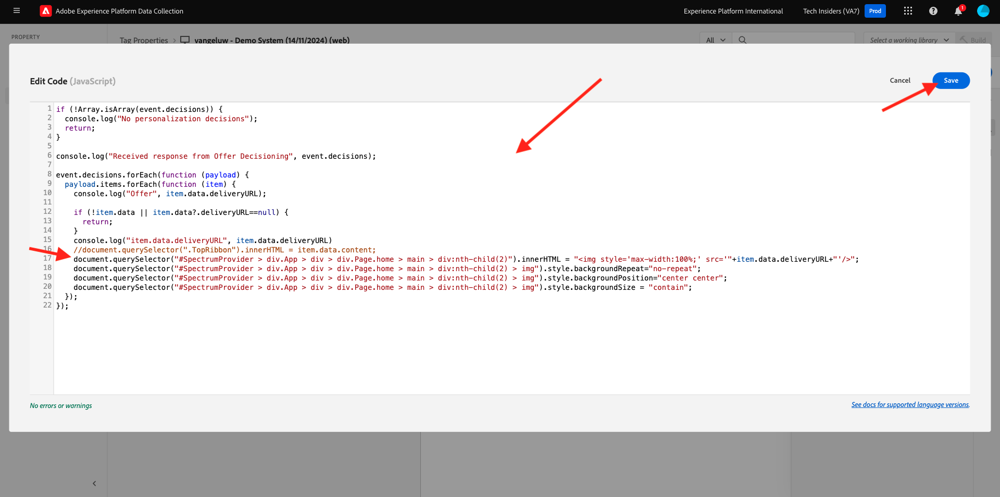

# 3.3.3 Préparation de la configuration de la propriété client de collecte de données Adobe Experience Platform et du SDK Web pour Offer Decisioning

## 3.3.3.1 Mise à jour de la matrice de données

Dans l&#39; [exercice 0.2](./../../../modules/gettingstarted/gettingstarted/ex2.md), vous avez créé votre propre **[!UICONTROL Datastream]**. Vous avez ensuite utilisé le nom `--aepUserLdap-- - Demo System Datastream`.

Dans cet exercice, vous devez configurer cet **[!UICONTROL Datastream]** pour qu’il fonctionne avec **[!DNL Offer Decisioning]**.

Pour ce faire, accédez à [https://experience.adobe.com/#/data-collection/](https://experience.adobe.com/#/data-collection/). Vous verrez alors ceci. Cliquez sur **[!UICONTROL Datastreams]** ou **[!UICONTROL Datastreams (Beta)]**.

Dans le coin supérieur droit de votre écran, sélectionnez le nom de votre environnement de test, qui doit être `--aepSandboxName--`.



Recherchez votre **[!UICONTROL Datastream]**, qui est nommé `--aepUserLdap-- - Demo System Datastream`. Cliquez sur votre **[!UICONTROL Datastream]** pour l’ouvrir.


Vous verrez alors ceci. Cliquez sur **...** en regard de **Adobe Experience Platform**, puis cliquez sur **Modifier**.


Pour activer **[!DNL Offer Decisioning]**, cochez la case correspondant à **[!DNL Offer Decisioning]**. Cliquez sur **Enregistrer**.


Votre **[!UICONTROL Datastream]** est maintenant prêt à fonctionner avec **[!DNL Offer Decisioning]**.


## 3.3.3.2 Configuration de la propriété du client de collecte de données Adobe Experience Platform pour demander des offres personnalisées

Accédez à [https://experience.adobe.com/#/data-collection/](https://experience.adobe.com/#/data-collection/), à **[!UICONTROL Client]**. Recherchez vos propriétés de collecte de données, qui sont nommées `--aepUserLdap-- - Demo System (DD/MM/YYYY)`. Ouvrez la propriété du client de collecte de données pour le Web.


Dans votre propriété, accédez à **[!UICONTROL Rules]** et ouvrez la règle **[!UICONTROL Page View]**.


Cliquez pour ouvrir le [!UICONTROL SDK Web AEP ] **[!UICONTROL - Envoyer l’événement]**.


Vous verrez alors ceci. Vous remarquerez que l’option de menu pour **[!UICONTROL Portées de décision]**.


Pour chaque requête envoyée au serveur Edge et à Adobe Experience Platform, il est possible de fournir un ou plusieurs **[!UICONTROL périmètres de décision]**. Une **[!UICONTROL portée de décision]** est une combinaison de deux éléments :

- [!UICONTROL ID de décision]
- [!UICONTROL Identifiant de référencement]

Regardons d&#39;abord où vous pouvez trouver ces deux éléments.

### 3.3.3.2.1 Récupérez votre [!UICONTROL identifiant de référencement]

L’ [!UICONTROL identifiant de référencement] identifie l’emplacement et le type de ressource requis. Par exemple, l’image principale sur la page d’accueil du site web Luma correspond à l’[!UICONTROL identifiant de référencement] pour [!UICONTROL Web - Image].

>[!NOTE]
>
>Dans le cadre du module 6, vous avez déjà configuré une activité de ciblage d’expérience Adobe Target qui modifiera l’image de l’emplacement du héros sur la page d’accueil, comme vous pouvez le voir dans la capture d’écran. Pour le plaisir de l’exercice, vous allez maintenant faire apparaître vos offres sur l’image sous l’image principale, comme indiqué dans la capture d’écran.


Pour trouver l&#39;[!UICONTROL identifiant de référencement] pour [!UICONTROL Web - Image], accédez à Adobe Journey Optimizer en accédant à [Adobe Experience Cloud](https://experience.adobe.com?lang=fr). Cliquez sur **Journey Optimizer**.


Vous serez redirigé vers la vue **Home** dans Journey Optimizer. Tout d’abord, assurez-vous d’utiliser l’environnement de test approprié. L’environnement de test à utiliser s’appelle `--aepSandboxName--`. Pour passer d’un environnement de test à un autre, cliquez sur **Production Prod (VA7)** et sélectionnez l’environnement de test dans la liste. Dans cet exemple, l’environnement de test est nommé **AEP Enablement FY22**. Vous serez alors dans la vue **Home** de votre environnement de test `--aepSandboxName--`.


Ensuite, accédez à [!UICONTROL Composants], puis à [!UICONTROL Emplacements]. Cliquez sur l’emplacement [!UICONTROL Web - Image] pour en afficher les détails.


Comme vous pouvez le voir sur l’image ci-dessus, dans cet exemple, l’ [!UICONTROL identifiant de référencement] est `xcore:offer-placement:14bf09dc4190ebba`. Notez l’ [!UICONTROL  identifiant de référencement] pour votre emplacement pour [!UICONTROL Web - Image], car vous en aurez besoin lors de l’exercice suivant.

### 3.3.3.2.2 Récupérez votre [!UICONTROL ID de décision]

L’ [!UICONTROL ID de décision] identifie la combinaison d’offres personnalisées et d’offres de secours que vous souhaitez utiliser. Dans l’exercice précédent, vous avez créé votre propre [!UICONTROL Décision] et vous l’avez nommée `--aepUserLdap-- - Luma Decision`.

Pour trouver l&#39;[!UICONTROL ID de décision] pour votre `--aepUserLdap-- - Luma Decision`, accédez à [https://platform.adobe.com](https://platform.adobe.com).

Ensuite, accédez à [!UICONTROL Offres], puis à [!UICONTROL Décisions]. Cliquez pour sélectionner votre [!UICONTROL décision], qui est nommée `--aepUserLdap-- - Luma Decision`.


Comme vous pouvez le voir sur l’image ci-dessus, dans cet exemple, l’ [!UICONTROL ID de décision] est `xcore:offer-activity:14c052382e1b6505`. Notez l’ [!UICONTROL ID de décision] pour votre décision `--aepUserLdap-- - Luma Decision`, car vous en aurez besoin lors de l’exercice suivant.

Maintenant que vous avez récupéré les deux éléments dont vous avez besoin pour créer un **[!UICONTROL champ de décision]**, vous pouvez passer à l’étape suivante, qui implique le codage de la portée de décision.

### 3.3.3.2.3 Codage BASE64

La **[!UICONTROL portée de décision]** que vous devez saisir est une chaîne codée BASE64. Cette chaîne codée en BASE64 est une combinaison de l’[!UICONTROL identifiant de référencement] et de l’[!UICONTROL identifiant de décision], comme vous pouvez le voir ci-dessous.

```json
{
  "activityId":"xcore:offer-activity:14c052382e1b6505",
  "placementId":"xcore:offer-placement:14bf09dc4190ebba"
}
```

La **[!UICONTROL portée de décision]** peut être générée de deux manières :

- Utilisez un service public tel que [https://www.base64encode.org/](https://www.base64encode.org/). Saisissez le code JSON comme mentionné ci-dessus, cliquez sur **[!UICONTROL Encode]** et vous obtiendrez la chaîne codée BASE64 ci-dessous.

  

- Récupérez la chaîne codée BASE64 à partir de Adobe Experience Platform. Accédez à [!UICONTROL Decisions] et cliquez pour ouvrir votre [!UICONTROL Decision], qui s’appelle `--aepUserLdap-- - Luma Decision`.

  

  Après l’ouverture de `--aepUserLdap-- - Luma Decision`, vous verrez ceci. Recherchez l&#39;emplacement [!UICONTROL Web - Image] et cliquez sur le bouton **[!UICONTROL Copier]** . Cliquez ensuite sur **[!UICONTROL Étendue de décision codée]**. L’**[!UICONTROL étendue de décision]** est désormais copié dans le presse-papiers.

  

Ensuite, revenez à Launch, à votre action **[!UICONTROL SDK Web AEP - Envoyer l’événement]**.


Collez la portée de décision codée dans le champ de saisie.


Enregistrez vos modifications dans l’action **[!UICONTROL AEP Web SDK - Send Event]** en cliquant sur **[!UICONTROL Keep Changes]**.


Cliquez ensuite sur **[!UICONTROL Enregistrer]** ou **[!UICONTROL Enregistrer dans la bibliothèque]**



Dans la collecte de données Adobe Experience Platform, accédez à **[!UICONTROL Flux de publication]** et ouvrez votre **[!UICONTROL bibliothèque de développement]** nommée **[!UICONTROL principale]**. Cliquez sur **[!UICONTROL + Ajouter toutes les ressources modifiées]**, puis sur **[!UICONTROL Enregistrer et créer pour le développement]**. Vos modifications seront désormais publiées sur votre site web de démonstration.


Chaque fois que vous chargez une **page générale**, comme par exemple la page d’accueil du site web de démonstration, l’Offer decisioning évalue l’offre applicable et renvoie une réponse au site web avec les détails de l’offre à afficher. L’affichage de l’offre sur le site web nécessite une configuration supplémentaire, ce que vous allez faire à l’étape suivante.

## 3.3.3.3 Configuration de la propriété du client de collecte de données Adobe Experience Platform pour recevoir et appliquer des offres personnalisées

Accédez à [https://experience.adobe.com/#/data-collection/](https://experience.adobe.com/#/data-collection/), à **[!UICONTROL Propriétés]**. Recherchez vos propriétés de collecte de données, qui sont nommées `--aepUserLdap-- - Demo System (DD/MM/YYYY)`. Ouvrez la propriété Collecte de données pour le Web.


Dans votre propriété, accédez à **[!UICONTROL Rules]**.


Recherchez et ouvrez la règle **Décision reçue**.


Vous verrez alors ceci. Ouvrez l’action **Placez l’offre sur la page**.


Cliquez sur **[!UICONTROL Ouvrir l’éditeur]**


Remplacez le code en collant le code ci-dessous dans l’éditeur.

```javascript
if(!Array.isArray(event.decisions)) {
  console.log('No decisions returned')
  return;
}
console.log("decision",event.decisions)

event.decisions.forEach(function(payload) {
  payload.items.forEach(function(item){
    console.log("Response from Offer Decisioning ", item.data.content);
   
    var element = document.querySelector("#root > div > div > div.app-content > div > section.feature_part.padding_top > div > div.row.align-items-center.justify-content-between > div.col-lg-7.col-sm-6.\\30  > div");
    if(!element){
      console.log("Offer Placement Area Selector not found")
      return;
    }
    if(!item.data){
      return
    }
    //check if offer already exists
    var offer = document.querySelector("#root > div > div > div.app-content > div > section.feature_part.padding_top > div > div.row.align-items-center.justify-content-between > div.col-lg-7.col-sm-6.\\30  > div");
    if(!offer){ 
      element.insertAdjacentHTML('afterbegin', item.data.content) 
    }
    else { 
      console.log("item.data.deliveryURL: " + item.data.deliveryURL)
      document.querySelector("#root > div > div > div.app-content > div > section.feature_part.padding_top > div > div.row.align-items-center.justify-content-between > div.col-lg-7.col-sm-6.\\30  > div").style.background="url('"+item.data.deliveryURL+"')";
      document.querySelector("#root > div > div > div.app-content > div > section.feature_part.padding_top > div > div.row.align-items-center.justify-content-between > div.col-lg-7.col-sm-6.\\30  > div").style.backgroundRepeat="no-repeat";
      document.querySelector("#root > div > div > div.app-content > div > section.feature_part.padding_top > div > div.row.align-items-center.justify-content-between > div.col-lg-7.col-sm-6.\\30  > div").style.backgroundPosition="center center";
      document.querySelector("#root > div > div > div.app-content > div > section.feature_part.padding_top > div > div.row.align-items-center.justify-content-between > div.col-lg-7.col-sm-6.\\30  > div").style.backgroundSize = "contain";
    }  
  })
});
```

Les lignes 26-27-28-29 appliqueront l&#39;image qui est renvoyée par Offer decisioning au site web. Cliquez sur **[!UICONTROL Enregistrer]**.



Cliquez sur **[!UICONTROL Conserver les modifications]**.


Cliquez ensuite sur **[!UICONTROL Enregistrer]** ou **[!UICONTROL Enregistrer dans la bibliothèque]**


Dans la collecte de données Adobe Experience Platform, accédez à **[!UICONTROL Flux de publication]** et ouvrez votre **[!UICONTROL bibliothèque de développement]** nommée **[!UICONTROL principale]**. Cliquez sur **[!UICONTROL + Ajouter toutes les ressources modifiées]**, puis sur **[!UICONTROL Enregistrer et créer pour le développement]**. Vos modifications seront désormais publiées sur votre site web de démonstration.


Avec cette modification, cette règle dans la collecte de données Adobe Experience Platform écoute désormais la réponse de l’Offer decisioning qui fait partie de la réponse du SDK Web. Lorsque la réponse est reçue, l’image de l’offre s’affiche sur la page d’accueil.

En regardant le site web de démonstration, vous verrez que cette image sera remplacée maintenant :

>[!NOTE]
>
>Dans le cadre du module 6, vous avez déjà configuré une activité de ciblage d’expérience Adobe Target qui modifiera l’image de l’emplacement du héros sur la page d’accueil, comme vous pouvez le voir dans la capture d’écran. Pour le plaisir de l’exercice, vous allez maintenant faire apparaître vos offres sur l’image sous l’image principale, comme indiqué dans la capture d’écran.


Et au lieu des images par défaut du site web Luma, vous verrez désormais une offre comme celle-ci. Dans ce cas, l’offre de secours s’affiche.


Vous avez maintenant configuré 2 types de personnalisation :

- 1 activité de ciblage d’expérience utilisant Adobe Target dans le module 6
- Mise en oeuvre d’un Offer decisioning à l’aide de votre propriété de collecte de données

Au cours de l’exercice suivant, vous verrez comment combiner vos offres et décisions créées dans Adobe Journey Optimizer avec une activité de ciblage d’expérience Adobe Target.

Étape suivante : [3.3.4 Combiner Adobe Target et Offer decisioning](./ex4.md)

[Revenir au module 3.3](./offer-decisioning.md)

[Revenir à tous les modules](./../../../overview.md)
