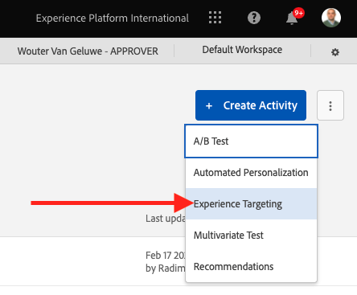

# 3.3.4 Combinaison d’Adobe Target et d’Offer Decisioning

## 3.3.4.1 Collecte du lien partageable de votre projet de démonstration

Pour charger le projet de site web de démonstration dans Adobe Target, vous devez d’abord collecter un lien spécial qui permettra à Adobe Target de charger votre projet de site web de démonstration.

Pour ce faire, accédez à [https://builder.adobedemo.com/projects](https://builder.adobedemo.com/projects). Une fois connecté avec votre Adobe ID, vous verrez ceci. Cliquez sur le projet de votre site web pour l’ouvrir.

Vous allez maintenant voir ceci. Cliquez sur **Partager**.

Cliquez sur **Générer le lien**, puis copiez le lien dans le presse-papiers.

Accédez à [https://bitly.com](https://bitly.com), collez le lien que vous avez copié et cliquez sur **Raccourcir**. Vous obtiendrez désormais un lien raccourci, qui ressemble à ceci : `https://bit.ly/3JxN7aG`. Vous aurez besoin de ce lien dans le prochain exercice.

## 3.3.4.2 Collecte

Accédez maintenant à la page d’accueil de Adobe Experience Cloud en vous rendant à l’adresse [https://experiencecloud.adobe.com/](https://experiencecloud.adobe.com/). Cliquez sur **Target**.

Sur la page d’accueil **Adobe Target**, vous verrez toutes les activités existantes.

Cliquez sur **+ Créer une activité** pour créer une activité.

Sélectionnez **Ciblage d’expérience**.

Sélectionnez maintenant **Visuel** et collez votre lien raccourci dans le champ **Entrer dans l’URL d’activité**. Cliquez sur **Suivant**.

Votre projet de site web de démonstration sera alors chargé dans le compositeur d’expérience visuelle.

Accédez au mode **Parcourir** pour cliquer sur **Autoriser tout** dans la fenêtre contextuelle de consentement des cookies.

Cliquez sur la zone contenant le texte **Catégories en vedette**. Cliquez sur **Insérer avant**, puis sélectionnez **Offer Decision**.

Vous verrez alors cette fenêtre contextuelle. Sélectionnez votre environnement de test `--aepSandboxId--`, puis sélectionnez l’emplacement **Web - Image**.

Sélectionnez ensuite votre décision `--demoProfileLdap-- - Luma Decision`. Cliquez sur **Enregistrer**.

Vous verrez alors ceci. Veillez à ajouter une règle de modèle supplémentaire **URL** **contient** **votre-nom-projet**. Cliquez sur **Enregistrer**.

Vous verrez alors ceci. Cliquez sur **Suivant**.

Saisissez un nom pour votre offre. Utilisez ce nom : `--demoProfileLdap-- - XT with Offers (VEC)`. Cliquez sur **Suivant**.

Vous verrez alors ceci. Définissez la **mesure de l’objectif** comme indiqué. Cliquez sur **Enregistrer et fermer**.

Votre offre est maintenant créée et en cours de publication.

Une fois votre offre publiée, vous pouvez l’activer.

Étape suivante : [3.3.5 Utilisez votre décision dans un email et un sms](./ex5.md)

[Revenir au module 3.3](./offer-decisioning.md)

[Revenir à tous les modules](./../../../overview.md)
