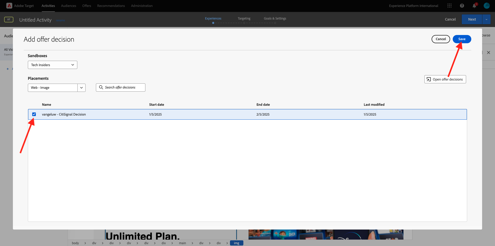
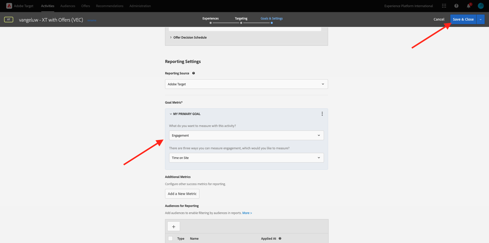

# 3.3.4 Combiner Adobe Target et Offer decisioning

## 3.3.4.1 Collecter le lien partageable de votre projet de démonstration

Pour charger le projet de site web de démonstration dans Adobe Target, vous devez d’abord collecter un lien spécial qui permettra à Adobe Target de charger votre projet de site web de démonstration.

Pour ce faire, accédez à [https://dsn.adobe.com/projects](https://builder.adobedemo.com/projects). Après vous être connecté avec votre Adobe ID, voici ce que vous verrez. Cliquez sur le projet de votre site web pour l’ouvrir.

Vous allez voir ceci. Accédez à **Partager**. Cliquez sur **Générer le lien** puis copiez le lien dans le presse-papiers.

Accédez à [https://bitly.com](https://bitly.com), collez le lien que vous avez copié et cliquez sur **Créer votre lien**.

Vous obtiendrez désormais un lien raccourci, qui ressemble à ceci : `https://adobe.ly/3PpGcFk`. Vous aurez besoin de ce lien dans l’exercice suivant.

## 3.3.4.2 Collecter

Accédez maintenant à la page d’accueil de Adobe Experience Cloud en accédant à [https://experiencecloud.adobe.com/](https://experiencecloud.adobe.com/). Cliquez sur **Cible**.

Sur la page d’accueil **Adobe Target**, toutes les activités existantes s’affichent. Cliquez sur **Créer une activité** puis sur **Ciblage d’expérience**.

Sélectionnez maintenant **Visuel** et collez votre lien raccourci dans le champ **Saisir l’URL de l’activité**. Cliquez sur **Créer**.

Votre projet de site web de démonstration sera ensuite chargé dans le compositeur d’expérience visuelle.

>[!NOTE]
>
>Si votre site web ne se charge pas correctement, installez et activez cette extension Chrome : **Adobe Target VEC Helper** à partir du magasin web Chrome, puis réessayez.

Cliquez sur la zone qui contient l’offre Disney+. Veillez à sélectionner le **Conteneur** complet. Cliquez sur **Insérer avant** puis sélectionnez **Décision d’offre**.

Vous verrez alors cette fenêtre contextuelle. Sélectionnez votre `--aepSandboxName--` sandbox, puis sélectionnez l’emplacement **Web - Image**.

Sélectionnez ensuite votre `--aepUserLdap-- - CitiSignal Decision` de décision. Cliquez sur **Enregistrer**.

Tu verras ça. Cliquez sur **Vérifier la règle**.

Assurez-vous que la règle de modèle supplémentaire **URL** **contient** **nom-de-votre-projet** a été ajoutée. Cliquez sur **Enregistrer**.

Tu verras ça. Cliquez sur **Suivant**.

Saisissez un nom pour votre offre. Utilisez le nom suivant : `--aepUserLdap-- - XT with Offers (VEC)`. Cliquez sur **Suivant**.

Tu verras ça. Définissez votre **mesure d’objectif** comme indiqué. Cliquez sur **Enregistrer et fermer**.

Votre offre est maintenant créée et est en cours de publication. Une fois votre offre publiée, vous pouvez l’activer.

Étape suivante : [3.3.5 Utilisez votre décision dans un e-mail et un sms](./ex5.md)

[Retour au module 3.3](./offer-decisioning.md)

[Revenir à tous les modules](./../../../overview.md)
