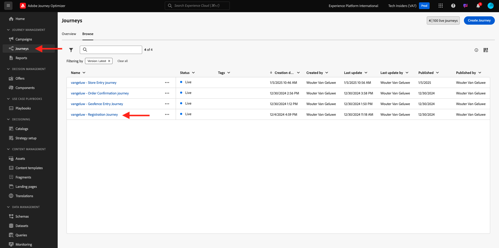

# 3.3.5 Utiliser votre décision dans un email

Dans cet exercice, vous utiliserez votre décision pour personnaliser la diffusion d’un email et d’un SMS.

Accédez à **Parcours**. Recherchez le parcours que vous avez créé dans l’exercice 7.2, intitulé `--aepUserLdap-- - Account Creation Journey`. Cliquez sur votre parcours pour l’ouvrir.

Vous verrez alors ceci. Cliquez sur **Créer une version**.

Cliquez sur **Créer une version**.

Cliquez sur l&#39;action **Email**, puis sur **Modifier le contenu**.

Le tableau de bord du message s’affiche alors. Cliquez sur **Email Designer**.

Vous verrez alors ceci.

Vous verrez alors ceci. Faites glisser un nouveau composant de structure **1:1 column** sur la zone de travail.

Dans le menu, accédez à **Composants du contenu**. Sélectionnez le composant **Offer Decision** et faites glisser et déposez ce composant dans l’espace réservé de l’offre de contenu du courrier électronique comme indiqué. Cliquez ensuite sur **Ajouter**.

Sélectionnez le type d’emplacement que vous souhaitez inclure dans le courrier électronique. Dans le menu déroulant **Emplacements**, sélectionnez **Email - Image**, puis sélectionnez votre décision `--aepUserLdap-- - Luma Decision`. Cliquez sur **Ajouter**.

Vous voyez maintenant toutes les offres personnalisées et l’offre de secours en cours de visualisation dans le concepteur d’email. Cliquez sur **Simuler le contenu** pour prévisualiser le message électronique avec un profil client réel.

Commencez par identifier le profil que vous souhaitez utiliser pour la prévisualisation. Sélectionnez l’espace de noms **email** et saisissez l’adresse électronique d’un profil client que vous avez créé sur le site web de démonstration. Cliquez ensuite sur **Aperçu**.

Une fois l&#39;email affiché et l&#39;offre correctement affichée, cliquez sur le bouton **Fermer** .

Enfin, cliquez sur **Enregistrer**.

Cliquez maintenant sur la flèche pour revenir à l’écran précédent.

Vous verrez alors ceci. Cliquez sur la flèche dans le coin supérieur gauche pour revenir à votre parcours.

Cliquez sur **Ok** pour fermer votre action **Email**.

Cliquez sur **Publish** pour publier votre parcours mis à jour.

Confirmez en cliquant de nouveau sur **Publish**.

Votre message est maintenant publié.

Lorsque vous créez un compte sur le site web de démonstration, vous obtenez maintenant cet e-mail :

Vous avez terminé cet exercice.

Étape suivante : [3.3.6 Test de votre décision à l’aide de l’API](./ex6.md)

[Revenir au module 3.3](./offer-decisioning.md)

[Revenir à tous les modules](./../../../overview.md)
