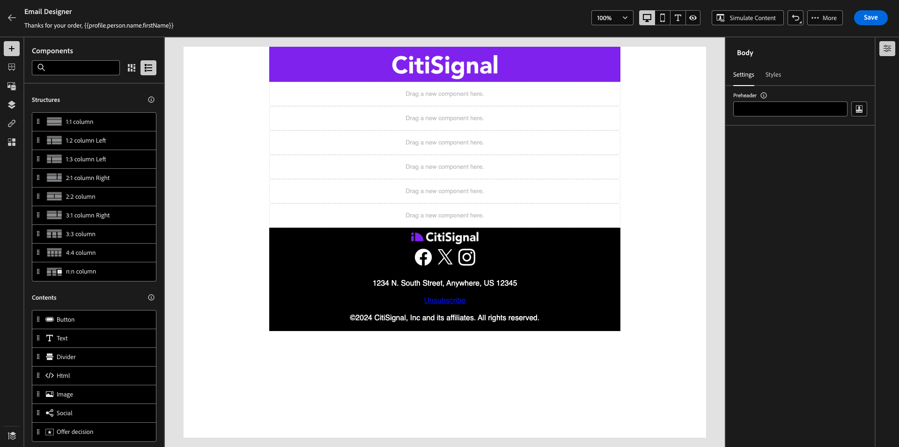
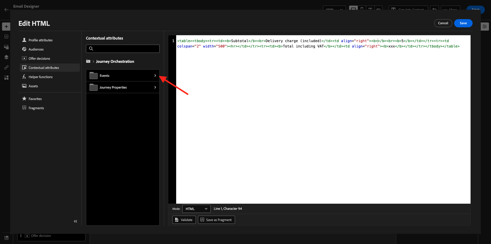

# 3.4.1 Configuration d’un parcours basé sur un déclencheur - Confirmation de commande

Connectez-vous à Adobe Journey Optimizer en vous rendant à [Adobe Experience Cloud](https://experience.adobe.com?lang=fr). Cliquez sur **Journey Optimizer**.


Vous serez redirigé vers la vue **Home** dans Journey Optimizer. Tout d’abord, assurez-vous d’utiliser l’environnement de test approprié. L’environnement de test à utiliser s’appelle `--aepSandboxName--`. Pour passer d’un environnement de test à un autre, cliquez sur **Production Prod (VA7)** et sélectionnez l’environnement de test dans la liste. Dans cet exemple, l’environnement de test est nommé **AEP Enablement FY22**. Vous serez alors dans la vue **Home** de votre environnement de test `--aepSandboxName--`.


## 3.4.1.1 Création de votre événement

Dans le menu, accédez à **Configurations** et cliquez sur **Gérer** sous **Événements**.


Sur l’écran **Events**, une vue similaire s’affiche. Cliquez sur **Créer un événement**.


Une configuration d’événement vide s’affiche alors.


Tout d’abord, attribuez un nom à votre événement comme suit : `--aepUserLdap--PurchaseEvent` et ajoutez une description comme celle-ci : `Purchase Event`.


La sélection **Type d’événement** suivante est disponible. Sélectionnez **Unitary**.


La sélection **Type d’ID d’événement** suivante est disponible. Sélectionnez **Généré par le système**


La sélection de schéma suivante s’affiche. Un schéma a été préparé pour cet exercice. Utilisez le schéma `Demo System - Event Schema for Website (Global v1.1) v.1`.


Après avoir sélectionné le schéma, plusieurs champs sont sélectionnés dans la section **Payload**. Cliquez sur l’icône **Modifier/Crayon** pour ajouter des champs supplémentaires à cet événement.


Vous verrez alors cette fenêtre contextuelle. Vous devez maintenant cocher des cases supplémentaires pour accéder à des données supplémentaires lorsque cet événement est déclenché.


Tout d&#39;abord, cochez la case sur la ligne `--aepTenantId--`.


Faites ensuite défiler l’écran vers le bas et cochez la case sur la ligne `productListItems`.


Faites ensuite défiler l’écran vers le bas et cochez la case sur la ligne `commerce`.


Cliquez ensuite sur **Ok**.

Vous verrez ensuite que des champs supplémentaires ont été ajoutés à l’événement. Cliquez sur **Enregistrer**.


Votre nouvel événement est ensuite partagé et vous verrez maintenant votre événement dans la liste des événements disponibles.

Cliquez à nouveau sur votre événement pour ouvrir à nouveau l’écran **Modifier l’événement** .
Passez la souris sur le champ **Payload** pour afficher à nouveau les 3 icônes. Cliquez sur l’icône **Afficher la charge utile** .


Vous verrez maintenant un exemple de la charge utile attendue. Votre événement a un eventID d’orchestration unique, que vous pouvez trouver en faisant défiler la page vers le bas dans cette payload jusqu’à ce que vous voyiez `_experience.campaign.orchestration.eventID`.


L’identifiant d’événement est ce qui doit être envoyé à Adobe Journey Optimizer pour déclencher le parcours que vous allez créer à l’étape suivante. Notez cet eventID, car vous en aurez besoin lors de l’une des étapes suivantes.
`"eventID": "ef6dd943c94fe1b4763c098ccd1772344662f2a9f614513106cb5ada8be36857"`

Cliquez sur **Ok**, puis sur **Annuler**.

Votre événement est maintenant configuré et prêt à être utilisé.

## 3.4.1.2 Création de votre parcours

Dans le menu, accédez à **Parcours** et cliquez sur **Créer un Parcours**.


Vous verrez alors ceci. Donnez un nom à votre parcours. Utilisez `--aepUserLdap-- - Order Confirmation journey`. Cliquez sur **OK**.


Tout d’abord, vous devez ajouter votre événement comme point de départ de votre parcours. Recherchez votre événement `--aepUserLdap--PurchaseEvent` et faites-le glisser sur la zone de travail. Cliquez sur **OK**.


Ensuite, sous **Actions**, recherchez l’action **Email** et ajoutez-la à la zone de travail.


Définissez la **catégorie** sur **Marketing** et sélectionnez une surface d&#39;email qui vous permet d&#39;envoyer des emails. Dans ce cas, la surface de l&#39;email à sélectionner est **Email**. Assurez-vous que les cases à cocher des **clics sur l’email** et des **ouvertures d’email** sont toutes deux activées.


L’étape suivante consiste à créer votre message. Pour ce faire, cliquez sur **Modifier le contenu**.


Vous voyez maintenant ceci. Cliquez sur le champ de texte **Objet** .


Dans la zone de texte, commencez à écrire **Merci pour votre commande,**


L’objet n’est pas encore terminé. Vous devez ensuite importer le jeton de personnalisation pour le champ **Prénom** stocké sous `profile.person.name.firstName`. Dans le menu de gauche, faites défiler l’écran vers le bas pour trouver le champ **Personne** > **Nom complet** > **Prénom** et cliquez sur l’icône **+** pour ajouter le jeton de personnalisation à la ligne d’objet. Cliquez sur **Enregistrer**.


Vous serez alors de retour ici. Cliquez sur **Email Designer** pour créer le contenu de l’email.


Dans l’écran suivant, cliquez sur **Conception à partir de zéro**.


Dans le menu de gauche, vous trouverez les composants de structure que vous pouvez utiliser pour définir la structure de l&#39;email (lignes et colonnes).

Faites glisser et déposez 8 fois une **colonne 1:1** sur la zone de travail, ce qui devrait vous donner ceci :


Accédez à **Composants de contenu**.



Faites glisser et déposez un composant **Image** sur la première ligne. Cliquez sur **Parcourir**.


Accédez au dossier **enablement-assets**, sélectionnez le fichier **luma-logo.png** et cliquez sur **Sélectionner**.


Vous êtes maintenant de retour ici. Cliquez sur votre image pour la sélectionner, puis utilisez le curseur **Taille** pour rendre l’image de logo un peu plus petite.


Accédez à **Composants de contenu** et faites glisser et déposez un composant **Image** sur la deuxième ligne. Sélectionnez le **composant Image** mais NE CLIQUEZ PAS sur Parcourir.


Collez cette URL d’image dans le champ **Source**: `https://parsefiles.back4app.com/hgJBdVOS2eff03JCn6qXXOxT5jJFzialLAHJixD9/29043bedcde632a9cbe8a02a164189c9_preparing.png`. Cette image est hébergée en dehors de l’Adobe.


Lorsque vous définissez la portée sur un autre champ, l’image est rendue et vous verrez ceci :


Ensuite, accédez à **Composants du contenu** et faites glisser et déposez un composant **Texte** sur la troisième ligne.


Sélectionnez le texte par défaut dans ce composant **Veuillez saisir votre texte ici.** et remplacez-le par le texte ci-dessous :

```javascript
You’re one step closer!

Hi 

We've received your order details!

We will also send you a separate email containing your VAT Invoice.

We'll be back in touch with you as soon as we've finished packing your package. Please read carefully the Order Information detailed below.
```


Placez le curseur en regard du texte **Hi** et cliquez sur **Ajouter Personalization**.


Accédez au champ **Personne** > **Nom complet** > **Prénom** et cliquez sur l’icône **+** pour ajouter le jeton de personnalisation à la ligne d’objet. Cliquez sur **Enregistrer**.


Vous verrez alors :


Ensuite, accédez à **Composants du contenu** et faites glisser et déposez un composant **Texte** sur la quatrième ligne.


Sélectionnez le texte par défaut dans ce composant **Veuillez saisir votre texte ici.** et remplacez-le par le texte ci-dessous :

`Order Information`

Définissez la taille de la police sur **26px** et centrez votre texte dans cette cellule. Vous obtiendrez alors ce qui suit :


Ensuite, accédez à **Composants du contenu** et faites glisser et déposez un composant **HTML** sur la cinquième ligne. Cliquez sur le composant HTML, puis sur **Afficher le code source**.


Dans la fenêtre contextuelle **Modifier l’HTML**, collez cet HTML :

```<table><tbody><tr><td><b>Items purchased</b></td><td></td><td><b>Quantity</b></td><td><b>Subtotal</b></td></tr><tr><td colspan="4" width="500"><hr></td></tr></tbody></table>```

Cliquez sur **Enregistrer**.


Vous aurez alors ceci. Cliquez sur **Enregistrer** pour enregistrer la progression.


Accédez à **Composants du contenu** et faites glisser et déposez un composant **HTML** sur la sixième ligne. Cliquez sur le composant HTML, puis sur **Afficher le code source**.


Dans la fenêtre contextuelle **Modifier l’HTML**, collez cet HTML :

```{{#each xxx as |item|}}<table width="500"><tbody><tr><td></td><td><table><tbody><tr><td><b>{{item.name}}</b><br>{{item.--aepTenantId--.core.subCategory}}<br><b>{{item.priceTotal}}</b><br>&nbsp;<br>Article no: {{item.SKU}}</td></tr></tbody></table></td><td>{{item.quantity}}</td><td><b>{{item.priceTotal}}</b></td></tr></tbody></table>{{/each}}```

Vous obtiendrez alors ce qui suit :


Vous devez maintenant remplacer **xxx** par une référence à l’objet productListItems qui fait partie de l’événement qui déclenche le parcours.


Tout d&#39;abord, supprimez **xxx** dans le code de votre HTML.


Dans le menu de gauche, cliquez sur **Attributs contextuels**. Ce contexte est transmis au message depuis le parcours.


Vous verrez alors ceci. Cliquez sur la flèche en regard de **Journey Orchestration** pour approfondir l’analyse.


Cliquez sur la flèche en regard de **Events** pour approfondir l’analyse.


Cliquez sur la flèche en regard de `--aepUserLdap--PurchaseEvent` pour approfondir l’analyse.


Cliquez sur la flèche en regard de **productListItems** pour approfondir l’analyse.


Cliquez sur l’icône **+** en regard de **Nom** pour l’ajouter à la zone de travail. Vous aurez alors ceci. Vous devez maintenant sélectionner **.name** comme indiqué dans la capture d’écran ci-dessous, puis supprimer **.name**.


Vous aurez alors ceci. Cliquez sur **Enregistrer**.


Vous serez de retour dans le Designer email maintenant. Cliquez sur **Enregistrer** pour enregistrer la progression.


Ensuite, accédez à **Composants du contenu** et faites glisser et déposez un composant **HTML** sur la septième ligne. Cliquez sur le composant HTML, puis sur **Afficher le code source**.


Dans la fenêtre contextuelle **Modifier l’HTML**, collez cet HTML :

```<table><tbody><tr><td><b>Subtotal</b><br>Delivery charge (included)</td><td align="right"><b>xxx</b><br><b>5</b></td></tr><tr><td colspan="2" width="500"><hr></td></tr><tr><td><b>Total including VAT</b></td><td align="right"><b>xxx</b></td></tr></tbody></table>```

Il existe 2 références de **xxx** dans ce code d’HTML. Vous devez maintenant remplacer chaque **xxx** par une référence à l’objet productListItems qui fait partie de l’événement qui déclenche le parcours.


Tout d&#39;abord, supprimez le premier **xxx** dans le code de votre HTML.


Dans le menu de gauche, cliquez sur **Attributs contextuels**.


Cliquez sur la flèche en regard de **Journey Orchestration** pour approfondir l’analyse.


Cliquez sur la flèche en regard de **Events** pour approfondir l’analyse.



Cliquez sur la flèche en regard de `--aepUserLdap--PurchaseEvent` pour approfondir l’analyse.


Cliquez sur la flèche en regard de **Commerce** pour approfondir l’analyse.


Cliquez sur la flèche en regard de **Commande** pour approfondir l’analyse.


Cliquez sur l’icône **+** en regard de **Total prix** pour l’ajouter à la zone de travail.


Vous aurez alors ceci. Supprimez maintenant le deuxième **xxx** dans le code de votre HTML.


Cliquez de nouveau sur l’icône **+** en regard de **Total prix** pour l’ajouter à la zone de travail.


Vous pouvez également ajouter le champ **Currency** depuis l’objet **Order** sur la zone de travail, comme vous pouvez le voir ici.
Une fois que vous avez terminé, cliquez sur **Enregistrer** pour enregistrer vos modifications.


Vous serez alors de retour dans le Designer email. Cliquez à nouveau sur **Enregistrer**.


Revenez au tableau de bord des messages en cliquant sur la **flèche** en regard de l’objet du texte dans le coin supérieur gauche.


Cliquez sur la flèche dans le coin supérieur gauche pour revenir à votre parcours.


Cliquez sur **Ok** pour fermer votre action de courrier électronique.


Cliquez sur **Publish** pour publier votre parcours.


Cliquez de nouveau sur **Publish**.


Votre parcours est maintenant publié.


## 3.4.1.5 Mise à jour de la propriété du client de collecte de données Adobe Experience Platform

Accédez à [Adobe Experience Platform Data Collection](https://experience.adobe.com/launch/) et sélectionnez **Balises**.

Il s’agit de la page Propriétés de la collecte de données Adobe Experience Platform que vous avez déjà vue.


Dans le module 0, Demo System a créé deux propriétés Client pour vous : une pour le site web et une pour l’application mobile. Recherchez-les en recherchant `--aepUserLdap--` dans la zone **[!UICONTROL Rechercher]**. Cliquez pour ouvrir la propriété **Web**.


Accédez à **Data Elements**. Recherchez et ouvrez l’élément de données **XDM - Purchase**.


Vous verrez alors ceci. Accédez au champ **_experience.campaign.orchestration.eventID** et renseignez votre eventID ici. L’eventID à remplir ici est l’eventID que vous avez créé dans le cadre de l’exercice 10.1.2. Cliquez sur **Enregistrer** ou **Enregistrer dans la bibliothèque**.


Enregistrez vos modifications dans la propriété Client, puis publiez vos modifications en mettant à jour votre bibliothèque de développement.


Vos modifications sont maintenant déployées et peuvent être testées.

## 3.4.1.6 Testez votre email de confirmation de commande à l’aide du site web de démonstration.

Testons le parcours mis à jour en achetant un produit sur le site web de démonstration.

Accédez à [https://builder.adobedemo.com/projects](https://builder.adobedemo.com/projects). Une fois connecté avec votre Adobe ID, vous verrez ceci. Cliquez sur le projet de votre site web pour l’ouvrir.


Vous verrez alors votre site web de démonstration ouvert. Sélectionnez l’URL et copiez-la dans le presse-papiers.


Ouvrez une nouvelle fenêtre de navigateur incognito.


Collez l’URL de votre site web de démonstration, que vous avez copiée à l’étape précédente. Vous serez alors invité à vous connecter à l’aide de votre Adobe ID.


Sélectionnez le type de compte et procédez à la connexion.


Votre site web est alors chargé dans une fenêtre de navigateur incognito. Pour chaque démonstration, vous devez utiliser une fenêtre de navigateur incognito actualisée pour charger l’URL de votre site web de démonstration.


Cliquez sur l’icône représentant un logo d’Adobe dans le coin supérieur gauche de votre écran pour ouvrir la visionneuse de profils.


Consultez le panneau Visionneuse de profils et Real-time Customer Profile avec l’**identifiant Experience Cloud** comme identifiant principal pour ce client actuellement inconnu.


Accédez à la page Enregistrer/Connexion . Cliquez sur **CRÉER UN COMPTE**.


Renseignez vos détails et cliquez sur **Enregistrer** après quoi vous serez redirigé vers la page précédente.


Ajoutez n’importe quel produit à votre panier et accédez à la page **Panier** . Cliquez sur **Passez en caisse**.


Ensuite, vérifiez les champs de la page de passage en caisse et cliquez sur **Passage en caisse**.


Vous recevrez ensuite votre email de confirmation de commande dans les secondes.


Vous avez terminé cet exercice.

Étape suivante : [3.4.2 Configuration d’un parcours de newsletter par lots](./ex2.md)

[Revenir au module 3.4](./journeyoptimizer.md)

[Revenir à tous les modules](../../../overview.md)
