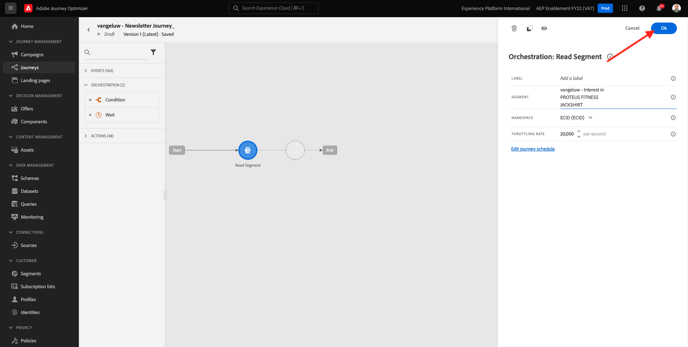

# 3.4.2 Configuration d’un parcours de newsletter par lots

Connectez-vous à Adobe Journey Optimizer en allant sur [Adobe Experience Cloud](https://experience.adobe.com?lang=fr). Cliquez sur **Journey Optimizer**.

Vous serez redirigé vers la vue **Accueil** dans Journey Optimizer. Tout d’abord, assurez-vous d’utiliser le bon sandbox. Le sandbox à utiliser est appelé `--aepSandboxName--`. Pour passer d’un sandbox à un autre, cliquez sur **PRODUCTION Prod (VA7)** et sélectionnez le sandbox dans la liste. Dans cet exemple, le sandbox est nommé **Activation AEP FY22**. Vous serez alors dans la vue **Accueil** de votre `--aepSandboxName--` sandbox.

## 3.4.2.1 Créer un parcours de newsletter

Vous allez à présent créer un parcours basé sur des lots. Contrairement au parcours basé sur un événement de l’exercice précédent, qui repose sur les événements d’expérience entrants, les entrées ou les sorties d’audience pour déclencher un parcours pour un client spécifique, les parcours par lots ciblent une audience entière une fois avec un contenu unique tel que des newsletters, des promotions ponctuelles ou des informations génériques, ou périodiquement avec un contenu similaire envoyé régulièrement, par exemple des campagnes d’anniversaire et des rappels.

Dans le menu, accédez à **Parcours** puis cliquez sur **Créer un Parcours**.

Sur la droite, vous verrez un formulaire dans lequel vous devez spécifier le nom et la description du parcours. Saisissez les valeurs suivantes :

- **Nom** : `--aepUserLdap-- - Newsletter Journey`. Par exemple : **vangeluw - Newsletter Parcours**.
- **Description** : Newsletter Mensuelle

Cliquez sur **OK**.

Sous **Orchestration**, effectuez un glisser-déposer **Lecture d’audience** sur la zone de travail. Cela signifie qu’une fois publié, le parcours commencera par récupérer l’ensemble de l’audience, qui devient alors l’audience cible du parcours et du message. Cliquez sur **Sélectionner une audience**.

Dans la fenêtre contextuelle **Sélection d’une audience**, recherchez votre ldap et sélectionnez l’audience que vous avez créée dans [Module 2.3 - Real-time CDP - Création d’une audience et effectuez une action](./../../../modules/rtcdp-b2c/module2.3/real-time-cdp-build-a-segment-take-action.md) appelée `--aepUserLdap-- - Interest in Galaxy S24`. Cliquez sur **Enregistrer**.

Cliquez sur **OK**.

Dans le menu de gauche, recherchez la section **Actions** et effectuez un glisser-déposer d’une action **E-mail** sur la zone de travail.

Définissez la **Catégorie** sur **Marketing** et sélectionnez une surface d’e-mail qui vous permet d’envoyer un e-mail. Dans ce cas, la surface d’e-mail à sélectionner est **Email**. Assurez-vous que les cases à cocher **Clics sur l’e-mail** et **Ouvertures d’e-mail** sont activées.

L’étape suivante consiste à créer votre message. Pour ce faire, cliquez sur **Modifier le contenu**.

Vous voyez maintenant ceci. Cliquez sur le champ de texte **Objet**.

Saisissez le texte suivant pour l&#39;objet : `Luma Newsletter - your monthly update has arrived.`. Cliquez sur **Enregistrer**.

Tu seras de retour ici. Cliquez sur **Email Designer** pour commencer à créer le contenu de l’e-mail.

Tu verras ça. Cliquez sur **Importer l’HTML**.

Dans l’écran pop-up, vous devez faire un glisser-déposer du fichier d’HTML de l’e-mail. Le modèle HTML est disponible [ici](./../../../assets/html/ajo-newsletter.html.zip). Téléchargez le fichier zip avec le modèle HTML sur votre ordinateur local et décompressez-le sur votre bureau.

Effectuez un glisser-déposer du fichier **ajo-newsletter.html** pour le charger dans Journey Optimizer. Cliquez sur **Importer**.

Ce contenu d’e-mail est prêt à l’emploi, car il dispose de toute la personnalisation, des images et du texte attendus. Seul l’espace réservé de l’offre reste vide.

Il se peut que vous receviez un message d’erreur : **Erreur lors de la tentative de récupération de ressources**. Il est lié à l’image dans l’e-mail.

Si vous obtenez cette erreur, sélectionnez l’image et cliquez sur le bouton **Modifier l’image**.

Cliquez sur **Assets Essentials** pour revenir à votre bibliothèque AEM Assets Essentials.

Vous verrez alors cette fenêtre contextuelle. Accédez au dossier **enablement-assets** et sélectionnez l’image **luma-newsletterContent.png**. Cliquez sur **Sélectionner**.

Votre e-mail de newsletter de base est maintenant prêt. Cliquez sur **Enregistrer**.

Revenez au tableau de bord des messages en cliquant sur la **flèche** en regard du texte de l’objet dans le coin supérieur gauche.

Cliquez sur la flèche dans le coin supérieur gauche pour revenir au parcours.

Cliquez sur **Ok** pour fermer l’action de l’e-mail.

Votre parcours de newsletter est maintenant prêt à être publié. Avant de procéder, notez la section **Planifier** dans laquelle vous pouvez passer de ce parcours ponctuel à une campagne récurrente. Cliquez sur le bouton **Planifier**.

Tu verras ça. Sélectionnez **Une Fois**.

Sélectionnez une date et une heure au cours de l’heure suivante afin de pouvoir tester votre parcours. Cliquez sur **OK**.

>[!NOTE]
>
>La date et l’heure d’envoi du message doivent être comprises dans plus d’une heure.

Cliquez sur **Publier**.

Cliquez de nouveau sur **Publish**.

Votre parcours de newsletter de base est maintenant publié. Votre newsletter sera envoyée par e-mail comme vous l’avez définie dans votre planning, et votre parcours s’arrêtera dès que le dernier e-mail aura été envoyé.

Vous avez terminé cet exercice.

Étape suivante : [3.4.3 Appliquer la personnalisation dans un e-mail](./ex3.md)

[Retour au module 3.4](./journeyoptimizer.md)

[Revenir à tous les modules](../../../overview.md)
