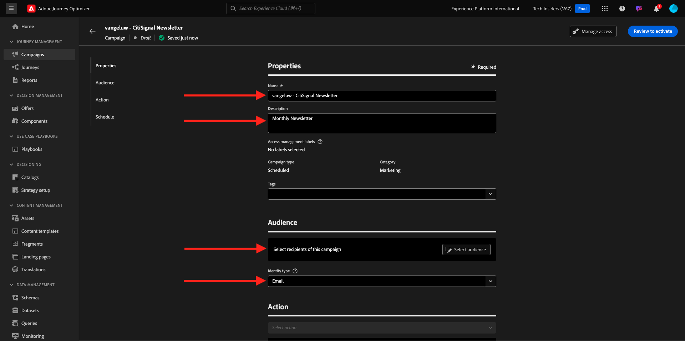

# 3.4.2 Configuration d’une campagne

Connectez-vous à Adobe Journey Optimizer en allant sur [Adobe Experience Cloud](https://experience.adobe.com?lang=fr). Cliquez sur **Journey Optimizer**.


Vous serez redirigé vers la vue **Accueil** dans Journey Optimizer. Tout d’abord, assurez-vous d’utiliser le bon sandbox. Le sandbox à utiliser est appelé `--aepSandboxName--`. Vous serez alors dans la vue **Accueil** de votre `--aepSandboxName--` sandbox.


## 3.4.2.1 Créer une audience

Avant de créer votre campagne, vous devez définir l’audience qui doit recevoir la campagne. Pour créer une audience, accédez à **Audiences** dans le menu de gauche. Toutes les audiences créées précédemment s’affichent à cet endroit.

Cliquez sur **+ Créer une audience**.


Sélectionnez **Créer une règle** puis cliquez sur **Créer**.


Sélectionnez le champ **Profil individuel XDM > E-mail personnel > Adresse** et ajoutez-le à la zone de travail. Définissez la condition de règle sur **existe**.

Pour éviter d’envoyer des e-mails à d’autres utilisateurs dans votre environnement de formation partagé, vous pouvez également ajouter un filtre tel que **Prénom égal à -votre prénom-**.

Définissez le nom de votre audience sur `--aepUserLdap-- - All customers with email` et cliquez sur **Publish**.


Votre audience est maintenant publiée et peut être utilisée dans une campagne.

## 3.4.2.2 Créer une campagne de newsletter

Vous allez maintenant créer une campagne. Contrairement au parcours basé sur un événement de l’exercice précédent, qui repose sur les événements d’expérience entrants, les entrées ou les sorties d’audience pour déclencher un parcours pour un client spécifique, les campagnes ciblent une audience entière une fois avec du contenu unique tel que des newsletters, des promotions ponctuelles ou des informations génériques, ou périodiquement avec du contenu similaire envoyé régulièrement, par exemple des campagnes d’anniversaire et des rappels.

Dans le menu, accédez à **Campagnes** et cliquez sur **Créer une campagne**.


Sélectionnez **Planifié - Marketing** et cliquez sur **Créer**.


Dans l’écran de création de la campagne, configurez les éléments suivants :

- **Nom** : `--aepUserLdap-- - CitiSignal Newsletter`.
- **Description** : Newsletter Mensuelle
- **Type d’identité** : remplacez par E-mail .

Cliquez sur **Sélectionner une audience**.



Pour l’**Audience**, sélectionnez l’audience que vous avez créée à l’étape précédente, `--aepUserLdap-- - All customers with email`. Cliquez sur **Enregistrer**.


Pour l’**Action**, sélectionnez **E-mail** et sélectionnez une **Configuration d’e-mail** existante. Vous allez modifier le contenu dans quelques minutes.


Pour le **Planning**, choisissez **À une date et une heure spécifiques** puis définissez l’heure de votre choix.


Vous pouvez maintenant commencer à créer l’e-mail lui-même. Faites défiler l’écran vers le haut, puis cliquez sur **Modifier le contenu**.


Tu verras ça. Pour l’**Objet**, utilisez la commande suivante : `Your monthly CitiSignal update has arrived.`. Cliquez ensuite sur **Modifier le corps de l’e-mail**.


Choisissez **Créer en partant de zéro**.


Tu verras ça. Dans le menu de gauche, vous trouverez les composants de structure que vous pouvez utiliser pour définir la structure de l’e-mail (lignes et colonnes).

Effectuez un glisser-déposer 3 fois par colonne **1:1** sur la zone de travail, 1 fois par colonne 1:2 à gauche et 1 fois par colonne 2:1 à droite, ce qui devrait vous donner cette structure :


Dans le menu de gauche, accédez à **Fragments**. Faites glisser l’en-tête que vous avez créé précédemment dans le 3.1.2.1[&#128279;](./../module3.1/ex2.md) [exercice) sur le premier composant de la zone de travail. Faites glisser le pied de page que vous avez créé précédemment dans le 3.1.2.2](./../module3.1/ex2.md) exercice) sur le dernier composant de la zone de travail.


Cliquez sur l’icône **+** dans le menu de gauche. Accédez à **Contenu** pour commencer à ajouter du contenu sur la zone de travail.


Faites glisser et déposez un composant **Texte** sur la deuxième ligne.


Sélectionnez le texte par défaut dans ce composant **Veuillez saisir votre texte ici.**-le et remplacez-le par le texte ci-dessous. Remplacez l’alignement par **Alignement centré**.

```javascript
Hi {{profile.person.name.firstName}}

As a CitiSignal member, you're part of a dynamic community that's constantly evolving to meet your needs. We're committed to delivering innovative solutions that enhance your digital lifestyle and keep you ahead of the curve.

Stay connected.
```


Faites glisser et déposez un composant **Image** sur la 3e et la 4e ligne. Cliquez sur **Parcourir** sur la 3e ligne.


Ouvrez le dossier **citi-signal-images**, cliquez pour sélectionner l’image **Offer_AirPods.jpg**, puis cliquez sur **Sélectionner**.


Cliquez sur **Parcourir** dans l’espace réservé de l’image sur la 4e ligne.


Ouvrez le dossier **citi-signal-images**, cliquez pour sélectionner l’image **Offer_Phone.jpg**, puis cliquez sur **Sélectionner**.


Faites glisser et déposez un composant **Texte** sur la 3e et la 4e ligne.


Sélectionnez le texte par défaut dans le composant de la 3e ligne **Veuillez saisir votre texte ici.**-le et remplacez-le par le texte ci-dessous.

```javascript
Get AirPods for free:

Experience seamless connectivity like never before with CitiSignal. Sign up for select premium plans and receive a complimentary pair of Apple AirPods. Stay connected in style with our unbeatable offer.
```

Sélectionnez le texte par défaut dans le composant sur la 4e ligne **Veuillez saisir votre texte ici.**-le et remplacez-le par le texte ci-dessous.

```javascript
We'll pay off your phone:

Make the switch to CitiSignal and say goodbye to phone payments! Switching to CitiSignal has never been more rewarding. Say farewell to hefty phone bills as we help pay off your phone, up to 800$!
```


Votre e-mail de newsletter de base est maintenant prêt. Cliquez sur **Enregistrer**.


Revenez au tableau de bord de la campagne en cliquant sur la **flèche** en regard du texte de l’objet dans le coin supérieur gauche.


Cliquez sur **Vérifier pour activer**.


Il se peut que vous obteniez cette erreur. Si c’est le cas, vous devrez peut-être attendre jusqu’à 24 heures avant que l’audience ait été évaluée, puis essayer d’activer à nouveau votre campagne. Vous devrez peut-être également mettre à jour le planning de votre campagne pour l’exécuter ultérieurement.

Cliquez sur **Activer**.


Une fois activée, votre campagne sera planifiée pour s’exécuter.


Votre campagne est maintenant activée. Votre newsletter sera envoyée par e-mail comme vous l’avez définie dans votre planning, et votre campagne s’arrêtera dès que le dernier e-mail aura été envoyé.

Vous devriez également recevoir l’e-mail à l’adresse e-mail que vous avez utilisée pour le profil de démonstration que vous avez créé précédemment.


Vous avez terminé cet exercice.

Étape suivante : [3.4.3 Appliquer une personnalisation basée sur les segments dans un e-mail](./ex3.md)

[Retour au module 3.4](./journeyoptimizer.md)

[Revenir à tous les modules](../../../overview.md)
