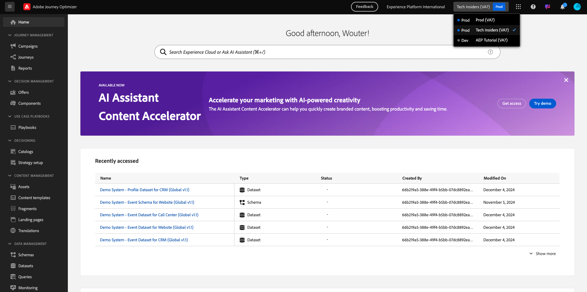
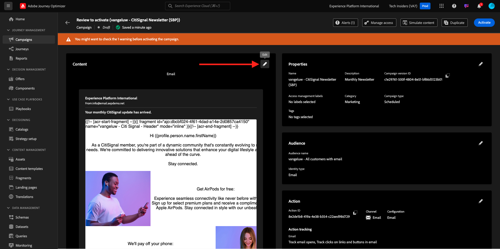
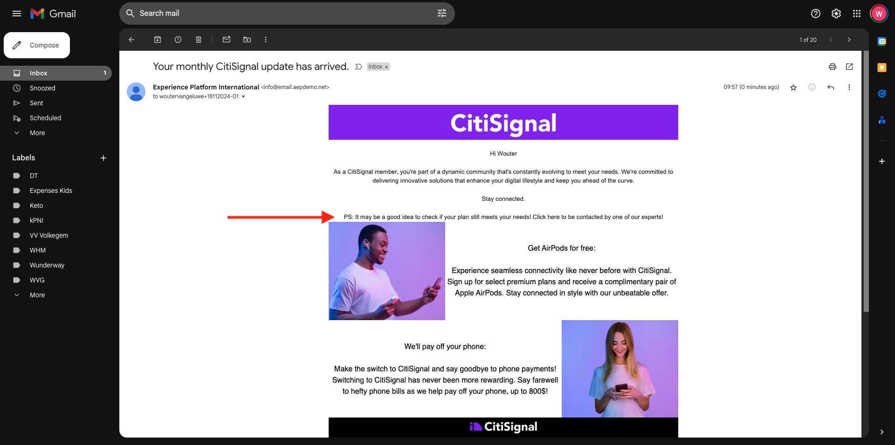

# 3.4.3 Appliquer une personnalisation basée sur les segments dans un e-mail

Connectez-vous à Adobe Experience Cloud en allant sur [Adobe Experience Cloud](https://experience.adobe.com?lang=fr). Cliquez sur **Adobe Journey Optimizer**.

Vous serez redirigé vers la vue **Accueil** dans Journey Optimizer. Avant de continuer, vous devez sélectionner un **sandbox**. Le sandbox à sélectionner est nommé ``--aepTenantId--``.

## 3.4.3.1 la personnalisation basée sur les segments

Dans cet exercice, vous allez améliorer l’e-mail de newsletter que vous avez créé dans l’exercice précédent avec un texte personnalisé basé sur l’appartenance à un segment.

Accédez à **Campagnes**. Recherchez le parcours de newsletter que vous avez créé dans l’exercice précédent. Recherchez `--aepUserLdap-- - CitiSignal Newsletter`. Cliquez avec le bouton droit de la souris sur le **de 3 points...**, puis cliquez sur **Dupliquer**.

Tu verras ça. Utilisez ceci pour le **Titre** : `--aepUserLdap-- - CitiSignal Newsletter (SBP)`. Cliquez sur **Dupliquer**.

Cliquez sur la campagne dupliquée pour l’ouvrir.

Cliquez sur **Modifier** pour modifier le contenu.

Cliquez sur **Modifier le corps de l’e-mail**.

Tu verras ça.

Ouvrez **Composants de contenu** et faites glisser une colonne **1:1** au-dessus de l’offre AirPods.

Faites glisser et déposez un composant **Texte** dans cette colonne 1:1.

Sélectionnez l’intégralité du texte par défaut et supprimez-le. Cliquez ensuite sur le bouton **Ajouter une personnalisation** dans la barre d’outils.

Tu verras ça. Dans le menu de gauche, cliquez sur **Audiences**.

Sélectionnez la `--aepUserLdap-- - Interest in Plans` du segment et cliquez sur l’icône **+** pour l’ajouter à la zone de travail.

Vous devez ensuite laisser la première ligne telle quelle et remplacer les lignes 2 et 3 par ce code :

``
    PS: It may be a good idea to check if your plan still meets your needs! Click here to be contacted by one of our experts!

    PS: Thanks for taking the time to read our newsletter. Here is a 10% promo code to use on the website: NEWSLETTER10

``

Tu auras alors ceci. Cliquez sur **Enregistrer**.

Remplacez l’alignement du texte par **Alignement centré**.

Vous pouvez maintenant enregistrer ce message en cliquant sur le bouton **Enregistrer** dans le coin supérieur droit. Cliquez ensuite sur **flèche** en regard du texte de l’objet dans le coin supérieur gauche.

Cliquez sur **Vérifier pour activer**.

Cliquez sur **Activer**.

Votre newsletter avec la personnalisation basée sur les segments est maintenant publiée. Votre newsletter sera envoyée par e-mail selon votre calendrier et votre parcours s’arrêtera dès que le dernier e-mail aura été envoyé.

Si vous remplissez les critères pour le segment qui a été utilisé, vous verrez ceci dans l’e-mail que vous recevrez :

Vous avez terminé cet exercice.

Étape suivante : [3.4.4 Configurer et utiliser des notifications push pour iOS](./ex4.md)

[Retour au module 3.4](./journeyoptimizer.md)

[Revenir à tous les modules](../../../overview.md)
