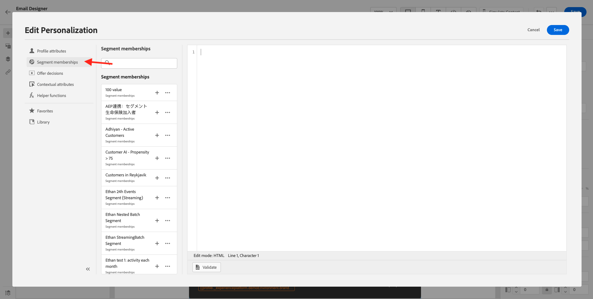

# 3.4.3 Appliquer la personnalisation à un email

Connectez-vous à Adobe Experience Cloud en vous rendant à [Adobe Experience Cloud](https://experience.adobe.com?lang=fr). Cliquez sur **Adobe Journey Optimizer**.

Vous serez redirigé vers la vue **Home** dans Journey Optimizer. Avant de continuer, vous devez sélectionner un **sandbox**. L’environnement de test à sélectionner est nommé ``--aepTenantId--``. Pour ce faire, cliquez sur le texte **[!UICONTROL Production Prod]** dans la ligne bleue en haut de votre écran.

## 3.4.3.1 Personnalisation basée sur les segments

Dans cet exercice, vous améliorerez votre message électronique de newsletter avec un texte personnalisé basé sur l’adhésion au segment.

Accédez à **Parcours**. Recherchez le parcours de newsletter que vous avez créé lors de l’exercice précédent. Recherchez `--demoProfileLdap-- - Newsletter`. Cliquez sur votre parcours pour l’ouvrir.

Vous verrez alors ceci. Cliquez sur **Dupliquer**.

Cliquez sur **Dupliquer**.

Sélectionnez votre action **Email** et cliquez sur **Modifier le contenu**.

Cliquez sur **Email Designer**.

Vous verrez alors ceci.

Ouvrez **Composants du contenu** et faites glisser un composant **Texte** sous le contenu actuel de la newsletter.

Sélectionnez l’intégralité du texte par défaut et supprimez-le. Cliquez ensuite sur le bouton **Ajouter la personnalisation** de la barre d’outils.

Vous verrez alors :

Dans le menu de gauche, cliquez sur **Adhésions au segment**.

>[!NOTE]
>
>Si vous ne trouvez pas votre segment dans cette liste, faites défiler la liste vers le bas pour trouver des instructions sur la manière de récupérer manuellement l’identifiant du segment.

Sélectionnez le segment `Luma - Women's Category Interest` et cliquez sur l’icône **+**, qui doit se présenter comme suit :

Vous devez ensuite laisser la première ligne telle quelle et remplacer la ligne 2 et la ligne 3 par ce code :

``
    Psssst... a private sale in the women category will launch soon, we will keep you posted

    Thanks for taking the time to read our newsletter. Here is a 10% promo code to use on the website: READER10

``

Vous obtiendrez alors ce qui suit :

Cliquez sur **Valider** pour vous assurer que le code est correct. Cliquez sur **Enregistrer**.

Vous pouvez désormais enregistrer ce message en cliquant sur le bouton **Enregistrer** dans le coin supérieur droit. Cliquez ensuite sur **Simuler le contenu**.

Sélectionnez l’un des profils que vous avez créés dans le cadre de ce tutoriel et cliquez sur **Aperçu**. Vous verrez alors le résultat de votre configuration.

Vous verrez alors ceci. Cliquez ensuite sur **Fermer**.

Revenez au tableau de bord des messages en cliquant sur la **flèche** en regard de l’objet du texte dans le coin supérieur gauche.

Cliquez sur la flèche dans le coin supérieur gauche pour revenir à votre parcours.

Cliquez sur **Ok** pour fermer votre action de courrier électronique.

Remplacez votre **Schedule** par **Once** et définissez une **date/heure**. Cliquez sur **OK**.

>[!NOTE]
>
>La date et l’heure d’envoi du message doivent être comprises dans plus d’une heure.

Cliquez sur le bouton **Publish** dans le parcours.

Dans la fenêtre contextuelle, cliquez de nouveau sur **Publish**.

Votre parcours de newsletter de base est maintenant publié. Votre message électronique de newsletter sera envoyé selon votre planning et votre parcours s’arrêtera dès que le dernier email aura été envoyé.

Vous avez terminé cet exercice.

Étape suivante : [3.4.4 Configuration et utilisation des notifications push pour iOS](./ex4.md)

[Revenir au module 3.4](./journeyoptimizer.md)

[Revenir à tous les modules](../../../overview.md)
