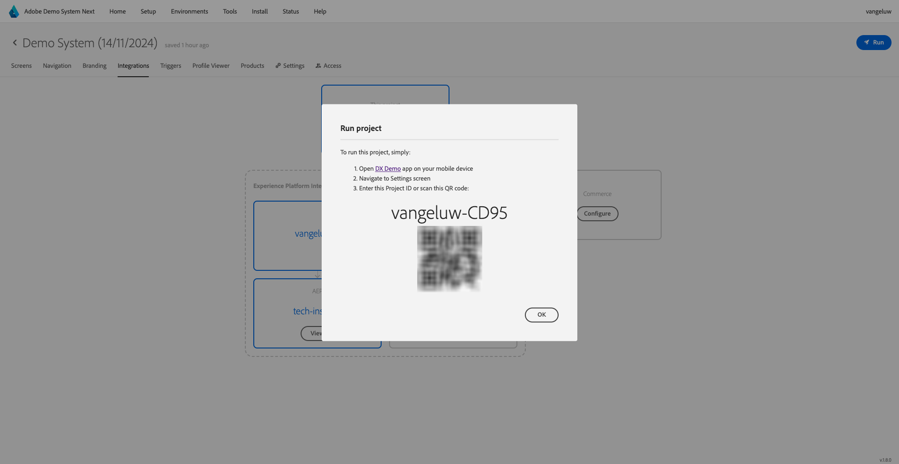
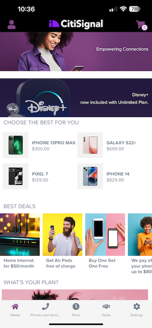
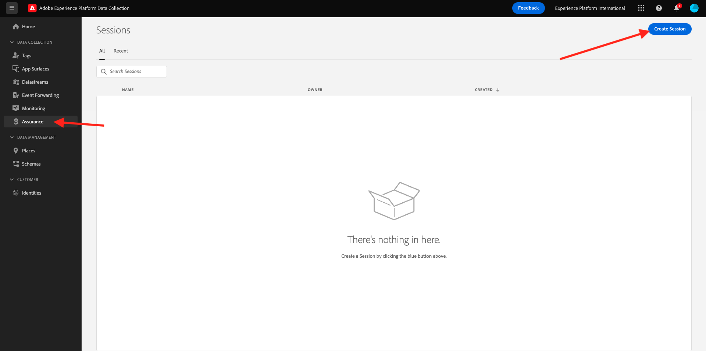
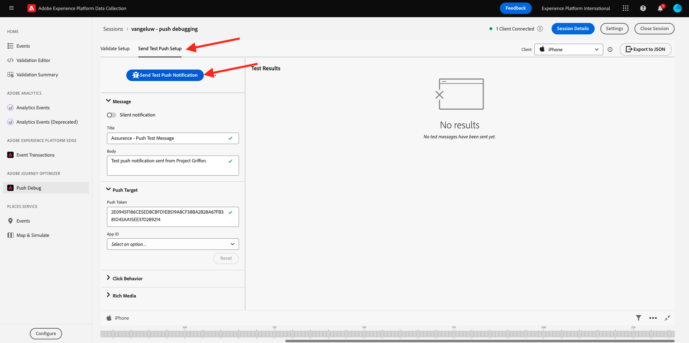
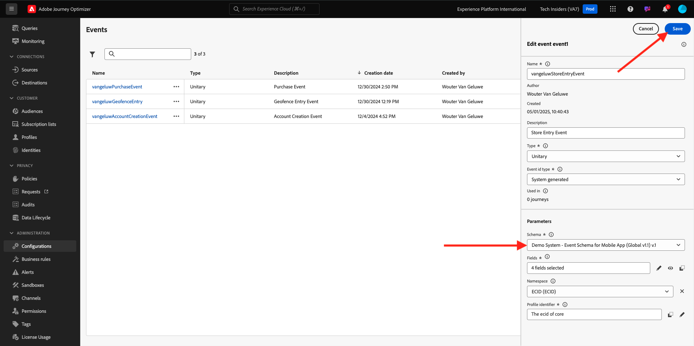

# 3.4.4 Configuration et utilisation des notifications push pour iOS

Pour utiliser les notifications push avec Adobe Journey Optimizer, il existe plusieurs paramètres à vérifier et à connaître.

Voici tous les paramètres à vérifier :

- Jeux de données et schémas dans Adobe Experience Platform
- Flux de données pour mobile
- Propriété de collecte de données pour mobile
- Surface de l’application pour les certificats push
- Test de votre configuration push à l’aide d’AEP Assurance

Examinons-les un par un.

Connectez-vous à Adobe Journey Optimizer en vous rendant à [Adobe Experience Cloud](https://experience.adobe.com?lang=fr). Cliquez sur **Journey Optimizer**.

Vous serez redirigé vers la vue **Home** dans Journey Optimizer. Tout d’abord, assurez-vous d’utiliser l’environnement de test approprié. L’environnement de test à utiliser s’appelle `--aepSandboxName--`. Pour passer d’un environnement de test à un autre, cliquez sur **Production Prod (VA7)** et sélectionnez l’environnement de test dans la liste. Dans cet exemple, l’environnement de test est nommé **AEP Enablement FY22**. Vous serez alors dans la vue **Home** de votre environnement de test `--aepSandboxName--`.

## 3.4.4.1 Jeux de données push

Adobe Journey Optimizer utilise des jeux de données pour stocker des éléments tels que les jetons push provenant d’appareils mobiles ou des interactions avec des messages push (par exemple : message envoyé, message ouvert, etc.) dans un jeu de données dans Adobe Journey Optimizer.

Vous pouvez trouver ces jeux de données en accédant à **[!UICONTROL Jeux de données]** dans le menu sur le côté gauche de votre écran. Pour afficher les jeux de données système, cliquez sur l’icône de filtre.

Activez l’option **Afficher les jeux de données système** et recherchez **AJO**. Vous verrez ensuite les jeux de données utilisés pour les notifications push.

## 3.4.4.2 Flux de données pour Mobile

Accédez à [https://experience.adobe.com/#/data-collection/](https://experience.adobe.com/#/data-collection/).

Dans le menu de gauche, accédez à **[!UICONTROL Datastream]** et recherchez votre flux de données que vous avez créé dans l’ [exercice 0.2](./../../../modules/gettingstarted/gettingstarted/ex2.md), intitulé `--aepUserLdap-- - Demo System Datastream (Mobile)`. Cliquez pour l’ouvrir.

Cliquez sur **Modifier** sur le service **Adobe Experience Platform**.

Vous verrez ensuite les paramètres de la banque de données qui ont été définis, ainsi que dans quels jeux de données et attributs de profil seront stockés.

Aucune modification n’est nécessaire. Votre flux de données est maintenant prêt à être utilisé dans votre propriété du client de collecte de données pour Mobile.

## 3.4.4.3 Vérification de la propriété de collecte de données pour Mobile

Accédez à [https://experience.adobe.com/#/data-collection/](https://experience.adobe.com/#/data-collection/). Dans le cadre de l’ [exercice 0.1](./../../../modules/gettingstarted/gettingstarted/ex1.md), 2 propriétés de collecte de données ont été créées.
Vous avez déjà utilisé ces propriétés du client de collecte de données dans le cadre des modules précédents.

Cliquez pour ouvrir la propriété Collecte de données pour mobile.

Dans la propriété Collecte de données, accédez à **Extensions**. Vous verrez ensuite les différentes extensions nécessaires pour l’application mobile. Cliquez pour ouvrir l’extension **Adobe Experience Platform Edge Network**.

Vous verrez ensuite que votre flux de données pour mobile est lié ici. Cliquez ensuite sur **Annuler** pour revenir à l’aperçu de vos extensions.

Vous serez alors de retour ici. Vous verrez l’extension pour **AEP Assurance**. AEP Assurance vous permet d’inspecter, de tester, de simuler et de valider la manière dont vous collectez des données ou diffusez des expériences dans votre application mobile. Vous pouvez en savoir plus sur AEP Assurance et Project Griffon ici [https://aep-sdks.gitbook.io/docs/beta/project-griffon](https://aep-sdks.gitbook.io/docs/beta/project-griffon).

Cliquez ensuite sur **Configurer** pour ouvrir l’extension **Adobe Journey Optimizer**.

Vous verrez ensuite que c’est là que le jeu de données pour le suivi des événements push est lié.

Il n’est pas nécessaire d’apporter des modifications à votre propriété de collecte de données.

## 3.4.4.4 Vérification de la configuration de la surface de l’application

Accédez à [https://experience.adobe.com/#/data-collection/](https://experience.adobe.com/#/data-collection/). Dans le menu de gauche, accédez à **App Surfaces** et ouvrez, la surface de l’application pour **DX Demo App APNS**.

Vous verrez ensuite la surface d’application configurée pour iOS et Android.

## 3.4.4.5 Test de la configuration des notifications push à l’aide d’AEP Assurance.

Une fois l’application installée, elle se trouve sur l’écran d’accueil de votre appareil. Cliquez sur l’icône pour ouvrir l’application.

Lorsque vous utilisez l’application pour la première fois, vous serez invité à vous connecter à l’aide de votre Adobe ID. Terminez le processus de connexion.

Une fois connecté, une notification vous demande l’autorisation d’envoyer des notifications. Nous enverrons des notifications dans le cadre du tutoriel, alors cliquez sur **Autoriser**.

Vous verrez ensuite la page d’accueil de l’application. Accédez à **Paramètres**.

Dans les paramètres, vous verrez qu’actuellement un **projet public** est chargé dans l’application. Cliquez sur **Projet personnalisé**.

Vous pouvez désormais charger un projet personnalisé. Cliquez sur le code QR pour charger facilement votre projet.

Après l’exercice 0.1, vous obteniez ce résultat. Cliquez pour ouvrir le **projet de vente au détail mobile** qui a été créé pour vous.

Si vous avez accidentellement fermé la fenêtre de votre navigateur, ou pour de futures sessions de démonstration ou d’activation, vous pouvez également accéder au projet de votre site web en accédant à [https://builder.adobedemo.com/projects](https://builder.adobedemo.com/projects). Une fois connecté avec votre Adobe ID, vous verrez ceci. Cliquez sur votre projet d’application mobile pour l’ouvrir.

Vous verrez alors ceci. Cliquez sur **Intégrations**.

Vous devez sélectionner la propriété Collecte de données pour mobile créée dans l’exercice 0.1. Cliquez ensuite sur **Exécuter**.

Vous verrez alors cette fenêtre contextuelle, qui contient un code QR. Analysez ce code QR depuis l’application mobile.

L’ID de projet s’affiche alors dans l’application, après quoi vous pouvez cliquer sur **Enregistrer**.

Maintenant, revenez à **Home** dans l’application. Votre application est maintenant prête à être utilisée.

Vous devez maintenant analyser un code QR pour connecter votre appareil mobile à votre session AEP Assurance.

Pour démarrer une session AEP Assurance, accédez à [https://experience.adobe.com/#/@experienceplatform/griffon](https://experience.adobe.com/#/@experienceplatform/griffon). Cliquez sur **Créer une session**.

Cliquez sur **Démarrer**.

Remplissez les valeurs :

- Nom de la session : utilisez `--aepUserLdap-- - push debugging` et remplacez ldap par votre ldap
- URL de base : utilisez **dxdemo://default**

Cliquez sur **Suivant**.

Vous verrez alors un code QR sur votre écran, que vous devez analyser avec votre appareil iOS.

Sur votre appareil mobile, ouvrez l’application d’appareil photo et analysez le code QR affiché par AEP Assurance.

Vous verrez alors un écran contextuel vous demandant de saisir le code PIN. Copiez le code PIN de votre écran AEP Assurance et cliquez sur **Se connecter**.

Vous verrez alors ceci.

Dans AEP Assurance, vous verrez désormais qu’un appareil est connecté à la session AEP Assurance.

Accédez à **Débogage push**. Vous verrez quelque chose comme ça.

Quelques explications :

- La première colonne, **Client**, affiche les identifiants disponibles sur votre appareil iOS. Vous verrez un ECID et un jeton push.
- La deuxième colonne contient des informations sur le **profil**, ainsi que des informations supplémentaires sur la plateforme dans laquelle réside le jeton push (APNS ou APNSSandbox). Si vous cliquez sur le bouton **Profil Inspect** , vous serez dirigé vers Adobe Experience Platform et vous verrez le profil client en temps réel complet.
- La troisième colonne présente la **configuration de l’application**, qui a été configurée dans le cadre de l’exercice **3.4.5.4 Créer une configuration d’application dans Launch**

Pour tester la configuration push, cliquez sur le bouton **Envoyer la notification push** .

Vous devez vous assurer que l’application **DX Demo** n’est pas ouverte au moment où vous cliquez sur le bouton **Envoyer la notification push** . Si l’application est ouverte, la notification push peut être reçue en arrière-plan et ne sera pas visible.

Une notification push comme celle-ci apparaîtra alors sur votre appareil mobile.

Si vous avez reçu la notification push, cela signifie que votre configuration est correcte et fonctionne correctement.

## 3.4.4.6 Création d’un événement

Dans le menu, accédez à **Administration de Parcours** et cliquez sur **Gérer** sous **Événements**.

Sur l’écran **Events**, une vue similaire s’affiche. Cliquez sur **Créer un événement**.

Une configuration d’événement vide s’affiche alors.

Tout d’abord, attribuez un nom à votre événement comme suit : `--aepUserLdap--StoreEntryEvent` et définissez la description sur `Store Entry Event`.

La sélection **Type d’événement** suivante est disponible. Sélectionnez **Unitary**.

La sélection **Type d’ID d’événement** suivante est disponible. Sélectionnez **Généré par le système**

La sélection de schéma suivante s’affiche. Un schéma a été préparé pour cet exercice. Utilisez le schéma `Demo System - Event Schema for Mobile App (Global v1.1) v.1`.

Après avoir sélectionné le schéma, plusieurs champs sont sélectionnés dans la section **Payload**. Votre événement est maintenant entièrement configuré.

Vous devriez alors voir ceci. Cliquez sur **Enregistrer**.

Votre événement est maintenant configuré et enregistré. Cliquez à nouveau sur votre événement pour ouvrir à nouveau l’écran **Modifier l’événement** .

Passez la souris sur le champ **Payload** et cliquez sur l’icône **Afficher la payload** .

Vous verrez maintenant un exemple de la charge utile attendue.

Votre événement comporte un eventID d’orchestration unique, que vous pouvez trouver en faisant défiler la page vers le bas dans cette payload jusqu’à ce que vous voyiez `_experience.campaign.orchestration.eventID`.

L’identifiant d’événement est ce qui doit être envoyé à Adobe Experience Platform pour déclencher le Parcours que vous allez créer à l’étape suivante. Notez cet eventID, car vous en aurez besoin à l’étape suivante.
`"eventID": "e3a8f0bdc0b609667cd96a72a6b1e5aafa0ddaf6ccf121c574e6a2030860a633"`

Cliquez sur **Ok**, puis sur **Annuler**.

## 3.4.4.7 Créer un parcours

Dans le menu, accédez à **Parcours** et cliquez sur **Créer un Parcours**.

Vous verrez alors ceci. Donnez un nom à votre parcours. Utilisez `--aepUserLdap-- - Store Entry journey`. Cliquez sur **OK**.

Tout d’abord, vous devez ajouter votre événement comme point de départ de votre parcours. Recherchez votre événement `--aepUserLdap--StoreEntryEvent` et faites-le glisser sur la zone de travail. Cliquez sur **OK**.

Ensuite, sous **Actions**, recherchez l’action **Push** .
Faites glisser l’action **Push** sur la zone de travail.

Définissez la **catégorie** sur **Marketing** et sélectionnez une surface push qui vous permet d’envoyer des notifications push. Dans ce cas, la surface de l’email à sélectionner est **Push-iOS-Android**.

L’étape suivante consiste à créer votre message. Pour ce faire, cliquez sur **Modifier le contenu**.

Vous verrez alors ceci. Cliquez sur l&#39;icône **personalization** pour le champ **Title**.

Vous verrez alors ceci. Vous pouvez désormais sélectionner directement n’importe quel attribut de profil dans Real-time Customer Profile.

Recherchez le champ **Prénom**, puis cliquez sur l’icône **+** en regard du champ **Prénom**. Vous verrez ensuite le jeton de personnalisation pour le prénom ajouté : **{{profile.person.name.firstName}}**.

Ajoutez ensuite le texte **, bienvenue dans notre boutique !** derrière **{{profile.person.name.firstName}}**.

Cliquez sur **Enregistrer**.

Vous avez maintenant ceci. Cliquez sur l’icône **personalization** pour le champ **Body**.

Saisissez ce texte **Cliquez ici pour obtenir une remise de 10 % lorsque vous achetez aujourd’hui !** et cliquez sur **Enregistrer**.

Vous aurez alors ceci. Cliquez sur la flèche dans le coin supérieur gauche pour revenir à votre parcours.

Cliquez sur **OK** pour fermer votre action push.

Cliquez sur **Publier**.

Cliquez de nouveau sur **Publish**.

Votre parcours est maintenant publié.

## 3.4.4.8 Test de votre parcours et de votre message push

Dans votre application mobile DX Demo 2.0, accédez à l’écran **Settings** . Cliquez sur le bouton **Stocker l’entrée** .

>[!NOTE]
>
>Le bouton **Entrée de magasin** est actuellement en cours de mise en oeuvre. Vous ne le trouverez pas encore dans l’application.

Veillez à fermer l’application immédiatement après avoir cliqué sur l’icône **Entrée de la boutique** , sinon le message push ne s’affichera pas.

Au bout de quelques secondes, le message s’affiche.

Vous avez terminé cet exercice.

Étape suivante : [3.4.5 Création d’un parcours d’événement professionnel](./ex5.md)

[Revenir au module 3.4](./journeyoptimizer.md)

[Revenir à tous les modules](../../../overview.md)
