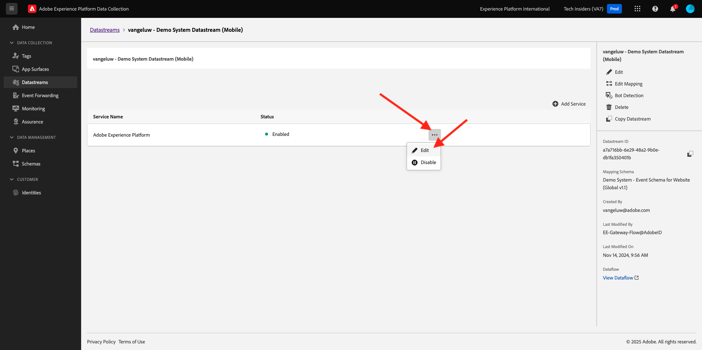
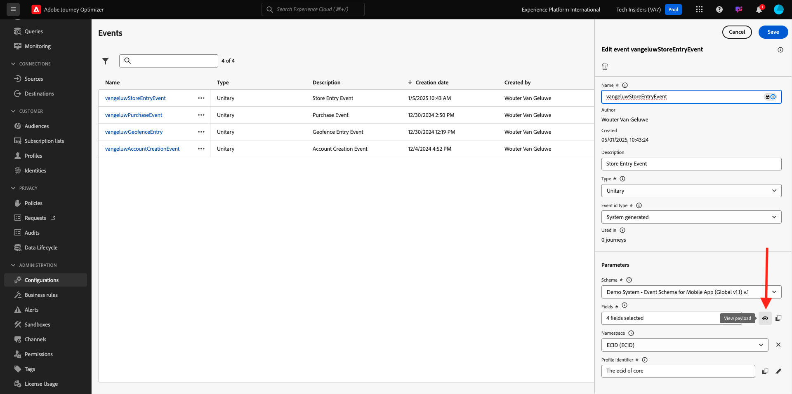
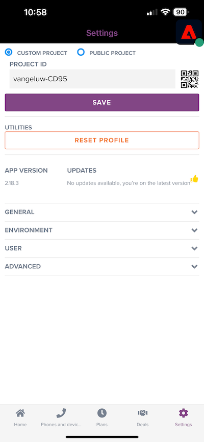

# 3.4.4 Configuration et utilisation des notifications push pour iOS

Pour utiliser les notifications push avec Adobe Journey Optimizer, il existe un certain nombre de paramètres à vérifier et à connaître.

Voici tous les paramètres à vérifier :

- Jeux de données et schémas dans Adobe Experience Platform
- Flux de données pour mobile
- Propriété de collecte de données pour mobile
- Surface d’application pour les certificats push
- Tester votre configuration push à l’aide d’AEP Assurance

Examinons-les une par une.

Connectez-vous à Adobe Journey Optimizer en allant sur [Adobe Experience Cloud](https://experience.adobe.com?lang=fr). Cliquez sur **Journey Optimizer**.

Vous serez redirigé vers la vue **Accueil** dans Journey Optimizer. Tout d’abord, assurez-vous d’utiliser le bon sandbox. Le sandbox à utiliser est appelé `--aepSandboxName--`. Vous serez alors dans la vue **Accueil** de votre `--aepSandboxName--` sandbox.

## Jeux de données 3.4.4.1 push

Adobe Journey Optimizer utilise des jeux de données pour stocker des éléments tels que les jetons push des appareils mobiles ou les interactions avec les messages push (comme : message envoyé, message ouvert, etc.) dans un jeu de données dans Adobe Journey Optimizer.

Vous pouvez trouver ces jeux de données en accédant à **[!UICONTROL Jeux de données]** dans le menu sur le côté gauche de l’écran. Pour afficher les jeux de données système, cliquez sur l’icône de filtre.

Activez l’option **Afficher les jeux de données système** et recherchez **AJO**. Les jeux de données utilisés pour les notifications push s’affichent ensuite.

## Flux de données 3.4.4.2 pour Mobile

Accédez à [https://experience.adobe.com/#/data-collection/](https://experience.adobe.com/#/data-collection/).

Dans le menu de gauche, accédez à **[!UICONTROL Flux de données]** et recherchez le flux de données que vous avez créé dans [Exercice 0.2](./../../../modules/gettingstarted/gettingstarted/ex2.md) et qui est nommé `--aepUserLdap-- - Demo System Datastream (Mobile)`. Cliquez pour l’ouvrir.

Cliquez sur **Modifier** sur le service **Adobe Experience Platform**.

Vous verrez ensuite les paramètres de train de données qui ont été définis et dans quels jeux de données les événements et les attributs de profil seront stockés.

Aucune modification n’est nécessaire, votre flux de données est maintenant prêt à être utilisé dans votre propriété Client de collecte de données pour Mobile.

## 3.4.4.3 votre propriété de collecte de données pour Mobile

Accédez à [https://experience.adobe.com/#/data-collection/](https://experience.adobe.com/#/data-collection/). Dans le cadre de l’[exercice 0.1](./../../../modules/gettingstarted/gettingstarted/ex1.md), 2 propriétés de collecte de données ont été créées.
Vous utilisez déjà ces propriétés du client de collecte de données dans le cadre de modules précédents.

Cliquez pour ouvrir la propriété Collecte de données pour les appareils mobiles.

Dans votre propriété Collecte de données, accédez à **Extensions**. Vous verrez ensuite les différentes extensions nécessaires pour l’application mobile. Cliquez pour ouvrir l’extension **Adobe Experience Platform Edge Network**.

Vous verrez alors que votre flux de données pour mobile est lié ici. Cliquez ensuite sur **Annuler** pour revenir à la présentation de vos extensions.

Tu reviendras ensuite ici. L’extension pour **AEP Assurance** s’affiche. AEP Assurance vous permet de contrôler, de tester, de simuler et de valider la manière dont vous collectez les données ou dont les expériences sont diffusées dans votre application mobile. Vous pouvez en savoir plus sur AEP Assurance et le projet Griffon ici [https://aep-sdks.gitbook.io/docs/beta/project-griffon](https://aep-sdks.gitbook.io/docs/beta/project-griffon).

Cliquez ensuite sur **Configurer** pour ouvrir l’extension **Adobe Journey Optimizer**.

Vous verrez ensuite que c’est là que le jeu de données pour le suivi des événements push est lié.

Il n’est pas nécessaire d’apporter des modifications à votre propriété de collecte de données.

## 3.4.4.4 Vérifier la configuration de votre Surface d’application

Accédez à [https://experience.adobe.com/#/data-collection/](https://experience.adobe.com/#/data-collection/). Dans le menu de gauche, accédez à **Surfaces d’application** et ouvrez la Surface d’application pour **DX Demo App APNS**.

Vous verrez ensuite la surface d’application configurée pour iOS et Android.

## 3.4.4.5 Testez la configuration des notifications push à l’aide d’AEP Assurance.

Une fois l&#39;application installée, vous la trouverez sur l&#39;écran d&#39;accueil de votre appareil. Cliquez sur l’icône pour ouvrir l’application.

Lorsque vous utilisez l’application pour la première fois, il vous sera demandé de vous connecter à l’aide de votre Adobe ID. Terminez le processus de connexion.

Après vous être connecté, une notification s’affichera pour vous demander l’autorisation d’envoyer des notifications. Nous enverrons des notifications dans le cadre du tutoriel. Cliquez donc sur **Autoriser**.

Vous verrez alors la page d’accueil de l’application. Accédez à **Paramètres**.

Dans les paramètres, vous verrez qu’un **Projet public** est actuellement chargé dans l’application. Cliquez sur **Projet personnalisé**.

Vous pouvez désormais charger un projet personnalisé. Cliquez sur le code QR pour charger facilement votre projet.

Après l&#39;exercice 0.1, vous avez obtenu ce résultat. Cliquez pour ouvrir le **Projet de vente au détail mobile** qui a été créé pour vous.

Si vous avez fermé accidentellement la fenêtre de votre navigateur ou pour des sessions de démonstration ou d’activation ultérieures, vous pouvez également accéder à votre projet de site web en accédant à [https://builder.adobedemo.com/projects](https://builder.adobedemo.com/projects). Après vous être connecté avec votre Adobe ID, voici ce que vous verrez. Cliquez sur votre projet d’application mobile pour l’ouvrir.

Tu verras ça. Cliquez sur **Intégrations**.

Vous devez sélectionner la propriété Collecte de données pour mobile qui a été créée dans l’exercice 0.1. Cliquez ensuite sur **Exécuter**.

Vous verrez ensuite cette fenêtre contextuelle, qui contient un code QR. Scannez ce code QR à partir de l’application mobile.

Votre ID de projet s’affichera alors dans l’application, après quoi vous pourrez cliquer sur **Enregistrer**.

Maintenant, revenez à **Accueil** dans l’application. Votre application est maintenant prête à être utilisée.

Vous devez maintenant scanner un code QR pour connecter votre appareil mobile à votre session AEP Assurance.

Pour démarrer une session AEP Assurance, accédez à [https://experience.adobe.com/#/@experienceplatform/griffon](https://experience.adobe.com/#/@experienceplatform/griffon). Cliquez sur **Créer une session**.

Cliquez sur **Démarrer**.

Renseignez les valeurs :

- Nom de la session : utilisez `--aepUserLdap-- - push debugging` et remplacez ldap par votre ldap.
- URL de base : utiliser **dxdemo://default**

Cliquez sur **Suivant**.

Un code QR s’affiche alors à l’écran, que vous devez numériser avec votre appareil iOS.

Sur votre appareil mobile, ouvrez l’application de caméra et numérisez le code QR affiché par AEP Assurance.

Vous verrez alors un écran contextuel, vous demandant de saisir le code PIN. Copiez le code PIN de votre écran AEP Assurance et cliquez sur **Se connecter**.

Tu verras ça.

Dans AEP Assurance, vous verrez désormais qu’un appareil est connecté à la session AEP Assurance.

Accédez à **Push Debug**. Vous verrez quelque chose comme ça.

Quelques explications :

- La première colonne, **Client**, affiche les identifiants disponibles sur votre appareil iOS. Un ECID et un jeton push s’affichent.
- La deuxième colonne affiche des informations **Profil**, avec des informations supplémentaires sur la plateforme sur laquelle réside le jeton push (APNS ou APNSSandbox). Si vous cliquez sur le bouton **Profil Inspect**, vous accédez à Adobe Experience Platform et le profil client en temps réel complet s’affiche.
- La 3e colonne affiche la **Configuration de l’application**, configurée dans le cadre de l’exercice **3.4.5.4 Créer une configuration d’application dans Launch**

Pour tester la configuration de votre notification push, cliquez sur le bouton **Envoyer une notification push**.

Vous devez vous assurer que l’application **DX Demo** n’est pas ouverte au moment où vous cliquez sur le bouton **Envoyer une notification push**. Si l’application est ouverte, la notification push peut être reçue en arrière-plan et n’est pas visible.

Une notification push comme celle-ci s’affiche alors sur votre appareil mobile.

Si vous avez reçu la notification push, cela signifie que votre configuration est correcte et qu’elle fonctionne correctement.

## 3.4.4.6 Créer un événement

Dans le menu, accédez à **Administration des Parcours** puis cliquez sur **Gérer** sous **Événements**.

Sur l’écran **Événements**, une vue similaire à celle-ci s’affiche. Cliquez sur **Créer un événement**.

Une configuration d’événement vide s’affiche alors.

Tout d’abord, donnez à votre Événement un Nom comme celui-ci : `--aepUserLdap--StoreEntryEvent` et définissez la description sur `Store Entry Event`.

La sélection suivante est **Type d’événement**. Sélectionnez **Unitaire**.

La sélection suivante est **Type d’identifiant d’événement**. Sélectionnez **Généré par le système**

Vient ensuite la sélection du schéma . Un schéma a été préparé pour cet exercice. Veuillez utiliser le `Demo System - Event Schema for Mobile App (Global v1.1) v.1` de schéma.

Après avoir sélectionné le schéma, vous verrez un certain nombre de champs sélectionnés dans la section **Payload**. Votre événement est maintenant entièrement configuré.

Vous devriez alors voir ceci. Cliquez sur **Enregistrer**.

Votre événement est maintenant configuré et enregistré. Cliquez à nouveau sur votre événement pour ouvrir à nouveau l’écran **Modifier l’événement**.

Pointez sur le champ **Payload** et cliquez sur l’icône **Afficher la payload**.

Un exemple de la payload attendue s’affiche maintenant.

Votre événement possède un eventID d’orchestration unique, que vous pouvez trouver en faisant défiler cette payload jusqu’à ce que vous voyiez `_experience.campaign.orchestration.eventID`.

L’identifiant d’événement est ce qui doit être envoyé à Adobe Experience Platform afin de déclencher le Parcours que vous allez créer à l’étape suivante. Notez cet eventID, car vous en aurez besoin à l’étape suivante.
`"eventID": "e3a8f0bdc0b609667cd96a72a6b1e5aafa0ddaf6ccf121c574e6a2030860a633"`

Cliquez sur **Ok**, puis sur **Annuler**.

## 3.4.4.7 Créer un parcours

Dans le menu, accédez à **Parcours** puis cliquez sur **Créer un Parcours**.

Tu verras ça. Donnez un nom à votre parcours. Utilisez `--aepUserLdap-- - Store Entry journey`. Cliquez sur **OK**.

Tout d’abord, vous devez ajouter votre événement comme point de départ de votre parcours. Recherchez le `--aepUserLdap--StoreEntryEvent` de votre événement et glissez-déposez-le sur la zone de travail. Cliquez sur **OK**.

Ensuite, sous **Actions**, recherchez l’action **Push**.
Faites glisser et déposez l’action **Push** sur la zone de travail.

Définissez la **Catégorie** sur **Marketing** et sélectionnez une surface push qui vous permet d’envoyer des notifications push. Dans ce cas, la surface d’email à sélectionner est **Push-iOS-Android**.

L’étape suivante consiste à créer votre message. Pour ce faire, cliquez sur **Modifier le contenu**.

Tu verras ça. Cliquez sur l’icône **personnalisation** pour le champ **Titre**.

Tu verras ça. Vous pouvez désormais sélectionner directement n’importe quel attribut de profil du profil client en temps réel.

Recherchez le champ **Prénom**, puis cliquez sur l’icône **+** en regard du champ **Prénom**. Le jeton de personnalisation du prénom ajouté s’affiche alors : **{{profile.person.name.firstName}}**.

Ensuite, ajoutez le texte **, bienvenue dans notre boutique !** derrière **{{profile.person.name.firstName}}**.

Cliquez sur **Enregistrer**.

Vous l&#39;avez maintenant. Cliquez sur l’icône **personnalisation** du champ **Corps**.

Entrez ce texte **Cliquez ici pour obtenir une réduction de 10 % lorsque vous achetez aujourd&#39;hui !** et cliquez sur **Enregistrer**.

Tu auras alors ceci. Cliquez sur la flèche dans le coin supérieur gauche pour revenir au parcours.

Cliquez sur **OK** pour fermer votre action push.

Cliquez sur **Publier**.

Cliquez de nouveau sur **Publish**.

Votre parcours est maintenant publié.

## 3.4.4.8 Tester votre parcours et votre message push

Dans votre application mobile DX Demo 2.0, accédez à l’écran **Paramètres**. Cliquez sur le bouton **Entrée de la boutique**.

>[!NOTE]
>
>Le bouton **Entrée de magasin** est en cours d’implémentation. Vous ne le trouverez pas encore dans l’application.

Veillez à fermer l’application immédiatement après avoir cliqué sur l’icône **Entrée de la boutique**, sinon le message push ne s’affichera pas.

Au bout de quelques secondes, le message s’affiche.

Vous avez terminé cet exercice.

Étape suivante : [3.4.5 Création d’un parcours d’événement métier](./ex5.md)

[Retour au module 3.4](./journeyoptimizer.md)

[Revenir à tous les modules](../../../overview.md)
