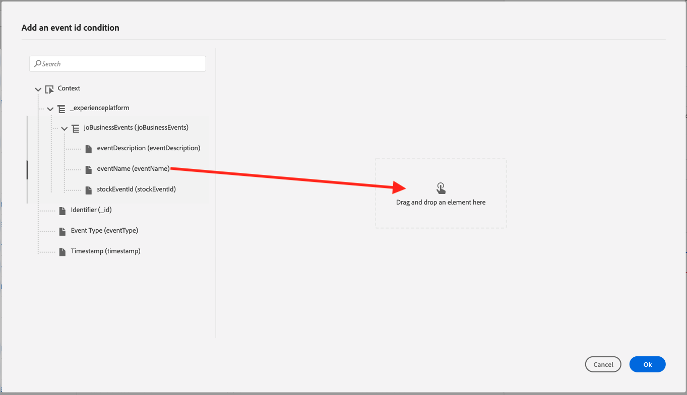
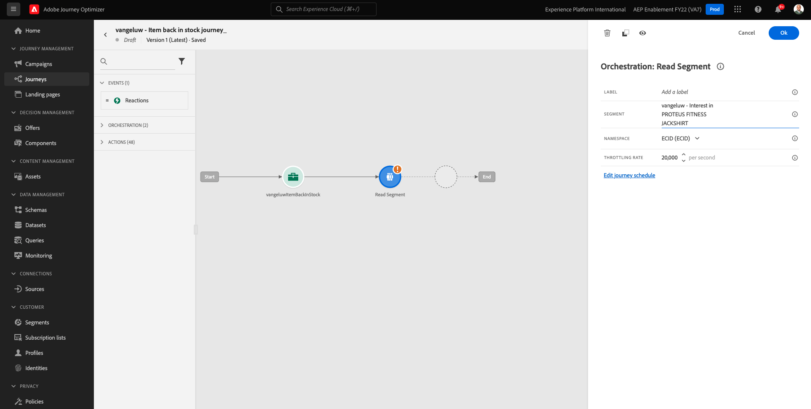
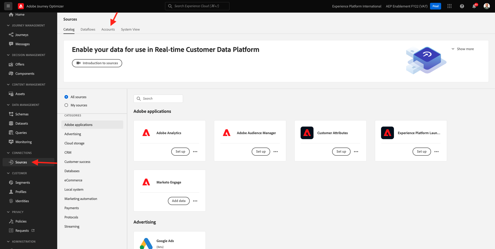
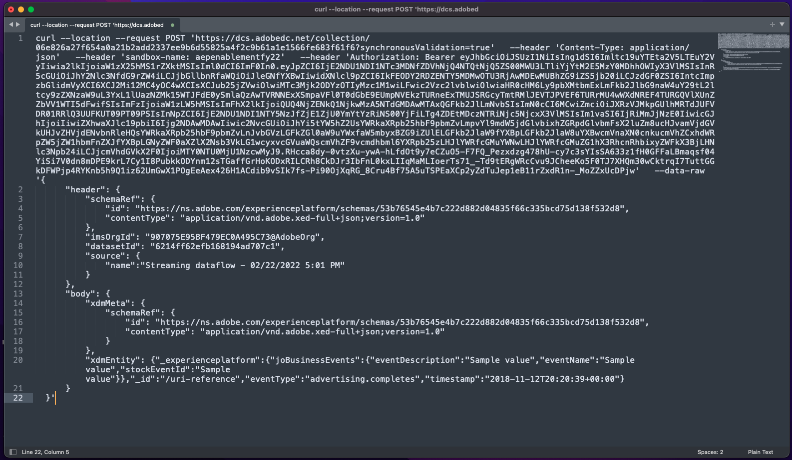

# 3.4.5 Création d’un parcours d’événement métier

Connectez-vous à Adobe Journey Optimizer en allant sur [Adobe Experience Cloud](https://experience.adobe.com?lang=fr). Cliquez sur **Journey Optimizer**.


Vous serez redirigé vers la vue **Accueil** dans Journey Optimizer. Tout d’abord, assurez-vous d’utiliser le bon sandbox. Le sandbox à utiliser est appelé `--aepSandboxName--`. Vous serez alors dans la vue **Accueil** de votre `--aepSandboxName--` sandbox.


## 3.4.5.1 Créer un événement métier

Dans le menu de gauche, cliquez sur **Configurations**. Cliquez sur le bouton **Gérer** à l’intérieur de la carte **Événements**.


Les événements métier constituent un nouveau type d’événement que vous pouvez créer dans Journey Optimizer. Contrairement aux événements **unitaires** que vous avez créés dans les modules précédents, les événements métier ne sont pas déclenchés par le client, mais par l’organisation. Vous allez maintenant créer votre événement métier.

Cliquez sur **Créer un événement**.


Saisissez les valeurs suivantes dans le formulaire de création d’événement :

- **Nom** : `--aepUserLdap--ItemBackInStock`. Par exemple : **vangeluwItemBackInStock**
- **Description** : cet événement est déclenché lorsqu’un produit est de nouveau en stock
- **Type** : sélectionnez **Métier** dans la liste déroulante


Pour le schéma, sélectionnez **Système de démonstration - Schéma d’événement pour les événements métier JO (global v1.1) v.1**. Vous devez maintenant sélectionner les champs du schéma dont vous avez besoin pour notre cas d’utilisation.


Procédez comme suit :

Cliquez sur l’icône **crayon** dans le champ où il est indiqué champ **1 sélectionné**.


Sélectionnez tous les champs disponibles dans le schéma, puis cliquez sur **OK**.


Pour la condition : vous devez spécifier quels enregistrements de ce schéma déclencheront l&#39;événement métier.

Procédez comme suit :

Cliquez sur l’icône **crayon** dans le champ où il est indiqué **Ajouter une condition**.


Sur le côté gauche, développez l’objet `--aepTenantId--`, développez l’objet **joBusinessEvents** et faites glisser et déposez le champ **eventName** sur la zone de travail.



Pour le champ **eventName**, saisissez la valeur suivante : `--aepUserLdap--ItemBackInStock`. Par exemple : vangeluxItemBackInStock.
Cliquez sur **OK**.


Cliquez sur **OK**.


Enfin, votre formulaire de création d’événement doit ressembler à ceci. Cliquez sur **Enregistrer** pour enregistrer votre événement métier.


## 3.4.5.2 Créer un parcours d’événement métier

Vous pouvez désormais exploiter cet événement métier et le message dans un parcours. Accédez à **Parcours**. Cliquez sur **Créer un Parcours**.


Sur la droite, vous verrez un formulaire dans lequel vous devez spécifier le nom et la description du parcours. Saisissez les valeurs suivantes :

- **Nom** : `--aepUserLdap-- - Item back in stock journey`. Par exemple : vangeluw - Article de retour en stock parcours
- **Description** : ce parcours envoie un SMS lorsqu’un article est de nouveau en stock aux visiteurs qui ont montré un intérêt.

Cliquez sur **OK**.


Dans le menu de gauche, sous **Événements**, recherchez votre ldap. Vous trouverez les `--aepUserLdap--ItemBackInStock` d’événement métier créées précédemment. Faites glisser et déposez cet événement sur la zone de travail, car il s’agira du point de départ du parcours.


Comme vous pouvez le constater, une activité **Lecture d’audience** a automatiquement été ajoutée à la zone de travail. En effet, les événements métier envoient uniquement un déclencheur pour que le parcours lise une audience spécifique, qui récupère alors la liste des profils de ce parcours.

Cliquez sur l’activité **Lecture d’audience**.
La configuration **Lecture d’audience** exige que vous sélectionniez l’audience à avertir de l’événement métier qui vient de se produire. Cliquez sur le champ **Sélectionner une audience**.


Dans la fenêtre contextuelle **Sélection d’une audience**, recherchez votre ldap et sélectionnez l’audience que vous avez créée dans [Module 2.3 - Real-time CDP - Création d’une audience et effectuez une action](./../../../modules/rtcdp-b2c/module2.3/real-time-cdp-build-a-segment-take-action.md) appelée `--aepUserLdap-- - Interest in Galaxy S24`. Cliquez sur **Enregistrer**.


Cliquez ensuite sur **OK**.



L’étape suivante consiste à effectuer un glisser-déposer de l’action que nous voulons effectuer dans ce parcours. Sélectionnez l&#39;action **SMS**, puis faites-la glisser après la condition que vous venez d&#39;ajouter.


Définissez la **Catégorie** sur **Marketing** et sélectionnez une surface de sms qui vous permet d’envoyer des sms. Dans ce cas, la surface d’e-mail à sélectionner est **SMS**.


L’étape suivante consiste à créer votre message. Pour ce faire, cliquez sur **Modifier le contenu**.


Le tableau de bord des messages s’affiche maintenant et vous pouvez y configurer le texte de votre SMS. Cliquez sur la zone **Composer le message** pour créer votre message.


Saisissez le texte suivant : `Hi {{profile.person.name.firstName}}, the Proteus Fitness Jackshirt is back in stock at Luma.`. Cliquez sur **Enregistrer**.


Revenez au tableau de bord des messages en cliquant sur la **flèche** en regard du texte de l’objet dans le coin supérieur gauche.


L’action SMS terminée s’affiche maintenant. Cliquez sur **OK**.


Votre parcours est maintenant prêt à être publié. Cliquez sur **Publier**.


Cliquez de nouveau sur **Publish**.


Votre parcours est maintenant publié. Vous pouvez maintenant le tester.


## 3.4.5.3 Tester votre parcours d’événement métier

Vous allez maintenant simuler le réapprovisionnement d’un produit en ingérant un nouvel événement dans la version **1.1) du système de démonstration - Schéma d’événement pour les événements métier JO (version globale v1.1)** à l’aide de Postman.

Dans le menu de gauche, cliquez sur **Sources** puis sur l’onglet **Comptes**.



Dans l’onglet **Comptes**, vous trouverez le compte nommé **Journey Optimizer Business Events**. Cliquez dessus pour l’ouvrir.


Ce compte ne comporte qu’un seul flux de données. Cliquez sur le nom du flux de données pour le sélectionner.


Cliquez sur **Copier la payload du schéma** dans le menu de droite. Cette option copie l’intégralité de la commande **curl** pour insérer un enregistrement dans le **Système de démonstration - Schéma d’événement pour les événements métier JO (global v1.1) v.1** de votre presse-papiers.


Collez la commande Curl dans un éditeur de texte



Regardons de plus près cette demande,

- La demande du POST est envoyée à l’ID d’entrée DCS
- La requête fait référence au schéma, au jeu de données et à l’ID d’organisation.
- Enfin, il contient le nœud xdmEntity qui représente les données que nous voulons créer dans le jeu de données.

Vous devez maintenant remplacer la ligne de `xdmEntity` suivante...

```json
"xdmEntity": {
  "_experienceplatform": {
    "joBusinessEvents": {
      "eventDescription": "string",
      "eventName": "string",
      "stockEventId": "string"
    }
  },
  "_id": "/uri-reference",
  "eventType": "advertising.completes",
  "timestamp": "2018-11-12T20:20:39+00:00"
}
```

...par cette ligne, veillez à vérifier le champ eventName comme il devrait l’indiquer `--aepUserLdap--ItemBackInStock`, qui représente la condition que vous avez spécifiée dans votre événement métier pour déclencher votre parcours.

```json
"xdmEntity": {
  "_experienceplatform": {
    "joBusinessEvents": {
      "eventDescription": "Product Proteus Fitness Jackshirt is back in stock",
      "eventName": "--aepUserLdap--ItemBackInStock",
      "stockEventId": "1"
    }
  },
  "_id": "/uri-reference",
  "eventType": "productBackInStock",
  "timestamp": "2021-04-19T15:25:39+00:00"
}
```

La commande **curl** mise à jour doit se présenter comme suit :


Sélectionnez-les toutes et copiez-les dans le presse-papiers.

Ouvrez Postman. Dans la partie gauche de Postman, cliquez sur **Importer**.


Sélectionnez l&#39;onglet **Texte brut** et collez la commande précédemment copiée ici. Cliquez sur **Continuer**.


Cliquez sur **Importer**.


Postman a automatiquement converti la commande **curl** en commande REST prête à être déclenchée. Il vous suffit d’appuyer sur le bouton **Envoyer** pour demander la création de cet enregistrement dans le jeu de données.


Vérifiez que votre demande a bien été reçue. Recherchez un statut **200 OK** dans Postman.


Le SMS peut prendre quelques minutes pour arriver sur votre téléphone mobile. Si ce n&#39;est pas le cas, votre segment **Intérêt pour le Proteus Fitness Jackshirt** peut ne pas contenir un profil avec un téléphone mobile correct. Si oui, allez sur le site web de Luma, visitez le produit **Proteus Fitness Jackshirt** et inscrivez-vous en vous assurant de fournir le bon numéro de téléphone mobile.


Vous avez maintenant terminé cet exercice.

Étape suivante : [Résumé et avantages](./summary.md)

[Retour au module 3.4](./journeyoptimizer.md)

[Revenir à tous les modules](../../../overview.md)
