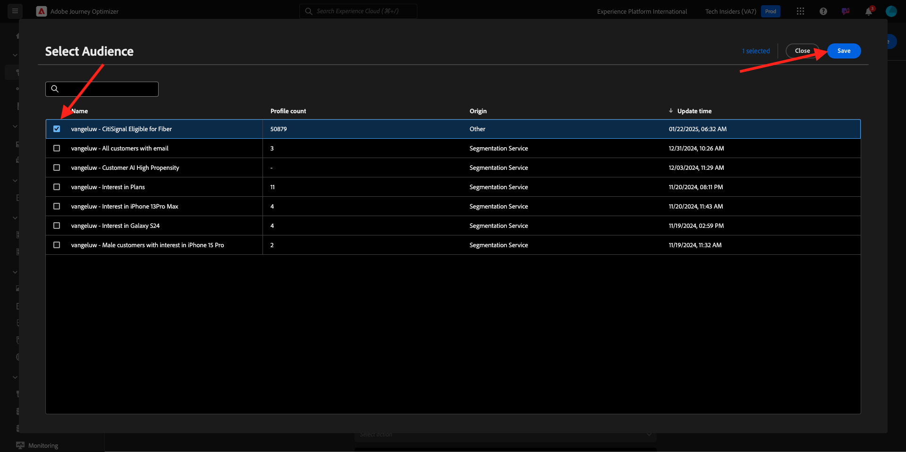
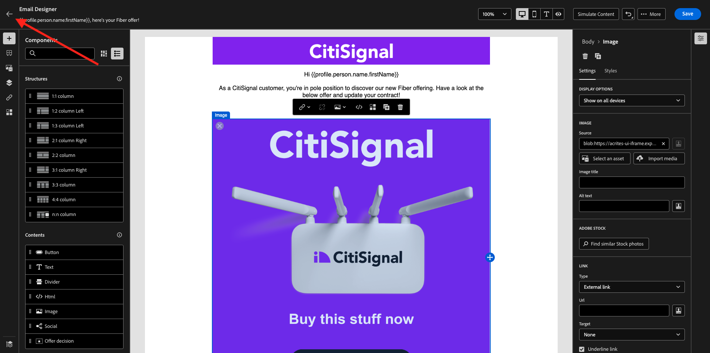
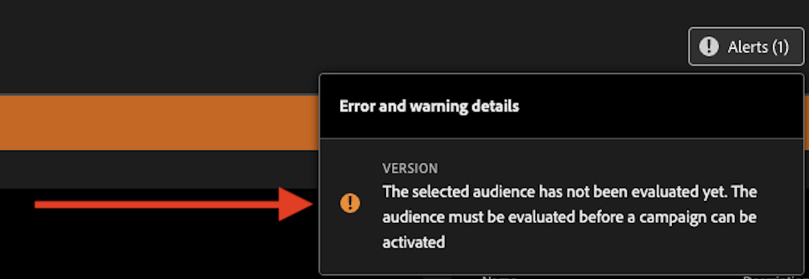

# 3.5.2 Création de votre campagne

Accédez à [https://experience.adobe.com/](https://experience.adobe.com/). Cliquez sur **Journey Optimizer**.


Vous serez redirigé vers la vue **Accueil** dans Journey Optimizer. Tout d’abord, assurez-vous d’utiliser le bon sandbox. Le sandbox à utiliser est appelé `--aepSandboxName--`.


>[!NOTE]
>
>Si vous avez déjà créé vos fragments d&#39;en-tête et de pied de page dans le cadre de l&#39;exercice [exercice 3.1.2.1](./../module3.1/ex2.md) et [exercice 3.1.2.2](./../module3.1/ex2.md), veuillez vous lancer dans l&#39;exercice 3.5.2.3 Créer une campagne Fibre. Ne plus créer de fragments d’en-tête et de pied de page.

## 3.5.2.1 Créer un fragment d’en-tête

Dans le menu de gauche, cliquez sur **Fragments**. Un fragment est un composant réutilisable dans Journey Optimizer, ce qui évite la duplication et facilite les modifications futures qui devraient avoir un impact sur tous les messages, telles que les modifications apportées à un en-tête ou à un pied de page dans un e-mail.

Cliquez sur **Créer un fragment**.


Saisissez le `--aepUserLdap-- - CitiSignal - Header` de nom et sélectionnez le **Type : fragment visuel**. Cliquez sur **Créer**.


Tu verras ça. Dans le menu de gauche, vous trouverez les composants de structure que vous pouvez utiliser pour définir la structure de l’e-mail (lignes et colonnes).

Faites glisser et déposez une colonne **1:1** du menu vers la zone de travail. Il s’agira de l’espace réservé pour l’image du logo.


Vous pouvez ensuite utiliser les composants de contenu pour ajouter du contenu à l’intérieur de ces blocs. Faites glisser et déposez un composant **Image** dans la première cellule de la première ligne. Cliquez sur **Parcourir**.


Une fenêtre contextuelle s’affiche alors pour vous montrer votre Media Library AEM Assets. Accédez au dossier **citi-signal-images**, cliquez pour sélectionner l’image **CitiSignal-Logo-White.png**, puis cliquez sur **Sélectionner**.

>[!NOTE]
>
>Si vous ne voyez pas les images Citi Signal dans votre bibliothèque AEM Assets, vous pouvez les trouver [ici](../../../assets/ajo/CitiSignal-images.zip). Téléchargez-les sur votre bureau, créez le dossier **citi-signal-images** et chargez toutes les images de ce dossier.


Tu verras ça. Votre image est blanche et ne s’affiche pas encore. Vous devez maintenant définir une couleur d’arrière-plan pour que l’image s’affiche correctement. Cliquez sur **Styles**, puis sur la zone **Couleur d’arrière-plan**.


Dans la fenêtre contextuelle, modifiez le code couleur **Hex** en **#8821F4** puis changez la sélection en cliquant dans le champ **100 %**. La nouvelle couleur appliquée à l’image s’affiche.


L&#39;image est aussi un peu trop grande en ce moment. Changeons la largeur en faisant glisser le sélecteur **Largeur** à **40 %**.


Votre fragment d’en-tête est maintenant prêt. Cliquez sur **Enregistrer** puis sur la flèche pour revenir à l’écran précédent.


Votre fragment doit être publié avant de pouvoir être utilisé. Cliquez sur **Publier**.


Au bout de quelques minutes, vous verrez que le statut de votre fragment est passé à **Actif**.
Vous devez ensuite créer un fragment pour le pied de page de vos e-mails. Cliquez sur **Créer un fragment**.


## 3.5.2.2 Créer le fragment de pied de page

Cliquez sur **Créer un fragment**.


Saisissez le `--aepUserLdap-- - CitiSignal - Footer` de nom et sélectionnez le **Type : fragment visuel**. Cliquez sur **Créer**.


Tu verras ça. Dans le menu de gauche, vous trouverez les composants de structure que vous pouvez utiliser pour définir la structure de l’e-mail (lignes et colonnes).

Faites glisser et déposez une colonne **1:1** du menu vers la zone de travail. Il s’agira de l’espace réservé pour le contenu du pied de page.


Vous pouvez ensuite utiliser les composants de contenu pour ajouter du contenu à l’intérieur de ces blocs. Effectuez un glisser-déposer d’un composant **HTML** dans la première cellule de la première ligne. Cliquez sur le composant pour le sélectionner, puis sur l’icône **&lt;/>** pour modifier le code source HTML.


Tu verras ça.


Copiez le fragment de code d’HTML ci-dessous et collez-le dans la fenêtre **Modifier l’HTML** de Journey Optimizer.

```html
<!--[if mso]><table cellpadding="0" cellspacing="0" border="0" width="100%"><tr><td style="text-align: center;" ><![endif]-->
<table style="width: auto; display: inline-block;">
  <tbody>
    <tr class="component-social-container">
      <td style="padding: 5px">
        <a style="text-decoration: none;" href="https://www.facebook.com" data-component-social-icon-id="facebook">
        
        </a>
      </td>
      <td style="padding: 5px">
        <a style="text-decoration: none;" href="https://x.com" data-component-social-icon-id="twitter">
        
        </a>
      </td>
      <td style="padding: 5px">
        <a style="text-decoration: none;" href="https://www.instagram.com" data-component-social-icon-id="instagram">
         
        </a>
      </td>
    </tr>
  </tbody>
</table>
<!--[if mso]></td></tr></table><![endif]-->
```

Tu auras alors ceci. Aux lignes 7, 12 et 17, vous devez maintenant insérer un fichier image à l’aide des ressources de votre bibliothèque AEM Assets.


Assurez-vous que votre curseur se trouve à la ligne 7, puis cliquez sur **Assets** dans le menu de gauche. Cliquez sur **Ouvrir le sélecteur de ressources** pour sélectionner votre image.


Ouvrez le dossier **citi-signal-images** et cliquez pour sélectionner l’image **Icon_Facebook.png**. Cliquez sur **Sélectionner**.


Assurez-vous que le curseur se trouve à la ligne 12, puis cliquez sur **Ouvrir le sélecteur de ressources** pour sélectionner votre image.


Ouvrez le dossier **citi-signal-images** et cliquez pour sélectionner l’image **Icon_X.png**. Cliquez sur **Sélectionner**.


Assurez-vous que le curseur se trouve à la ligne 17, puis cliquez sur **Ouvrir le sélecteur de ressources** pour sélectionner votre image.


Ouvrez le dossier **citi-signal-images** et cliquez pour sélectionner l’image **Icon_Instagram.png**. Cliquez sur **Sélectionner**.


Tu verras ça. Cliquez sur **Enregistrer**.


Vous serez alors de retour dans l&#39;éditeur. Vos icônes ne sont pas encore visibles car l’arrière-plan et les fichiers image sont tous en blanc. Pour modifier la couleur d’arrière-plan, accédez à **Styles**, puis cochez la case **Couleur d’arrière-plan**.


Remplacez le code couleur **Hex** par **#000000**.


Modifiez l&#39;alignement pour qu&#39;il soit centré.


Ajoutons d’autres parties au pied de page. Faites glisser et déposez un composant **Image** au-dessus du composant d’HTML que vous venez de créer. Cliquez sur **Parcourir**.


Cliquez pour sélectionner le fichier image **`CitiSignal_Footer_Logo.png`** et cliquez sur **Sélectionner**.


Accédez à **Styles** et cochez la case **Couleur d’arrière-plan**, nous allons à nouveau la modifier en noir. Remplacez le code couleur **Hex** par **#000000**.


Remplacez la largeur par **20 %** et vérifiez que l&#39;alignement est centré.


Ensuite, faites glisser et déposez un composant **Texte** sous le composant HTML que vous avez créé. Cliquez sur **Parcourir**.


Copiez et collez le texte ci-dessous en remplaçant le texte d’espace réservé.

```
1234 N. South Street, Anywhere, US 12345

Unsubscribe

©2024 CitiSignal, Inc and its affiliates. All rights reserved.
```

Définissez l’**Alignement du texte** à centrer.


Remplacez la **Couleur de police** par le blanc, **#FFFFFF**.


Remplacez **Couleur d’arrière-plan** par le noir, **#000000**.


Sélectionnez le texte **Se désabonner** dans le pied de page, puis cliquez sur l’icône **Lien** dans la barre de menus. Définissez le **Type** sur **Désinscription/opt-out externe** et définissez l’URL sur **https://aepdemo.net/unsubscribe.html** (le lien de désinscription ne peut pas contenir d’URL vide).


Tu auras alors ceci. Votre pied de page est maintenant prêt. Cliquez sur **Enregistrer** puis sur la flèche pour revenir à la page précédente.


Cliquez sur **Publish** pour publier votre pied de page afin de l&#39;utiliser dans un e-mail.


Au bout de quelques minutes, vous verrez que le statut de votre pied de page est passé à **Actif**.


## 3.5.2.3 Créer une campagne Fibre

Vous allez maintenant créer une campagne. Contrairement au parcours basé sur un événement de l’exercice précédent, qui repose sur les événements d’expérience entrants, les entrées ou les sorties d’audience pour déclencher un parcours pour un client spécifique, les campagnes ciblent une audience entière une fois avec du contenu unique tel que des newsletters, des promotions ponctuelles ou des informations génériques, ou périodiquement avec du contenu similaire envoyé régulièrement, par exemple des campagnes d’anniversaire et des rappels.

Dans le menu, accédez à **Campagnes** et cliquez sur **Créer une campagne**.


Sélectionnez **Planifié - Marketing** et cliquez sur **Créer**.


Dans l’écran de création de la campagne, configurez les éléments suivants :

- **Nom** : `--aepUserLdap-- - CitiSignal Fiber`.
- **Description** : Campagne Fibre
- **Type d’identité** : remplacez par E-mail .


Faites défiler jusqu’à **Action**. Pour l’**Action**, sélectionnez **E-mail**.


Sélectionnez ensuite une **Configuration du canal e-mail** existante. Vous allez modifier le contenu dans quelques minutes.


Faites défiler jusqu’à **Audience**. Cliquez sur **Sélectionner une audience**.


Pour l’audience **Audience**, sélectionnez l’audience que vous avez créée dans [1.3.3 Création d’une composition fédérée](./../../datacollection/module1.3/ex3.md), qui est nommée `--aepUserLdap-- - CitiSignal Eligible for Fiber`. Cliquez sur **Enregistrer**.



Faites défiler jusqu’à **Planification**. Pour le **Planning**, choisissez **À une date et une heure spécifiques** puis définissez l’heure de votre choix.


Vous pouvez maintenant commencer à créer l’e-mail lui-même. Faites défiler vers le haut, puis cliquez sur **Modifier le contenu**.


Tu verras ça. Pour la **ligne d’objet**, utilisez la commande suivante :

```
{{profile.person.name.firstName}}, here's your Fiber offer!
```

Cliquez ensuite sur **Modifier le corps de l’e-mail**.


Choisissez **Créer en partant de zéro**.


Tu verras ça. Dans le menu de gauche, vous trouverez les composants de structure que vous pouvez utiliser pour définir la structure de l’e-mail (lignes et colonnes).

Effectuez un glisser-déposer 4 fois par colonne **1:1** sur la zone de travail, ce qui devrait vous donner cette structure :


Dans le menu de gauche, accédez à **Fragments**. Faites glisser l’en-tête que vous avez créé précédemment sur le premier composant de la zone de travail. Faites glisser le pied de page que vous avez créé précédemment sur le dernier composant de la zone de travail.


Cliquez sur l’icône **+** dans le menu de gauche. Accédez à **Contenu** pour commencer à ajouter du contenu sur la zone de travail.


Faites glisser et déposez un composant **Texte** sur la deuxième ligne.


Sélectionnez le texte par défaut dans ce composant **Veuillez saisir votre texte ici.**-le et remplacez-le par le texte ci-dessous. Remplacez l’alignement par **Alignement centré**.

```javascript
Hi {{profile.person.name.firstName}}

As a CitiSignal customer, you're in pole position to discover our new Fiber offering. Have a look at the below offer and update your contract!

Stay connected.
```


Faites glisser et déposez un composant **Image** sur la 3e ligne. Cliquez sur **Parcourir**.


Sélectionnez le référentiel AEM Assets que vous avez créé dans le cadre des modules précédents. Ce référentiel doit être nommé `--aepUserLdap-- - Citi Signal dev`. Cliquez pour ouvrir la `--aepUserLdap-- - Workfront Assets` du dossier.


Cliquez pour sélectionner l’image **2048x2048_buynow.png**, puis cliquez sur **Sélectionner**.


Votre e-mail de newsletter de base est maintenant prêt. Cliquez sur **Enregistrer**.


Revenez au tableau de bord de la campagne en cliquant sur la **flèche** en regard du texte de l’objet dans le coin supérieur gauche.



Cliquez sur **Vérifier pour activer**.


Il se peut que vous obteniez cette erreur. Si c’est le cas, vous devrez peut-être attendre jusqu’à 24 heures avant que l’audience ait été évaluée, puis essayer d’activer à nouveau votre campagne. Vous devrez peut-être également mettre à jour le planning de votre campagne pour l’exécuter ultérieurement.



Cliquez sur **Activer**.


Une fois activée, votre campagne sera planifiée pour s’exécuter.


Vous avez terminé cet exercice.

## Étapes suivantes

Accédez à [3.5.3 Ajouter des langues à votre e-mail](./ex3.md)

Revenez au [module 3.5](./ajotranslationsvcs.md){target="_blank"}

Revenir à [Tous les modules](./../../../overview.md){target="_blank"}
