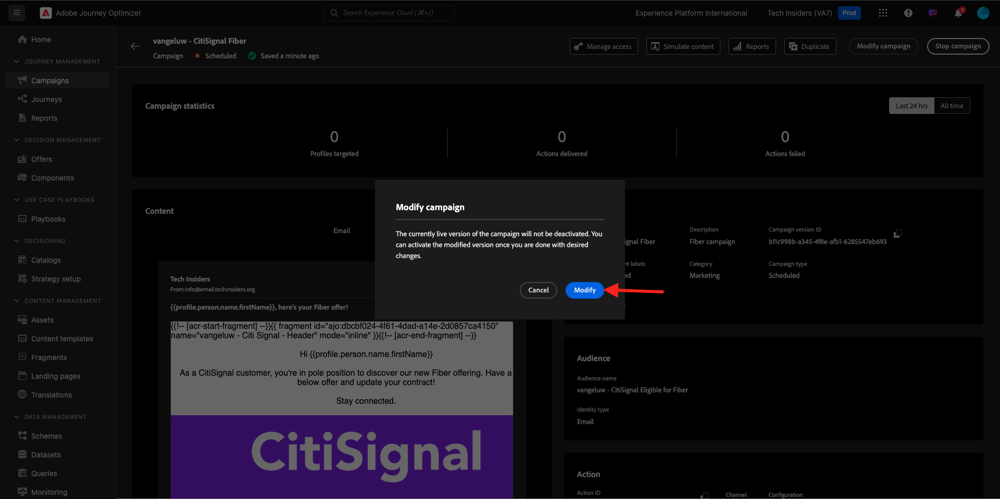
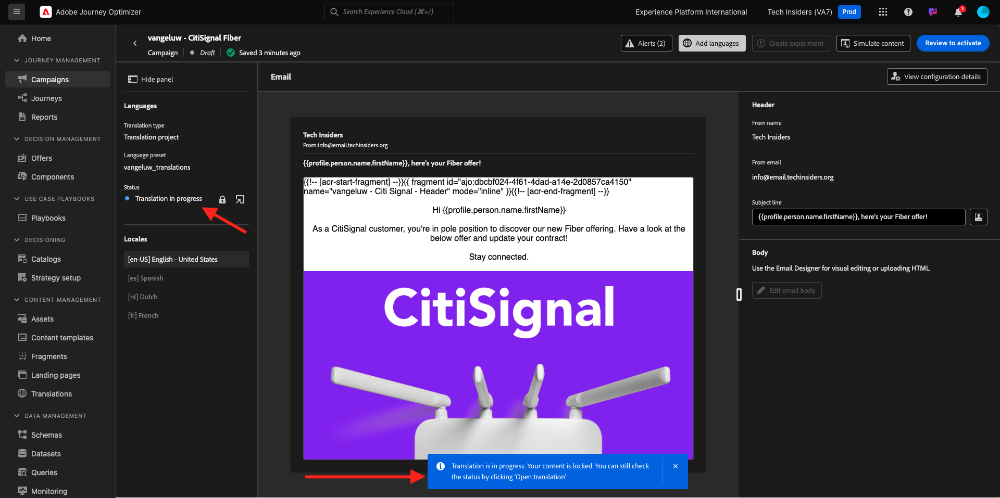

# 3.5.3 Ajouter des langues à votre e-mail

Accédez à [https://experience.adobe.com/](https://experience.adobe.com/). Cliquez sur **Journey Optimizer**.

Vous serez redirigé vers la vue **Accueil** dans Journey Optimizer. Tout d’abord, assurez-vous d’utiliser le bon sandbox. Le sandbox à utiliser est appelé `--aepSandboxName--`.

Accédez à **Campagnes** et cliquez pour ouvrir la campagne que vous venez de créer.

Cliquez sur **Modifier la campagne**.

Cliquez sur **Modifier**.

Faites défiler jusqu’à l’action **E-mail** et cliquez sur **Modifier le contenu**.

Cliquez sur **Ajouter des langues**.

Sélectionnez votre **Paramètres de langue**, qui sont nommés `--aepUserLdap--_translations`. Cliquez sur **Sélectionner**.

Vous devriez alors voir ceci. Cliquez sur **Envoyer à la traduction**.

Vous devriez alors voir un message comme celui-ci. Le workflow **Envoyer à la traduction** a maintenant démarré et sa réalisation prendra quelques minutes.
Vous verrez que le statut passe à **Traduction en cours**.

Au bout de quelques minutes, le statut du workflow de traduction passera à **Traduction terminée**.

Cliquez sur la traduction **`[es] Spanish`**. Le texte mis à jour s’affiche alors dans la prévisualisation de l’e-mail et également dans la **ligne d’objet**.
Si nécessaire, vous pouvez toujours vérifier et mettre à jour la traduction directement dans le champ **Objet**.

Cliquez sur **Modifier le corps de l’e-mail** pour réviser la traduction contenue dans l’e-mail.

Vous pouvez modifier le texte manuellement au cas où la traduction devrait être révisée.

Revenez à la présentation de la campagne en cliquant sur la **flèche** en regard du texte de l’objet dans le coin supérieur gauche.

Tu devrais alors être de retour ici. Il n’est pas nécessaire d’activer à nouveau cette campagne.

Revenez à la campagne en cliquant sur la **flèche** dans le coin supérieur gauche.

Vérifiez que votre campagne est à l’état **Arrêtée**.

Vous avez maintenant terminé cet exercice.

## Étapes suivantes

Accédez à [&#x200B; Résumé et avantages &#x200B;](./summary.md)

Revenez au [module 3.5](./ajotranslationsvcs.md){target="_blank"}

Revenir à [Tous les modules](./../../../overview.md){target="_blank"}
