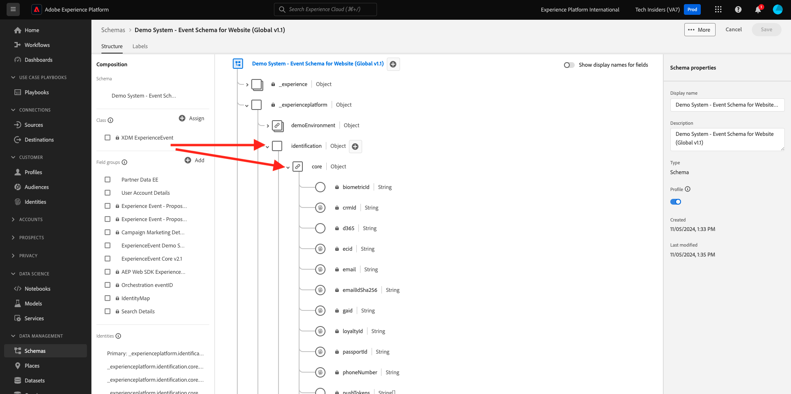

# 4.1.1 Customer Journey Analytics 101

## Objectifs

- Présentation du service d’application CJA
- Découvrez comment positionner CJA
- Comprendre le processus CJA : de la connexion aux données aux informations

## 4.1.1.1 Qu’est-ce que le Customer Journey Analytics ?

Customer Journey Analytics (CJA) fournit une boîte à outils aux équipes de Business Intelligence et de science des données pour l’assemblage et l’analyse de données cross-canal (en ligne et hors ligne). Les fonctionnalités de CJA offrent un contexte et une clarté pour le parcours client multi-canal complexe. Le contexte fourni permet d’obtenir des informations exploitables sur la suppression des points douloureux du processus de conversion des clients, ainsi que sur la conception et la diffusion d’expériences exceptionnelles pour les moments les plus importants.

CJA met Analysis Workspace au-dessus de Adobe Experience Platform. Adobe Experience Platform est le cerveau de la communication et de l’orchestration. Avec CJA, les marques peuvent maintenant contextualiser et visualiser toutes ces données, de sorte que les équipes d’affaires et d’Insight puissent en tirer des leçons en analysant le parcours client complet en ligne vers hors ligne.

Les équipes métier et Insight peuvent discuter avec CJA, poser des questions et obtenir des réponses à la volée avec l’interface utilisateur conviviale d’Analysis Workspace, accessible par glisser-déposer, pointer-cliquer.

## 4.1.1.2 Principaux avantages

Les trois principaux avantages pour les clients sont les suivants :

- la possibilité de rendre les informations disponibles à tous (c’est-à-dire la démocratisation de l’accès aux données) ;
- La possibilité de voir le client dans un parcours contextuel (c’est-à-dire que les données peuvent être visualisées de manière séquentielle, couvrant plusieurs canaux en ligne et hors ligne)
- La capacité d’exploiter la puissance des données sans avoir à utiliser (c’est-à-dire qu’elle permet aux êtres humains normaux d’utiliser des données pour déverrouiller des informations et des analyses profondes pour l’activation marketing).

## 4.1.1.3 Pourquoi choisir Customer Journey Analytics ?

CJA n’est pas destiné à remplacer une application de BI actuelle telle que Power BI, Microstratégie, Locker ou Tableau. Ces applications BI sont destinées à visualiser les données afin de créer des tableaux de bord d’entreprise afin que chaque membre de l’entreprise puisse rapidement consulter les mesures importantes.\
L’objectif de CJA est d’apporter un pouvoir d’analyse aux équipes marketing et commerciales en en faisant un outil d’analyse &quot;obligatoire&quot; pour ces acteurs.

Traditionnellement, les applications de BI sont incapables d’activer une véritable intelligence client :

- Ils ne peuvent pas effectuer d’attribution et ne font pas d’analyse de parcours client.
- Les applications de BI doivent connaître la question à l’avance.
- Les requêtes interactives sont limitées par la structure de la base de données
- Des compétences SQL sont requises.
- Les applications de BI ne vous permettent pas de demander pourquoi quelque chose s&#39;est produit.
- Les applications BI n’ont aucune connexion directe avec les points de contact clients.

En raison de ce qui précède, les utilisateurs et les analystes d’entreprise se retrouvent presque immédiatement dans l’impasse, ce qui rend les analyses coûteuses, lentes, inflexibles et déconnectées des systèmes d’action.

CJA vous permet de disposer d’une vue 360 du parcours client, en utilisant des données hors ligne et en ligne, avec les outils adéquats pour réduire le temps d’analyse, ce qui rend les utilisateurs professionnels indépendants dans la compréhension de pourquoi quelque chose s’est produit et comment y répondre.

## 4.1.1.4 Présentation du processus du Customer Journey Analytics

Avant de commencer les exercices suivants, il est essentiel de comprendre les étapes nécessaires pour importer les données de Adobe Experience Platform dans CJA afin de les visualiser et d’obtenir des informations détaillées. C&#39;est ce que nous appelons Processus CJA. Regardons cela :

Avant de commencer les étapes ci-dessus, n’oubliez pas l’étape 0, qui consiste à comprendre les données disponibles dans Adobe Experience Platform.

**Videz les ordures, videz les ordures.** Vous souvenez-vous ? Vous devez avoir une idée claire des données disponibles et de la manière dont les schémas dans Adobe Experience Platform sont configurés. La compréhension des données de Adobe Experience Platform facilite les choses, non seulement de la connexion aux données, mais également lors de la création de visualisations et de l’analyse.

## 4.1.1.5 Étape 0 : Présentation des schémas et des jeux de données Adobe Experience Platform

Connectez-vous à Adobe Experience Platform en accédant à cette URL : [https://experience.adobe.com/platform](https://experience.adobe.com/platform).

Une fois connecté, vous accédez à la page d’accueil de Adobe Experience Platform.

Avant de continuer, vous devez sélectionner un **sandbox**. L’environnement de test à sélectionner est nommé ``--aepSandboxName--``. Pour ce faire, cliquez sur le texte **[!UICONTROL Production Prod]** dans la ligne bleue en haut de votre écran. Après avoir sélectionné l’environnement de test approprié, l’écran change et vous êtes désormais dans votre environnement de test dédié.

Regardez ces schémas et jeux de données dans Adobe Experience Platform.

| Jeu de données | Schéma |
| ----------------- |-------------| 
| Système de démonstration - Jeu de données d’événement pour le site web (Global v1.1) | Système de démonstration - Schéma d’événement pour le site web (Global v1.1) |
| Système de démonstration - Jeu de données d’événement pour le centre d’appels (Global v1.1) | Système de démonstration - Schéma d’événement pour le centre d’appels (Global v1.1) |
| Système de démonstration - Jeu de données d’événement pour les assistants vocaux (Global v1.1) | Système de démonstration - Schéma d’événement pour les assistants vocaux (Global v1.1) |

Veillez à avoir au moins vérifié les éléments suivants :

- Identités : CRMID, phoneNumber, ECID, email. Quelles identités sont les identifiants principaux, lesquels sont les identifiants secondaires ?
Vous pouvez trouver les identifiants en ouvrant un schéma et en regardant l’objet `--aepTenantId--.identification.core`. Regardez le schéma [Demo System - Event Schema for Website (Global v1.1)](https://experience.adobe.com/platform/schema).

- Explorez l’objet de commerce dans le schéma [Demo System - Event Schema for Website (Global v1.1)](https://experience.adobe.com/platform/schema).

- Prévisualisez tous les [jeux de données](https://experience.adobe.com/platform/dataset/browse?limit=50&amp;page=1&amp;sortDescending=1&amp;sortField=created) et examinez les données.

Vous êtes maintenant prêt à commencer à utiliser l’interface utilisateur du Customer Journey Analytics.

Étape suivante : [4.1.2 Connexion de jeux de données Adobe Experience Platform dans Customer Journey Analytics](./ex2.md)

[Revenir au module 4.1](./customer-journey-analytics-build-a-dashboard.md)

[Revenir à tous les modules](../../../overview.md)
